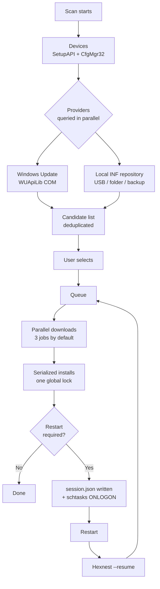

<div align="center">


# Hexnest

**Hexnest ist ein kostenloses, quelloffenes Systemwerkzeug für Windows und macOS: ein Treiber-Updater,
ein Systemmonitor, ein Netzwerkmonitor, ein Autostart-Manager und ein Datenträger-Cleaner in einem Fenster.**

Unter Windows prüft es jedes Gerät im Rechner, findet und installiert die fehlenden und veralteten
Treiber, macht nach den nötigen Neustarts weiter, sichert Ihre Treiber vor einer Neuinstallation und spielt
sie danach ganz ohne Internet zurück. Auf beiden Plattformen zeigt es live, was die Maschine und
jedes Programm darauf an Prozessorzeit, Arbeitsspeicher und Bandbreite kosten, was bei der Anmeldung startet
und was den Speicherplatz belegt. Kein Installationsprogramm unter Windows, nirgends Adware.

<br>

[](https://github.com/ahmetcaglayan/Hexnest/releases/latest/download/Hexnest.exe)
[](https://github.com/ahmetcaglayan/Hexnest/releases/latest/download/Hexnest-arm64.dmg)

<sub>[🌐 Projektseite](https://ahmetcaglayan.github.io/Hexnest/) · [Intel-Mac, Windows auf ARM und jede frühere Version →](../../releases)</sub>

<br>

### Windows: kein Installationsprogramm. macOS: in „Programme“ ziehen.

`Windows 10 1607+ / 11` · `macOS 12 Monterey+` · `64-bit` · `Apple silicon and Intel`

**Vorher ist nichts zu installieren.** Beide Builds tragen die .NET-8-Laufzeitumgebung in sich: kein .NET-
Download unter Windows, kein Visual C++ Redistributable, kein Homebrew und kein Xcode auf dem Mac.

<br>

[](LICENSE)
[](../../releases)
[](../../releases)
[](https://dotnet.microsoft.com/)
[](../../releases/latest)
[](../../releases)
[](../../stargazers)
[](../../actions/workflows/build.yml)

<sub>[🇬🇧 English](README.md) · [🇹🇷 Türkçe](README.tr.md) · [🇷🇺 Русский](README.ru.md) · [🇨🇳 简体中文](README.zh.md) · [🇮🇳 हिन्दी](README.hi.md) · [🇵🇹 Português](README.pt.md) · [🇯🇵 日本語](README.ja.md) · 🇩🇪 Deutsch · [🇫🇷 Français](README.fr.md) · [🇰🇷 한국어](README.ko.md)</sub>

<br>


</div>

---

## 🖥️ Was läuft wo

Hexnest ist ein Produkt mit zwei Fenstern. Der gemeinsame Kern — die Monitore, der Cleaner, der
Autostart-Manager, die Einstellungen und die Protokolle — ist auf beiden Plattformen derselbe Code. Die Treiber-
Hälfte gibt es nur unter Windows, und zwar nicht, weil sie noch nicht geschrieben wäre: **macOS hat keinen
Treiberspeicher für Drittanbieter, den man prüfen, aktualisieren oder sichern könnte.** Apple liefert Treiber im Betriebssystem mit,
es gibt dort also nichts, was ein solches Werkzeug finden könnte. Diese Seiten fehlen im Mac-Build deshalb ganz,
statt vorhanden und dauerhaft leer zu sein.

| |  |  |
| --- | :---: | :---: |
| **Übersicht** und Hardware-Zusammenfassung | ✅ | ✅ |
| **Systemmonitor** — Prozessor, pro Kern, Speicher, Datenträger, Akku | ✅ | ✅ |
| **Prozessor und Speicher pro Anwendung** | ✅ | ✅ |
| **Netzwerkmonitor** — Live-Raten, Summen, Adapter, Verbindungen | ✅ | ✅ |
| **Netzwerknutzung pro Anwendung** | ✅ nur TCP | ✅ über `nettop` |
| **Autostart-Manager** | ✅ Run-Schlüssel + Autostart-Ordner | ✅ launchd-Agents |
| **Aufräumen**, gemessen statt geschätzt | ✅ | ✅ |
| **Protokolle, Einstellungen, zehn Sprachen, hell/dunkel** | ✅ | ✅ |
| **Prozessortemperatur** | ✅ ACPI-Thermalzonen | ❌ ohne root nicht zugänglich |
| **Datenträgerdurchsatz pro Volume** | ✅ | ❌ kein Zähler pro Volume |
| **Speicher freigeben** | ✅ | ❌ macOS komprimiert stattdessen |
| **Gerätesuche / fehlende Treiber** | ✅ | ❌ kein Treiberspeicher |
| **Windows-Update-Treiberkatalog** | ✅ | ❌ |
| **Offline-INF-Repository** | ✅ | ❌ |
| **Treiber sichern und wiederherstellen** | ✅ | ❌ |
| **Installationswarteschlange und Fortsetzen nach Neustart** | ✅ | ❌ |
| **Systemwiederherstellungspunkt** | ✅ | ❌ Aufgabe von Time Machine |
| **Läuft als Administrator / root** | ⚠️ erforderlich | ✅ nie — nur Benutzerdomäne |

Ein ❌ oben steht für etwas, das die Plattform nicht hat, nicht für etwas, das Hexnest ausgelassen hätte. Jeder
dieser Punkte wird in der Anwendung an der Stelle erklärt, an der er auftaucht.

---

## 🎯 Wofür ist das gut?

Sie haben Windows gerade neu installiert. Der Geräte-Manager ist voller gelber Ausrufezeichen, die
Auflösung stimmt nicht, es gibt keinen Ton und — am schlimmsten — kein Internet, weil auch der
Netzwerkadapter keinen Treiber hat.

Hexnest löst das aus einem einzigen Fenster:

- Listet **jedes PnP-Gerät** im Rechner auf und sagt Ihnen, welche davon keinen Treiber haben.
- Findet fehlende und aktualisierbare Treiber im **Windows-Update-Katalog** oder in einem
  **lokalen Ordner auf einem USB-Stick**.
- Stellt sie in die Warteschlange, lädt sie, installiert sie und **macht dort weiter, wo es aufgehört hat**, nach
  jedem nötigen Neustart.
- Exportiert Ihre aktuellen Treiber **vor** einer Neuinstallation und spielt sie **danach** zurück,
  ganz ohne Internet.

Seit 1.1 beantwortet es außerdem die zwei Fragen, für die Leute den Task-Manager öffnen:

- **Was macht diese Maschine gerade?** Prozessorlast pro logischem Kern, eine Speicheraufschlüsselung,
  jeder Temperatursensor, den die Firmware offenlegt, Datenträger mit echtem Lese-/Schreibdurchsatz,
  Akku — und eine Tabelle jedes laufenden Programms mit Prozessoranteil, Arbeitssatz,
  privaten Bytes und Datenträgerdurchsatz.
- **Wer benutzt meine Verbindung?** Live-Download und -Upload für die ganze Maschine, Summen
  für diese Sitzung und seit dem Start von Windows, jeder Adapter — und eine Tabelle pro Anwendung,
  die zeigt, welches Programm gerade was überträgt.

Seit 1.2 beantwortet es zwei weitere:

- **Was startet mit Windows, und will ich das?** Jeder Autostart-Eintrag mit einem Schalter,
  geschrieben wie der Task-Manager es schreibt, sodass nie etwas gelöscht wird.
- **Was frisst meinen Speicherplatz?** Jeder Cache gemessen statt geschätzt, nichts
  für Sie angekreuzt, und Ihre eigenen Dateien getrennt gehalten und in den Papierkorb geschickt.

Eine Datei, kein Installationsprogramm, kein Hintergrunddienst, keine Telemetrie.

---

## ✨ Funktionen

| Funktion | Plattform | Was sie tut |
| --- | --- | --- |
| 🔍 **Vollständige Gerätesuche** |  | Zählt jedes vorhandene PnP-Gerät über SetupAPI + CfgMgr32 auf. Kein WMI, also funktioniert es auch auf einer frisch installierten Maschine oder einer mit defektem WMI-Repository. |
| ⚠️ **Erkennung fehlender Treiber** |  | Liest die Problemcodes des Konfigurations-Managers; 28 (`CM_PROB_FAILED_INSTALL`), 1 und 19 bedeuten „kein Treiber“. 22 ist deaktiviert, 14 wartet auf einen Neustart. |
| ☁️ **Windows-Update-Treiberkatalog** |  | Spricht über die COM-API des Windows Update-Agents (WUApiLib) mit Microsoft Update. Kein zusätzlicher Dienst, kein zusätzlicher Download, keine zusätzliche Abhängigkeit — `wuapi.dll` gehört zu Windows. |
| 💾 **Lokales / offline INF-Repository** |  | Liest `.inf`-Pakete in Ordnern und ordnet sie nach Hardware-ID zu. Ein USB-Stick, eine Netzwerkfreigabe oder eine Hexnest-Sicherung funktionieren alle als Quelle. |
| ⚡ **Parallele Downloads + serialisierte Installationen** |  | Downloads überlappen (standardmäßig 3, einstellbar 1–8). Installationen laufen nacheinander. Das ist keine Abkürzung: Windows Update gibt bei einer zweiten gleichzeitigen Installation `WU_E_OPERATIONINPROGRESS` zurück, und das PnP-Subsystem serialisiert ohnehin. Etwas anderes vorzutäuschen würde nur Scheinfehler erzeugen. |
| 🔄 **Fortsetzen nach Neustart** |  | Die Warteschlange wird nach jeder Zustandsänderung in `session.json` geschrieben; eine bei der Anmeldung ausgelöste `schtasks`-Aufgabe (mit HKLM-`RunOnce` als Rückfallebene) startet Hexnest mit `--resume` neu, und es macht genau da weiter, wo es aufgehört hat. |
| 🛡️ **Systemwiederherstellungspunkt** |  | Legt vor der ersten Installation einer Sitzung über `srclient.dll` einen Wiederherstellungspunkt vom Typ „Treiber“ an. |
| ↩️ **Sicherung vor dem Update** |  | Das Paket, das ersetzt werden soll, wird unmittelbar vor der Installation exportiert, und sein Pfad wird im Verlaufseintrag gespeichert, damit es sich zurückspielen lässt, falls etwas schiefgeht. |
| 📦 **Treiber sichern / wiederherstellen** |  | Exportiert jedes Treiberpaket von Drittanbietern mit `pnputil /export-driver` in einen Ordner oder ein ZIP und stellt es mit `pnputil /add-driver ... /subdirs /install` wieder her. |
| 📊 **Update-Verlauf** |  | Eine dauerhafte Aufzeichnung als ein JSON-Objekt pro Zeile (`history.jsonl`), mit einem Klick als CSV exportierbar. |
| 📄 **Hardwarebericht** |  | Schreibt jedes Gerät und jede Hardware-ID in eine einfache Textdatei — nehmen Sie sie auf einem USB-Stick zu einem funktionierenden Computer mit und schlagen Sie die Treiber von Hand nach. |
| 🆙 **Eingebauter Updater** |  | Lädt die neue Version von GitHub, **prüft ihren SHA-256** (und installiert nicht, wenn die Version keine `checksums.txt` veröffentlicht) und tauscht die ausführbare Datei dann aus. |
| 📈 **Systemmonitor** |   | Prozessorlast insgesamt und pro logischem Kern (`NtQuerySystemInformation`), Arbeitsspeicher bis hinunter zu zwischengespeicherten und zugesicherten Bytes (`GlobalMemoryStatusEx` + `GetPerformanceInfo`), ACPI-Thermalzonen, Lese-/Schreibdurchsatz pro Volume (`IOCTL_DISK_PERFORMANCE`) und Akkuzustand. Nichts wird abgetastet, bevor die Seite geöffnet wird, und es hört auf, sobald Sie sie verlassen. |
| 🧮 **Ressourcennutzung pro Anwendung** |   | Prozessoranteil, Arbeitssatz, private Bytes, Datenträgerdurchsatz und Threadanzahl für jeden Prozess, gemessen genau so, wie der Task-Manager sie misst: die Differenz der Kernel- und Benutzerzeit des Prozesses zwischen zwei Messungen, geteilt durch die verstrichene Zeit und die Anzahl der logischen Prozessoren. |
| 🌐 **Netzwerkmonitor** |   | Maschinenweiter Download und Upload aus den eigenen Zählern der Adapter, Summen für die Sitzung und seit dem Start, Anzahl offener Verbindungen und jeder Adapter mit Adresse und ausgehandelter Verbindungsgeschwindigkeit. |
| 🔎 **Netzwerknutzung pro Anwendung** |   | Welches Programm was überträgt, aus `GetExtendedTcpTable` plus TCP-ESTATS (`GetPerTcpConnectionEStats`). Nur TCP — Windows hat ohne Kerneltreiber keinen UDP-Zähler pro Prozess, und die Seite sagt das, statt stillschweigend zu wenig zu melden. |
| 🔁 **Automatische Update-Prüfung** |  | Eine Anfrage pro Tag an die GitHub-Releases-API und eine Zahl am Eintrag *Über*, wenn eine neue Version existiert. Automatisches Herunterladen und Installieren ist optional, wird gegen SHA-256 geprüft und immer erst beim Schließen von Hexnest angewendet — nie mitten in der Warteschlange. Unter macOS ist die Prüfung manuell — *Über* → *Nach Updates suchen* — und sie öffnet den Download, statt ihn zu installieren. |
| 🚀 **Autostart-Manager** |   | Jeder Autostart-Eintrag aus den Schlüsseln `Run` / `RunOnce` (HKCU, HKLM und die 32-Bit-Sicht) und beiden Autostart-Ordnern, mit je einem Schalter. Deaktivieren schreibt denselben `StartupApproved`-Wert, den auch der Task-Manager schreibt, sodass beide immer übereinstimmen und die ursprüngliche Befehlszeile nie gelöscht wird. Einträge, die auf eine fehlende Datei zeigen, werden markiert. |
| 🧹 **Aufräumen** |   | Temporäre Dateien, Miniatur- und Symbolcache, die Caches von sieben Browsern, der Download-Cache von Windows Update, Übermittlungsoptimierung, Absturzabbilder, Fehlerberichte, Shader-Caches, Wartungsprotokolle und der Papierkorb — jedes davon **gemessen, nicht geschätzt**, und **standardmäßig nichts angekreuzt**. |
| 🗂️ **Übriggebliebenes und alte Downloads** |   | Ordner unter AppData, die zu keinem installierten Programm, keinem laufenden Programm und nichts in „Programme“ passen und seit sechs Monaten unberührt sind; dazu Archive und Installationsprogramme im Download-Ordner, die älter als ein Monat sind. Einzeln aufgelistet und in den **Papierkorb** geschickt, nie endgültig gelöscht. |
| 🧠 **Speicher freigeben** |  | Lagert die Arbeitssätze von Prozessen aus. Die Seite sagt klar, dass das *jetzt* physischen Speicher freigibt und nichts schneller macht — das Gegenteil von dem, was jedes andere Werkzeug mit dieser Schaltfläche behauptet. |
| 🌍 **Zehn Oberflächensprachen** |   | Englisch, Türkisch, Russisch, Vereinfachtes Chinesisch, Hindi, Portugiesisch, Japanisch, Deutsch, Französisch und Koreanisch, alle in der einen ausführbaren Datei. Wechselt sofort bei geöffneter Anwendung. |
| 🎨 **Helles / dunkles Design** |   | Tauscht die Farbpalette; wird ohne erneutes Öffnen des Fensters angewendet. Der Mac-Build bietet zusätzlich *Dem System folgen*, was dem Hell-/Dunkel-Wechsel von macOS folgt. |

---

## 🚑 Wiederherstellung nach dem Formatieren

Dafür gibt es Hexnest.

### Das Henne-Ei-Problem

Nach dem Formatieren hat **auch der Netzwerkadapter meistens keinen Treiber**. Sie brauchen das
Internet, um den Treiber zu laden, und den Treiber, um ins Internet zu kommen. Windows Update
hilft nicht, weil Sie es nicht erreichen können.

Die Lösung: **nehmen Sie Ihre Treiber vor dem Formatieren mit.**

### VOR dem Formatieren (5 Minuten)

1. Starten Sie Hexnest.
2. Gehen Sie zu **Sichern & Wiederherstellen**.
3. Klicken Sie auf **Sicherung erstellen**. Jedes Treiberpaket von Drittanbietern auf dem System wird exportiert.
   (Die mitgelieferten Treiber von Microsoft werden bewusst übersprungen — die installiert Windows
   selbst neu, und sie mitzunehmen würde die Sicherung ohne Nutzen verdreifachen.)
4. Setzen Sie ein Häkchen bei **Als ZIP komprimieren**, wenn Sie mögen.
5. Kopieren Sie den entstandenen Ordner **und `Hexnest.exe`** auf denselben USB-Stick.

> 💡 Optional: Nennen Sie den Sicherungsordner `Drivers` und legen Sie ihn neben `Hexnest.exe`.
> Hexnest registriert ihn **automatisch** als lokales Treiber-Repository — ganz ohne
> Konfiguration.

### NACH dem Formatieren

1. Stecken Sie den Stick ein und starten Sie `Hexnest.exe` (es fragt nach Rechteerhöhung).
   Ohne Internet starten Sie es als `Hexnest.exe --rescue`: Windows Update wird nie
   kontaktiert und es werden nur lokale Quellen genutzt.
2. **Sichern & Wiederherstellen → Wiederherstellen** (oder **Aus Ordner wiederherstellen**) und wählen Sie Ihre Sicherung.
   Jedes Paket wird dem Treiberspeicher hinzugefügt und seinen Geräten zugeordnet.
3. Sobald der Netzwerkadapter funktioniert, drücken Sie **Prüfen**.
4. **Übersicht → Wiederherstellung nach dem Formatieren** stellt alles, was noch fehlt, aus
   Windows Update in die Warteschlange.
5. Nehmen Sie den Neustart an, wenn er verlangt wird — Hexnest kommt bei der Anmeldung zurück und erledigt den
   Rest der Warteschlange.

> ℹ️ Der Ordner muss keine Hexnest-Sicherung sein. Jeder Hersteller-Treiberordner, den Sie
> heruntergeladen und entpackt haben, funktioniert mit **Aus Ordner wiederherstellen**; seine `.inf`-Dateien werden
> rekursiv gefunden.

### Befehlszeile

```powershell
Hexnest.exe                 # normal launch
Hexnest.exe --rescue        # offline rescue mode (same as --offline)
Hexnest.exe --resume        # continue an interrupted queue straight away
```

---

## 📸 Bildschirmfotos

Echte Bildschirmfotos des ausgelieferten Builds. Sie werden aus dem Build selbst neu erzeugt — siehe
[Bildschirmfotos neu erzeugen](#regenerating-the-screenshots) — und können deshalb nicht
veralten.

### 

<table>
<tr>
<td width="50%"><br><sub><b>Systemmonitor</b> — Prozessor, Speicher, Temperatur und Datenträger als Live-Diagramme, ein Balken pro logischem Kern.</sub></td>
<td width="50%"><br><sub><b>Netzwerkmonitor</b> — maschinenweiter Download und Upload, Sitzungssummen, jeder Adapter.</sub></td>
</tr>
<tr>
<td width="50%"><br><sub><b>Nutzung pro Programm</b> — Prozessor, Speicher, Datenträger und Threads für jeden laufenden Prozess.</sub></td>
<td width="50%"><br><sub><b>Datenverkehr pro Programm</b> — welche Anwendung die Verbindung nutzt, und wie viel.</sub></td>
</tr>
<tr>
<td width="50%"><br><sub><b>Geräte</b> — jedes PnP-Gerät nach Klasse gruppiert, mit Live-Problemcodes.</sub></td>
<td width="50%"><br><sub><b>Updates</b> — installierbare Pakete aus Windows Update und lokalen INF-Ordnern.</sub></td>
</tr>
<tr>
<td width="50%"><br><sub><b>Aktivität</b> — die laufende Warteschlange, mit Geschwindigkeit und Installationsphase pro Treiber.</sub></td>
<td width="50%"><br><sub><b>Sichern &amp; Wiederherstellen</b> — jeden Fremdtreiber exportieren, offline wiederherstellen.</sub></td>
</tr>
<tr>
<td width="50%"><br><sub><b>Autostart-Programme</b> — ein Schalter pro Eintrag, geschrieben wie der Task-Manager es schreibt.</sub></td>
<td width="50%"><br><sub><b>Aufräumen</b> — gemessen, nicht geschätzt, und nichts für Sie angekreuzt.</sub></td>
</tr>
<tr>
<td width="50%"><br><sub><b>Einstellungen</b> — parallele Downloads, Sicherheit, automatische Updates, Design und Sprache.</sub></td>
<td width="50%"><br><sub><b>Über</b> — Versionsinformationen und der eingebaute Updater.</sub></td>
</tr>
</table>

### 

<table>
<tr>
<td width="50%"><br><sub><b>Übersicht</b> — was der Mac gerade tut und was er ist: Chip, Grafik, Speicher, Datenträger.</sub></td>
<td width="50%"><br><sub><b>Systemmonitor</b> — ein Balken pro Kern, inklusive der P- und E-Cluster auf Apple Silicon.</sub></td>
</tr>
<tr>
<td width="50%"><br><sub><b>Netzwerkmonitor</b> — Datenverkehr pro Anwendung aus derselben Quelle, die auch die Aktivitätsanzeige nutzt.</sub></td>
<td width="50%"><br><sub><b>Autostart-Programme</b> — launchd-Agents mit je einem Schalter; Systemjobs werden gezeigt, nicht angefasst.</sub></td>
</tr>
<tr>
<td width="50%"><br><sub><b>Aufräumen</b> — Caches, Xcode Derived Data, iPhone-Sicherungen. Gemessen, und nichts angekreuzt.</sub></td>
<td width="50%"><br><sub><b>Einstellungen</b> — dieselben Optionen, dazu ein Design, das macOS bei Sonnenauf- und -untergang folgt.</sub></td>
</tr>
<tr>
<td width="50%"><br><sub><b>Protokolle</b> — Live-Diagnose, ein Klick in die Zwischenablage für einen Fehlerbericht.</sub></td>
<td width="50%"><br><sub><b>Über</b> — Version, Maschine und eine Update-Prüfung, die den Download öffnet.</sub></td>
</tr>
</table>

### Bildschirmfotos neu erzeugen

Jedes Bild oben wird von der Anwendung selbst erzeugt, sodass sich eine Änderung an der Oberfläche mit
einem einzigen Befehl in der Dokumentation abbilden lässt:

```powershell
# Windows, from an elevated prompt, after building
.\Hexnest.exe --capture .\assets\screenshots --lang en
```

```bash
# macOS, after ./build/make-mac-app.sh
./artifacts/mac/arm64/Hexnest.app/Contents/MacOS/Hexnest --capture ./shots --lang en
```

Beide gehen das ganze Menü durch, warten, bis die Live-Seiten ihre Diagramme gefüllt haben, und schreiben ein PNG
pro Seite. `--lang` legt die Oberflächensprache fest, damit die veröffentlichten Bilder nicht von der
Anzeigesprache dessen abhängen, der sie neu erzeugt hat.

> Warum überhaupt eine eingebaute Aufnahme? Unter Windows läuft Hexnest mit erhöhten Rechten, und die
> User Interface Privilege Isolation hindert das (nicht erhöhte) Snipping Tool daran, Eingaben zu sehen, die an ein
> Fenster mit höherer Integrität gehen — die Druck-Taste über Hexnest, dem Task-Manager oder dem Registrierungs-
> Editor bewirkt nichts. Unter macOS bräuchte eine Bildschirmaufnahme die Berechtigung zur Bildschirmaufzeichnung und
> würde alles andere auf dem Schreibtisch mit fotografieren. Beide Builds rendern stattdessen ihren eigenen visuellen
> Baum, sodass keines der beiden Probleme auftritt.

---

## 🧭 Menüs

| Menü | Plattform | Was es tut |
| --- | --- | --- |
| **Übersicht** |   | Geräteanzahl, fehlende Treiber, verfügbare Updates, Problemgeräte. Zusammenfassung von Betriebssystem / Maschine / CPU / BIOS. Schnellaktionen: *Jetzt prüfen*, *Wiederherstellung nach dem Formatieren*, *Alles aktualisieren*, *Treiber sichern*, *Hardwarebericht*. Ein Warnbanner erscheint, wenn kein Netzwerkadapter einen funktionierenden Treiber hat. |
| **Geräte** |  | Jedes PnP-Gerät, nach Klasse gruppiert. Filter: *Alle / Probleme / Fehlend / Generischer Treiber*. Suche nach Name, Hersteller, Version und Hardware-ID; Hardware-ID in die Zwischenablage kopieren. |
| **Updates** |  | Installierbare Pakete: sowohl fehlende Treiber als auch Versionsaktualisierungen. Auswahl pro Zeile, *Alle auswählen / Auswahl aufheben*, ausgewählte Gesamtgröße, *Ausgewählte installieren*. Sie können ein einzelnes Update ausblenden oder ein Gerät ganz ignorieren. |
| **Aktivität** |  | Die laufende Warteschlange. Downloadprozentsatz, Geschwindigkeit, übertragene Bytes und die Installationsphase werden für jeden Auftrag getrennt angezeigt. *Alle abbrechen*, *Fehlgeschlagene wiederholen*, *Jetzt neu starten* / *Später*. Eine unterbrochene Sitzung zeigt hier eine Schaltfläche *Fortfahren*. |
| **Sichern & Wiederherstellen** |  | *Sicherung erstellen* (wahlweise gezippt), die Liste vorhandener Sicherungen (Paketanzahl, Größe, Datum), *Wiederherstellen*, *Aus Ordner wiederherstellen*, *Öffnen*, *Löschen*. |
| **Verlauf** |  | Eine dauerhafte Aufzeichnung jedes Treibervorgangs. Nach Ergebnis filtern, suchen, *Als CSV exportieren*, *Verlauf leeren*. Wenn die Sicherung vor dem Update zu einem Eintrag noch existiert, können Sie deren Ordner öffnen. |
| **Systemmonitor** |   | Prozessorlast insgesamt und pro logischem Kern, Arbeitsspeicher aufgeschlüsselt in belegt / verfügbar / zwischengespeichert / zugesichert, Temperatursensoren, sofern die Maschine welche offenlegt, Datenträgerkapazität mit Live-Lese- und -Schreibdurchsatz und Akku. Darunter jeder laufende Prozess mit Prozessoranteil, Arbeitssatz, privaten Bytes, Datenträgerdurchsatz und Threadanzahl — sortierbar nach Prozessor, Speicher, Datenträger oder Name, durchsuchbar und anhaltbar, damit sich eine Zeile wirklich lesen lässt. |
| **Netzwerkmonitor** |   | Live-Download und -Upload für die ganze Maschine als Diagramme, die Summe für diese Sitzung und seit dem Start von Windows, die Anzahl offener Verbindungen und jeder Adapter mit Typ, Adresse und Verbindungsgeschwindigkeit. Darunter eine Tabelle pro Anwendung: Download- und Uploadrate, Sitzungssummen, offene Verbindungen und der entfernte Endpunkt. |
| **Autostart-Programme** |   | Jeder Autostart-Eintrag, den Hexnest sicher umschalten kann, mit dem Programmnamen aus der Versionsressource der ausführbaren Datei, dem Herausgeber, der Befehlszeile, der Größe und dem Startort. Ein Schalter pro Zeile; Deaktivieren schreibt dieselbe Einstellung wie der Task-Manager und löscht nichts. Einträge, die auf eine nicht mehr vorhandene Datei zeigen, werden markiert, Sicherheitssoftware wird gekennzeichnet und fragt vor dem Abschalten nach, und es gibt Filter für ein, aus und defekt sowie eine Suche. |
| **Aufräumen** |   | Gemessene Größen für temporäre Dateien, Miniatur- und Symbolcaches, sieben Browser, den Download-Cache von Windows Update, die Übermittlungsoptimierung, Absturzabbilder, Fehlerberichte, Shader-Caches, Windows-Protokolle, Hexnests eigenen Cache und den Papierkorb. Standardmäßig ist nichts angekreuzt. Alte Downloads und übrig gebliebene AppData-Ordner werden einzeln aufgelistet und wandern in den Papierkorb. Dazu ein Freigeben von Speicher, das ehrlich sagt, was es tut. |
| **Protokolle** |   | Live-Diagnose. *Kopieren* legt das Protokoll mit einer Kopfzeile aus Version / Betriebssystem / Maschine in die Zwischenablage — genau das, was ein Fehlerbericht braucht. Protokolldatei oder -ordner öffnen oder leeren. |
| **Einstellungen** |   | Anzahl paralleler Downloads, Anzahl der Wiederholungen, Prüfen beim Start, Wiederherstellungspunkt, Sicherung vor dem Update, Fortsetzen nach Neustart, automatischer Neustart und dessen Verzögerung, Offlinemodus, optionale Treiber, lokale Treiberordner, Aufbewahrung des Verlaufs, **automatische Update-Prüfung, automatische Installation und Vorabversionen**, Design, Sprache. |
| **Über** |   | Versionsinformationen, *Nach Updates suchen*, Versionshinweise, Projektseite und Links zu den Issues. Der Windows-Build lädt und installiert das Update auch; der Mac-Build öffnet stattdessen den Download, weil das Überschreiben einer laufenden `.app` deren Signatur zerstört. |

Die Seitenleiste des Mac-Builds besteht aus den acht oben mit macOS markierten Zeilen, in dieser Reihenfolge. *Geräte*,
*Updates*, *Aktivität*, *Sichern & Wiederherstellen* und *Verlauf* fehlen dort, statt leer zu sein.

---

## ⚙️ Wie es funktioniert



Kurz gefasst:

1. **Prüfen.** `SetupDiGetClassDevs(DIGCF_PRESENT | DIGCF_ALLCLASSES)` zählt jedes physisch
   vorhandene Gerät auf; `CM_Get_DevNode_Status` liefert den Problemcode, und
   `HKLM\SYSTEM\CurrentControlSet\Control\Class\<DriverKey>` liefert Version, Datum und
   Anbieter des installierten Treibers.
2. **Anbieter.** Windows Update und das lokale INF-Repository werden gleichzeitig
   abgefragt. Ein Anbieter, der ausfällt, wird zu einer Warnzeile, nie zu einem Abbruch.
3. **Entdopplung.** Wenn beide Quellen dasselbe Paket anbieten, **gewinnt die lokale Kopie** —
   sie liegt schon auf der Festplatte und braucht kein Netz. Bietet Windows Update eine Version an, die älter
   ist als die installierte, wird dieser Kandidat verworfen.
4. **Warteschlange.** Downloads laufen hinter `SemaphoreSlim(MaxParallelJobs)`; Installationen hinter
   einer globalen Sperre. Ein fehlgeschlagener Auftrag wird standardmäßig zweimal wiederholt.
5. **Fortsetzen.** Jede Zustandsänderung wird atomar in `session.json` geschrieben. Wenn ein Neustart
   nötig ist, wird die Warteschlange geparkt, und eine bei der Anmeldung ausgelöste Aufgabe holt Hexnest mit
   `--resume` zurück. Eine Sitzung übersteht als Sicherheitsventil höchstens 10 Neustarts, danach
   wird sie aufgegeben.

---

## 🔨 Aus dem Quellcode bauen

Irrelevant, wenn Sie einfach nur die App wollen: **exe herunterladen, doppelklicken, fertig.**
Der Quellcode liegt in seinem eigenen Ordner und stört niemanden.

```
Hexnest/
├── src/                    source code (C#, .NET 8)
│   ├── Hexnest.Core/       UI-free core, multi-targeted:
│   │                         net8.0-windows  drivers, WUApiLib, SetupAPI, the registry
│   │                         net8.0          the portable half behind the Mac build
│   ├── Hexnest.App/        WPF application for Windows (Hexnest.exe)
│   ├── Hexnest.Mac/        Avalonia application for macOS (Hexnest.app)
│   └── Hexnest.Cli/        (reserved) placeholder for a headless front end
├── docs/                   documentation
├── build/                  build scripts, including the macOS bundler
├── assets/                 logo and screenshots
└── .github/workflows/      CI
```

Die Kurzfassung, unter Windows:

```powershell
dotnet publish src/Hexnest.App/Hexnest.App.csproj -c Release -r win-x64 -o publish
```

und auf einem Mac, was `artifacts/mac/arm64/Hexnest.app` erzeugt:

```bash
./build/make-mac-app.sh --arch arm64
```

Fügen Sie `--dmg` hinzu, um das Disk-Image zu erhalten, das die Version veröffentlicht. Das Skript braucht nichts außer dem
.NET-8-SDK: es schreibt die `Info.plist`, baut die `.icns` aus `assets/icon-mac-1024.png`
und signiert das Bundle ad-hoc, damit Apple Silicon es ausführt.

Details, die arm64-Builds und eine Erklärung des WUApiLib-COM-Verweises:
**[docs/BUILD.md](docs/BUILD.md)**

Architektur, die Abstraktion `IDriverProvider` und wie man eine neue Treiberquelle hinzufügt:
**[docs/ARCHITECTURE.md](docs/ARCHITECTURE.md)**

---

## 🔐 Sicherheit und Datenschutz

- **Keine Telemetrie.** Keine Nutzungsdaten, keine Gerätekennungen, keine Statistiken verlassen die Maschine.
- Genau **zwei** Dinge gehen je hinaus:
  1. **Windows-Update-Abfragen** — direkt zu Microsoft, über den Windows-eigenen Windows-
     Update-Agent. (Nie im Offlinemodus oder mit `--rescue`.)
  2. **Die GitHub-Releases-API** — nur wenn Sie *Nach Updates suchen* drücken.
- **Warum Administrator?** Einen Treiber zu installieren ist privilegiert: `pnputil`, der Windows-Update-
  Installer und die Systemwiederherstellung brauchen alle ein erhöhtes Token. Hexnest fordert es gleich im
  Anwendungsmanifest an (`requireAdministrator`), statt mitten in einer Warteschlange
  zu scheitern.
- **Sicherheitsnetze:** ein Systemwiederherstellungspunkt vor der ersten Installation einer Sitzung und eine
  Sicherung jedes Treiberpakets, das ersetzt wird.
- **Der Updater** vergleicht den Download mit dem SHA-256 aus der `checksums.txt` der Version;
  eine fehlende oder abweichende Prüfsumme bedeutet, dass die Datei gelöscht und das Update abgelehnt wird.
- **Unter macOS läuft Hexnest nie als root.** Das ist eine Entwurfsentscheidung, keine fehlende
  Funktion: Alles, was der Mac-Build tut, bleibt in dem Konto, das ihn gestartet hat, und eine
  grafische Anwendung als root kann versehentlich alles auf der Maschine löschen. Systemweite launchd-
  Jobs werden aufgelistet und klar markiert, aber nicht angefasst.
- Der gesamte Zustand liegt unter `%ProgramData%\Hexnest` unter Windows und unter
  `~/Library/Application Support/Hexnest` mit Protokollen in `~/Library/Logs/Hexnest` unter macOS:
  `settings.json`, `session.json`, `history.jsonl`, `logs/`, `backups/`, `cache/`,
  `reports/`.

Meldungen zu Sicherheitslücken: **[SECURITY.md](SECURITY.md)**

---

## ❓ Häufige Fragen

### Ist Hexnest kostenlos?

Ja. Hexnest steht unter der MIT-Lizenz und der vollständige Quellcode liegt in diesem Repository. Es gibt
keine Bezahlstufe, keine Testversion, keine Funktion, die sich nach einer Zahlung freischaltet, keine Werbung und keine mitgelieferte
Fremdsoftware. Der Scan und die Installationen sind dasselbe Produkt.

### Muss ich .NET installieren?

Nein. Die gesamte .NET-8-Laufzeitumgebung steckt in `Hexnest.exe` (self-contained, Single-File-Publish), und WPF
bringt seine eigenen `vcruntime140_cor3.dll` / `msvcp140_cor3.dll` mit. Auch kein Visual C++ Redistributable.
Die einzige Voraussetzung ist 64-Bit-Windows 10 Version 1607 (Build 14393) oder neuer.

### Aktualisiert Hexnest Treiber auf einem Mac?

Nein, und nichts anderes tut das auch. macOS hat keinen Treiberspeicher für Drittanbieter: Apple liefert die
Geräteunterstützung im Betriebssystem mit und aktualisiert sie mit dem Betriebssystem. Es gibt nichts, was ein solches
Werkzeug prüfen, herunterladen oder sichern könnte, deshalb hat der Mac-Build gar keine Seiten *Geräte*, *Updates*,
*Aktivität*, *Sichern* oder *Verlauf* — statt fünf Seiten, auf denen nie
etwas stünde. Alles andere, was Hexnest tut, funktioniert dort.

### Welchen Mac brauche ich?

macOS 12 Monterey oder neuer, auf Apple Silicon oder Intel. Die beiden Builds werden getrennt
veröffentlicht (`Hexnest-arm64.dmg` und `Hexnest-x64.dmg`) statt als ein Universal Binary:
jeder trägt seine eigene Kopie der .NET-Laufzeitumgebung, und sie zusammenzulegen würde den Download für alle
verdoppeln, um auf der Downloadseite eine einzige Entscheidung zu sparen.

### macOS sagt, Hexnest „kann nicht geöffnet werden, da der Entwickler nicht verifiziert werden kann“

Die Versionen sind ad-hoc signiert, aber nicht notarisiert, weil eine Notarisierung ein kostenpflichtiges Apple-
Developer-Konto verlangt. Klicken Sie in „Programme“ mit der rechten Maustaste (oder bei gedrückter Control-Taste) auf Hexnest und wählen Sie **Öffnen**;
macOS fragt dann einmal und merkt sich die Antwort. Jede Version veröffentlicht eine `checksums.txt`, gegen die Sie
den Download vorher prüfen können.

### Warum fragt Hexnest für Mac nie nach meinem Passwort?

Weil es das nie braucht. Die Monitore lesen öffentliche Statistiken, der Cleaner arbeitet in Ihrem
eigenen Benutzerordner, und der Autostart-Manager ändert Ihre eigenen Anmelde-Agents über `launchctl`.
Systemweite launchd-Jobs werden angezeigt, aber als schreibgeschützt markiert. Eine Anwendung, die nach einem
Administratorpasswort fragt, um Ihnen ein Diagramm zu zeigen, würde weit mehr Vertrauen verlangen, als sie braucht.

### Warum warnt SmartScreen oder mein Virenscanner davor?

Weil `Hexnest.exe` **nicht codesigniert** ist — Zertifikate kosten Geld. SmartScreen und Smart App
Control warnen bei jeder unsignierten ausführbaren Datei ohne aufgebaute Reputation, und eine App, die als
Administrator läuft, Treiber installiert und eine geplante Aufgabe registriert, sieht für einen heuristischen
Scanner wie Schadsoftware aus. Die ehrliche Abhilfe ist, die Datei zu prüfen: Vergleichen Sie die Ausgabe von
`Get-FileHash .\Hexnest.exe -Algorithm SHA256` mit der passenden Zeile in der
`checksums.txt`.

### Kann ich nach dem Formatieren ohne Internet Treiber installieren?

Ja — dafür wurde Hexnest gebaut. Sichern Sie Ihre Treiber vor dem Formatieren, legen Sie die Sicherung und
`Hexnest.exe` auf denselben USB-Stick, starten Sie danach `Hexnest.exe --rescue` und drücken Sie
**Wiederherstellen**. Ein Ordner namens `Drivers` neben `Hexnest.exe` wird automatisch als lokales
Treiber-Repository registriert, und jeder selbst entpackte Herstellerordner funktioniert ebenso.

### Kann ich einen Treiber zurücknehmen?

Ja, auf drei Wegen: aus der Sicherung, die Hexnest unmittelbar vor jeder Installation exportiert (**Aus Ordner
wiederherstellen**), aus dem Systemwiederherstellungspunkt, der vor der ersten Installation einer Sitzung angelegt wurde
(`rstrui.exe`), oder mit der Windows-eigenen Schaltfläche *Treiber zurücksetzen* im Geräte-Manager. Deshalb
ist es empfehlenswert, die Einstellung für den Wiederherstellungspunkt anzulassen.

### Macht es nach einem Neustart wirklich weiter?

Ja. Der Zustand der Warteschlange wird bei jeder Änderung atomar in `session.json` geschrieben, und eine bei der Anmeldung ausgelöste
geplante Aufgabe `Hexnest\ResumeSession` (mit HKLM-`RunOnce` als Rückfallebene) holt Hexnest mit
`--resume` zurück. Eine Sitzung übersteht höchstens 10 Neustarts; die Aufgabe und der Registrierungswert werden entfernt, sobald
die Warteschlange fertig ist.

### Löscht das Deaktivieren eines Autostart-Programms etwas?

Nein. Windows hält das Aktiviert-Kennzeichen in einem eigenen Schlüssel —
`...\CurrentVersion\Explorer\StartupApproved\Run` und seinen zwei Geschwistern — und das ist das
Einzige, was Hexnest schreibt. Der `Run`-Wert oder die Verknüpfung im Autostart-Ordner bleibt
genau da, wo sie ist, sodass das Wiedereinschalten des Eintrags die ursprüngliche Befehlszeile
Byte für Byte wiederherstellt.

Das bedeutet außerdem, dass Task-Manager und Hexnest übereinstimmen: Deaktivieren Sie etwas im einen,
zeigt es das andere als deaktiviert an. Und wenn Sie Hexnest später löschen, fehlt der Maschine nicht
die Hälfte ihrer Autostart-Programme, weil keines davon je irgendwohin verschwunden ist.

### Ist das Aufräumen sicher?

Es ist darauf gebaut, und das Design sagt wie, statt Sie um Vertrauen zu bitten:

- **Nichts ist standardmäßig angekreuzt.** Die Seite öffnet sich mit einer Summe von null.
- Jeder Pfad kommt aus einer Known-Folder-API, nicht aus einer Zeichenkette. Nichts außerhalb der
  eigenen Wurzeln einer Kategorie wird je angefasst, und jede einzelne Löschung wird unmittelbar davor
  erneut gegen diese Wurzeln geprüft.
- Reparse-Punkten wird nie gefolgt. `%LOCALAPPDATA%` ist voller Junctions, und in eine
  hineinzulaufen ist der Weg, auf dem eine „Cache leeren“-Funktion am Ende die Dokumente von jemandem löscht.
- Geöffnete Dateien werden übersprungen, nicht erzwungen. Die Zahl der übersprungenen Dateien wird gemeldet.
- Ihre eigenen Dateien — alte Downloads, übrig gebliebene Ordner — werden nie im Block ausgewählt. Sie stehen
  einzeln mit Größe und Alter da, und sie wandern in den **Papierkorb**.

Die Erkennung von Übriggebliebenem ist die eine Stelle, an der Hexnest rät, und die Zeile sagt das auch.

### Bringt „Arbeitsspeicher freigeben“ wirklich etwas?

Es gibt jetzt sofort physischen Speicher frei, und das ist alles.

Es ruft für jeden Prozess `EmptyWorkingSet` auf, was Windows bittet, den Arbeitssatz dieses Prozesses
in die Auslagerungsdatei zu schreiben. Der belegte Speicher sinkt wirklich. Aber diese Seiten sind nicht weg — sie
liegen auf der Festplatte, und sobald das Programm diesen Speicher wieder anfasst, liest Windows sie zurück,
was langsamer ist, als sie in Ruhe zu lassen. Ungenutzter Speicher ist kein verschwendeter Speicher; Windows hielt ihn
ohnehin schon verfügbar.

Es ist also keine Leistungsfunktion, und Hexnest gibt sie auch nicht als solche aus. Wirklich nützlich ist sie
unmittelbar bevor Sie etwas starten, das auf einen Schlag viel Speicher braucht, oder um zu sehen, wie
viel ein leckendes Programm wirklich hält. Jedes andere Werkzeug mit dieser Schaltfläche behauptet
etwas anderes.

### Warum sagt die Temperaturkarte, es gebe keinen Sensor?

Weil es auf dieser Maschine keinen gibt, den Windows lesen kann. Die einzige Temperatur, die Windows
ohne Treiber offenlegt, ist die ACPI-Thermalzone, die die Firmware für die eigene Lüftersteuerung
deklariert (`root\WMI:MSAcpi_ThermalZoneTemperature`), und sehr viele Desktop-Mainboards
deklarieren gar keine. Temperaturen pro Kern und für die GPU kommen von einem Herstellersensor über einen
SMBus, was einen signierten Kerneltreiber braucht — genau den installieren HWiNFO und Open Hardware
Monitor. Hexnest installiert keinen Kerneltreiber, um eine Zahl auszufüllen, und sagt Ihnen deshalb lieber,
dass der Sensor fehlt, statt plausible 45 °C zu erfinden.

### Warum ergibt die Netzwerknutzung pro Programm nicht die Maschinensumme?

Weil beide unterschiedlich gemessen werden und beide stimmen.

Der maschinenweite Wert ist die Summe der eigenen Byte-Zähler der Netzwerkadapter und deckt damit
alles ab: TCP, UDP, QUIC, Broadcast. Der Wert pro Anwendung kommt aus TCP-
ESTATS (RFC 4898) über `GetPerTcpConnectionEStats`, dem einzigen Byte-Zähler pro Prozess,
den Windows ohne Kerneltreiber anbietet — und der erfasst nur TCP. Videoanrufe,
viel Spieleverkehr und DNS werden deshalb in der ersten Zahl gezählt und nicht in der
zweiten. Die Seite sagt das, statt stillschweigend zu wenig zu melden.

ESTATS zu aktivieren braucht ein erhöhtes Token. Hexnest hat immer eines; wird es je verweigert,
fällt die Tabelle auf Verbindungszahlen pro Prozess zurück und sagt, warum.

### Aktualisiert sich Hexnest im Hintergrund selbst?

Es **prüft** einmal am Tag und sagt es Ihnen am Menüeintrag *Über*. Es lädt oder installiert
nichts, solange Sie das nicht unter **Einstellungen → Updates** einschalten, und selbst dann:

- wird der Download gegen die `checksums.txt` der Version geprüft, bevor ihm vertraut wird,
- findet der Tausch statt, während Hexnest **schließt**, nie während eine Treiber-Warteschlange läuft,
- entfallen Prüfung und Installation im Offline- und Rettungsmodus vollständig.

Sie können die Prüfung ganz abschalten; die Schaltfläche *Nach Updates suchen* funktioniert weiter.

### Ist der Monitor ein Hintergrunddienst?

Nein. Keiner der beiden Monitore tastet etwas ab, bevor Sie seine Seite öffnen, und beide hören auf, sobald
Sie weggehen. Hexnest installiert weiterhin keinen Dienst, keinen Treiber und keinen Autostart-Eintrag —
das Einzige, was es je registriert, ist die Anmeldeaufgabe, die eine unterbrochene Treiber-Warteschlange
fortsetzt, und die entfernt sich selbst, wenn die Warteschlange fertig ist.

### Sammelt Hexnest irgendwelche Daten?

Nein. Keine Telemetrie, keine Nutzungsstatistik, keine Gerätekennungen. Genau zwei Dinge verlassen die Maschine:
Windows-Update-Abfragen, die über den Windows-eigenen Agent direkt zu Microsoft gehen und im Offlinemodus nie
stattfinden, und eine Anfrage an die GitHub-Releases-API, wenn Sie *Nach Updates suchen* drücken.

---

„Warum ist die exe so groß?“, „Warum kein WMI?“, „Läuft es auf Windows Server?“ und der Rest:

**[docs/FAQ.md](docs/FAQ.md)** · Anleitung (Türkisch): **[docs/USAGE.md](docs/USAGE.md)** ·
Projektseite: **[ahmetcaglayan.github.io/Hexnest](https://ahmetcaglayan.github.io/Hexnest/)**

---

## 🤝 Mitmachen

Beiträge sind willkommen.

- **Fehlerberichte:** [Issues](../../issues) — bitte hängen Sie das Protokoll an, das die Schaltfläche *Kopieren*
  im Menü **Protokolle** liefert; es enthält bereits die Version und die Betriebssystem-Kopfzeile.
- **Code:** forken, Branch anlegen, Pull Request öffnen. Behalten Sie den bestehenden Stil bei: keine NuGet-
  Abhängigkeiten (die Größe der Einzeldatei und der Offlinebetrieb sind bewusste Entscheidungen) und kein
  Oberflächencode in `Hexnest.Core`.
- **Übersetzung:** eine Sprache hinzuzufügen heißt, eine JSON-Datei in
  `src/Hexnest.Core/Languages/` abzulegen, die `build/check-languages.py` dann gegen das
  Englische prüft; siehe [docs/ARCHITECTURE.md](docs/ARCHITECTURE.md).

---

## 📄 Lizenz

MIT — siehe [LICENSE](LICENSE).

---

## ⚠️ Haftungsausschluss

Treiber zu installieren birgt ein grundsätzliches Risiko. Ein falscher oder beschädigter Treiber kann Probleme verursachen, bis
hin zu einer Maschine, die nicht mehr startet. Hexnest verringert dieses Risiko, indem es einen
Systemwiederherstellungspunkt anlegt und die Treiber sichert, die es ersetzt, aber es gibt keine Garantie.

**Lassen Sie die Einstellung für den Wiederherstellungspunkt an.** Sichern Sie alles, was Ihnen wichtig ist. Die
Software wird „wie besehen“ bereitgestellt; die Folgen ihrer Nutzung liegen in der Verantwortung des Nutzers.

---

## Schlagwörter

<sub>
windows treiber updater open source · kostenloser treiber updater ohne adware · treiber nach formatieren installieren ·
offline treiber installer usb · treiber sichern wiederherstellen windows · fehlende treiber finden ·
windows 11 treiber scanner · pnputil treiber export · windows update treiberkatalog werkzeug ·
kostenloser systemmonitor windows · cpu ram temperatur monitor · netzwerknutzung pro anwendung windows ·
bandbreitenmonitor pro programm · task-manager alternative open source ·
geräte-manager gelbes ausrufezeichen beheben ·
mac systemmonitor open source · kostenloser mac cleaner ohne abo · macos autostart-objekte verwalten ·
launchd anmeldeobjekte bearbeiten · aktivitätsanzeige alternative mac · mac netzwerknutzung pro app ·
apple silicon systemmonitor · m1 m2 m3 mac cpu speicher monitor · xcode derived data löschen ·
speicherplatz freigeben mac · mac menüleiste kostenloses systemwerkzeug · open source mac werkzeug
</sub>
