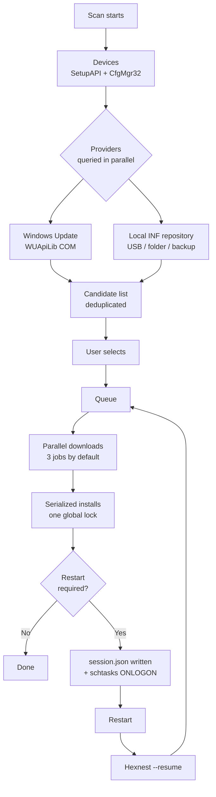

<div align="center">


# Hexnest

**Hexnest est un utilitaire système gratuit et open source pour Windows et macOS : un outil de mise à jour des pilotes,
un moniteur système, un moniteur réseau, un gestionnaire de démarrage et un nettoyeur de disque dans une seule fenêtre.**

Sous Windows, il analyse chaque périphérique de la machine, trouve et installe les pilotes manquants et
obsolètes, reprend après les redémarrages qu'ils exigent, sauvegarde vos pilotes avant un formatage et les restaure
ensuite sans aucune connexion Internet. Sur les deux plateformes, il montre en direct ce que la machine et
chaque programme coûtent en temps processeur, en mémoire et en bande passante, ce qui se lance à l'ouverture de session,
et ce qui occupe l'espace disque. Pas de programme d'installation sous Windows, pas d'adware nulle part.

<br>

[](https://github.com/ahmetcaglayan/Hexnest/releases/latest/download/Hexnest.exe)
[](https://github.com/ahmetcaglayan/Hexnest/releases/latest/download/Hexnest-arm64.dmg)

<sub>[🌐 Site du projet](https://ahmetcaglayan.github.io/Hexnest/) · [Mac Intel, Windows sur ARM et toutes les versions précédentes →](../../releases)</sub>

<br>

### Windows : pas de programme d'installation. macOS : glissez-le dans Applications.

`Windows 10 1607+ / 11` · `macOS 12 Monterey+` · `64-bit` · `Apple silicon and Intel`

**Rien à installer au préalable.** Les deux versions embarquent l'environnement d'exécution .NET 8 : pas de .NET à
télécharger sous Windows, pas de Visual C++ Redistributable, ni Homebrew ni Xcode sur un Mac.

<br>

[](LICENSE)
[](../../releases)
[](../../releases)
[](https://dotnet.microsoft.com/)
[](../../releases/latest)
[](../../releases)
[](../../stargazers)
[](../../actions/workflows/build.yml)

<sub>[🇬🇧 English](README.md) · [🇹🇷 Türkçe](README.tr.md) · [🇷🇺 Русский](README.ru.md) · [🇨🇳 简体中文](README.zh.md) · [🇮🇳 हिन्दी](README.hi.md) · [🇵🇹 Português](README.pt.md) · [🇯🇵 日本語](README.ja.md) · [🇩🇪 Deutsch](README.de.md) · 🇫🇷 Français · [🇰🇷 한국어](README.ko.md)</sub>

<br>


</div>

---

## 🖥️ Ce qui fonctionne où

Hexnest est un seul produit avec deux fenêtres. Le moteur commun — les moniteurs, le nettoyeur, le
gestionnaire de démarrage, les paramètres et les journaux — est le même code sur les deux plateformes. La moitié
consacrée aux pilotes est réservée à Windows, et non parce qu'elle n'aurait pas encore été écrite : **macOS n'a pas de magasin
de pilotes tiers à analyser, mettre à jour ou sauvegarder.** Apple livre les pilotes dans le système d'exploitation, donc
il n'y a rien là qu'un outil de ce genre puisse trouver. Ces pages sont donc absentes de la version
Mac plutôt que présentes et éternellement vides.

| |  |  |
| --- | :---: | :---: |
| **Tableau de bord** et résumé matériel | ✅ | ✅ |
| **Moniteur système** — processeur, par cœur, mémoire, stockage, batterie | ✅ | ✅ |
| **Processeur et mémoire par application** | ✅ | ✅ |
| **Moniteur réseau** — débits en direct, totaux, cartes, connexions | ✅ | ✅ |
| **Utilisation réseau par application** | ✅ TCP uniquement | ✅ via `nettop` |
| **Gestionnaire de démarrage** | ✅ clés Run + dossiers Démarrage | ✅ agents launchd |
| **Nettoyage**, mesuré et non estimé | ✅ | ✅ |
| **Journaux, paramètres, dix langues, sombre/clair** | ✅ | ✅ |
| **Santé de la batterie et ce qui empêche la veille** | ❌ | ✅ |
| **Température du processeur** | ✅ zones thermiques ACPI | ❌ inaccessible sans root |
| **Débit disque par volume** | ✅ | ❌ pas de compteur par volume |
| **Libération de mémoire** | ✅ | ❌ macOS compresse à la place |
| **Analyse des périphériques / pilotes manquants** | ✅ | ❌ pas de magasin de pilotes |
| **Catalogue de pilotes Windows Update** | ✅ | ❌ |
| **Dépôt INF hors ligne** | ✅ | ❌ |
| **Sauvegarde et restauration des pilotes** | ✅ | ❌ |
| **File d'installation et reprise après redémarrage** | ✅ | ❌ |
| **Point de restauration système** | ✅ | ❌ affaire de Time Machine |
| **S'exécute en administrateur / root** | ⚠️ requis | ✅ jamais — domaine utilisateur seulement |

Un ❌ ci-dessus désigne une chose que la plateforme n'a pas, pas une chose que Hexnest aurait laissée de côté. Chacune
d'elles est expliquée là où elle apparaît dans l'application elle-même.

Une ligne va dans l'autre sens. L'usure de la batterie et la liste des processus qui gardent
la machine éveillée sont sur le Mac et pas sous Windows, et c'est le seul ❌ du tableau qui
signifie « pas encore fait » plutôt que « pas disponible » : Windows expose les deux via
`powercfg`.

---

## 🎯 À quoi cela sert-il ?

Vous venez de formater Windows. Le Gestionnaire de périphériques est plein de points d'exclamation jaunes, la
résolution est fausse, il n'y a pas de son et — le pire — pas d'Internet, parce que la
carte réseau n'a pas de pilote non plus.

Hexnest règle cela depuis une seule fenêtre :

- Liste **chaque périphérique PnP** de la machine et vous dit lesquels n'ont pas de pilote.
- Trouve les pilotes manquants et actualisables dans le **catalogue Windows Update** ou dans un
  **dossier local sur une clé USB**.
- Les met en file, les télécharge, les installe et **reprend là où il s'était arrêté** après
  chaque redémarrage nécessaire.
- Exporte vos pilotes actuels **avant** un formatage et les restaure **ensuite**
  sans la moindre connexion Internet.

Depuis la 1.1, il répond aussi aux deux questions pour lesquelles on ouvre le Gestionnaire des tâches :

- **Que fait cette machine ?** Charge du processeur par cœur logique, répartition de la mémoire,
  chaque capteur de température exposé par le micrologiciel, stockage avec le débit réel de lecture/écriture,
  batterie — et un tableau de chaque programme en cours avec sa part de processeur, son jeu de travail,
  ses octets privés et son débit disque.
- **Qui utilise ma connexion ?** Téléchargement et envoi en direct pour toute la machine, totaux
  de cette session et depuis le démarrage de Windows, chaque carte réseau — et un tableau par application
  montrant quel programme transfère quoi, à l'instant même.

Depuis la 1.2, il en répond deux de plus :

- **Qu'est-ce qui démarre avec Windows, et est-ce que je le veux ?** Chaque entrée de démarrage avec un interrupteur,
  écrite comme le Gestionnaire des tâches l'écrit, si bien que rien n'est jamais supprimé.
- **Qu'est-ce qui dévore mon disque ?** Chaque cache mesuré plutôt qu'estimé, rien de
  coché à votre place, et vos propres fichiers gardés à part et envoyés à la Corbeille.

Un seul fichier, pas de programme d'installation, pas de service en arrière-plan, pas de télémétrie.

---

## ✨ Fonctionnalités

| Fonctionnalité | Plateforme | Ce qu'elle fait |
| --- | --- | --- |
| 🔍 **Analyse complète des périphériques** |  | Énumère chaque périphérique PnP présent via SetupAPI + CfgMgr32. Pas de WMI, donc cela fonctionne aussi sur une machine fraîchement installée ou dont le référentiel WMI est cassé. |
| ⚠️ **Détection des pilotes manquants** |  | Lit les codes d'erreur du Gestionnaire de configuration ; 28 (`CM_PROB_FAILED_INSTALL`), 1 et 19 signifient « pas de pilote ». 22 est désactivé, 14 attend un redémarrage. |
| ☁️ **Catalogue de pilotes Windows Update** |  | Dialogue avec Microsoft Update via l'API COM de l'agent Windows Update (WUApiLib). Pas de service supplémentaire, pas de téléchargement supplémentaire, pas de dépendance supplémentaire — `wuapi.dll` est livrée avec Windows. |
| 💾 **Dépôt INF local / hors ligne** |  | Analyse les paquets `.inf` dans des dossiers et les associe par identifiant matériel. Une clé USB, un partage réseau ou une sauvegarde Hexnest font tous office de source. |
| ⚡ **Téléchargements parallèles + installations sérialisées** |  | Les téléchargements se chevauchent (3 par défaut, réglable de 1 à 8). Les installations se font une à une. Ce n'est pas un raccourci : Windows Update renvoie `WU_E_OPERATIONINPROGRESS` pour une deuxième installation simultanée et le sous-système PnP sérialise de toute façon. Prétendre le contraire ne produirait que de faux échecs. |
| 🔄 **Reprise après redémarrage** |  | La file est écrite dans `session.json` après chaque changement d'état ; une tâche `schtasks` déclenchée à l'ouverture de session (avec un repli sur `RunOnce` dans HKLM) relance Hexnest avec `--resume` et il continue exactement là où il s'était arrêté. |
| 🛡️ **Point de restauration système** |  | Crée un point de restauration de type pilote via `srclient.dll` avant la première installation d'une session. |
| ↩️ **Sauvegarde avant mise à jour** |  | Le paquet sur le point d'être remplacé est exporté juste avant l'installation, et son chemin est consigné dans l'historique afin de pouvoir le restaurer si quelque chose tourne mal. |
| 📦 **Sauvegarde / restauration des pilotes** |  | Exporte chaque paquet de pilotes tiers avec `pnputil /export-driver` dans un dossier ou un ZIP, et restaure avec `pnputil /add-driver ... /subdirs /install`. |
| 📊 **Historique des mises à jour** |  | Un enregistrement permanent conservé à raison d'un objet JSON par ligne (`history.jsonl`), exportable en CSV d'un clic. |
| 📄 **Rapport matériel** |  | Écrit chaque périphérique et chaque identifiant matériel dans un simple fichier texte — emportez-le sur une clé USB vers un ordinateur qui fonctionne et cherchez les pilotes à la main. |
| 🆙 **Programme de mise à jour intégré** |  | Télécharge la nouvelle version depuis GitHub, **vérifie son SHA-256** (et refuse d'installer quand la version ne publie pas de `checksums.txt`), puis remplace l'exécutable sur place. |
| 📈 **Moniteur système** |   | Charge du processeur globale et par cœur logique (`NtQuerySystemInformation`), mémoire jusqu'aux octets en cache et validés (`GlobalMemoryStatusEx` + `GetPerformanceInfo`), zones thermiques ACPI, débit lecture/écriture par volume (`IOCTL_DISK_PERFORMANCE`) et état de la batterie. Rien n'est échantillonné avant l'ouverture de la page, et tout s'arrête dès que vous la quittez. |
| 🔋 **Santé de la batterie et ce qui empêche la veille** |  | Depuis `ioreg`, les cycles de charge, la capacité maximale que macOS indique lui-même, l'état et la température propre de la batterie ; depuis `pmset`, chaque power assertion : quel processus empêche le Mac de dormir, ce qu'il a demandé et depuis combien de temps. Lu à l'ouverture de la page plutôt que sur une minuterie, car une page échantillonnant chaque seconde dépenserait de la batterie pour parler de la batterie. |
| 🧮 **Utilisation des ressources par application** |   | Part de processeur, jeu de travail, octets privés, débit disque et nombre de threads pour chaque processus, mesurés exactement comme le Gestionnaire des tâches les mesure : l'écart de temps noyau + utilisateur du processus entre deux mesures, divisé par le temps écoulé et le nombre de processeurs logiques. |
| 🌐 **Moniteur réseau** |   | Téléchargement et envoi pour toute la machine depuis les compteurs des cartes réseau, totaux de session et depuis le démarrage, nombre de connexions ouvertes, et chaque carte avec son adresse et son débit négocié. |
| 🔎 **Utilisation réseau par application** |   | Quel programme transfère quoi, à partir de `GetExtendedTcpTable` et des ESTATS TCP (`GetPerTcpConnectionEStats`). TCP uniquement — Windows n'a pas de compteur UDP par processus sans pilote noyau, et la page le dit au lieu de sous-estimer en silence. |
| 🔁 **Vérification automatique des mises à jour** |  | Une requête par jour à l'API GitHub Releases, et un compteur sur l'entrée *À propos* quand une nouvelle version existe. Le téléchargement et l'installation automatiques sont optionnels, vérifiés par SHA-256, et appliqués uniquement à la fermeture de Hexnest — jamais au milieu d'une file. Sous macOS la vérification est manuelle — *À propos* → *Rechercher des mises à jour* — et elle ouvre le téléchargement au lieu de l'installer. |
| 🚀 **Gestionnaire de démarrage** |   | Chaque entrée de démarrage issue des clés `Run` / `RunOnce` (HKCU, HKLM et la vue 32 bits) et des deux dossiers Démarrage, avec un interrupteur chacune. Désactiver écrit la même valeur `StartupApproved` que le Gestionnaire des tâches, si bien que les deux sont toujours d'accord et que la ligne de commande d'origine n'est jamais supprimée. Les entrées pointant vers un fichier absent sont signalées. |
| 🧹 **Nettoyage** |   | Fichiers temporaires, cache de miniatures et d'icônes, caches de sept navigateurs, cache de téléchargement de Windows Update, Optimisation de la distribution, vidages sur incident, rapports d'erreur, caches de shaders, journaux de maintenance et Corbeille — chacun **mesuré, pas estimé**, et **rien de coché par défaut**. |
| 🗂️ **Résidus et anciens téléchargements** |   | Dossiers sous AppData ne correspondant à aucun programme installé, aucun programme en cours et rien dans Program Files, intacts depuis six mois ; plus les archives et installateurs du dossier Téléchargements datant de plus d'un mois. Listés un par un et envoyés à la **Corbeille**, jamais supprimés d'emblée. |
| 🧠 **Libération de mémoire** |  | Écrit les jeux de travail des processus sur le disque. La page dit clairement que cela libère de la mémoire physique *maintenant* et n'accélère rien — c'est l'inverse de ce que prétend tout autre outil doté de ce bouton. |
| 🌍 **Dix langues d'interface** |   | Anglais, turc, russe, chinois simplifié, hindi, portugais, japonais, allemand, français et coréen, tous dans l'exécutable unique. Le changement est instantané, application ouverte. |
| 🎨 **Thème sombre / clair** |   | Change la palette ; appliqué sans rouvrir la fenêtre. La version Mac ajoute une troisième option, *Suivre le système*, qui suit le basculement clair/sombre de macOS. |

---

## 🚑 Récupération après un formatage

C'est la raison d'être de Hexnest.

### Le problème de l'œuf et de la poule

Après un formatage, **la carte réseau n'a généralement pas de pilote non plus**. Il vous faut
Internet pour télécharger le pilote et le pilote pour atteindre Internet. Windows Update
ne peut pas aider, puisque vous ne pouvez pas l'atteindre.

La solution : **emportez vos pilotes avec vous avant le formatage.**

### AVANT le formatage (5 minutes)

1. Lancez Hexnest.
2. Allez dans **Sauvegarde & restauration**.
3. Cliquez sur **Créer une sauvegarde**. Chaque paquet de pilotes tiers du système est exporté.
   (Les pilotes intégrés de Microsoft sont délibérément ignorés — Windows les réinstalle
   lui-même, et les inclure triplerait la taille de la sauvegarde pour rien.)
4. Cochez **Compresser en ZIP** si vous le souhaitez.
5. Copiez le dossier obtenu **et `Hexnest.exe`** sur la même clé USB.

> 💡 Facultatif : nommez le dossier de sauvegarde `Drivers` et gardez-le à côté de `Hexnest.exe`.
> Hexnest l'enregistre **automatiquement** comme dépôt de pilotes local — aucune configuration
> nécessaire.

### APRÈS le formatage

1. Branchez la clé et lancez `Hexnest.exe` (il demande l'élévation).
   Sans Internet, démarrez-le avec `Hexnest.exe --rescue` : Windows Update n'est jamais
   contacté et seules les sources locales sont utilisées.
2. **Sauvegarde & restauration → Restaurer** (ou **Restaurer depuis un dossier**) et choisissez votre sauvegarde.
   Chaque paquet est ajouté au magasin de pilotes et lié à ses périphériques.
3. Dès que la carte réseau fonctionne, appuyez sur **Analyser**.
4. **Tableau de bord → Récupération après formatage** met en file tout ce qui manque encore
   depuis Windows Update.
5. Acceptez le redémarrage quand il est demandé — Hexnest revient à l'ouverture de session et termine le
   reste de la file.

> ℹ️ Le dossier n'a pas à être une sauvegarde Hexnest. N'importe quel dossier de pilotes constructeur que vous
> avez téléchargé et extrait fonctionne avec **Restaurer depuis un dossier** ; ses fichiers `.inf` sont
> trouvés récursivement.

### Ligne de commande

```powershell
Hexnest.exe                 # normal launch
Hexnest.exe --rescue        # offline rescue mode (same as --offline)
Hexnest.exe --resume        # continue an interrupted queue straight away
```

---

## 📸 Captures d'écran

De vraies captures de la version livrée. Elles sont régénérées depuis la build elle-même — voir
[Régénérer les captures d'écran](#regenerating-the-screenshots) — et ne peuvent donc pas
devenir obsolètes.

### 

<table>
<tr>
<td width="50%"><br><sub><b>Moniteur système</b> — processeur, mémoire, température et disque en graphiques temps réel, une barre par cœur logique.</sub></td>
<td width="50%"><br><sub><b>Moniteur réseau</b> — téléchargement et envoi pour toute la machine, totaux de session, chaque carte.</sub></td>
</tr>
<tr>
<td width="50%"><br><sub><b>Utilisation par programme</b> — processeur, mémoire, disque et threads pour chaque processus en cours.</sub></td>
<td width="50%"><br><sub><b>Trafic par programme</b> — quelle application utilise la connexion, et combien.</sub></td>
</tr>
<tr>
<td width="50%"><br><sub><b>Périphériques</b> — chaque périphérique PnP groupé par classe, avec les codes d'erreur en direct.</sub></td>
<td width="50%"><br><sub><b>Mises à jour</b> — paquets installables depuis Windows Update et les dossiers INF locaux.</sub></td>
</tr>
<tr>
<td width="50%"><br><sub><b>Activité</b> — la file en cours, avec la vitesse et la phase d'installation par pilote.</sub></td>
<td width="50%"><br><sub><b>Sauvegarde &amp; restauration</b> — exporter chaque pilote tiers, le restaurer hors ligne.</sub></td>
</tr>
<tr>
<td width="50%"><br><sub><b>Programmes au démarrage</b> — un interrupteur par entrée, écrit comme le Gestionnaire des tâches l'écrit.</sub></td>
<td width="50%"><br><sub><b>Nettoyage</b> — mesuré, pas estimé, et rien de coché à votre place.</sub></td>
</tr>
<tr>
<td width="50%"><br><sub><b>Paramètres</b> — téléchargements parallèles, sécurité, mises à jour automatiques, thème et langue.</sub></td>
<td width="50%"><br><sub><b>À propos</b> — informations de version et programme de mise à jour intégré.</sub></td>
</tr>
</table>

### 

<table>
<tr>
<td width="50%"><br><sub><b>Tableau de bord</b> — ce que fait le Mac maintenant, et ce qu'il est : puce, graphismes, mémoire, disque.</sub></td>
<td width="50%"><br><sub><b>Moniteur système</b> — une barre par cœur, y compris les grappes P et E sur Apple Silicon.</sub></td>
</tr>
<tr>
<td width="50%"><br><sub><b>Batterie et alimentation</b> — cycles et usure, et quelle application empêche le Mac de dormir.</sub></td>
<td width="50%"><br><sub><b>Moniteur réseau</b> — trafic par application depuis la même source que le Moniteur d'activité.</sub></td>
</tr>
<tr>
<td width="50%"><br><sub><b>Programmes au démarrage</b> — agents launchd avec un interrupteur chacun ; les tâches système sont affichées, pas touchées.</sub></td>
<td width="50%"><br><sub><b>Nettoyage</b> — caches, données dérivées Xcode, sauvegardes d'iPhone. Mesuré, et rien de coché.</sub></td>
</tr>
<tr>
<td width="50%"><br><sub><b>Paramètres</b> — les mêmes options, plus un thème qui suit macOS au lever et au coucher du soleil.</sub></td>
<td width="50%"><br><sub><b>Journaux</b> — diagnostics en direct, un clic vers le presse-papiers pour un rapport d'incident.</sub></td>
</tr>
<tr>
<td width="50%"><br><sub><b>À propos</b> — version, machine, et une vérification de mise à jour qui ouvre le téléchargement.</sub></td>
<td width="50%"></td>
</tr>
</table>

### Régénérer les captures d'écran

Chaque image ci-dessus est produite par l'application elle-même, si bien qu'un changement d'interface peut se refléter
dans la documentation avec une seule commande :

```powershell
# Windows, from an elevated prompt, after building
.\Hexnest.exe --capture .\assets\screenshots --lang en
```

```bash
# macOS, after ./build/make-mac-app.sh
./artifacts/mac/arm64/Hexnest.app/Contents/MacOS/Hexnest --capture ./shots --lang en
```

Les deux parcourent tout le menu, attendent que les pages en direct remplissent leurs graphiques, et écrivent un PNG
par page. `--lang` fixe la langue de l'interface pour que les images publiées ne dépendent pas de la
langue d'affichage de celui qui les a régénérées.

> Pourquoi une capture intégrée ? Sous Windows, Hexnest s'exécute avec élévation, et l'isolement des privilèges
> d'interface utilisateur empêche l'outil Capture d'écran (non élevé) de voir les entrées destinées à une
> fenêtre de niveau d'intégrité supérieur — appuyer sur Impr. écran au-dessus de Hexnest, du Gestionnaire des tâches ou de l'Éditeur
> du Registre ne fait rien. Sous macOS, une capture d'écran exigerait l'autorisation d'enregistrement de l'écran et
> photographierait tout ce qui se trouve par ailleurs sur le bureau. Les deux versions rendent plutôt leur propre arbre
> visuel, donc aucun de ces deux problèmes ne se pose.

---

## 🧭 Menus

| Menu | Plateforme | Ce qu'il fait |
| --- | --- | --- |
| **Tableau de bord** |   | Nombre de périphériques, pilotes manquants, mises à jour disponibles, périphériques en défaut. Résumé système / machine / processeur / BIOS. Actions rapides : *Analyser maintenant*, *Récupération après formatage*, *Tout mettre à jour*, *Sauvegarder les pilotes*, *Rapport matériel*. Une bannière d'avertissement apparaît quand aucune carte réseau n'a de pilote fonctionnel. |
| **Périphériques** |  | Chaque périphérique PnP, groupé par classe. Filtres : *Tous / Problèmes / Manquants / Pilote générique*. Recherche par nom, fabricant, version et identifiant matériel ; copie d'un identifiant matériel dans le presse-papiers. |
| **Mises à jour** |  | Paquets installables : pilotes manquants comme mises à niveau de version. Sélection par ligne, *Tout sélectionner / Effacer la sélection*, taille totale sélectionnée, *Installer la sélection*. Vous pouvez masquer une mise à jour ou ignorer complètement un périphérique. |
| **Activité** |  | La file en cours. Le pourcentage de téléchargement, la vitesse, les octets transférés et la phase d'installation sont affichés séparément pour chaque tâche. *Tout annuler*, *Réessayer les échecs*, *Redémarrer maintenant* / *Plus tard*. Une session interrompue affiche ici un bouton *Continuer*. |
| **Sauvegarde & restauration** |  | *Créer une sauvegarde* (compressée au besoin), la liste des sauvegardes existantes (nombre de paquets, taille, date), *Restaurer*, *Restaurer depuis un dossier*, *Ouvrir*, *Supprimer*. |
| **Historique** |  | Un enregistrement permanent de chaque opération sur les pilotes. Filtrer par résultat, rechercher, *Exporter en CSV*, *Effacer l'historique*. Si la sauvegarde antérieure à la mise à jour existe encore, vous pouvez ouvrir son dossier. |
| **Moniteur système** |   | Charge du processeur globale et par cœur logique, mémoire ventilée en utilisée / disponible / en cache / validée, capteurs de température quand la machine en expose, capacité de stockage avec débit de lecture et d'écriture en direct, et batterie. En dessous, chaque processus en cours avec sa part de processeur, son jeu de travail, ses octets privés, son débit disque et son nombre de threads — triable par processeur, mémoire, disque ou nom, cherchable, et pouvant être mis en pause pour qu'une ligne puisse vraiment être lue. |
| **Batterie et alimentation** |  | Capacité maximale, cycles de charge, état et température propre de la batterie, chacun avec sa source nommée : le pourcentage d'Apple n'est pas un rapport simple entre les capacités, donc une valeur calculée est signalée comme calculée, et la température est celle de la batterie et non du processeur. En dessous, chaque processus qui garde le Mac éveillé, l'assertion prise et sa durée ; celles que macOS détient lui-même sont à part. |
| **Moniteur réseau** |   | Téléchargement et envoi en direct pour toute la machine sous forme de graphiques, le total de cette session et depuis le démarrage de Windows, le nombre de connexions ouvertes, et chaque carte avec son type, son adresse et son débit. En dessous, un tableau par application : débit de téléchargement et d'envoi, totaux de session, connexions ouvertes et le point distant. |
| **Programmes au démarrage** |   | Chaque entrée de démarrage que Hexnest peut basculer sans risque, avec le nom du programme lu dans la ressource de version de l'exécutable, son éditeur, la ligne de commande, la taille et son origine. Un interrupteur par ligne ; désactiver écrit le même réglage que le Gestionnaire des tâches et ne supprime rien. Les entrées pointant vers un fichier disparu sont signalées, les logiciels de sécurité sont marqués et demandent confirmation avant d'être désactivés, et il y a des filtres actif, inactif et cassé ainsi qu'une recherche. |
| **Nettoyage** |   | Tailles mesurées pour les fichiers temporaires, les caches de miniatures et d'icônes, sept navigateurs, le cache de téléchargement de Windows Update, l'Optimisation de la distribution, les vidages sur incident, les rapports d'erreur, les caches de shaders, les journaux Windows, le cache de Hexnest lui-même et la Corbeille. Rien n'est coché par défaut. Les anciens téléchargements et les dossiers AppData résiduels sont listés un par un et vont à la Corbeille. Plus une libération de mémoire honnête sur ce qu'elle fait. |
| **Journaux** |   | Diagnostics en direct. *Copier* place le journal dans le presse-papiers avec un en-tête version / système / machine — exactement ce dont un rapport d'incident a besoin. Ouvrir le fichier journal ou son dossier, ou l'effacer. |
| **Paramètres** |   | Nombre de téléchargements parallèles, nombre de tentatives, analyse au démarrage, point de restauration, sauvegarde avant mise à jour, reprise après redémarrage, redémarrage automatique et son délai, mode hors ligne, pilotes facultatifs, dossiers de pilotes locaux, conservation de l'historique, **vérification automatique des mises à jour, installation automatique et préversions**, thème, langue. |
| **À propos** |   | Informations de version, *Rechercher des mises à jour*, notes de version, page du projet et liens vers les tickets. La version Windows télécharge et installe aussi la mise à jour ; la version Mac ouvre le téléchargement à la place, parce que réécrire une `.app` en cours d'exécution casse sa signature. |

La barre latérale de la version Mac est constituée des neuf lignes ci-dessus marquées macOS, dans cet ordre. *Périphériques*,
*Mises à jour*, *Activité*, *Sauvegarde & restauration* et *Historique* y sont absents plutôt que vides.

---

## ⚙️ Comment cela fonctionne



En résumé :

1. **Analyse.** `SetupDiGetClassDevs(DIGCF_PRESENT | DIGCF_ALLCLASSES)` énumère chaque
   périphérique physiquement présent ; `CM_Get_DevNode_Status` fournit le code d'erreur, et
   `HKLM\SYSTEM\CurrentControlSet\Control\Class\<DriverKey>` fournit la version, la date et le
   fournisseur du pilote installé.
2. **Fournisseurs.** Windows Update et le dépôt INF local sont interrogés en même
   temps. Un fournisseur qui échoue devient une ligne d'avertissement, jamais une analyse abandonnée.
3. **Dédoublonnage.** Quand les deux sources proposent le même paquet, **la copie locale l'emporte** —
   elle est déjà sur le disque et ne demande pas de réseau. Si Windows Update propose une version plus ancienne
   que celle installée, ce candidat est écarté.
4. **File.** Les téléchargements passent par `SemaphoreSlim(MaxParallelJobs)` ; les installations par
   un verrou global unique. Une tâche en échec est réessayée deux fois par défaut.
5. **Reprise.** Chaque changement d'état est écrit de façon atomique dans `session.json`. Quand un redémarrage
   est nécessaire, la file est mise en attente, et une tâche déclenchée à l'ouverture de session relance Hexnest avec
   `--resume`. Une session survit à 10 redémarrages au maximum avant d'être abandonnée, en guise de
   soupape de sécurité.

---

## 🔨 Compiler depuis les sources

Sans intérêt si vous voulez juste l'application : **téléchargez l'exe, double-cliquez, c'est fait.**
Le code source est dans son propre dossier et ne dérange personne.

```
Hexnest/
├── src/                    source code (C#, .NET 8)
│   ├── Hexnest.Core/       UI-free core, multi-targeted:
│   │                         net8.0-windows  drivers, WUApiLib, SetupAPI, the registry
│   │                         net8.0          the portable half behind the Mac build
│   ├── Hexnest.App/        WPF application for Windows (Hexnest.exe)
│   ├── Hexnest.Mac/        Avalonia application for macOS (Hexnest.app)
│   └── Hexnest.Cli/        (reserved) placeholder for a headless front end
├── docs/                   documentation
├── build/                  build scripts, including the macOS bundler
├── assets/                 logo and screenshots
└── .github/workflows/      CI
```

La version courte, sous Windows :

```powershell
dotnet publish src/Hexnest.App/Hexnest.App.csproj -c Release -r win-x64 -o publish
```

et sur un Mac, ce qui produit `artifacts/mac/arm64/Hexnest.app` :

```bash
./build/make-mac-app.sh --arch arm64
```

Ajoutez `--dmg` pour l'image disque que publie la version. Le script n'a besoin de rien d'autre que du
SDK .NET 8 : il écrit le `Info.plist`, construit le `.icns` à partir de `assets/icon-mac-1024.png`
et signe le paquet en ad-hoc pour qu'Apple Silicon l'exécute.

Les détails, les versions arm64 et une explication de la référence COM WUApiLib :
**[docs/BUILD.md](docs/BUILD.md)**

L'architecture, l'abstraction `IDriverProvider` et comment ajouter une nouvelle source de pilotes :
**[docs/ARCHITECTURE.md](docs/ARCHITECTURE.md)**

---

## 🔐 Sécurité et vie privée

- **Pas de télémétrie.** Aucune donnée d'usage, aucun identifiant d'appareil, aucune statistique ne quitte la machine.
- Exactement **deux** choses sortent :
  1. **Les requêtes Windows Update** — directement vers Microsoft, via l'agent Windows Update
     de Windows lui-même. (Jamais en mode hors ligne ni avec `--rescue`.)
  2. **L'API GitHub Releases** — seulement quand vous appuyez sur *Rechercher des mises à jour*.
- **Pourquoi administrateur ?** Installer un pilote est une opération privilégiée : `pnputil`, l'installateur
  Windows Update et la Restauration du système exigent tous un jeton élevé. Hexnest le demande d'emblée dans
  son manifeste d'application (`requireAdministrator`) plutôt que d'échouer au milieu d'une
  file.
- **Filets de sécurité :** un point de restauration système avant la première installation d'une session, et une
  sauvegarde de chaque paquet de pilotes qu'il remplace.
- **Le programme de mise à jour** compare le téléchargement au SHA-256 du `checksums.txt` de la version ;
  une somme de contrôle absente ou différente signifie que le fichier est supprimé et la mise à jour refusée.
- **Sous macOS, Hexnest ne s'exécute jamais en root.** C'est un choix de conception, pas une fonction
  manquante : tout ce que fait la version Mac reste dans le compte qui l'a lancée, et une
  application graphique exécutée en root peut effacer n'importe quoi sur la machine par accident. Les tâches launchd
  à l'échelle du système sont listées et clairement marquées, et elles ne sont pas touchées.
- Tout l'état vit sous `%ProgramData%\Hexnest` sous Windows, et sous
  `~/Library/Application Support/Hexnest` avec les journaux dans `~/Library/Logs/Hexnest` sous macOS :
  `settings.json`, `session.json`, `history.jsonl`, `logs/`, `backups/`, `cache/`,
  `reports/`.

Signalement de vulnérabilités : **[SECURITY.md](SECURITY.md)**

---

## ❓ Questions fréquentes

### Hexnest est-il gratuit ?

Oui. Hexnest est publié sous licence MIT et tout le code source est dans ce dépôt. Il n'y a
pas d'offre payante, pas de version d'essai, pas de fonction qui se débloque après paiement, pas de publicité et aucun logiciel
tiers livré en prime. L'analyse et les installations sont le même produit.

### Dois-je installer .NET ?

Non. Tout l'environnement d'exécution .NET 8 est dans `Hexnest.exe` (publication autonome en un seul fichier) et WPF
embarque ses propres `vcruntime140_cor3.dll` / `msvcp140_cor3.dll`. Pas de Visual C++ Redistributable non plus.
La seule exigence est Windows 10 version 1607 (build 14393) 64 bits ou plus récent.

### Hexnest met-il à jour les pilotes sur un Mac ?

Non, et rien d'autre ne le fait non plus. macOS n'a pas de magasin de pilotes tiers : Apple livre la
prise en charge des périphériques dans le système d'exploitation et la met à jour avec lui. Il n'y a rien qu'un outil
de ce genre puisse analyser, télécharger ou sauvegarder, donc la version Mac n'a aucune page *Périphériques*,
*Mises à jour*, *Activité*, *Sauvegarde* ou *Historique* — plutôt que cinq pages qui n'auraient
jamais rien à afficher. Tout le reste de ce que fait Hexnest fonctionne là-bas.

### De quel Mac ai-je besoin ?

macOS 12 Monterey ou plus récent, sur Apple Silicon ou Intel. Les deux versions sont publiées
séparément (`Hexnest-arm64.dmg` et `Hexnest-x64.dmg`) plutôt qu'en un binaire universel :
chacune embarque sa propre copie de l'environnement .NET, et les fusionner doublerait le téléchargement
de tout le monde pour économiser une seule décision sur la page de téléchargement.

### macOS dit que Hexnest « ne peut pas être ouvert car le développeur ne peut pas être vérifié »

Les versions sont signées en ad-hoc mais non notariées, car la notarisation exige un compte Apple
Developer payant. Faites un clic droit (ou Contrôle-clic) sur Hexnest dans Applications et choisissez **Ouvrir** ;
macOS pose alors la question une fois et retient la réponse. Chaque version publie un `checksums.txt` avec lequel
vous pouvez vérifier le téléchargement au préalable.

### Pourquoi Hexnest pour Mac ne demande-t-il jamais mon mot de passe ?

Parce qu'il n'en a jamais besoin. Les moniteurs lisent des statistiques publiques, le nettoyeur travaille dans votre
propre dossier personnel, et le gestionnaire de démarrage modifie vos propres agents d'ouverture de session via `launchctl`.
Les tâches launchd à l'échelle du système sont affichées mais marquées en lecture seule. Une application qui demanderait un mot de passe
administrateur pour vous montrer un graphique demanderait bien plus de confiance qu'elle n'en a besoin.

### Pourquoi SmartScreen ou mon antivirus met-il en garde ?

Parce que `Hexnest.exe` **n'est pas signé numériquement** — les certificats coûtent de l'argent. SmartScreen et Smart App
Control avertissent pour tout exécutable non signé qui n'a pas encore de réputation, et une application qui s'exécute en
administrateur, installe des pilotes et enregistre une tâche planifiée ressemble à un logiciel malveillant pour un antivirus
heuristique. La parade honnête est de vérifier le fichier : comparez la sortie de
`Get-FileHash .\Hexnest.exe -Algorithm SHA256` avec la ligne correspondante du
`checksums.txt`.

### Puis-je installer des pilotes après un formatage sans Internet ?

Oui — c'est pour cela que Hexnest a été conçu. Sauvegardez vos pilotes avant le formatage, mettez la sauvegarde et
`Hexnest.exe` sur la même clé USB, puis lancez ensuite `Hexnest.exe --rescue` et appuyez sur
**Restaurer**. Un dossier nommé `Drivers` à côté de `Hexnest.exe` est enregistré automatiquement comme dépôt
de pilotes local, et n'importe quel dossier constructeur que vous avez extrait vous-même fonctionne aussi.

### Puis-je revenir sur un pilote ?

Oui, de trois façons : depuis la sauvegarde que Hexnest exporte juste avant chaque installation (**Restaurer depuis
un dossier**), depuis le point de restauration système créé avant la première installation d'une session
(`rstrui.exe`), ou avec le bouton *Restaurer le pilote précédent* de Windows dans le Gestionnaire de périphériques. C'est pourquoi
il est recommandé de laisser le réglage du point de restauration activé.

### Reprend-il vraiment après un redémarrage ?

Oui. L'état de la file est écrit de façon atomique dans `session.json` à chaque changement, et une tâche planifiée
`Hexnest\ResumeSession` déclenchée à l'ouverture de session (avec un repli sur `RunOnce` dans HKLM) relance Hexnest avec
`--resume`. Une session survit à 10 redémarrages au maximum ; la tâche et la valeur de registre sont supprimées dès que
la file se termine.

### Désactiver un programme de démarrage supprime-t-il quelque chose ?

Non. Windows garde l'indicateur d'activation dans une clé distincte —
`...\CurrentVersion\Explorer\StartupApproved\Run` et ses deux jumelles — et c'est la
seule chose que Hexnest écrit. La valeur `Run`, ou le raccourci dans le dossier Démarrage, est laissée
exactement où elle est, si bien que réactiver l'entrée restaure la ligne de commande d'origine
octet pour octet.

Cela signifie aussi que le Gestionnaire des tâches et Hexnest sont d'accord : désactivez quelque chose dans l'un
et l'autre l'affiche comme désactivé. Et si vous supprimez Hexnest plus tard, la machine ne se retrouve pas
privée de la moitié de ses programmes de démarrage, parce qu'aucun d'eux n'est jamais allé nulle part.

### Le nettoyage est-il sûr ?

Il est conçu pour l'être, et sa conception explique comment plutôt que de vous demander d'y croire :

- **Rien n'est coché par défaut.** La page s'ouvre avec un total de zéro.
- Chaque chemin vient d'une API de dossier connu, pas d'une chaîne de caractères. Rien en dehors des
  racines propres à une catégorie n'est jamais touché, et chaque suppression est revérifiée contre
  ces racines juste avant d'avoir lieu.
- Les points d'analyse ne sont jamais suivis. `%LOCALAPPDATA%` est plein de jonctions, et entrer
  dans l'une d'elles est la façon dont une fonction « vider le cache » finit par supprimer les documents de quelqu'un.
- Les fichiers ouverts sont ignorés, pas forcés. Le nombre de fichiers ignorés est indiqué.
- Vos propres fichiers — anciens téléchargements, dossiers résiduels — ne sont jamais sélectionnés en bloc. Ils sont
  listés un par un avec leur taille et leur âge, et ils vont à la **Corbeille**.

La détection des résidus est le seul endroit où Hexnest devine, et la ligne le dit.

### « Libérer de la mémoire » sert-il vraiment à quelque chose ?

Cela libère de la mémoire physique sur l'instant, et c'est tout.

Il appelle `EmptyWorkingSet` sur chaque processus, ce qui demande à Windows d'écrire le jeu de travail de ce
processus dans le fichier d'échange. La mémoire utilisée baisse réellement. Mais ces pages ne sont pas perdues — elles
sont sur le disque, et dès que le programme retouche cette mémoire Windows les relit,
ce qui est plus lent que de les laisser tranquilles. La mémoire inutilisée n'est pas de la mémoire gaspillée ; Windows la
gardait déjà disponible.

Ce n'est donc pas une fonction de performance et Hexnest ne la présente pas comme telle. Elle est vraiment
utile juste avant de lancer quelque chose qui réclame une grosse allocation, ou pour voir
combien un programme qui fuit retient réellement. Tous les autres outils dotés de ce bouton prétendent
le contraire.

### Pourquoi la carte de température dit-elle qu'il n'y a pas de capteur ?

Parce que sur cette machine il n'y en a pas que Windows sache lire. La seule température que Windows
expose sans pilote est la zone thermique ACPI que le micrologiciel déclare pour sa propre gestion
des ventilateurs (`root\WMI:MSAcpi_ThermalZoneTemperature`), et un très grand nombre de cartes mères de bureau
n'en déclarent aucune. Les températures par cœur et du GPU viennent d'une puce de capteurs constructeur sur un
bus SMBus, ce qui exige un pilote noyau signé — c'est exactement ce qu'installent HWiNFO et Open Hardware
Monitor. Hexnest n'installera pas un pilote noyau pour remplir un nombre, il vous dit donc
que le capteur est absent plutôt que d'inventer un plausible 45 °C.

### Pourquoi l'utilisation réseau par programme ne fait-elle pas le total de la machine ?

Parce que les deux sont mesurés différemment, et les deux sont corrects.

Le chiffre à l'échelle de la machine est la somme des compteurs d'octets des cartes réseau, il
couvre donc tout : TCP, UDP, QUIC, diffusion. Le chiffre par application vient des ESTATS
TCP (RFC 4898) via `GetPerTcpConnectionEStats`, le seul compteur d'octets par processus
que Windows propose sans pilote noyau — et il ne couvre que TCP. Les appels vidéo,
une grande partie du trafic de jeu et le DNS sont donc comptés dans le premier nombre et pas dans le
second. La page le dit plutôt que de sous-estimer en silence.

Activer les ESTATS demande un jeton élevé. Hexnest en a toujours un ; s'il est un jour refusé,
le tableau revient à un décompte de connexions par processus et explique pourquoi.

### Hexnest se met-il à jour tout seul en arrière-plan ?

Il **vérifie** une fois par jour et vous le dit, sur l'entrée de menu *À propos*. Il ne télécharge
ni n'installe rien tant que vous ne l'activez pas dans **Paramètres → Mises à jour**, et même alors :

- le téléchargement est vérifié avec le `checksums.txt` de la version avant d'être considéré comme fiable,
- le remplacement se fait à la **fermeture** de Hexnest, jamais pendant qu'une file de pilotes tourne,
- la vérification comme l'installation sont entièrement ignorées en mode hors ligne et en mode de secours.

Vous pouvez désactiver la vérification complètement ; le bouton *Rechercher des mises à jour* continue de fonctionner.

### Le moniteur est-il un service en arrière-plan ?

Non. Aucun des deux moniteurs n'échantillonne quoi que ce soit avant que vous ouvriez sa page, et tous deux s'arrêtent dès que
vous partez ailleurs. Hexnest n'installe toujours aucun service, aucun pilote et aucune entrée de démarrage —
la seule chose qu'il enregistre est la tâche d'ouverture de session qui reprend une file de pilotes
interrompue, et elle se supprime elle-même quand la file se termine.

### Hexnest collecte-t-il des données ?

Non. Pas de télémétrie, pas de statistiques d'usage, pas d'identifiants d'appareil. Exactement deux choses quittent la machine :
les requêtes Windows Update, qui vont directement à Microsoft via l'agent de Windows lui-même et n'ont jamais lieu
en mode hors ligne, et une requête à l'API GitHub Releases quand vous appuyez sur *Rechercher des mises à jour*.

---

« Pourquoi l'exe est-il si gros ? », « Pourquoi pas de WMI ? », « Est-ce que ça marche sur Windows Server ? » et le reste :

**[docs/FAQ.md](docs/FAQ.md)** · Guide d'utilisation (en turc) : **[docs/USAGE.md](docs/USAGE.md)** ·
Site du projet : **[ahmetcaglayan.github.io/Hexnest](https://ahmetcaglayan.github.io/Hexnest/)**

---

## 🤝 Contribuer

Les contributions sont les bienvenues.

- **Rapports de bugs :** [Issues](../../issues) — joignez le journal obtenu avec le bouton *Copier*
  du menu **Journaux** ; il porte déjà la version et l'en-tête du système.
- **Code :** forkez, créez une branche, ouvrez une pull request. Gardez le style existant : pas de dépendances
  NuGet (la taille du fichier unique et le fonctionnement hors ligne sont des choix délibérés), et pas de code
  d'interface dans `Hexnest.Core`.
- **Traduction :** ajouter une langue revient à déposer un fichier JSON dans
  `src/Hexnest.Core/Languages/`, que `build/check-languages.py` compare ensuite à
  l'anglais ; voir [docs/ARCHITECTURE.md](docs/ARCHITECTURE.md).

---

## 📄 Licence

MIT — voir [LICENSE](LICENSE).

---

## ⚠️ Avertissement

Installer des pilotes comporte un risque intrinsèque. Un pilote erroné ou corrompu peut causer des problèmes allant
jusqu'à une machine qui ne démarre plus. Hexnest réduit ce risque en créant un point de
restauration système et en sauvegardant les pilotes qu'il remplace, mais il n'offre aucune garantie.

**Laissez le réglage du point de restauration activé.** Gardez des sauvegardes de tout ce à quoi vous tenez. Le
logiciel est fourni « tel quel » ; les conséquences de son utilisation relèvent de la responsabilité de l'utilisateur.

---

## Mots-clés

<sub>
mise à jour pilotes windows open source · mise à jour pilotes gratuite sans adware · installer pilotes après formatage ·
installateur pilotes hors ligne usb · sauvegarde restauration pilotes windows · trouver pilotes manquants ·
scanner de pilotes windows 11 · export pilotes pnputil · outil catalogue pilotes windows update ·
moniteur système gratuit windows · moniteur cpu ram température · utilisation réseau par application windows ·
moniteur bande passante par programme · alternative gestionnaire des tâches open source ·
corriger point d'exclamation jaune gestionnaire de périphériques ·
moniteur système mac open source · nettoyeur mac gratuit sans abonnement · gestionnaire d'ouverture macos ·
éditeur d'éléments d'ouverture launchd · alternative moniteur d'activité mac · usage réseau par app mac ·
moniteur système apple silicon · moniteur cpu mémoire mac m1 m2 m3 · nettoyer les données dérivées xcode ·
libérer de l'espace disque mac · utilitaire système gratuit barre de menus mac · utilitaire mac open source
</sub>
