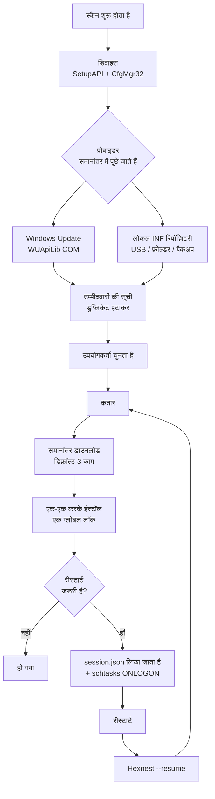

<div align="center">


# Hexnest

**Hexnest, Windows और macOS के लिए एक मुफ़्त, ओपन-सोर्स सिस्टम उपयोगिता है: ड्राइवर अपडेटर,
सिस्टम मॉनिटर, नेटवर्क मॉनिटर, स्टार्ट-अप प्रबंधक और डिस्क क्लीनर — सब एक ही विंडो में।**

Windows पर यह मशीन के हर डिवाइस को स्कैन करता है, अनुपस्थित और पुराने ड्राइवर ढूँढ़कर इंस्टॉल करता है,
ज़रूरी रीस्टार्ट के बाद वहीं से आगे बढ़ता है, फ़ॉर्मैट से पहले आपके ड्राइवरों का बैकअप लेता है और बाद में
बिना इंटरनेट के उन्हें लौटा देता है। दोनों प्लैटफ़ॉर्म पर यह लाइव दिखाता है कि मशीन और उस पर चलने वाला
हर प्रोग्राम प्रोसेसर, मेमोरी और बैंडविड्थ में कितना ख़र्च कर रहा है, लॉगिन पर क्या शुरू होता है, और
डिस्क की जगह कहाँ जा रही है। Windows पर कोई इंस्टॉलर नहीं, कहीं भी कोई ऐडवेयर नहीं।

<br>

[](https://github.com/ahmetcaglayan/Hexnest/releases/latest/download/Hexnest.exe)
[](https://github.com/ahmetcaglayan/Hexnest/releases/latest/download/Hexnest-arm64.dmg)

<sub>[🌐 प्रोजेक्ट साइट](https://ahmetcaglayan.github.io/Hexnest/) · [Intel Mac, ARM पर Windows और सभी पुराने रिलीज़ →](../../releases)</sub>

<br>

### Windows: कोई इंस्टॉलर नहीं। macOS: Applications में खींचिए।

`Windows 10 1607+ / 11` · `macOS 12 Monterey+` · `64-बिट` · `Apple silicon और Intel`

**पहले कुछ भी इंस्टॉल करने की ज़रूरत नहीं।** दोनों बिल्ड .NET 8 रनटाइम अपने भीतर लेकर चलते हैं:
Windows पर .NET डाउनलोड नहीं, Visual C++ Redistributable नहीं, Mac पर Homebrew या Xcode नहीं।

<br>

[](LICENSE)
[](../../releases)
[](../../releases)
[](https://dotnet.microsoft.com/)
[](../../releases/latest)
[](../../releases)
[](../../stargazers)
[](../../actions/workflows/build.yml)

<sub>[🇬🇧 English](README.md) · [🇹🇷 Türkçe](README.tr.md) · [🇷🇺 Русский](README.ru.md) · [🇨🇳 简体中文](README.zh.md) · 🇮🇳 हिन्दी</sub>

<br>


</div>

---

## 🖥️ कहाँ क्या चलता है

Hexnest एक ही उत्पाद है, दो विंडो के साथ। साझा इंजन — मॉनिटर, क्लीनर, स्टार्ट-अप प्रबंधक,
सेटिंग्स और लॉग — दोनों प्लैटफ़ॉर्म पर एक ही कोड है। ड्राइवर वाला हिस्सा केवल Windows पर है, और इसलिए नहीं
कि वह अभी लिखा नहीं गया: **macOS में स्कैन, अपडेट या बैकअप करने लायक कोई तीसरे पक्ष का ड्राइवर स्टोर है ही
नहीं।** Apple ड्राइवर ऑपरेटिंग सिस्टम के भीतर भेजता है, इसलिए ऐसे किसी टूल के लिए वहाँ ढूँढ़ने को कुछ नहीं है।
यही वजह है कि वे पेज Mac बिल्ड में मौजूद होकर हमेशा ख़ाली रहने के बजाय हैं ही नहीं।

| |  |  |
| --- | :---: | :---: |
| **डैशबोर्ड** और हार्डवेयर सारांश | ✅ | ✅ |
| **सिस्टम मॉनिटर** — प्रोसेसर, प्रति कोर, मेमोरी, स्टोरेज, बैटरी | ✅ | ✅ |
| **प्रति-एप्लिकेशन प्रोसेसर और मेमोरी** | ✅ | ✅ |
| **नेटवर्क मॉनिटर** — लाइव दर, कुल, अडैप्टर, कनेक्शन | ✅ | ✅ |
| **प्रति-एप्लिकेशन नेटवर्क उपयोग** | ✅ केवल TCP | ✅ `nettop` से |
| **स्टार्ट-अप प्रबंधक** | ✅ Run कुंजियाँ + फ़ोल्डर | ✅ launchd एजेंट |
| **सफ़ाई**, अनुमान नहीं, मापी हुई | ✅ | ✅ |
| **लॉग, सेटिंग्स, पाँच भाषाएँ, गहरा/हल्का** | ✅ | ✅ |
| **प्रोसेसर तापमान** | ✅ ACPI थर्मल ज़ोन | ❌ root के बिना उपलब्ध नहीं |
| **प्रति-वॉल्यूम डिस्क थ्रूपुट** | ✅ | ❌ प्रति-वॉल्यूम काउंटर नहीं |
| **मेमोरी ट्रिम** | ✅ | ❌ macOS इसके बजाय संपीड़न करता है |
| **डिवाइस स्कैन / अनुपस्थित ड्राइवर** | ✅ | ❌ ड्राइवर स्टोर नहीं |
| **Windows Update ड्राइवर कैटलॉग** | ✅ | ❌ |
| **ऑफ़लाइन INF रिपॉज़िटरी** | ✅ | ❌ |
| **ड्राइवर बैकअप और रीस्टोर** | ✅ | ❌ |
| **इंस्टॉल क़तार और रीबूट के बाद जारी रखना** | ✅ | ❌ |
| **सिस्टम रीस्टोर पॉइंट** | ✅ | ❌ यह Time Machine का काम है |
| **एडमिनिस्ट्रेटर / root के रूप में चलना** | ⚠️ ज़रूरी | ✅ कभी नहीं — केवल उपयोगकर्ता का दायरा |

ऊपर का ❌ वह चीज़ है जो प्लैटफ़ॉर्म के पास नहीं है, वह नहीं जिसे Hexnest ने छोड़ दिया।
इनमें से हर एक को ऐप्लिकेशन के भीतर, जहाँ वह दिखता है, वहीं समझाया गया है।

---

## 🎯 यह किस काम आता है?

आपने अभी-अभी Windows फ़ॉर्मैट किया है। डिवाइस मैनेजर पीले विस्मयादिबोधक चिह्नों से भरा है,
रेज़ॉल्यूशन ग़लत है, आवाज़ नहीं आ रही और — सबसे बुरी बात — इंटरनेट भी नहीं है, क्योंकि नेटवर्क
एडेप्टर का ड्राइवर भी मौजूद नहीं है।

Hexnest यह सब एक ही विंडो से हल कर देता है:

- मशीन के **हर PnP डिवाइस** की सूची बनाता है और बताता है कि किनका ड्राइवर मौजूद नहीं है।
- गुम और अपग्रेड होने लायक ड्राइवर **Windows Update कैटलॉग** में या **USB स्टिक के किसी लोकल
  फ़ोल्डर** में ढूँढता है।
- उन्हें कतार में लगाता है, डाउनलोड करता है, इंस्टॉल करता है और जितने रीस्टार्ट ज़रूरी हों उनके
  बाद **जहाँ छोड़ा था वहीं से आगे बढ़ता है**।
- फ़ॉर्मैट से **पहले** आपके मौजूदा ड्राइवर एक्सपोर्ट करता है और **बाद में** बिना किसी इंटरनेट के
  उन्हें वापस लगा देता है।

1.1 से यह उन दो सवालों के जवाब भी देता है जिनके लिए लोग कार्य प्रबंधक खोलते हैं:

- **यह मशीन कर क्या रही है?** हर लॉजिकल कोर का प्रोसेसर लोड, मेमोरी का ब्योरा, फ़र्मवेयर जितने भी
  तापमान सेंसर दिखाता है वे सब, असली रीड/राइट थ्रूपुट के साथ स्टोरेज, बैटरी — और हर चल रहे
  प्रोग्राम की एक तालिका, जिसमें उसका प्रोसेसर हिस्सा, वर्किंग सेट, प्राइवेट बाइट्स और डिस्क
  थ्रूपुट होता है।
- **मेरा कनेक्शन कौन इस्तेमाल कर रहा है?** पूरी मशीन का लाइव डाउनलोड और अपलोड, इस सेशन का और
  Windows शुरू होने के बाद से का कुल, हर एडेप्टर — और एक प्रति-ऐप्लिकेशन तालिका जो दिखाती है कि
  इस वक़्त कौन-सा प्रोग्राम कितना डेटा भेज-ले रहा है।

1.2 से यह दो और सवालों के जवाब भी देता है:

- **Windows के साथ क्या-क्या शुरू होता है, और क्या मैं वह चाहता हूँ?** हर ऑटोस्टार्ट प्रविष्टि के
  साथ एक स्विच; बंद करने पर वही सेटिंग लिखी जाती है जो कार्य प्रबंधक लिखता है, इसलिए कुछ भी कभी
  मिटाया नहीं जाता।
- **मेरी डिस्क की जगह कौन खा रहा है?** हर कैश अनुमान से नहीं, नाप कर बताया गया, आपके लिए कुछ भी
  पहले से चुना हुआ नहीं, और आपकी अपनी फ़ाइलें अलग रखी जाती हैं और रीसायकल बिन में भेजी जाती हैं।

एक ही फ़ाइल, कोई इंस्टॉलर नहीं, कोई बैकग्राउंड सर्विस नहीं, कोई टेलीमेट्री नहीं।

---

## ✨ विशेषताएँ

| विशेषता | Platform | यह क्या करता है |
| --- | --- | --- |
| 🔍 **पूरा डिवाइस स्कैन** |  | SetupAPI + CfgMgr32 के ज़रिए मौजूद हर PnP डिवाइस की गिनती करता है। WMI का इस्तेमाल नहीं, इसलिए यह अभी-अभी इंस्टॉल हुई मशीन पर या टूटे हुए WMI रिपॉज़िटरी वाली मशीन पर भी चलता है। |
| ⚠️ **गुम ड्राइवर की पहचान** |  | Configuration Manager के प्रॉब्लम कोड पढ़ता है; 28 (`CM_PROB_FAILED_INSTALL`), 1 और 19 का मतलब है "ड्राइवर नहीं है"। 22 का मतलब डिवाइस बंद है, 14 का मतलब वह रीस्टार्ट का इंतज़ार कर रहा है। |
| ☁️ **Windows Update ड्राइवर कैटलॉग** |  | Windows Update Agent के COM API (WUApiLib) के ज़रिए सीधे Microsoft Update से बात करता है। कोई अतिरिक्त सर्विस नहीं, कोई अतिरिक्त डाउनलोड नहीं, कोई अतिरिक्त डिपेंडेंसी नहीं — `wuapi.dll` Windows के साथ ही आती है। |
| 💾 **लोकल / ऑफ़लाइन INF रिपॉज़िटरी** |  | फ़ोल्डरों में पड़े `.inf` पैकेज पढ़ता है और उन्हें हार्डवेयर आईडी से मिलाता है। USB स्टिक, नेटवर्क शेयर या Hexnest का बैकअप — तीनों स्रोत के तौर पर चलते हैं। |
| ⚡ **समानांतर डाउनलोड + एक-एक करके इंस्टॉल** |  | डाउनलोड एक साथ चलते हैं (डिफ़ॉल्ट 3, 1–8 के बीच बदला जा सकता है)। इंस्टॉल एक बार में एक ही होता है। यह कोई शॉर्टकट नहीं है: दूसरा इंस्टॉल एक साथ चलाने पर Windows Update `WU_E_OPERATIONINPROGRESS` लौटाता है, और PnP सबसिस्टम वैसे भी उन्हें एक-एक करके ही करता है। इसके उलट दिखावा करने से सिर्फ़ झूठी विफलताएँ मिलतीं। |
| 🔄 **रीबूट के बाद फिर से शुरू** |  | हर स्थिति बदलने पर कतार `session.json` में लिख दी जाती है; लॉगऑन पर चलने वाला एक `schtasks` टास्क (और उसके फ़ेल होने पर HKLM का `RunOnce`) Hexnest को `--resume` के साथ दोबारा चलाता है, और यह ठीक वहीं से आगे बढ़ता है जहाँ रुका था। |
| 🛡️ **सिस्टम पुनर्स्थापना बिंदु** |  | किसी सेशन के पहले इंस्टॉल से पहले `srclient.dll` के ज़रिए ड्राइवर-प्रकार का पुनर्स्थापना बिंदु बनाता है। |
| ↩️ **अपडेट से पहले बैकअप** |  | जिस पैकेज की जगह नया आने वाला है, उसे इंस्टॉल से ठीक पहले एक्सपोर्ट कर लिया जाता है और उसका पथ इतिहास रिकॉर्ड में रख दिया जाता है, ताकि कुछ ग़लत होने पर उसे वापस लगाया जा सके। |
| 📦 **ड्राइवर बैकअप / रीस्टोर** |  | `pnputil /export-driver` से हर थर्ड-पार्टी ड्राइवर पैकेज को किसी फ़ोल्डर या ZIP में एक्सपोर्ट करता है, और `pnputil /add-driver ... /subdirs /install` से वापस लगाता है। |
| 📊 **अपडेट इतिहास** |  | हर पंक्ति में एक JSON ऑब्जेक्ट के रूप में रखा गया स्थायी रिकॉर्ड (`history.jsonl`), जिसे एक क्लिक में CSV के रूप में एक्सपोर्ट किया जा सकता है। |
| 📄 **हार्डवेयर रिपोर्ट** |  | हर डिवाइस और हार्डवेयर आईडी को एक सादा टेक्स्ट फ़ाइल में लिख देता है — उसे USB स्टिक पर किसी चालू कंप्यूटर तक ले जाइए और ड्राइवर हाथ से खोज लीजिए। |
| 🆙 **बिल्ट-इन अपडेटर** |  | नई रिलीज़ GitHub से डाउनलोड करता है, **उसका SHA-256 जाँचता है** (और अगर रिलीज़ के साथ `checksums.txt` प्रकाशित नहीं हुआ है तो इंस्टॉल करने से मना कर देता है), फिर एक्ज़ीक्यूटेबल को उसी जगह बदल देता है। |
| 📈 **सिस्टम मॉनिटर** |   | कुल मिलाकर और हर लॉजिकल कोर के हिसाब से प्रोसेसर लोड (`NtQuerySystemInformation`), कैश्ड और कमिटेड बाइट्स तक टूटी हुई मेमोरी (`GlobalMemoryStatusEx` + `GetPerformanceInfo`), ACPI थर्मल ज़ोन, हर वॉल्यूम का रीड/राइट थ्रूपुट (`IOCTL_DISK_PERFORMANCE`) और बैटरी की स्थिति। पेज खुलने से पहले कुछ भी सैंपल नहीं किया जाता, और पेज छोड़ते ही यह रुक जाता है। |
| 🧮 **प्रति-ऐप्लिकेशन संसाधन उपयोग** |   | हर प्रोसेस का प्रोसेसर हिस्सा, वर्किंग सेट, प्राइवेट बाइट्स, डिस्क थ्रूपुट और थ्रेड संख्या — ठीक उसी तरह मापी गई जैसे कार्य प्रबंधक मापता है: दो सैंपल के बीच प्रोसेस के अपने कर्नेल + यूज़र समय का अंतर, बीते वास्तविक समय और लॉजिकल प्रोसेसरों की संख्या से भाग देकर। |
| 🌐 **नेटवर्क मॉनिटर** |   | एडेप्टरों के अपने काउंटरों से पूरी मशीन का डाउनलोड और अपलोड, सेशन का और बूट के बाद से का कुल, खुले कनेक्शनों की संख्या, और हर एडेप्टर अपने पते और तय हुई लिंक स्पीड के साथ। |
| 🔎 **प्रति-ऐप्लिकेशन नेटवर्क उपयोग** |   | कौन-सा प्रोग्राम कितना डेटा भेज-ले रहा है, यह `GetExtendedTcpTable` और TCP ESTATS (`GetPerTcpConnectionEStats`) से आता है। सिर्फ़ TCP — कर्नेल ड्राइवर के बिना Windows में प्रति-प्रोसेस UDP काउंटर है ही नहीं, और पेज चुपचाप कम आँकड़े दिखाने के बजाय यह बात साफ़ लिख देता है। |
| 🔁 **अपने आप अपडेट जाँच** |  | दिन में एक बार GitHub Releases API को एक अनुरोध, और नया संस्करण होने पर *परिचय* प्रविष्टि पर एक संख्या। अपने आप डाउनलोड और इंस्टॉल आपके चालू करने पर ही होता है, SHA-256 से जाँचा जाता है, और सिर्फ़ तब लागू होता है जब Hexnest बंद हो रहा हो — कतार के बीच में कभी नहीं। macOS पर जाँच मैन्युअल है — *परिचय* → *अपडेट जाँचें* — और यह इंस्टॉल करने के बजाय डाउनलोड खोल देती है। |
| 🚀 **स्टार्टअप मैनेजर** |   | `Run` / `RunOnce` कुंजियों (HKCU, HKLM और 32-बिट व्यू) और दोनों स्टार्टअप फ़ोल्डरों की हर ऑटोस्टार्ट प्रविष्टि, हर एक के साथ एक स्विच। बंद करने पर वही `StartupApproved` वैल्यू लिखी जाती है जो कार्य प्रबंधक लिखता है, इसलिए दोनों जगह हमेशा एक ही स्थिति दिखती है और मूल कमांड लाइन कभी मिटाई नहीं जाती। जो प्रविष्टियाँ किसी गुम फ़ाइल की ओर इशारा करती हैं, वे चिह्नित कर दी जाती हैं। |
| 🧹 **सफ़ाई** |   | टेम्परेरी फ़ाइलें, थंबनेल और आइकन कैश, सात ब्राउज़रों के कैश, Windows Update का डाउनलोड कैश, डिलीवरी ऑप्टिमाइज़ेशन, क्रैश डंप, त्रुटि रिपोर्ट, शेडर कैश, सर्विसिंग लॉग और रीसायकल बिन — हर एक **मापा हुआ, अनुमान नहीं**, और **डिफ़ॉल्ट रूप से कुछ भी चुना हुआ नहीं**। |
| 🗂️ **बचे हुए फ़ोल्डर और पुराने डाउनलोड** |   | AppData के अंदर वे फ़ोल्डर जो किसी इंस्टॉल किए हुए प्रोग्राम, किसी चल रहे प्रोग्राम और Program Files की किसी चीज़ से मेल नहीं खाते और जिन्हें छह महीने से छुआ नहीं गया; साथ ही Downloads में पड़ी वे आर्काइव और इंस्टॉलर फ़ाइलें जो एक महीने से पुरानी हैं। इन्हें एक-एक करके सूची में दिखाया जाता है और **रीसायकल बिन** में भेजा जाता है, सीधे मिटाया कभी नहीं जाता। |
| 🧠 **मेमोरी खाली करना** |  | प्रोसेस के वर्किंग सेट पेज-आउट कर देता है। पेज साफ़-साफ़ लिखता है कि इससे *इसी वक़्त* फ़िज़िकल मेमोरी खाली होती है और कुछ भी तेज़ नहीं होता — जो इस बटन वाले हर दूसरे टूल के दावे के ठीक उलट है। |
| 🌍 **पाँच इंटरफ़ेस भाषाएँ** |   | अंग्रेज़ी, तुर्की, रूसी, सरलीकृत चीनी और हिन्दी — सभी उसी एक एक्ज़ीक्यूटेबल के अंदर। ऐप खुला रहते ही तुरंत बदल जाती हैं। |
| 🎨 **डार्क / लाइट थीम** |   | पैलेट डिक्शनरी बदल देता है; विंडो दोबारा खोले बिना लागू हो जाती है। |

---

## 🚑 फ़ॉर्मैट के बाद रिकवरी

Hexnest इसी वजह से बना है।

### पहले मुर्गी या पहले अंडा वाली उलझन

फ़ॉर्मैट के बाद आम तौर पर **नेटवर्क एडेप्टर का ड्राइवर भी मौजूद नहीं होता**। ड्राइवर डाउनलोड करने
के लिए इंटरनेट चाहिए और इंटरनेट तक पहुँचने के लिए ड्राइवर। Windows Update भी काम नहीं आता,
क्योंकि आप उस तक पहुँच ही नहीं सकते।

इसका हल: **फ़ॉर्मैट से पहले अपने ड्राइवर साथ ले जाइए।**

### फ़ॉर्मैट से पहले (5 मिनट)

1. Hexnest चलाइए।
2. **बैकअप और रीस्टोर** पर जाइए।
3. **बैकअप बनाएँ** पर क्लिक कीजिए। सिस्टम का हर थर्ड-पार्टी ड्राइवर पैकेज एक्सपोर्ट हो जाता है।
   (Microsoft के अपने इन-बॉक्स ड्राइवर जान-बूझकर छोड़ दिए जाते हैं — उन्हें Windows ख़ुद दोबारा
   इंस्टॉल कर लेता है, और उन्हें शामिल करने से बैकअप का आकार बेवजह तीन गुना हो जाता।)
4. चाहें तो **ZIP में कंप्रेस करें** पर निशान लगा दीजिए।
5. बना हुआ फ़ोल्डर **और `Hexnest.exe`** दोनों एक ही USB स्टिक पर कॉपी कर लीजिए।

> 💡 वैकल्पिक: बैकअप फ़ोल्डर का नाम `Drivers` रखिए और उसे `Hexnest.exe` के बगल में रखिए।
> Hexnest उसे **अपने आप** एक लोकल ड्राइवर रिपॉज़िटरी के रूप में दर्ज कर लेता है — कुछ भी सेट
> करने की ज़रूरत नहीं।

### फ़ॉर्मैट के बाद

1. स्टिक लगाइए और `Hexnest.exe` चलाइए (यह एडमिन अधिकार माँगेगा)।
   इंटरनेट न हो तो इसे `Hexnest.exe --rescue` के रूप में शुरू कीजिए: तब Windows Update से संपर्क
   बिल्कुल नहीं किया जाता और सिर्फ़ लोकल स्रोत इस्तेमाल होते हैं।
2. **बैकअप और रीस्टोर → रीस्टोर** (या **फ़ोल्डर से रीस्टोर करें**) चुनकर अपना बैकअप बताइए।
   हर पैकेज ड्राइवर स्टोर में जुड़ जाता है और अपने डिवाइस से बाँध दिया जाता है।
3. नेटवर्क एडेप्टर चलने लगे तो **स्कैन** दबाइए।
4. **डैशबोर्ड → फ़ॉर्मैट के बाद रिकवरी** जो कुछ अब भी गुम है उसे Windows Update से कतार में लगा
   देता है।
5. जब रीस्टार्ट के लिए पूछा जाए तो हाँ कहिए — Hexnest लॉगऑन पर ख़ुद वापस आ जाता है और बची हुई
   कतार पूरी कर देता है।

> ℹ️ फ़ोल्डर का Hexnest का बैकअप होना ज़रूरी नहीं है। किसी वेंडर का जो ड्राइवर फ़ोल्डर आपने
> डाउनलोड करके निकाला है, वह भी **फ़ोल्डर से रीस्टोर करें** के साथ चलता है; उसकी `.inf` फ़ाइलें
> सब-फ़ोल्डरों समेत ढूँढ ली जाती हैं।

### कमांड लाइन

```powershell
Hexnest.exe                 # सामान्य शुरुआत
Hexnest.exe --rescue        # ऑफ़लाइन रेस्क्यू मोड (--offline के बराबर)
Hexnest.exe --resume        # बीच में रुकी कतार सीधे आगे बढ़ाएँ
```

---

## 📸 स्क्रीनशॉट

शिपिंग बिल्ड के असली स्क्रीनशॉट। ये ऐप्लिकेशन ख़ुद से दोबारा बनाए जाते हैं — देखिए
[स्क्रीनशॉट दोबारा बनाना](#स्क्रीनशॉट-दोबारा-बनाना) — इसलिए ये पुराने नहीं पड़ सकते।

### 

<table>
<tr>
<td width="50%"><br><sub><b>सिस्टम मॉनिटर</b> — प्रोसेसर, मेमोरी, तापमान और डिस्क लाइव चार्ट के रूप में, हर लॉजिकल कोर के लिए एक बार।</sub></td>
<td width="50%"><br><sub><b>नेटवर्क मॉनिटर</b> — पूरी मशीन का डाउनलोड और अपलोड, सेशन का कुल, हर एडेप्टर।</sub></td>
</tr>
<tr>
<td width="50%"><br><sub><b>प्रति प्रोग्राम उपयोग</b> — हर चल रही प्रोसेस का प्रोसेसर, मेमोरी, डिस्क और थ्रेड।</sub></td>
<td width="50%"><br><sub><b>प्रति प्रोग्राम ट्रैफ़िक</b> — कौन-सा ऐप्लिकेशन कनेक्शन इस्तेमाल कर रहा है, और कितना।</sub></td>
</tr>
<tr>
<td width="50%"><br><sub><b>डिवाइस</b> — क्लास के हिसाब से समूहबद्ध हर PnP डिवाइस, लाइव प्रॉब्लम कोड के साथ।</sub></td>
<td width="50%"><br><sub><b>अपडेट</b> — Windows Update और लोकल INF फ़ोल्डरों से इंस्टॉल होने लायक पैकेज।</sub></td>
</tr>
<tr>
<td width="50%"><br><sub><b>गतिविधि</b> — चल रही कतार, हर ड्राइवर की गति और इंस्टॉल चरण के साथ।</sub></td>
<td width="50%"><br><sub><b>बैकअप और रीस्टोर</b> — हर थर्ड-पार्टी ड्राइवर एक्सपोर्ट कीजिए, ऑफ़लाइन वापस लगाइए।</sub></td>
</tr>
<tr>
<td width="50%"><br><sub><b>स्टार्टअप प्रोग्राम</b> — हर प्रविष्टि के लिए एक स्विच, ठीक वैसे लिखा जैसे कार्य प्रबंधक लिखता है।</sub></td>
<td width="50%"><br><sub><b>सफ़ाई</b> — अनुमान नहीं, मापा हुआ, और आपके लिए कुछ भी पहले से चुना हुआ नहीं।</sub></td>
</tr>
<tr>
<td width="50%"><br><sub><b>सेटिंग्स</b> — समानांतर डाउनलोड, सुरक्षा, अपने आप अपडेट, थीम और भाषा।</sub></td>
<td width="50%"><br><sub><b>परिचय</b> — संस्करण की जानकारी और बिल्ट-इन अपडेटर।</sub></td>
</tr>
</table>

### 

<table>
<tr>
<td width="50%"><br><sub><b>डैशबोर्ड</b> — यह Mac अभी क्या कर रहा है, और है क्या: चिप, ग्राफ़िक्स, मेमोरी, डिस्क।</sub></td>
<td width="50%"><br><sub><b>सिस्टम मॉनिटर</b> — हर कोर के लिए एक बार, Apple silicon पर P और E क्लस्टर समेत।</sub></td>
</tr>
<tr>
<td width="50%"><br><sub><b>नेटवर्क मॉनिटर</b> — प्रति-एप्लिकेशन ट्रैफ़िक, वही स्रोत जो Activity Monitor उपयोग करता है।</sub></td>
<td width="50%"><br><sub><b>स्टार्ट-अप प्रोग्राम</b> — launchd एजेंट के लिए एक-एक स्विच; सिस्टम जॉब दिखते हैं, छुए नहीं जाते।</sub></td>
</tr>
<tr>
<td width="50%"><br><sub><b>सफ़ाई</b> — कैश, Xcode derived data, iPhone बैकअप। मापे हुए, और कुछ भी पहले से चुना नहीं।</sub></td>
<td width="50%"><br><sub><b>सेटिंग्स</b> — वही विकल्प, साथ में सूर्योदय-सूर्यास्त पर macOS का अनुसरण करने वाली थीम।</sub></td>
</tr>
<tr>
<td width="50%"><br><sub><b>लॉग</b> — लाइव डायग्नोस्टिक्स, इशू रिपोर्ट के लिए एक क्लिक में क्लिपबोर्ड पर।</sub></td>
<td width="50%"><br><sub><b>परिचय</b> — संस्करण, मशीन, और एक अपडेट जाँच जो डाउनलोड खोल देती है।</sub></td>
</tr>
</table>

### स्क्रीनशॉट दोबारा बनाना

ऊपर की हर तस्वीर ऐप्लिकेशन ख़ुद बनाता है, इसलिए UI में बदलाव को दस्तावेज़ों में एक ही
कमांड से उतारा जा सकता है:

```powershell
# Windows, बिल्ड के बाद एलिवेटेड प्रॉम्प्ट से
.\Hexnest.exe --capture .\assets\screenshots --lang en
```

```bash
# macOS, ./build/make-mac-app.sh चलाने के बाद
./artifacts/mac/arm64/Hexnest.app/Contents/MacOS/Hexnest --capture ./shots --lang en
```

दोनों पूरे मेन्यू पर जाते हैं, लाइव पेजों के चार्ट भरने का इंतज़ार करते हैं, और हर पेज का एक
PNG लिखते हैं। `--lang` इंटरफ़ेस भाषा तय कर देता है, ताकि प्रकाशित तस्वीरें उन्हें बनाने वाले की डिस्प्ले भाषा
पर निर्भर न रहें।

> बिल्ट-इन कैप्चर क्यों? Windows पर Hexnest एलिवेटेड चलता है, और यूज़र इंटरफ़ेस प्रिविलेज
> आइसोलेशन (बिना एलिवेशन वाले) Snipping Tool को ऊँची इंटीग्रिटी वाली विंडो के इनपुट देखने नहीं देता —
> Hexnest, Task Manager या Registry Editor पर Print Screen दबाने से कुछ नहीं होता। macOS पर स्क्रीन
> कैप्चर के लिए Screen Recording अनुमति चाहिए और वह डेस्कटॉप पर मौजूद बाकी सब कुछ भी खींच लेता।
> दोनों बिल्ड इसके बजाय अपना ही विज़ुअल ट्री रेंडर करते हैं।

---

## 🧭 मेन्यू

| मेन्यू | Platform | यह क्या करता है |
| --- | --- | --- |
| **डैशबोर्ड** |   | डिवाइस की संख्या, गुम ड्राइवर, उपलब्ध अपडेट, समस्या वाले डिवाइस। OS / मशीन / CPU / BIOS का सारांश। क्विक ऐक्शन: *अभी स्कैन करें*, *फ़ॉर्मैट के बाद रिकवरी*, *सब कुछ अपडेट करें*, *ड्राइवर बैकअप लें*, *हार्डवेयर रिपोर्ट*। जब किसी भी नेटवर्क एडेप्टर का ड्राइवर काम नहीं कर रहा होता, तब एक चेतावनी बैनर दिखता है। |
| **डिवाइस** |  | हर PnP डिवाइस, क्लास के हिसाब से समूहबद्ध। फ़िल्टर: *सभी / समस्याएँ / गुम / जेनेरिक ड्राइवर*। नाम, निर्माता, संस्करण और हार्डवेयर आईडी से खोज; किसी हार्डवेयर आईडी को क्लिपबोर्ड पर कॉपी करने की सुविधा। |
| **अपडेट** |  | इंस्टॉल किए जा सकने वाले पैकेज: गुम ड्राइवर भी और संस्करण अपग्रेड भी। हर पंक्ति के लिए अलग चयन, *सभी चुनें / चयन हटाएँ*, चुनी हुई चीज़ों का कुल आकार, *चुने हुए इंस्टॉल करें*। आप चाहें तो कोई एक अपडेट छिपा सकते हैं या किसी डिवाइस को पूरी तरह अनदेखा कर सकते हैं। |
| **गतिविधि** |  | चल रही कतार। हर काम के लिए डाउनलोड प्रतिशत, गति, भेजे-लिए गए बाइट और इंस्टॉल का चरण अलग-अलग दिखते हैं। *सब रद्द करें*, *विफल हुए दोबारा आज़माएँ*, *अभी रीस्टार्ट करें* / *बाद में*। बीच में रुक गया सेशन यहाँ *जारी रखें* बटन दिखाता है। |
| **बैकअप और रीस्टोर** |  | *बैकअप बनाएँ* (चाहें तो ZIP में), मौजूदा बैकअप की सूची (पैकेज संख्या, आकार, तारीख़), *रीस्टोर*, *फ़ोल्डर से रीस्टोर करें*, *खोलें*, *हटाएँ*। |
| **इतिहास** |  | हर ड्राइवर कार्रवाई का स्थायी रिकॉर्ड। नतीजे के हिसाब से फ़िल्टर, खोज, *CSV के रूप में एक्सपोर्ट करें*, *इतिहास मिटाएँ*। किसी रिकॉर्ड का अपडेट-से-पहले वाला बैकअप अब भी मौजूद हो तो आप उसका फ़ोल्डर खोल सकते हैं। |
| **सिस्टम मॉनिटर** |   | कुल मिलाकर और हर लॉजिकल कोर के हिसाब से प्रोसेसर लोड, इस्तेमाल में / उपलब्ध / कैश्ड / कमिटेड में बँटी मेमोरी, मशीन जितने तापमान सेंसर दिखाती हो वे, लाइव रीड और राइट थ्रूपुट के साथ स्टोरेज क्षमता, और बैटरी। उसके नीचे हर चल रही प्रोसेस अपने प्रोसेसर हिस्से, वर्किंग सेट, प्राइवेट बाइट्स, डिस्क थ्रूपुट और थ्रेड संख्या के साथ — प्रोसेसर, मेमोरी, डिस्क या नाम से क्रमबद्ध, खोजी जा सकने वाली, और रोकी भी जा सकने वाली, ताकि कोई पंक्ति सचमुच पढ़ी जा सके। |
| **नेटवर्क मॉनिटर** |   | पूरी मशीन का लाइव डाउनलोड और अपलोड चार्ट के रूप में, इस सेशन का और Windows शुरू होने के बाद से का कुल, खुले कनेक्शनों की संख्या, और हर एडेप्टर अपने प्रकार, पते और लिंक स्पीड के साथ। उसके नीचे एक प्रति-ऐप्लिकेशन तालिका: डाउनलोड और अपलोड की दर, सेशन का कुल, खुले कनेक्शन और दूरस्थ एंडपॉइंट। |
| **स्टार्टअप प्रोग्राम** |   | हर वह ऑटोस्टार्ट प्रविष्टि जिसे Hexnest सुरक्षित तरीक़े से चालू-बंद कर सकता है — एक्ज़ीक्यूटेबल के वर्ज़न रिसोर्स से लिया गया प्रोग्राम का नाम, उसका प्रकाशक, कमांड लाइन, आकार और वह कहाँ से चलता है, इन सबके साथ। हर पंक्ति के लिए एक स्विच; बंद करने पर वही सेटिंग लिखी जाती है जो कार्य प्रबंधक लिखता है, और कुछ भी मिटाया नहीं जाता। जो प्रविष्टियाँ ऐसी फ़ाइल की ओर इशारा करती हैं जो अब मौजूद नहीं है, वे चिह्नित होती हैं, सुरक्षा सॉफ़्टवेयर पर निशान लगता है और उसे बंद करने से पहले पूछा जाता है, और चालू, बंद तथा टूटी प्रविष्टियों के फ़िल्टर के साथ खोज भी है। |
| **सफ़ाई** |   | टेम्परेरी फ़ाइलों, थंबनेल और आइकन कैश, सात ब्राउज़रों, Windows Update के डाउनलोड कैश, डिलीवरी ऑप्टिमाइज़ेशन, क्रैश डंप, त्रुटि रिपोर्ट, शेडर कैश, Windows लॉग, Hexnest के अपने कैश और रीसायकल बिन के मापे हुए आकार। डिफ़ॉल्ट रूप से कुछ भी चुना हुआ नहीं होता। पुराने डाउनलोड और AppData में बचे हुए फ़ोल्डर एक-एक करके सूची में आते हैं और रीसायकल बिन में जाते हैं। साथ में मेमोरी खाली करने की सुविधा, जो अपने काम के बारे में ईमानदार है। |
| **लॉग** |   | लाइव डायग्नोस्टिक्स। *कॉपी* लॉग को संस्करण / OS / मशीन हेडर के साथ क्लिपबोर्ड पर रख देता है — किसी issue रिपोर्ट को ठीक इतना ही चाहिए। लॉग फ़ाइल या फ़ोल्डर खोलिए, या उसे साफ़ कर दीजिए। |
| **सेटिंग्स** |   | समानांतर डाउनलोड की संख्या, दोबारा कोशिश की संख्या, शुरू होते ही स्कैन, पुनर्स्थापना बिंदु, अपडेट से पहले बैकअप, रीस्टार्ट के बाद फिर से शुरू करना, अपने आप रीस्टार्ट और उसकी देरी, ऑफ़लाइन मोड, वैकल्पिक ड्राइवर, लोकल ड्राइवर फ़ोल्डर, इतिहास कितने समय रखा जाए, **अपने आप अपडेट जाँच, अपने आप इंस्टॉल और प्री-रिलीज़**, थीम, भाषा। |
| **परिचय** |   | संस्करण की जानकारी, *अपडेट जाँचें*, *डाउनलोड करके इंस्टॉल करें*, रिलीज़ नोट्स, प्रोजेक्ट पेज और issue के लिंक। |

Mac बिल्ड का साइडबार ऊपर macOS चिह्नित आठ पंक्तियाँ ही हैं, उसी क्रम में। *डिवाइस*,
*अपडेट*, *गतिविधि*, *बैकअप और रीस्टोर* तथा *इतिहास* वहाँ ख़ाली नहीं, बल्कि हैं ही नहीं।

---

## ⚙️ यह कैसे काम करता है



संक्षेप में:

1. **स्कैन।** `SetupDiGetClassDevs(DIGCF_PRESENT | DIGCF_ALLCLASSES)` भौतिक रूप से मौजूद हर
   डिवाइस की गिनती करता है; प्रॉब्लम कोड `CM_Get_DevNode_Status` से आता है, और इंस्टॉल हुए
   ड्राइवर का संस्करण, तारीख़ और प्रोवाइडर
   `HKLM\SYSTEM\CurrentControlSet\Control\Class\<DriverKey>` से।
2. **प्रोवाइडर।** Windows Update और लोकल INF रिपॉज़िटरी दोनों एक ही समय पर पूछे जाते हैं। कोई
   प्रोवाइडर विफल हो जाए तो वह सिर्फ़ एक चेतावनी पंक्ति बनता है, पूरा स्कैन कभी नहीं रुकता।
3. **डुप्लिकेट हटाना।** जब दोनों स्रोत एक ही पैकेज देते हैं तो **लोकल कॉपी जीतती है** — वह पहले
   से डिस्क पर है और उसे नेटवर्क नहीं चाहिए। अगर Windows Update पहले से इंस्टॉल संस्करण से पुराना
   संस्करण देता है, तो वह उम्मीदवार हटा दिया जाता है।
4. **कतार।** डाउनलोड `SemaphoreSlim(MaxParallelJobs)` के पीछे चलते हैं; इंस्टॉल एक ही ग्लोबल लॉक
   के पीछे। विफल हुआ काम डिफ़ॉल्ट रूप से दो बार दोबारा आज़माया जाता है।
5. **फिर से शुरू करना।** हर स्थिति परिवर्तन एटॉमिक तरीक़े से `session.json` में लिखा जाता है। जब
   रीस्टार्ट ज़रूरी हो तो कतार रोक दी जाती है, और लॉगऑन पर चलने वाला एक टास्क Hexnest को
   `--resume` के साथ वापस ले आता है। एक सेशन ज़्यादा से ज़्यादा 10 रीस्टार्ट झेलता है; उसके बाद
   सुरक्षा वाल्व के तौर पर उसे छोड़ दिया जाता है।

---

## 🔨 सोर्स से बिल्ड करना

अगर आपको सिर्फ़ ऐप चाहिए तो इससे कोई मतलब नहीं: **exe डाउनलोड कीजिए, डबल-क्लिक कीजिए, हो गया।**
सोर्स अपने अलग फ़ोल्डर में पड़ा रहता है और किसी को परेशान नहीं करता।

```
Hexnest/
├── src/                    सोर्स कोड (C#, .NET 8, WPF)
│   ├── Hexnest.Core/       UI-रहित कोर: स्कैनिंग, प्रोवाइडर, जॉब इंजन
│   ├── Hexnest.App/        WPF डेस्कटॉप ऐप्लिकेशन (Hexnest.exe)
│   ├── Hexnest.Mac/        macOS के लिए Avalonia ऐप्लिकेशन (Hexnest.app)
│   └── Hexnest.Cli/        (आरक्षित) बिना UI वाले फ़्रंट एंड के लिए जगह
├── docs/                   दस्तावेज़
├── build/                  बिल्ड स्क्रिप्ट
├── assets/                 लोगो और स्क्रीनशॉट
└── .github/workflows/      CI
```

छोटा रास्ता:

```powershell
dotnet publish src/Hexnest.App/Hexnest.App.csproj -c Release -r win-x64 -o publish
```

और किसी Mac पर, जो `artifacts/mac/arm64/Hexnest.app` बनाता है:

```bash
./build/make-mac-app.sh --arch arm64
```

रिलीज़ में प्रकाशित होने वाली डिस्क इमेज के लिए `--dmg` जोड़िए। स्क्रिप्ट को .NET 8 SDK के अलावा कुछ नहीं चाहिए: यह `Info.plist` लिखती है, `assets/icon-mac-1024.png` से `.icns` बनाती है और bundle पर ad-hoc हस्ताक्षर करती है ताकि Apple silicon उसे चला सके।


विस्तार से जानकारी, arm64 बिल्ड और WUApiLib COM रेफ़रेंस की व्याख्या:
**[docs/BUILD.md](docs/BUILD.md)**

आर्किटेक्चर, `IDriverProvider` एब्स्ट्रैक्शन और नया ड्राइवर स्रोत कैसे जोड़ें:
**[docs/ARCHITECTURE.md](docs/ARCHITECTURE.md)**

---

## 🔐 सुरक्षा और निजता

- **कोई टेलीमेट्री नहीं।** कोई उपयोग डेटा, कोई डिवाइस पहचानकर्ता, कोई आँकड़े मशीन से बाहर नहीं
  जाते।
- बाहर सिर्फ़ **दो** चीज़ें जाती हैं:
  1. **Windows Update के प्रश्न** — सीधे Microsoft को, Windows के अपने Windows Update Agent के
     ज़रिए। (ऑफ़लाइन मोड में या `--rescue` के साथ कभी नहीं।)
  2. **GitHub Releases API** — सिर्फ़ तब, जब आप *अपडेट जाँचें* दबाते हैं।
- **एडमिनिस्ट्रेटर क्यों?** ड्राइवर इंस्टॉल करना विशेषाधिकार वाला काम है: `pnputil`, Windows
  Update का इंस्टॉलर और सिस्टम पुनर्स्थापना — तीनों को एलिवेटेड टोकन चाहिए। Hexnest कतार के बीच
  में जाकर फ़ेल होने के बजाय इसे अपने ऐप्लिकेशन मैनिफ़ेस्ट (`requireAdministrator`) में शुरुआत
  में ही माँग लेता है।
- **सुरक्षा जाल:** सेशन के पहले इंस्टॉल से पहले एक सिस्टम पुनर्स्थापना बिंदु, और जिस भी ड्राइवर
  पैकेज की जगह नया आता है उसका बैकअप।
- **अपडेटर** डाउनलोड की गई फ़ाइल की तुलना रिलीज़ के `checksums.txt` में दिए SHA-256 से करता है;
  चेकसम न मिले या मेल न खाए तो फ़ाइल हटा दी जाती है और अपडेट से मना कर दिया जाता है।
- सारा डेटा `%ProgramData%\Hexnest` के नीचे रहता है: `settings.json`, `session.json`,
  `history.jsonl`, `logs/`, `backups/`, `cache/`, `reports/`।

सुरक्षा ख़ामियों की रिपोर्ट: **[SECURITY.md](SECURITY.md)**

---

## ❓ अक्सर पूछे जाने वाले सवाल

### क्या Hexnest मुफ़्त है?

हाँ। Hexnest MIT लाइसेंस के तहत जारी होता है और पूरा सोर्स इसी रिपॉज़िटरी में है। न कोई पेड
वर्ज़न है, न ट्रायल, न कोई ऐसी सुविधा जो पैसे देने पर खुलती हो, न विज्ञापन, न साथ में घुसाया गया
कोई थर्ड-पार्टी सॉफ़्टवेयर। स्कैन और इंस्टॉल — दोनों एक ही उत्पाद हैं।

### क्या मुझे .NET इंस्टॉल करना पड़ेगा?

नहीं। पूरा .NET 8 रनटाइम `Hexnest.exe` के अंदर ही है (self-contained, single-file publish), और
WPF अपनी `vcruntime140_cor3.dll` / `msvcp140_cor3.dll` ख़ुद साथ लाता है। Visual C++
Redistributable की भी ज़रूरत नहीं। एकमात्र शर्त यह है कि 64-बिट Windows 10 संस्करण 1607
(बिल्ड 14393) या उससे नया हो।

### क्या Hexnest किसी Mac पर ड्राइवर अपडेट करता है?

नहीं, और कोई दूसरा भी नहीं करता। macOS में तीसरे पक्ष का कोई ड्राइवर स्टोर है ही नहीं: Apple डिवाइस
सपोर्ट ऑपरेटिंग सिस्टम के भीतर भेजता है और उसे OS के साथ ही अपडेट करता है। ऐसे किसी टूल के लिए वहाँ
स्कैन, डाउनलोड या बैकअप करने को कुछ नहीं है, इसलिए Mac बिल्ड में *डिवाइस*, *अपडेट*, *गतिविधि*,
*बैकअप* या *इतिहास* पेज हैं ही नहीं — बजाय इसके कि पाँच पेज हों जिनमें कभी कुछ आए ही नहीं। Hexnest
जो कुछ और करता है, वह सब वहाँ काम करता है।

### किस Mac की ज़रूरत है?

macOS 12 Monterey या नया, Apple silicon या Intel पर। दोनों बिल्ड अलग-अलग प्रकाशित होते हैं
(`Hexnest-arm64.dmg` और `Hexnest-x64.dmg`), एक यूनिवर्सल बाइनरी के रूप में नहीं: हर एक अपनी .NET
रनटाइम की प्रति साथ रखता है, और उन्हें जोड़ने से डाउनलोड पेज पर एक फ़ैसला बचाने के लिए सबका डाउनलोड
दोगुना हो जाता।

### macOS कहता है "डेवलपर सत्यापित न होने के कारण खोला नहीं जा सकता"

रिलीज़ ad-hoc हस्ताक्षरित हैं पर नोटराइज़ नहीं, क्योंकि नोटराइज़ेशन के लिए सशुल्क Apple Developer
खाता चाहिए। Applications में Hexnest पर राइट-क्लिक (या Control-क्लिक) कीजिए और **Open** चुनिए;
macOS एक बार पूछता है और जवाब याद रख लेता है। हर रिलीज़ के साथ `checksums.txt` आता है, जिससे डाउनलोड
पहले जाँचा जा सकता है।

### Hexnest for Mac कभी मेरा पासवर्ड क्यों नहीं माँगता?

क्योंकि उसे ज़रूरत ही नहीं। मॉनिटर सार्वजनिक आँकड़े पढ़ते हैं, क्लीनर आपके अपने होम फ़ोल्डर के भीतर
काम करता है, और स्टार्ट-अप प्रबंधक `launchctl` से आपके अपने लॉगिन एजेंट बदलता है। सिस्टम-व्यापी
launchd जॉब दिखाए तो जाते हैं पर केवल-पढ़ने के रूप में चिह्नित रहते हैं। जो ऐप्लिकेशन आपको एक ग्राफ़
दिखाने के लिए एडमिन पासवर्ड माँगे, वह अपनी ज़रूरत से कहीं ज़्यादा भरोसा माँग रहा है।

### SmartScreen या मेरा एंटीवायरस इसके बारे में चेतावनी क्यों देता है?

क्योंकि `Hexnest.exe` पर **कोड साइनिंग नहीं है** — सर्टिफ़िकेट पैसे लेते हैं। SmartScreen और
Smart App Control हर उस बिना साइन वाली एक्ज़ीक्यूटेबल पर चेतावनी देते हैं जिसने अभी कोई प्रतिष्ठा
नहीं बनाई है, और जो ऐप एडमिनिस्ट्रेटर के रूप में चलता हो, ड्राइवर इंस्टॉल करता हो और एक शेड्यूल्ड
टास्क दर्ज करता हो, वह किसी ह्यूरिस्टिक स्कैनर को मालवेयर जैसा ही लगेगा। ईमानदार उपाय यह है कि
फ़ाइल की जाँच कर ली जाए: `Get-FileHash .\Hexnest.exe -Algorithm SHA256` के आउटपुट की तुलना
रिलीज़ के `checksums.txt` में उससे मेल खाती पंक्ति से कीजिए।

### क्या बिना इंटरनेट के, फ़ॉर्मैट के बाद ड्राइवर इंस्टॉल किए जा सकते हैं?

हाँ — Hexnest इसी के लिए बनाया गया था। फ़ॉर्मैट से पहले अपने ड्राइवरों का बैकअप लीजिए, बैकअप और
`Hexnest.exe` दोनों एक ही USB स्टिक पर रखिए, फिर बाद में `Hexnest.exe --rescue` से शुरू करके
**रीस्टोर** दबाइए। `Hexnest.exe` के बगल में रखा `Drivers` नाम का फ़ोल्डर अपने आप लोकल ड्राइवर
रिपॉज़िटरी के रूप में दर्ज हो जाता है, और आपने ख़ुद जो वेंडर फ़ोल्डर निकाला हो वह भी चलता है।

### क्या किसी ड्राइवर को वापस पुराने पर लाया जा सकता है?

हाँ, तीन तरीक़ों से: हर इंस्टॉल से ठीक पहले Hexnest जो बैकअप एक्सपोर्ट करता है उससे (**फ़ोल्डर से
रीस्टोर करें**), सेशन के पहले इंस्टॉल से पहले बने सिस्टम पुनर्स्थापना बिंदु से (`rstrui.exe`), या
डिवाइस मैनेजर में Windows के अपने *Roll Back Driver* बटन से। इसीलिए पुनर्स्थापना बिंदु वाली
सेटिंग चालू रखने की सलाह दी जाती है।

### क्या यह सचमुच रीबूट के बाद वहीं से आगे बढ़ता है?

हाँ। कतार की स्थिति हर बदलाव पर एटॉमिक तरीक़े से `session.json` में लिखी जाती है, और लॉगऑन पर
चलने वाला `Hexnest\ResumeSession` शेड्यूल्ड टास्क (और उसके फ़ेल होने पर HKLM का `RunOnce`)
Hexnest को `--resume` के साथ वापस ले आता है। एक सेशन ज़्यादा से ज़्यादा 10 रीस्टार्ट झेलता है;
कतार पूरी होते ही टास्क और रजिस्ट्री वैल्यू दोनों हटा दिए जाते हैं।

### किसी स्टार्टअप प्रोग्राम को बंद करने से क्या कुछ मिट जाता है?

नहीं। कोई प्रविष्टि चालू है या बंद, यह सेटिंग Windows एक अलग कुंजी में रखता है —
`...\CurrentVersion\Explorer\StartupApproved\Run` और उसके जैसी दो और कुंजियाँ — और Hexnest
सिर्फ़ यही लिखता है। `Run` की वैल्यू, या स्टार्टअप फ़ोल्डर का शॉर्टकट, ठीक अपनी जगह पड़ा रहता है,
इसलिए प्रविष्टि दोबारा चालू करते ही मूल कमांड लाइन बाइट-दर-बाइट वापस आ जाती है।

इसका मतलब यह भी है कि कार्य प्रबंधक और Hexnest हमेशा एक ही बात दिखाते हैं: एक में कुछ बंद कीजिए,
दूसरा भी उसे बंद ही दिखाएगा। और अगर आप बाद में Hexnest हटा देते हैं, तो मशीन के आधे स्टार्टअप
प्रोग्राम ग़ायब नहीं हो जाते, क्योंकि उनमें से कोई कहीं गया ही नहीं था।

### क्या सफ़ाई सुरक्षित है?

सुरक्षित रहने के लिए ही बनाई गई है, और डिज़ाइन आपसे भरोसा माँगने के बजाय बताता है कि कैसे:

- **डिफ़ॉल्ट रूप से कुछ भी चुना हुआ नहीं होता।** पेज कुल शून्य के साथ ही खुलता है।
- हर पथ known-folder API से आता है, किसी स्ट्रिंग से नहीं। किसी श्रेणी के अपने मूल फ़ोल्डरों के
  बाहर कुछ भी कभी नहीं छुआ जाता, और हर एक चीज़ हटाने से ठीक पहले दोबारा जाँचा जाता है कि वह
  उन्हीं मूल फ़ोल्डरों के भीतर है या नहीं।
- रीपार्स पॉइंट के पीछे कभी नहीं जाया जाता। `%LOCALAPPDATA%` जंक्शनों से भरा है, और उनमें घुस
  जाना ही वह तरीक़ा है जिससे कोई "कैश साफ़ करें" सुविधा किसी के दस्तावेज़ मिटा बैठती है।
- जो फ़ाइलें खुली हैं उन्हें ज़बरदस्ती हटाने के बजाय छोड़ दिया जाता है। छोड़ी गई फ़ाइलों की गिनती
  बता दी जाती है।
- आपकी अपनी फ़ाइलें — पुराने डाउनलोड, बचे हुए फ़ोल्डर — कभी थोक में नहीं चुनी जातीं। वे एक-एक
  करके अपने आकार और उम्र के साथ सूची में आती हैं, और **रीसायकल बिन** में जाती हैं।

बचे हुए फ़ोल्डरों की पहचान ही वह एक जगह है जहाँ Hexnest अंदाज़ा लगा रहा है, और वह पंक्ति पर साफ़
लिख देता है कि यह अनुमान है, तथ्य नहीं।

### क्या "मेमोरी खाली करें" से सचमुच कुछ होता है?

यह इसी वक़्त फ़िज़िकल मेमोरी खाली कर देता है, और बस इतना ही करता है।

यह हर प्रोसेस पर `EmptyWorkingSet` चलाता है, जो Windows से कहता है कि उस प्रोसेस का वर्किंग सेट
पेज फ़ाइल में पेज-आउट कर दे। उपयोग में मेमोरी सचमुच घटती है। लेकिन वे पेज ग़ायब नहीं हुए — वे
डिस्क पर हैं, और जैसे ही प्रोग्राम उस मेमोरी को दोबारा छूता है, Windows उन्हें वापस पढ़ लेता है,
जो उन्हें वहीं छोड़ देने से धीमा पड़ता है। बिना इस्तेमाल पड़ी मेमोरी बर्बाद मेमोरी नहीं होती;
Windows उसे पहले से ही उपलब्ध रखे हुए था।

इसलिए यह रफ़्तार बढ़ाने वाली सुविधा नहीं है, और Hexnest इसे ऐसी सुविधा बताकर पेश भी नहीं करता।
यह सचमुच तभी काम आता है जब ठीक इसके बाद कोई ऐसा काम शुरू करना हो जिसे एक साथ बहुत मेमोरी चाहिए,
या यह देखना हो कि मेमोरी लीक करता कोई प्रोग्राम असल में कितनी मेमोरी थामे बैठा है। इस बटन वाला
हर दूसरा टूल इसके उलट दावा करता है।

### तापमान कार्ड यह क्यों कहता है कि कोई सेंसर नहीं है?

क्योंकि उस मशीन पर ऐसा कोई सेंसर है ही नहीं जिसे Windows पढ़ सके। बिना किसी ड्राइवर के Windows
सिर्फ़ वही तापमान दिखा पाता है जो फ़र्मवेयर अपने पंखे के नियंत्रण के लिए ACPI थर्मल ज़ोन के रूप
में घोषित करता है (`root\WMI:MSAcpi_ThermalZoneTemperature`), और डेस्कटॉप के बहुत सारे मदरबोर्ड
ऐसा एक भी घोषित नहीं करते। हर कोर का और GPU का तापमान वेंडर की सेंसर चिप से SMBus के ज़रिए आता
है, जिसके लिए एक साइन किया हुआ कर्नेल ड्राइवर चाहिए — HWiNFO और Open Hardware Monitor ठीक यही
इंस्टॉल करते हैं। Hexnest एक संख्या भर देने के लिए कर्नेल ड्राइवर इंस्टॉल नहीं करेगा, इसलिए वह
भरोसेमंद दिखता हुआ 45 °C गढ़ने के बजाय आपको बता देता है कि सेंसर मौजूद नहीं है।

### प्रति-प्रोग्राम नेटवर्क उपयोग जोड़ने पर मशीन के कुल के बराबर क्यों नहीं होता?

क्योंकि दोनों अलग-अलग तरीक़े से मापे जाते हैं, और दोनों सही हैं।

पूरी मशीन का आँकड़ा नेटवर्क एडेप्टरों के अपने बाइट काउंटरों का जोड़ है, इसलिए उसमें सब कुछ आ जाता
है: TCP, UDP, QUIC, ब्रॉडकास्ट। प्रति-ऐप्लिकेशन आँकड़ा TCP ESTATS (RFC 4898) से
`GetPerTcpConnectionEStats` के ज़रिए आता है, जो कर्नेल ड्राइवर के बिना Windows का दिया हुआ
एकमात्र प्रति-प्रोसेस बाइट काउंटर है — और वह सिर्फ़ TCP गिनता है। इसीलिए वीडियो कॉल, अधिकतर गेम
ट्रैफ़िक और DNS पहली संख्या में गिने जाते हैं, दूसरी में नहीं। पेज चुपचाप कम आँकड़े दिखाने के
बजाय यह बात साफ़ लिख देता है।

ESTATS चालू करने के लिए एलिवेटेड टोकन चाहिए। Hexnest के पास वह हमेशा होता है; अगर कभी मना कर दिया
जाए, तो तालिका प्रति-प्रोसेस कनेक्शन गिनती पर लौट आती है और कारण भी बता देती है।

### क्या Hexnest बैकग्राउंड में ख़ुद को अपडेट कर लेता है?

यह दिन में एक बार **जाँच** करता है और *परिचय* मेन्यू प्रविष्टि पर आपको बता देता है। जब तक आप
**सेटिंग्स → अपडेट** में इसे चालू न करें, यह कुछ भी डाउनलोड या इंस्टॉल नहीं करता, और चालू करने पर
भी:

- डाउनलोड पर भरोसा करने से पहले उसे रिलीज़ के `checksums.txt` से जाँचा जाता है,
- बदलाव तब होता है जब Hexnest **बंद हो रहा** होता है, ड्राइवर कतार चलते समय कभी नहीं,
- ऑफ़लाइन और रेस्क्यू मोड में जाँच और इंस्टॉल दोनों पूरी तरह छोड़ दिए जाते हैं।

आप जाँच को पूरी तरह बंद भी कर सकते हैं; *अपडेट जाँचें* बटन तब भी काम करता रहेगा।

### क्या मॉनिटर कोई बैकग्राउंड सर्विस है?

नहीं। जब तक आप उसका पेज नहीं खोलते, दोनों में से कोई मॉनिटर कुछ भी सैंपल नहीं करता, और पेज से
हटते ही दोनों रुक जाते हैं। Hexnest अब भी कोई सर्विस, कोई ड्राइवर और कोई स्टार्टअप एंट्री
इंस्टॉल नहीं करता — वह सिर्फ़ एक चीज़ दर्ज करता है, वह लॉगऑन टास्क जो बीच में रुकी ड्राइवर कतार
को आगे बढ़ाता है, और कतार पूरी होते ही वह टास्क ख़ुद को हटा देता है।

### क्या Hexnest कोई डेटा इकट्ठा करता है?

नहीं। कोई टेलीमेट्री नहीं, कोई उपयोग आँकड़े नहीं, कोई डिवाइस पहचानकर्ता नहीं। मशीन से ठीक दो
चीज़ें बाहर जाती हैं: Windows Update के प्रश्न, जो Windows के अपने एजेंट के ज़रिए सीधे Microsoft
को जाते हैं और ऑफ़लाइन मोड में कभी नहीं जाते, और *अपडेट जाँचें* दबाने पर GitHub Releases API को
भेजा गया एक अनुरोध।

---

"exe इतनी बड़ी क्यों है?", "WMI क्यों नहीं?", "क्या यह Windows Server पर चलता है?" और बाक़ी सब:

**[docs/FAQ.md](docs/FAQ.md)** · उपयोग गाइड (तुर्की में): **[docs/USAGE.md](docs/USAGE.md)** ·
प्रोजेक्ट साइट: **[ahmetcaglayan.github.io/Hexnest](https://ahmetcaglayan.github.io/Hexnest/)**

---

## 🤝 योगदान

योगदान का स्वागत है।

- **बग रिपोर्ट:** [Issues](../../issues) — कृपया **लॉग** मेन्यू के *कॉपी* बटन से लिया गया लॉग
  साथ लगाइए; उसमें संस्करण और OS का हेडर पहले से मौजूद रहता है।
- **कोड:** fork कीजिए, ब्रांच बनाइए, पुल रिक्वेस्ट खोलिए। मौजूदा शैली बनाए रखिए: कोई NuGet
  डिपेंडेंसी नहीं (single-file का आकार और ऑफ़लाइन चलना जान-बूझकर लिए गए फ़ैसले हैं), और
  `Hexnest.Core` के अंदर कोई UI कोड नहीं।
- **अनुवाद:** नई भाषा जोड़ने का मतलब है `src/Hexnest.App/Services/Loc.cs` में एक डिक्शनरी
  जोड़ना; देखिए [docs/ARCHITECTURE.md](docs/ARCHITECTURE.md)।

---

## 📄 लाइसेंस

MIT — देखिए [LICENSE](LICENSE)।

---

## ⚠️ अस्वीकरण

ड्राइवर इंस्टॉल करने में अपने आप में जोखिम है। ग़लत या ख़राब ड्राइवर ऐसी दिक़्क़तें पैदा कर सकता
है कि मशीन बूट ही न हो। Hexnest सिस्टम पुनर्स्थापना बिंदु बनाकर और जिन ड्राइवरों की जगह नया लगाता
है उनका बैकअप लेकर यह जोखिम कम करता है, लेकिन कोई गारंटी नहीं देता।

**पुनर्स्थापना बिंदु वाली सेटिंग चालू रहने दीजिए।** जो कुछ आपके लिए ज़रूरी है, उसका बैकअप रखिए।
यह सॉफ़्टवेयर "जैसा है वैसा" दिया जाता है; इसे इस्तेमाल करने के नतीजों की ज़िम्मेदारी उपयोगकर्ता
की है।

---

## मुख्य शब्द

<sub>
Windows ड्राइवर अपडेटर ओपन सोर्स · मुफ़्त ड्राइवर अपडेटर बिना ऐडवेयर · फ़ॉर्मैट के बाद ड्राइवर इंस्टॉल ·
ऑफ़लाइन ड्राइवर इंस्टॉलर USB · ड्राइवर बैकअप रीस्टोर Windows · गुम ड्राइवर ढूँढने वाला ·
Windows 11 ड्राइवर स्कैनर · pnputil ड्राइवर एक्सपोर्ट · Windows Update ड्राइवर कैटलॉग टूल, मुफ़्त सिस्टम मॉनिटर Windows, CPU RAM तापमान मॉनिटर, प्रति ऐप्लिकेशन नेटवर्क उपयोग Windows, प्रति प्रोग्राम बैंडविड्थ मॉनिटर, टास्क मैनेजर विकल्प ओपन सोर्स ·
डिवाइस मैनेजर पीला विस्मयादिबोधक चिह्न ठीक करना
</sub>
