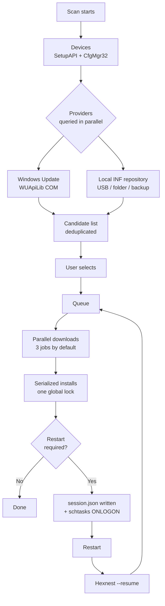

<div align="center">


# Hexnest

**Hexnest は Windows と macOS のための無料・オープンソースのシステムユーティリティです。ドライバー更新ツール、
システムモニタ、ネットワークモニタ、スタートアップ管理、ディスククリーンアップを 1 つのウィンドウにまとめました。**

Windows ではマシン内のすべてのデバイスを調べ、不足・旧版のドライバーを見つけて導入し、
そのために必要な再起動をまたいで作業を続け、フォーマット前にドライバーを退避して、あとから
インターネットなしで元に戻します。どちらのプラットフォームでも、マシン本体と
個々のプログラムがプロセッサ時間・メモリ・帯域をどれだけ使っているか、ログイン時に何が起動するか、
ディスク容量を何が占めているかをリアルタイムに示します。Windows ではインストーラー不要、どちらにもアドウェアはありません。

<br>

[](https://github.com/ahmetcaglayan/Hexnest/releases/latest/download/Hexnest.exe)
[](https://github.com/ahmetcaglayan/Hexnest/releases/latest/download/Hexnest-arm64.dmg)

<sub>[🌐 プロジェクトサイト](https://ahmetcaglayan.github.io/Hexnest/) · [Intel Mac、ARM 版 Windows、過去のすべてのリリース →](../../releases)</sub>

<br>

### Windows: インストーラー不要。macOS: アプリケーションフォルダーにドラッグ。

`Windows 10 1607+ / 11` · `macOS 12 Monterey+` · `64-bit` · `Apple silicon and Intel`

**先に入れておくものはありません。** どちらのビルドも .NET 8 ランタイムを内包しています。Windows で .NET を
落とす必要も、Visual C++ 再頒布可能パッケージも、Mac で Homebrew や Xcode を入れる必要もありません。

<br>

[](LICENSE)
[](../../releases)
[](../../releases)
[](https://dotnet.microsoft.com/)
[](../../releases/latest)
[](../../releases)
[](../../stargazers)
[](../../actions/workflows/build.yml)

<sub>[🇬🇧 English](README.md) · [🇹🇷 Türkçe](README.tr.md) · [🇷🇺 Русский](README.ru.md) · [🇨🇳 简体中文](README.zh.md) · [🇮🇳 हिन्दी](README.hi.md) · [🇵🇹 Português](README.pt.md) · 🇯🇵 日本語 · [🇩🇪 Deutsch](README.de.md) · [🇫🇷 Français](README.fr.md) · [🇰🇷 한국어](README.ko.md)</sub>

<br>


</div>

---

## 🖥️ どちらで何が動くか

Hexnest は 1 つの製品に 2 つのウィンドウがある形です。共通のエンジン — モニタ、クリーンアップ、
スタートアップ管理、設定、ログ — は両プラットフォームで同じコードです。ドライバー側は
Windows 専用ですが、まだ書いていないからではありません。**macOS には、調べたり更新したり退避したりできる
サードパーティのドライバーストアがありません。** Apple はドライバーを OS の中で提供するので、
この種のツールが見つけられるものが何もないのです。ですからそれらのページは、あっても永久に空のままになるより、
Mac ビルドから外してあります。

| |  |  |
| --- | :---: | :---: |
| **ダッシュボード** とハードウェア概要 | ✅ | ✅ |
| **システムモニタ** — プロセッサ、コア別、メモリ、ストレージ、バッテリー | ✅ | ✅ |
| **アプリ別のプロセッサとメモリ** | ✅ | ✅ |
| **ネットワークモニタ** — リアルタイム速度、合計、アダプター、接続 | ✅ | ✅ |
| **アプリ別のネットワーク使用量** | ✅ TCP のみ | ✅ `nettop` 経由 |
| **スタートアップ管理** | ✅ Run キー + スタートアップフォルダー | ✅ launchd エージェント |
| **クリーンアップ**、推定ではなく実測 | ✅ | ✅ |
| **ログ、設定、10 言語、ダーク/ライト** | ✅ | ✅ |
| **プロセッサ温度** | ✅ ACPI サーマルゾーン | ❌ root なしでは取得不可 |
| **ボリューム別のディスクスループット** | ✅ | ❌ ボリューム別カウンターなし |
| **メモリ解放** | ✅ | ❌ macOS は代わりに圧縮する |
| **デバイス検査 / 不足しているドライバー** | ✅ | ❌ ドライバーストアなし |
| **Windows Update ドライバーカタログ** | ✅ | ❌ |
| **オフライン INF リポジトリ** | ✅ | ❌ |
| **ドライバーのバックアップと復元** | ✅ | ❌ |
| **インストールキューと再起動後の再開** | ✅ | ❌ |
| **システム復元ポイント** | ✅ | ❌ Time Machine の役目 |
| **管理者 / root で動作** | ⚠️ 必須 | ✅ しない — ユーザードメインのみ |

上の ❌ はプラットフォームに存在しないものであって、Hexnest が省いたものではありません。どれも、
アプリケーション内でそれが現れる場所に説明があります。

---

## 🎯 何のためのものか

Windows を入れ直したばかり。デバイスマネージャーは黄色い感嘆符だらけで、
解像度はおかしく、音は出ず、そして何より — インターネットがありません。
ネットワークアダプターにもドライバーがないからです。

Hexnest はそれを 1 つのウィンドウで解決します:

- マシン内の **すべての PnP デバイス** を並べ、どれにドライバーがないかを教えます。
- 不足しているドライバーと更新可能なドライバーを **Windows Update カタログ** か
  **USB メモリ上のローカルフォルダー** から探します。
- キューに入れ、ダウンロードし、インストールし、必要な再起動のたびに
  **中断したところから続けます**。
- フォーマットの **前に** 現在のドライバーを書き出し、**あとで** インターネットなしに
  元へ戻します。

1.1 からは、人がタスクマネージャーを開く理由になる 2 つの疑問にも答えます:

- **このマシンは何をしているのか。** 論理コアごとのプロセッサ負荷、メモリの内訳、
  ファームウェアが公開するすべての温度センサー、実測の読み書きスループット付きのストレージ、
  バッテリー — さらに実行中の全プログラムを、プロセッサ占有率、ワーキングセット、
  プライベートバイト、ディスクスループットとともに一覧表示します。
- **誰が回線を使っているのか。** マシン全体のリアルタイムのダウンロードとアップロード、
  今回のセッションと Windows 起動以降の合計、すべてのアダプター — そして、どのプログラムが
  いま何を転送しているかを示すアプリ別の表。

1.2 からは、さらに 2 つに答えます:

- **Windows と一緒に何が起動し、それを望んでいるのか。** すべての自動起動項目にスイッチが付き、
  タスクマネージャーと同じ書き方をするので、何も削除されません。
- **ディスクを食っているのは何か。** すべてのキャッシュを推定ではなく実測し、こちらで
  チェックは付けず、あなた自身のファイルは分けてごみ箱へ送ります。

1 ファイル、インストーラーなし、常駐サービスなし、テレメトリなし。

---

## ✨ 機能

| 機能 | プラットフォーム | 内容 |
| --- | --- | --- |
| 🔍 **デバイスの全件検査** |  | 存在するすべての PnP デバイスを SetupAPI + CfgMgr32 で列挙します。WMI を使わないので、入れたばかりのマシンでも、WMI リポジトリが壊れたマシンでも動きます。 |
| ⚠️ **不足ドライバーの検出** |  | 構成マネージャーの問題コードを読みます。28 (`CM_PROB_FAILED_INSTALL`)、1、19 は「ドライバーなし」。22 は無効化、14 は再起動待ちです。 |
| ☁️ **Windows Update ドライバーカタログ** |  | Windows Update エージェントの COM API (WUApiLib) 経由で Microsoft Update と通信します。追加のサービスも、追加のダウンロードも、追加の依存関係もありません — `wuapi.dll` は Windows に付属しています。 |
| 💾 **ローカル / オフライン INF リポジトリ** |  | フォルダー内の `.inf` パッケージを解析し、ハードウェア ID で照合します。USB メモリ、ネットワーク共有、Hexnest のバックアップ、どれでも入手元になります。 |
| ⚡ **並列ダウンロード + 直列インストール** |  | ダウンロードは重ねて実行します (既定 3、1〜8 で設定可能)。インストールは 1 件ずつです。これは手抜きではありません。Windows Update は 2 件目の同時インストールに `WU_E_OPERATIONINPROGRESS` を返し、PnP サブシステムはどのみち直列化します。違うふりをしても、無意味な失敗が増えるだけです。 |
| 🔄 **再起動後の再開** |  | キューは状態が変わるたびに `session.json` へ書き出されます。ログイン時に起動する `schtasks` タスク (HKLM の `RunOnce` をフォールバックとして) が Hexnest を `--resume` 付きで起動し直し、止まった場所からそのまま続きます。 |
| 🛡️ **システム復元ポイント** |  | セッション最初のインストールの前に、`srclient.dll` 経由でドライバー種別の復元ポイントを作ります。 |
| ↩️ **更新前のバックアップ** |  | 置き換えられる直前にそのパッケージを書き出し、パスを履歴レコードに保存するので、問題が起きたときに元へ戻せます。 |
| 📦 **ドライバーのバックアップ / 復元** |  | サードパーティ製ドライバーパッケージをすべて `pnputil /export-driver` でフォルダーか ZIP に書き出し、`pnputil /add-driver ... /subdirs /install` で戻します。 |
| 📊 **更新履歴** |  | 1 行 1 JSON オブジェクト (`history.jsonl`) として恒久的に記録し、ワンクリックで CSV に書き出せます。 |
| 📄 **ハードウェアレポート** |  | すべてのデバイスとハードウェア ID をプレーンテキストに書き出します — USB メモリで動く別のコンピューターへ持って行き、手作業でドライバーを調べられます。 |
| 🆙 **内蔵アップデーター** |  | GitHub から新しいリリースをダウンロードし、**その SHA-256 を検証**して (リリースが `checksums.txt` を公開していない場合はインストールを拒否)、実行ファイルをその場で入れ替えます。 |
| 📈 **システムモニタ** |   | プロセッサ負荷を全体と論理コアごとに (`NtQuerySystemInformation`)、メモリをキャッシュ済み・コミット済みバイトまで (`GlobalMemoryStatusEx` + `GetPerformanceInfo`)、ACPI サーマルゾーン、ボリューム別の読み書きスループット (`IOCTL_DISK_PERFORMANCE`)、バッテリー状態。ページを開くまで何も計測せず、離れた瞬間に止まります。 |
| 🧮 **アプリ別のリソース使用量** |   | すべてのプロセスのプロセッサ占有率、ワーキングセット、プライベートバイト、ディスクスループット、スレッド数を、タスクマネージャーとまったく同じ方法で計測します。2 回のサンプル間のカーネル + ユーザー時間の差を、経過時間と論理プロセッサ数で割った値です。 |
| 🌐 **ネットワークモニタ** |   | マシン全体のダウンロードとアップロードをアダプター自身のカウンターから、セッションと起動以降の合計、開いている接続の数、そしてアドレスとネゴシエート済みリンク速度付きの全アダプター。 |
| 🔎 **アプリ別のネットワーク使用量** |   | どのプログラムが何を転送しているかを `GetExtendedTcpTable` と TCP ESTATS (`GetPerTcpConnectionEStats`) から取得します。TCP のみ — Windows にはカーネルドライバーなしのプロセス別 UDP カウンターがなく、黙って少なく報告する代わりにページでそう明言します。 |
| 🔁 **自動更新チェック** |  | GitHub Releases API へ 1 日 1 回リクエストし、新しいバージョンがあれば *バージョン情報* の項目に件数を出します。自動ダウンロードとインストールはオプトインで、SHA-256 で検証され、適用は Hexnest の終了時だけ — キューの途中では決してありません。macOS では確認は手動で — *バージョン情報* → *更新を確認* — インストールせずにダウンロードページを開きます。 |
| 🚀 **スタートアップ管理** |   | `Run` / `RunOnce` キー (HKCU、HKLM、32 ビットビュー) と 2 つのスタートアップフォルダーにあるすべての自動起動項目に、1 つずつスイッチを。無効化はタスクマネージャーと同じ `StartupApproved` 値を書くので、両者は常に一致し、元のコマンドラインが消えることはありません。存在しないファイルを指す項目には印が付きます。 |
| 🧹 **クリーンアップ** |   | 一時ファイル、サムネイルとアイコンのキャッシュ、7 種類のブラウザーのキャッシュ、Windows Update のダウンロードキャッシュ、配信の最適化、クラッシュダンプ、エラーレポート、シェーダーキャッシュ、保守ログ、ごみ箱 — どれも **推定ではなく実測** で、**既定では何もチェックされていません**。 |
| 🗂️ **残骸と古いダウンロード** |   | AppData 配下で、インストール済みのどのプログラムにも、実行中のどのプログラムにも、Program Files のどれにも一致せず、6 か月間触られていないフォルダー。さらに、ダウンロードフォルダーにある 1 か月より古い書庫やインストーラー。1 件ずつ並べて **ごみ箱** へ送り、いきなり削除はしません。 |
| 🧠 **メモリ解放** |  | プロセスのワーキングセットをページアウトします。ページには、これが *いま* 物理メモリを解放するだけで何も速くしないと明記しています — このボタンを持つ他のツールの主張とは正反対です。 |
| 🌍 **10 の表示言語** |   | 英語、トルコ語、ロシア語、簡体字中国語、ヒンディー語、ポルトガル語、日本語、ドイツ語、フランス語、韓国語がすべて単一の実行ファイルに。アプリを開いたまま即座に切り替わります。 |
| 🎨 **ダーク / ライトテーマ** |   | 配色を切り替えます。ウィンドウを開き直さずに適用されます。Mac ビルドには 3 つ目の選択肢 *システムに合わせる* があり、macOS 自身のライト/ダーク切り替えに追随します。 |

---

## 🚑 フォーマット後の復旧

Hexnest が存在する理由がこれです。

### 鶏が先か卵が先かの問題

フォーマットの後は **ネットワークアダプターにもたいていドライバーがありません**。ドライバーを落とすには
インターネットが要り、インターネットに出るにはドライバーが要ります。Windows Update は
そこに到達できないので、助けになりません。

解決策は **フォーマットの前にドライバーを持ち出しておくこと** です。

### フォーマットの前に (5 分)

1. Hexnest を実行します。
2. **バックアップと復元** へ移動します。
3. **バックアップを作成** をクリックします。システム上のサードパーティ製ドライバーパッケージがすべて書き出されます。
   (Microsoft 同梱のドライバーは意図的に除外します — あれは Windows が自分で入れ直しますし、
   含めるとバックアップの容量が意味もなく 3 倍になります。)
4. 必要なら **ZIP に圧縮** にチェックを入れます。
5. できたフォルダー **と `Hexnest.exe`** を同じ USB メモリにコピーします。

> 💡 任意: バックアップフォルダーの名前を `Drivers` にして `Hexnest.exe` の隣に置いてください。
> Hexnest がそれを **自動的に** ローカルのドライバーリポジトリとして登録します — 設定は
> 不要です。

### フォーマットの後に

1. USB メモリを挿して `Hexnest.exe` を実行します (昇格を求められます)。
   インターネットがない場合は `Hexnest.exe --rescue` で起動してください。Windows Update には
   一切接続せず、ローカルのソースだけを使います。
2. **バックアップと復元 → 復元** (または **フォルダーから復元**) を選び、バックアップを指定します。
   各パッケージがドライバーストアに追加され、対応するデバイスに割り当てられます。
3. ネットワークアダプターが動くようになったら **検査** を押します。
4. **ダッシュボード → フォーマット後の復旧** が、まだ足りないものを Windows Update から
   キューに入れます。
5. 再起動を求められたら受け入れてください — Hexnest はログイン時に自分で戻ってきて、キューの
   残りを片づけます。

> ℹ️ そのフォルダーは Hexnest のバックアップである必要はありません。自分でダウンロードして展開した
> メーカー配布のドライバーフォルダーでも **フォルダーから復元** で使えます。`.inf` ファイルは
> 再帰的に探されます。

### コマンドライン

```powershell
Hexnest.exe                 # normal launch
Hexnest.exe --rescue        # offline rescue mode (same as --offline)
Hexnest.exe --resume        # continue an interrupted queue straight away
```

---

## 📸 スクリーンショット

配布中のビルドの実際のスクリーンショットです。ビルド自体から再生成しているため —
[スクリーンショットの再生成](#regenerating-the-screenshots) を参照 — 内容が古くなることは
ありません。

### 

<table>
<tr>
<td width="50%"><br><sub><b>システムモニタ</b> — プロセッサ、メモリ、温度、ディスクをリアルタイムのグラフで、論理コアごとに 1 本のバー。</sub></td>
<td width="50%"><br><sub><b>ネットワークモニタ</b> — マシン全体のダウンロードとアップロード、セッション合計、すべてのアダプター。</sub></td>
</tr>
<tr>
<td width="50%"><br><sub><b>プログラム別の使用量</b> — 実行中の各プロセスのプロセッサ、メモリ、ディスク、スレッド。</sub></td>
<td width="50%"><br><sub><b>プログラム別の通信量</b> — どのアプリが接続をどれだけ使っているか。</sub></td>
</tr>
<tr>
<td width="50%"><br><sub><b>デバイス</b> — クラス別にまとめた全 PnP デバイスと、リアルタイムの問題コード。</sub></td>
<td width="50%"><br><sub><b>更新</b> — Windows Update とローカル INF フォルダーからのインストール可能なパッケージ。</sub></td>
</tr>
<tr>
<td width="50%"><br><sub><b>アクティビティ</b> — 実行中のキュー。ドライバーごとの速度とインストール段階つき。</sub></td>
<td width="50%"><br><sub><b>バックアップと復元</b> — サードパーティ製ドライバーをすべて書き出し、オフラインで復元。</sub></td>
</tr>
<tr>
<td width="50%"><br><sub><b>スタートアッププログラム</b> — 項目ごとにスイッチ。タスクマネージャーと同じ書き方で。</sub></td>
<td width="50%"><br><sub><b>クリーンアップ</b> — 推定ではなく実測、こちらでチェックは付けません。</sub></td>
</tr>
<tr>
<td width="50%"><br><sub><b>設定</b> — 並列ダウンロード、安全性、自動更新、テーマと言語。</sub></td>
<td width="50%"><br><sub><b>バージョン情報</b> — バージョン情報と内蔵アップデーター。</sub></td>
</tr>
</table>

### 

<table>
<tr>
<td width="50%"><br><sub><b>ダッシュボード</b> — Mac がいま何をしているか、そして何であるか: チップ、グラフィックス、メモリ、ディスク。</sub></td>
<td width="50%"><br><sub><b>システムモニタ</b> — コアごとに 1 本のバー。Apple シリコンの P クラスタと E クラスタも含みます。</sub></td>
</tr>
<tr>
<td width="50%"><br><sub><b>ネットワークモニタ</b> — アクティビティモニタと同じ情報源から取るアプリ別の通信量。</sub></td>
<td width="50%"><br><sub><b>スタートアッププログラム</b> — launchd エージェントに 1 つずつスイッチ。システムのジョブは表示のみで触りません。</sub></td>
</tr>
<tr>
<td width="50%"><br><sub><b>クリーンアップ</b> — キャッシュ、Xcode の derived data、iPhone のバックアップ。実測で、チェックは付きません。</sub></td>
<td width="50%"><br><sub><b>設定</b> — 同じ選択肢に加え、日の出と日の入りで macOS に追随するテーマ。</sub></td>
</tr>
<tr>
<td width="50%"><br><sub><b>ログ</b> — リアルタイム診断。ワンクリックで不具合報告用にクリップボードへ。</sub></td>
<td width="50%"><br><sub><b>バージョン情報</b> — バージョン、マシン、そしてダウンロードを開く更新確認。</sub></td>
</tr>
</table>

### スクリーンショットの再生成

上の画像はすべてアプリケーション自身が生成しているので、画面を変更しても 1 つのコマンドで
ドキュメントに反映できます:

```powershell
# Windows, from an elevated prompt, after building
.\Hexnest.exe --capture .\assets\screenshots --lang en
```

```bash
# macOS, after ./build/make-mac-app.sh
./artifacts/mac/arm64/Hexnest.app/Contents/MacOS/Hexnest --capture ./shots --lang en
```

どちらもメニュー全体を巡回し、リアルタイムのページがグラフを埋めるのを待ってから、ページごとに
PNG を 1 枚書き出します。`--lang` で表示言語を固定するため、公開される画像が再生成した人の
表示言語に左右されることはありません。

> そもそもなぜ内蔵のキャプチャなのか。Windows では Hexnest は昇格して動くため、ユーザー インターフェイス
> 特権分離により (昇格していない) Snipping Tool は、より高い整合性レベルのウィンドウに向けた入力を
> 受け取れません — Hexnest やタスクマネージャー、レジストリ エディターの上で Print Screen を押しても
> 何も起きないのです。macOS では画面収録の許可が必要なうえ、デスクトップにある他のものまで
> 写り込みます。どちらのビルドも代わりに自分のビジュアルツリーを描画するので、どちらの問題も
> 起きません。

---

## 🧭 メニュー

| メニュー | プラットフォーム | 内容 |
| --- | --- | --- |
| **ダッシュボード** |   | デバイス数、不足しているドライバー、利用可能な更新、問題のあるデバイス。OS / マシン / CPU / BIOS の概要。クイックアクション: *今すぐ検査*、*フォーマット後の復旧*、*すべて更新*、*ドライバーをバックアップ*、*ハードウェアレポート*。動作するドライバーを持つネットワークアダプターが 1 つもないときは警告バナーが出ます。 |
| **デバイス** |  | すべての PnP デバイスをクラス別に。フィルター: *すべて / 問題あり / 不足 / 汎用ドライバー*。名前、製造元、バージョン、ハードウェア ID で検索でき、ハードウェア ID をクリップボードにコピーできます。 |
| **更新** |  | インストール可能なパッケージ。不足しているドライバーもバージョンアップも含みます。行ごとの選択、*すべて選択 / 選択解除*、選択したものの合計サイズ、*選択したものをインストール*。特定の更新を隠したり、デバイスごと無視したりできます。 |
| **アクティビティ** |  | 実行中のキュー。ダウンロードの進捗率、速度、転送済みバイト数、インストール段階をジョブごとに分けて表示します。*すべてキャンセル*、*失敗したものを再試行*、*今すぐ再起動* / *あとで*。中断されたセッションではここに *続行* ボタンが出ます。 |
| **バックアップと復元** |  | *バックアップを作成* (任意で ZIP 圧縮)、既存バックアップの一覧 (パッケージ数、サイズ、日付)、*復元*、*フォルダーから復元*、*開く*、*削除*。 |
| **履歴** |  | すべてのドライバー操作の恒久的な記録。結果で絞り込み、検索、*CSV で書き出し*、*履歴を消去*。更新前のバックアップが残っていれば、そのフォルダーを開けます。 |
| **システムモニタ** |   | プロセッサ負荷を全体と論理コアごとに、メモリを使用中 / 利用可能 / キャッシュ済み / コミット済みに分けて、温度センサーがあるマシンではその値、実測の読み書きスループット付きのストレージ容量、そしてバッテリー。その下に、実行中の全プロセスをプロセッサ占有率、ワーキングセット、プライベートバイト、ディスクスループット、スレッド数とともに表示 — プロセッサ、メモリ、ディスク、名前で並べ替えでき、検索でき、行をきちんと読めるよう一時停止もできます。 |
| **ネットワークモニタ** |   | マシン全体のダウンロードとアップロードをリアルタイムのグラフで、今回のセッションと Windows 起動以降の合計、開いている接続の数、種類・アドレス・リンク速度付きの全アダプター。その下にアプリ別の表: ダウンロードとアップロードの速度、セッション合計、開いている接続、接続先。 |
| **スタートアッププログラム** |   | Hexnest が安全に切り替えられるすべての自動起動項目を、実行ファイルのバージョン情報から読んだプログラム名、発行元、コマンドライン、サイズ、起動元とともに表示。行ごとにスイッチがあり、無効化はタスクマネージャーと同じ設定を書くだけで何も削除しません。存在しないファイルを指す項目には印が付き、セキュリティソフトには印が付いて切る前に確認し、オン・オフ・破損のフィルターと検索があります。 |
| **クリーンアップ** |   | 一時ファイル、サムネイルとアイコンのキャッシュ、7 種類のブラウザー、Windows Update のダウンロードキャッシュ、配信の最適化、クラッシュダンプ、エラーレポート、シェーダーキャッシュ、Windows のログ、Hexnest 自身のキャッシュ、ごみ箱の実測サイズ。既定では何もチェックされていません。古いダウンロードと AppData に残ったフォルダーは 1 件ずつ並び、ごみ箱へ送られます。さらに、何をするのかを正直に述べたメモリ解放。 |
| **ログ** |   | リアルタイム診断。*コピー* はバージョン / OS / マシンのヘッダー付きでログをクリップボードに入れます — 不具合報告に必要なものそのものです。ログファイルやフォルダーを開いたり、消去したりできます。 |
| **設定** |   | 並列ダウンロード数、再試行回数、起動時の検査、復元ポイント、更新前のバックアップ、再起動後の再開、自動再起動とその待ち時間、オフラインモード、任意ドライバー、ローカルのドライバーフォルダー、履歴の保持期間、**自動更新チェック、自動インストール、プレリリース**、テーマ、言語。 |
| **バージョン情報** |   | バージョン情報、*更新を確認*、リリースノート、プロジェクトページと課題へのリンク。Windows ビルドは更新のダウンロードとインストールも行います。Mac ビルドは代わりにダウンロードページを開きます。実行中の `.app` を書き換えると署名が壊れるからです。 |

Mac ビルドのサイドバーは、上で macOS と記された 8 行をこの順に並べたものです。*デバイス*、
*更新*、*アクティビティ*、*バックアップと復元*、*履歴* は、空で置かれるのではなく存在しません。

---

## ⚙️ 仕組み



要点:

1. **検査。** `SetupDiGetClassDevs(DIGCF_PRESENT | DIGCF_ALLCLASSES)` が物理的に存在する
   デバイスをすべて列挙します。`CM_Get_DevNode_Status` が問題コードを、
   `HKLM\SYSTEM\CurrentControlSet\Control\Class\<DriverKey>` がインストール済みドライバーの
   バージョン、日付、提供元を返します。
2. **プロバイダー。** Windows Update とローカルの INF リポジトリを同時に
   問い合わせます。失敗したプロバイダーは警告行になるだけで、検査が中断することはありません。
3. **重複排除。** 両方が同じパッケージを提示した場合は **ローカルのコピーが勝ちます** —
   すでにディスク上にあり、ネットワークを必要としないからです。Windows Update がインストール済みより古い
   バージョンを提示した場合、その候補は捨てられます。
4. **キュー。** ダウンロードは `SemaphoreSlim(MaxParallelJobs)` の背後で、インストールは
   1 つのグローバルロックの背後で実行されます。失敗したジョブは既定で 2 回再試行されます。
5. **再開。** 状態が変わるたびに `session.json` へアトミックに書き出します。再起動が必要になると
   キューは待機状態になり、ログイン時に起動するタスクが Hexnest を `--resume` 付きで
   呼び戻します。安全弁として、1 つのセッションが耐えられる再起動は最大 10 回で、
   それを超えると打ち切ります。

---

## 🔨 ソースからビルドする

アプリを使いたいだけなら関係ありません: **exe をダウンロードして、ダブルクリック、以上です。**
ソースは専用のフォルダーにあり、誰の邪魔もしません。

```
Hexnest/
├── src/                    source code (C#, .NET 8)
│   ├── Hexnest.Core/       UI-free core, multi-targeted:
│   │                         net8.0-windows  drivers, WUApiLib, SetupAPI, the registry
│   │                         net8.0          the portable half behind the Mac build
│   ├── Hexnest.App/        WPF application for Windows (Hexnest.exe)
│   ├── Hexnest.Mac/        Avalonia application for macOS (Hexnest.app)
│   └── Hexnest.Cli/        (reserved) placeholder for a headless front end
├── docs/                   documentation
├── build/                  build scripts, including the macOS bundler
├── assets/                 logo and screenshots
└── .github/workflows/      CI
```

手短に、Windows では:

```powershell
dotnet publish src/Hexnest.App/Hexnest.App.csproj -c Release -r win-x64 -o publish
```

Mac では、`artifacts/mac/arm64/Hexnest.app` が生成されます:

```bash
./build/make-mac-app.sh --arch arm64
```

リリースが公開しているディスクイメージが欲しい場合は `--dmg` を付けてください。このスクリプトに必要なのは
.NET 8 SDK だけです。`Info.plist` を書き、`assets/icon-mac-1024.png` から `.icns` を作り、
Apple シリコンで実行できるようバンドルをアドホック署名します。

詳細、arm64 ビルド、WUApiLib の COM 参照についての説明:
**[docs/BUILD.md](docs/BUILD.md)**

アーキテクチャ、`IDriverProvider` という抽象、新しいドライバーソースの追加方法:
**[docs/ARCHITECTURE.md](docs/ARCHITECTURE.md)**

---

## 🔐 セキュリティとプライバシー

- **テレメトリなし。** 利用データもデバイス識別子も統計もマシンの外へ出ません。
- 外へ出るのは、ちょうど **2 つ** だけです:
  1. **Windows Update への問い合わせ** — Windows 自身の Windows Update エージェント経由で
     Microsoft に直接。(オフラインモードや `--rescue` では一切ありません。)
  2. **GitHub Releases API** — *更新を確認* を押したときだけ。
- **なぜ管理者権限が要るのか。** ドライバーのインストールは特権が必要です。`pnputil`、Windows Update の
  インストーラー、システムの復元はどれも昇格されたトークンを必要とします。Hexnest はキューの途中で失敗する代わりに、
  アプリケーションマニフェスト (`requireAdministrator`) で最初にそれを
  要求します。
- **安全網:** セッション最初のインストール前のシステム復元ポイントと、
  置き換えるすべてのドライバーパッケージのバックアップ。
- **アップデーター** はダウンロードをリリースの `checksums.txt` の SHA-256 と照合します。
  チェックサムが無いか一致しない場合、そのファイルは削除され更新は拒否されます。
- **macOS では Hexnest は決して root で動きません。** これは機能の欠落ではなく設計上の判断です。
  Mac ビルドが行うことはすべて、起動したアカウントの中に収まります。root で動く GUI アプリは
  うっかりマシン上の何でも消せてしまうからです。システム全体の launchd ジョブは
  一覧に出て明確に印が付きますが、触りません。
- 状態はすべて、Windows では `%ProgramData%\Hexnest` に、macOS では
  `~/Library/Application Support/Hexnest` に (ログは `~/Library/Logs/Hexnest` に) 置かれます:
  `settings.json`, `session.json`, `history.jsonl`, `logs/`, `backups/`, `cache/`,
  `reports/`.

脆弱性の報告: **[SECURITY.md](SECURITY.md)**

---

## ❓ よくある質問

### Hexnest は本当に無料ですか?

はい。Hexnest は MIT ライセンスで公開され、ソースコードはすべてこのリポジトリにあります。有料版も、
体験版も、支払い後に解除される機能も、広告も、同梱されるサードパーティ製ソフトも
ありません。スキャンもインストールも同じ 1 つの製品です。

### .NET のインストールは必要ですか?

いいえ。.NET 8 ランタイムはまるごと `Hexnest.exe` の中にあり (自己完結型の単一ファイル発行)、WPF は
自前の `vcruntime140_cor3.dll` / `msvcp140_cor3.dll` を持っています。Visual C++ 再頒布可能パッケージも不要です。
必要なのは 64 ビットの Windows 10 バージョン 1607 (ビルド 14393) 以降だけです。

### Hexnest は Mac でドライバーを更新しますか?

いいえ。そして他のどのツールもしません。macOS にはサードパーティのドライバーストアがないからです。Apple は
デバイスのサポートを OS の中で提供し、OS と一緒に更新します。この種のツールが
調べたり、ダウンロードしたり、退避したりできるものは何もありません。ですから Mac ビルドには *デバイス*、*更新*、
*アクティビティ*、*バックアップ*、*履歴* のページがそもそもありません — 中身が永久に空の 5 ページを
置くよりよいからです。それ以外の Hexnest の機能はすべてそこで動きます。

### どの Mac が必要ですか?

macOS 12 Monterey 以降、Apple シリコンまたは Intel。2 つのビルドはユニバーサルバイナリではなく
別々に公開しています (`Hexnest-arm64.dmg` と `Hexnest-x64.dmg`)。
それぞれが .NET ランタイムのコピーを持っているため、1 つにまとめるとダウンロードページでの選択を 1 回省くために
全員のダウンロード量が倍になってしまうからです。

### macOS が「開発元を検証できないため開けません」と表示します

リリースはアドホック署名されていますが公証はされていません。公証には有料の Apple Developer
アカウントが必要だからです。アプリケーションフォルダーで Hexnest を右クリック (または Control クリック) して **開く** を選んでください。
macOS は一度だけ確認し、その答えを覚えます。どのリリースにも `checksums.txt` を公開しているので、
先にダウンロードを検証することもできます。

### Mac 版 Hexnest はなぜパスワードを求めないのですか?

必要がないからです。モニタは公開された統計を読み、クリーンアップはあなた自身のホームフォルダーの中で
動き、スタートアップ管理は `launchctl` であなた自身のログインエージェントを変更します。
システム全体の launchd ジョブは表示されますが読み取り専用と明示されます。グラフを見せるために管理者
パスワードを求めるアプリケーションは、必要よりはるかに多くの信頼を要求していることになります。

### なぜ SmartScreen やウイルス対策ソフトが警告するのですか?

`Hexnest.exe` が **コード署名されていない** からです — 証明書にはお金がかかります。SmartScreen と Smart App
Control は、評判が積み上がっていない未署名の実行ファイルすべてに警告を出します。しかも管理者として動き、
ドライバーを入れ、タスクを登録するアプリは、ヒューリスティックなスキャナーにはマルウェアそのものに
見えます。誠実な対処はファイルを検証することです。
`Get-FileHash .\Hexnest.exe -Algorithm SHA256` の出力を、リリースの
`checksums.txt`.

### インターネットなしで、フォーマット後にドライバーを入れられますか?

はい — そのために Hexnest は作られました。フォーマット前にドライバーを退避し、そのバックアップと
`Hexnest.exe` を同じ USB メモリに入れ、あとで `Hexnest.exe --rescue` を起動して
**復元** を押してください。`Hexnest.exe` の隣にある `Drivers` という名前のフォルダーは自動的にローカルの
ドライバーリポジトリとして登録されますし、自分で展開したメーカー配布のフォルダーでも同じように使えます。

### ドライバーを元に戻せますか?

はい、3 通りあります。Hexnest が各インストールの直前に書き出すバックアップから (**フォルダーから
復元**)、セッション最初のインストール前に作られたシステム復元ポイントから
(`rstrui.exe`)、または Windows 自身のデバイスマネージャーの *ドライバーを元に戻す* ボタンから。だからこそ
復元ポイントの設定は有効のままにしておくことをお勧めします。

### 再起動のあと、本当に続きから再開しますか?

はい。キューの状態は変更のたびに `session.json` へアトミックに書き出され、ログイン時に起動する
`Hexnest\ResumeSession` というタスク (HKLM の `RunOnce` をフォールバックとして) が Hexnest を
`--resume` 付きで呼び戻します。1 つのセッションが耐えられる再起動は最大 10 回で、キューが終わるとタスクも
レジストリ値も削除されます。

### スタートアッププログラムを無効にすると、何か削除されますか?

いいえ。Windows は有効フラグを別のキー —
`...\CurrentVersion\Explorer\StartupApproved\Run` とその 2 つの兄弟 — に保持しており、Hexnest が
書き込むのはそれだけです。`Run` の値も、スタートアップフォルダーのショートカットも、
まったくそのまま残るので、項目を戻せば元のコマンドラインが
バイト単位で復元されます。

つまりタスクマネージャーと Hexnest は互いに一致します。片方で無効にすれば、もう片方でも無効と
表示されます。そしてあとで Hexnest を削除しても、スタートアップ項目が半分なくなることは
ありません。どれも、どこへも行っていないからです。

### クリーンアップは安全ですか?

安全になるよう作ってあります。しかも「信じてください」ではなく、設計でどう担保しているかを示します:

- **既定では何もチェックされていません。** ページは合計ゼロの状態で開きます。
- パスはすべて文字列ではなく既知フォルダー API から取得します。分類ごとのルートの外にあるものには
  一切触れず、個々の削除はその直前に、そのルート配下かどうかを
  もう一度確認します。
- 再解析ポイントは決してたどりません。`%LOCALAPPDATA%` はジャンクションだらけで、そこへ
  入り込むことこそ「キャッシュを消す」機能が誰かのドキュメントを消してしまう経路です。
- 開かれているファイルは強制せずに飛ばします。飛ばした件数は報告されます。
- あなた自身のファイル — 古いダウンロード、残ったフォルダー — は決して一括選択されません。サイズと
  経過期間を添えて 1 件ずつ並び、**ごみ箱** へ送られます。

残骸の判定は Hexnest が推測している唯一の箇所であり、行にもそう書いてあります。

### 「メモリを解放」は実際に効果がありますか?

その瞬間の物理メモリを解放します。それだけです。

各プロセスに対して `EmptyWorkingSet` を呼び、そのプロセスのワーキングセットをページファイルへ
追い出すよう Windows に頼みます。使用中メモリは確かに減ります。しかしそのページは消えたのではなく
ディスクにあり、プログラムがそのメモリに再び触れた瞬間に Windows が読み戻します。
それは放っておくより遅いのです。使われていないメモリは無駄なメモリではありません。Windows は
もともとそれを使える状態に保っていました。

つまり性能向上の機能ではなく、Hexnest もそう称してはいません。大きな確保を一度に行うものを
起動する直前や、リークしているプログラムが実際どれだけ抱えているかを見るときには
本当に役立ちます。このボタンを持つ他のツールは、どれも違うことを
主張します。

### なぜ温度カードは「センサーがない」と言うのですか?

そのマシンには Windows が読めるセンサーが実際にないからです。ドライバーなしで Windows が
公開する温度は、ファームウェアが自身のファン制御のために宣言する ACPI サーマルゾーン
(`root\WMI:MSAcpi_ThermalZoneTemperature`) だけで、デスクトップのマザーボードには
それを 1 つも宣言しないものが非常に多くあります。コアごとや GPU の温度は SMBus 経由でベンダー製の
センサーチップから取るもので、署名済みのカーネルドライバーが必要です — HWiNFO や Open Hardware
Monitor が入れているのがまさにそれです。Hexnest は数字を埋めるためだけにカーネルドライバーを入れないので、
もっともらしい 45 °C をでっち上げる代わりに、センサーがないと伝えます。

### なぜプログラム別のネットワーク使用量はマシン全体の合計になりませんか?

測り方が違うからで、どちらも正しいのです。

マシン全体の値はネットワークアダプター自身のバイトカウンターの合計なので、
TCP、UDP、QUIC、ブロードキャストのすべてを含みます。アプリ別の値は `GetPerTcpConnectionEStats`
経由の TCP ESTATS (RFC 4898) から取っており、これはカーネルドライバーなしに Windows が提供する唯一の
プロセス別バイトカウンターで、TCP しか対象にしません。ビデオ通話、ゲームの通信の大半、
DNS は、したがって 1 つ目の数字に数えられ、2 つ目には
入りません。ページは黙って少なく報告する代わりに、そう明言します。

ESTATS を有効にするには昇格されたトークンが要ります。Hexnest は常に持っていますが、万一拒否された場合は、
表はプロセス別の接続数にフォールバックし、その理由を示します。

### Hexnest はバックグラウンドで自動更新しますか?

1 日 1 回 **確認** し、*バージョン情報* のメニュー項目で知らせるだけです。**設定 → 更新** でオンに
しない限り、何もダウンロードもインストールもしません。オンにした場合も:

- ダウンロードは信用する前にリリースの `checksums.txt` と照合され、
- 入れ替えは Hexnest が **閉じるとき** に行われ、ドライバーのキューが動いている最中には決して行われず、
- オフラインモードと復旧モードでは、確認もインストールも完全に省かれます。

確認自体を完全に切ることもできます。*更新を確認* ボタンはそれでも使えます。

### モニタはバックグラウンドサービスですか?

いいえ。どちらのモニタもページを開くまで何も計測せず、別の場所へ移動した瞬間に
止まります。Hexnest はサービスもドライバーもスタートアップ項目もインストールしません —
登録するのは、中断したドライバーのキューを再開するログインタスクだけで、
それもキューが終われば自分で消えます。

### Hexnest は何かデータを集めますか?

いいえ。テレメトリも、利用統計も、デバイス識別子もありません。マシンの外へ出るのはちょうど 2 つだけです。
Windows 自身のエージェント経由で Microsoft へ直接届く Windows Update への問い合わせ (オフラインモードでは
決して発生しません) と、*更新を確認* を押したときの GitHub Releases API への 1 回のリクエストです。

---

「なぜ exe はこんなに大きいのか」「なぜ WMI を使わないのか」「Windows Server で動くのか」など、その他:

**[docs/FAQ.md](docs/FAQ.md)** · 使い方ガイド (トルコ語): **[docs/USAGE.md](docs/USAGE.md)** ·
プロジェクトサイト: **[ahmetcaglayan.github.io/Hexnest](https://ahmetcaglayan.github.io/Hexnest/)**

---

## 🤝 コントリビュート

貢献を歓迎します。

- **不具合の報告:** [Issues](../../issues) — **ログ** メニューの *コピー* ボタンで得られるログを
  添付してください。バージョンと OS のヘッダーがすでに含まれています。
- **コード:** フォークし、ブランチを切り、プルリクエストを開いてください。既存のスタイルを保ってください。NuGet の
  依存関係は使わず (単一ファイルのサイズとオフライン動作は意図的な選択です)、`Hexnest.Core` の中に
  UI のコードを置かないでください。
- **翻訳:** 言語の追加は、`src/Hexnest.Core/Languages/` に JSON ファイルを 1 つ
  置くだけです。そのあと `build/check-languages.py` が英語と突き合わせて検証します。
  [docs/ARCHITECTURE.md](docs/ARCHITECTURE.md) を参照してください。

---

## 📄 ライセンス

MIT — [LICENSE](LICENSE) を参照してください。

---

## ⚠️ 免責事項

ドライバーの導入には本質的なリスクがあります。誤ったドライバーや壊れたドライバーは、起動しなくなるマシンを
含む問題を引き起こしかねません。Hexnest はシステム復元ポイントを作り、置き換えるドライバーを
退避することでそのリスクを下げますが、保証はしません。

**復元ポイントの設定は有効のままにしてください。** 大切なものはバックアップを取ってください。本ソフトウェアは
「現状のまま」提供されます。使用した結果については利用者の責任となります。

---

## キーワード

<sub>
windows ドライバー更新 オープンソース · 無料 ドライバー更新 アドウェアなし · フォーマット後 ドライバー インストール ·
オフライン ドライバー インストーラー usb · ドライバー バックアップ 復元 windows · 不足しているドライバー 検出 ·
windows 11 ドライバー スキャン · pnputil ドライバー エクスポート · windows update ドライバーカタログ ツール ·
無料 システムモニタ windows · cpu ram 温度 モニタ · アプリ別 ネットワーク使用量 windows ·
プログラム別 帯域 モニタ · タスクマネージャー 代替 オープンソース ·
デバイスマネージャー 黄色い感嘆符 直す ·
mac システムモニタ オープンソース · 無料 mac クリーナー サブスクなし · macos スタートアップ項目 管理 ·
launchd ログイン項目 編集 · アクティビティモニタ 代替 mac · mac アプリ別 ネットワーク使用量 ·
apple silicon システムモニタ · m1 m2 m3 mac cpu メモリ モニタ · xcode derived data 削除 ·
mac 空き容量 増やす · mac メニューバー 無料 システムユーティリティ · オープンソース mac ユーティリティ
</sub>
