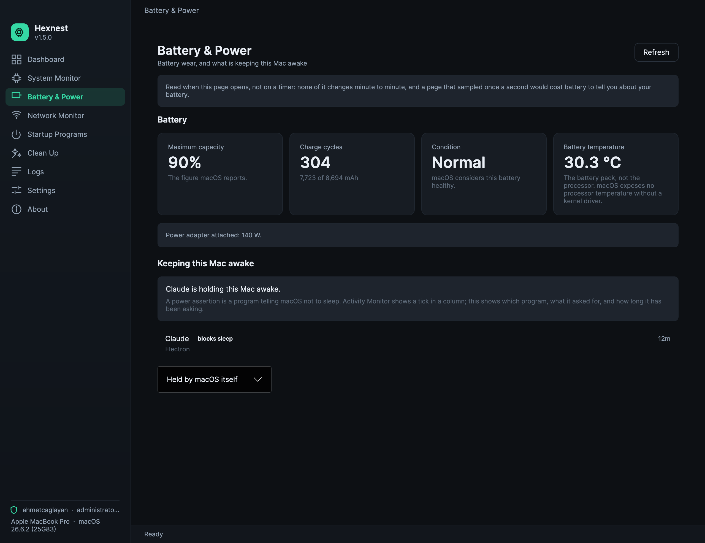
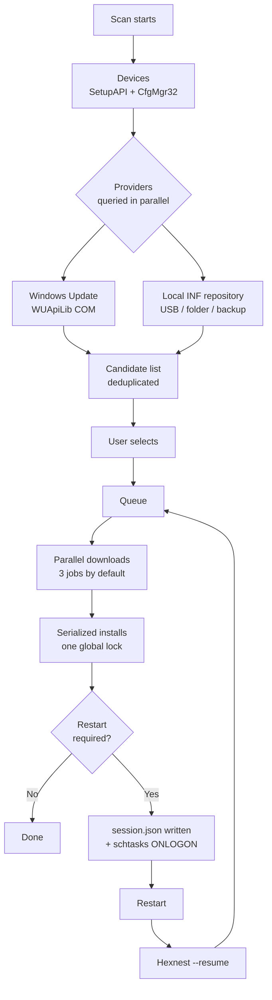

<div align="center">


# Hexnest

**Hexnest는 Windows와 macOS를 위한 무료 오픈소스 시스템 유틸리티입니다. 드라이버 업데이트 도구,
시스템 모니터, 네트워크 모니터, 시작프로그램 관리자, 디스크 정리를 창 하나에 담았습니다.**

Windows에서는 컴퓨터의 모든 장치를 검사해 빠졌거나 오래된 드라이버를 찾아 설치하고,
그에 필요한 재시작을 넘겨 가며 이어서 작업하며, 포맷 전에 드라이버를 백업했다가 그 뒤에
인터넷 없이 되돌려 놓습니다. 두 플랫폼 모두에서, 이 컴퓨터와 그 위의 모든 프로그램이
프로세서 시간·메모리·대역폭을 얼마나 쓰는지, 로그인할 때 무엇이 시작되는지,
디스크 공간을 무엇이 차지하는지 실시간으로 보여 줍니다. Windows에서는 설치 프로그램이 없고, 어디에도 애드웨어가 없습니다.

<br>

[](https://github.com/ahmetcaglayan/Hexnest/releases/latest/download/Hexnest.exe)
[](https://github.com/ahmetcaglayan/Hexnest/releases/latest/download/Hexnest-arm64.dmg)

<sub>[🌐 프로젝트 사이트](https://ahmetcaglayan.github.io/Hexnest/) · [Intel Mac, ARM용 Windows, 이전의 모든 릴리스 →](../../releases)</sub>

<br>

### Windows: 설치 프로그램 없음. macOS: 응용 프로그램 폴더로 끌어다 놓기.

`Windows 10 1607+ / 11` · `macOS 12 Monterey+` · `64-bit` · `Apple silicon and Intel`

**먼저 설치할 것이 없습니다.** 두 빌드 모두 .NET 8 런타임을 안에 담고 있습니다. Windows에서 .NET을
내려받을 필요도, Visual C++ 재배포 패키지도, Mac에서 Homebrew나 Xcode도 필요 없습니다.

<br>

[](LICENSE)
[](../../releases)
[](../../releases)
[](https://dotnet.microsoft.com/)
[](../../releases/latest)
[](../../releases)
[](../../stargazers)
[](../../actions/workflows/build.yml)

<sub>[🇬🇧 English](README.md) · [🇹🇷 Türkçe](README.tr.md) · [🇷🇺 Русский](README.ru.md) · [🇨🇳 简体中文](README.zh.md) · [🇮🇳 हिन्दी](README.hi.md) · [🇵🇹 Português](README.pt.md) · [🇯🇵 日本語](README.ja.md) · [🇩🇪 Deutsch](README.de.md) · [🇫🇷 Français](README.fr.md) · 🇰🇷 한국어</sub>

<br>


</div>

---

## 🖥️ 어디에서 무엇이 되는가

Hexnest는 창이 둘인 하나의 제품입니다. 공통 엔진 — 모니터, 정리, 시작프로그램 관리자,
설정, 로그 — 은 두 플랫폼에서 같은 코드입니다. 드라이버 쪽은
Windows 전용인데, 아직 만들지 않아서가 아닙니다. **macOS에는 검사하거나 업데이트하거나 백업할
서드파티 드라이버 저장소가 없습니다.** Apple은 드라이버를 운영체제 안에 넣어 제공하므로,
이런 도구가 찾아낼 것이 아예 없습니다. 그래서 그 페이지들은 있으면서 영원히 비어 있는 대신
Mac 빌드에서 빠져 있습니다.

| |  |  |
| --- | :---: | :---: |
| **대시보드** 와 하드웨어 요약 | ✅ | ✅ |
| **시스템 모니터** — 프로세서, 코어별, 메모리, 저장 장치, 배터리 | ✅ | ✅ |
| **앱별 프로세서와 메모리** | ✅ | ✅ |
| **네트워크 모니터** — 실시간 속도, 합계, 어댑터, 연결 | ✅ | ✅ |
| **앱별 네트워크 사용량** | ✅ TCP만 | ✅ `nettop` 이용 |
| **시작프로그램 관리자** | ✅ Run 키 + 시작프로그램 폴더 | ✅ launchd 에이전트 |
| **정리**, 추정이 아니라 실측 | ✅ | ✅ |
| **로그, 설정, 열 개 언어, 어두운/밝은 테마** | ✅ | ✅ |
| **배터리 상태와 잠자기를 막는 것** | ❌ | ✅ |
| **프로세서 온도** | ✅ ACPI 열 영역 | ❌ root 없이는 불가 |
| **볼륨별 디스크 처리량** | ✅ | ❌ 볼륨별 카운터 없음 |
| **메모리 확보** | ✅ | ❌ macOS는 대신 압축함 |
| **장치 검사 / 빠진 드라이버** | ✅ | ❌ 드라이버 저장소 없음 |
| **Windows Update 드라이버 카탈로그** | ✅ | ❌ |
| **오프라인 INF 저장소** | ✅ | ❌ |
| **드라이버 백업과 복원** | ✅ | ❌ |
| **설치 대기열과 재부팅 후 이어하기** | ✅ | ❌ |
| **시스템 복원 지점** | ✅ | ❌ Time Machine의 몫 |
| **관리자 / root로 실행** | ⚠️ 필요함 | ✅ 하지 않음 — 사용자 도메인만 |

위의 ❌ 는 플랫폼에 없는 것이지, Hexnest가 건너뛴 것이 아닙니다. 하나하나 모두
애플리케이션 안에서 그것이 나오는 자리에 설명되어 있습니다.

한 줄만 방향이 반대입니다. 배터리 소모도와 컴퓨터를 깨어 있게 하는 프로세스 목록은 Mac에
있고 Windows에는 없습니다. 표에서 "사용할 수 없음"이 아니라 "아직 만들지 않음"을 뜻하는
유일한 ❌ 이며, Windows도 `powercfg`로 둘 다 제공합니다.

---

## 🎯 무엇을 위한 것인가

Windows를 막 포맷했습니다. 장치 관리자는 노란 느낌표로 가득하고,
해상도는 엉망이고, 소리도 안 나고 — 무엇보다 인터넷이 안 됩니다.
네트워크 어댑터에도 드라이버가 없기 때문입니다.

Hexnest는 그것을 창 하나에서 해결합니다:

- 컴퓨터의 **모든 PnP 장치** 를 나열하고, 어느 것에 드라이버가 없는지 알려 줍니다.
- 빠졌거나 업그레이드할 수 있는 드라이버를 **Windows Update 카탈로그** 나
  **USB 메모리의 로컬 폴더** 에서 찾습니다.
- 대기열에 넣고, 내려받고, 설치하며, 필요한 재시작마다
  **멈췄던 자리에서 이어 갑니다**.
- 포맷 **전에** 현재 드라이버를 내보내고, **그 뒤에** 인터넷 없이
  되돌려 놓습니다.

1.1부터는 사람들이 작업 관리자를 여는 두 가지 이유에도 답합니다:

- **이 컴퓨터는 무엇을 하고 있는가?** 논리 코어별 프로세서 부하, 메모리 분석,
  펌웨어가 공개하는 모든 온도 센서, 실제 읽기·쓰기 처리량이 함께 나오는 저장 장치,
  배터리 — 그리고 실행 중인 모든 프로그램을 프로세서 점유율, 작업 집합,
  개인 바이트, 디스크 처리량과 함께 보여 주는 표.
- **누가 내 연결을 쓰고 있는가?** 컴퓨터 전체의 실시간 다운로드와 업로드, 이번 세션과
  Windows 시작 이후의 합계, 모든 어댑터 — 그리고 어느 프로그램이 지금 무엇을 주고받는지
  보여 주는 앱별 표.

1.2부터는 두 가지에 더 답합니다:

- **Windows와 함께 무엇이 시작되고, 나는 그것을 원하는가?** 모든 자동 시작 항목에 스위치 하나씩,
  작업 관리자와 같은 방식으로 기록하므로 아무것도 지워지지 않습니다.
- **무엇이 디스크를 먹고 있는가?** 모든 캐시를 추정이 아니라 실측하고, 대신 체크해 두는 것 없이,
  당신의 파일은 따로 두어 휴지통으로 보냅니다.

파일 하나, 설치 프로그램 없음, 상주 서비스 없음, 원격 수집 없음.

---

## ✨ 기능

| 기능 | 플랫폼 | 하는 일 |
| --- | --- | --- |
| 🔍 **전체 장치 검사** |  | 존재하는 모든 PnP 장치를 SetupAPI + CfgMgr32로 열거합니다. WMI를 쓰지 않으므로 방금 설치한 컴퓨터에서도, WMI 저장소가 망가진 컴퓨터에서도 동작합니다. |
| ⚠️ **빠진 드라이버 감지** |  | 구성 관리자의 문제 코드를 읽습니다. 28 (`CM_PROB_FAILED_INSTALL`), 1, 19는 “드라이버 없음”을 뜻합니다. 22는 사용 안 함, 14는 재시작 대기입니다. |
| ☁️ **Windows Update 드라이버 카탈로그** |  | Windows Update 에이전트 COM API(WUApiLib)를 통해 Microsoft Update와 통신합니다. 추가 서비스도, 추가 다운로드도, 추가 의존성도 없습니다 — `wuapi.dll`은 Windows에 들어 있습니다. |
| 💾 **로컬 / 오프라인 INF 저장소** |  | 폴더 안의 `.inf` 패키지를 해석해 하드웨어 ID로 맞춰 봅니다. USB 메모리, 네트워크 공유, Hexnest 백업 모두 원본이 될 수 있습니다. |
| ⚡ **병렬 다운로드 + 직렬 설치** |  | 다운로드는 겹쳐서 진행합니다(기본 3개, 1~8 설정 가능). 설치는 한 번에 하나씩입니다. 이것은 요령을 피운 것이 아닙니다. Windows Update는 두 번째 동시 설치에 `WU_E_OPERATIONINPROGRESS`를 돌려주고, PnP 서브시스템도 어차피 직렬화합니다. 아닌 척해 봐야 헛된 실패만 생깁니다. |
| 🔄 **재부팅 후 이어하기** |  | 대기열은 상태가 바뀔 때마다 `session.json`에 기록됩니다. 로그인 때 실행되는 `schtasks` 작업(HKLM `RunOnce`를 대체 수단으로)이 Hexnest를 `--resume`과 함께 다시 실행하고, 멈춘 자리에서 정확히 이어집니다. |
| 🛡️ **시스템 복원 지점** |  | 세션의 첫 설치 전에 `srclient.dll`을 통해 드라이버 형식의 복원 지점을 만듭니다. |
| ↩️ **업데이트 전 백업** |  | 교체될 패키지를 설치 직전에 내보내고 그 경로를 기록 항목에 저장하므로, 문제가 생기면 되돌릴 수 있습니다. |
| 📦 **드라이버 백업 / 복원** |  | 모든 서드파티 드라이버 패키지를 `pnputil /export-driver`로 폴더나 ZIP에 내보내고, `pnputil /add-driver ... /subdirs /install`로 되돌립니다. |
| 📊 **업데이트 기록** |  | 한 줄에 JSON 객체 하나(`history.jsonl`)로 영구 보관하며, 한 번의 클릭으로 CSV로 내보낼 수 있습니다. |
| 📄 **하드웨어 보고서** |  | 모든 장치와 하드웨어 ID를 일반 텍스트 파일로 기록합니다 — USB 메모리에 담아 동작하는 컴퓨터로 가져가 손으로 드라이버를 찾아볼 수 있습니다. |
| 🆙 **내장 업데이트 기능** |  | GitHub에서 새 릴리스를 내려받아 **SHA-256을 검증**하고(릴리스에 `checksums.txt`가 없으면 설치를 거부합니다), 실행 파일을 제자리에서 교체합니다. |
| 📈 **시스템 모니터** |   | 프로세서 부하를 전체와 논리 코어별로(`NtQuerySystemInformation`), 메모리를 캐시된 바이트와 커밋된 바이트까지(`GlobalMemoryStatusEx` + `GetPerformanceInfo`), ACPI 열 영역, 볼륨별 읽기·쓰기 처리량(`IOCTL_DISK_PERFORMANCE`), 배터리 상태. 페이지를 열기 전에는 아무것도 측정하지 않고, 페이지를 떠나는 순간 멈춥니다. |
| 🔋 **배터리 상태와 잠자기를 막는 것** |  | `ioreg`에서 충전 주기, macOS가 직접 알려 주는 최대 용량, 상태, 배터리 자체 온도를 읽고, `pmset`에서 모든 전원 어서션을 읽습니다. 어떤 프로세스가 Mac을 잠들지 못하게 하는지, 무엇을 요청했는지, 얼마나 오래 요청했는지. 타이머가 아니라 페이지를 열 때 읽습니다. 매초 측정하는 페이지는 배터리 이야기를 하려고 배터리를 쓰게 되기 때문입니다. |
| 🧮 **앱별 리소스 사용량** |   | 모든 프로세스의 프로세서 점유율, 작업 집합, 개인 바이트, 디스크 처리량, 스레드 수를 작업 관리자와 똑같은 방식으로 잽니다. 두 표본 사이의 커널 + 사용자 시간 차이를 경과 시간과 논리 프로세서 수로 나눈 값입니다. |
| 🌐 **네트워크 모니터** |   | 컴퓨터 전체의 다운로드와 업로드를 어댑터 자체 카운터에서, 세션과 부팅 이후 합계, 열려 있는 연결 수, 그리고 주소와 협상된 링크 속도가 함께 나오는 모든 어댑터. |
| 🔎 **앱별 네트워크 사용량** |   | 어느 프로그램이 무엇을 주고받는지 `GetExtendedTcpTable`과 TCP ESTATS(`GetPerTcpConnectionEStats`)에서 가져옵니다. TCP만 — Windows에는 커널 드라이버 없이 쓸 수 있는 프로세스별 UDP 카운터가 없고, 페이지는 조용히 적게 보고하는 대신 그 사실을 밝힙니다. |
| 🔁 **자동 업데이트 확인** |  | 하루 한 번 GitHub 릴리스 API에 요청하고, 새 버전이 있으면 *정보* 항목에 개수를 표시합니다. 자동 내려받기와 설치는 선택 사항이며, SHA-256으로 검증되고, Hexnest가 닫힐 때에만 적용됩니다 — 대기열 중간에는 절대 아닙니다. macOS에서는 확인이 수동이며 — *정보* → *업데이트 확인* — 설치하는 대신 다운로드를 엽니다. |
| 🚀 **시작프로그램 관리자** |   | `Run` / `RunOnce` 키(HKCU, HKLM, 32비트 뷰)와 두 시작프로그램 폴더의 모든 자동 시작 항목에 스위치 하나씩. 사용 안 함으로 바꾸면 작업 관리자가 쓰는 것과 같은 `StartupApproved` 값을 쓰므로 두 도구가 항상 일치하고 원래 명령줄은 절대 지워지지 않습니다. 없는 파일을 가리키는 항목에는 표시가 붙습니다. |
| 🧹 **정리** |   | 임시 파일, 축소판과 아이콘 캐시, 브라우저 일곱 종의 캐시, Windows Update 다운로드 캐시, 배달 최적화, 크래시 덤프, 오류 보고서, 셰이더 캐시, 서비스 로그, 휴지통 — 모두 **추정이 아니라 실측**이며 **기본으로 체크된 것이 없습니다**. |
| 🗂️ **남은 파일과 오래된 다운로드** |   | AppData 아래에서 설치된 어떤 프로그램에도, 실행 중인 어떤 프로그램에도, Program Files의 어떤 것에도 해당하지 않고 여섯 달 동안 손대지 않은 폴더. 그리고 다운로드 폴더에 있는 한 달 넘은 압축 파일과 설치 파일. 하나씩 나열해 **휴지통**으로 보내며, 곧바로 삭제하지 않습니다. |
| 🧠 **메모리 확보** |  | 프로세스의 작업 집합을 페이지 아웃합니다. 페이지에는 이것이 *지금* 물리 메모리를 확보할 뿐 무엇도 빠르게 만들지 않는다고 분명히 적혀 있습니다 — 이 단추를 가진 다른 도구들의 주장과 정반대입니다. |
| 🌍 **열 개 인터페이스 언어** |   | 영어, 튀르키예어, 러시아어, 중국어 간체, 힌디어, 포르투갈어, 일본어, 독일어, 프랑스어, 한국어가 모두 하나의 실행 파일 안에. 앱을 연 채로 즉시 바뀝니다. |
| 🎨 **어두운 / 밝은 테마** |   | 색상을 바꿉니다. 창을 다시 열지 않고 적용됩니다. Mac 빌드에는 세 번째 선택지 *시스템 따르기* 가 있어 macOS의 밝은/어두운 전환을 따라갑니다. |

---

## 🚑 포맷 후 복구

Hexnest가 존재하는 이유가 이것입니다.

### 닭이 먼저냐 달걀이 먼저냐

포맷한 뒤에는 **네트워크 어댑터에도 대개 드라이버가 없습니다**. 드라이버를 내려받으려면
인터넷이 필요하고, 인터넷에 닿으려면 드라이버가 필요합니다. Windows Update는
거기에 닿을 수 없으니 도움이 되지 않습니다.

해법은 **포맷하기 전에 드라이버를 챙겨 두는 것** 입니다.

### 포맷하기 전에 (5분)

1. Hexnest를 실행합니다.
2. **백업 및 복원** 으로 갑니다.
3. **백업 만들기** 를 누릅니다. 시스템의 모든 서드파티 드라이버 패키지가 내보내집니다.
   (Microsoft가 기본 제공하는 드라이버는 일부러 건너뜁니다 — 그건 Windows가 알아서 다시 설치하고,
   포함하면 백업 크기만 세 배가 되고 얻는 것이 없습니다.)
4. 원한다면 **ZIP으로 압축** 에 체크합니다.
5. 만들어진 폴더 **와 `Hexnest.exe`** 를 같은 USB 메모리에 복사합니다.

> 💡 선택 사항: 백업 폴더 이름을 `Drivers`로 하고 `Hexnest.exe` 옆에 두십시오.
> Hexnest가 그것을 **자동으로** 로컬 드라이버 저장소로 등록합니다 — 설정은
> 필요 없습니다.

### 포맷한 뒤에

1. USB 메모리를 꽂고 `Hexnest.exe`를 실행합니다(권한 상승을 요청합니다).
   인터넷이 없다면 `Hexnest.exe --rescue`로 시작하십시오. Windows Update에는
   전혀 접속하지 않고 로컬 원본만 사용합니다.
2. **백업 및 복원 → 복원** (또는 **폴더에서 복원**)을 골라 백업을 지정합니다.
   모든 패키지가 드라이버 저장소에 추가되고 해당 장치에 연결됩니다.
3. 네트워크 어댑터가 동작하면 **검사** 를 누릅니다.
4. **대시보드 → 포맷 후 복구** 가 아직 빠진 것을 이번에는 Windows Update에서
   대기열에 넣습니다.
5. 재시작을 요구하면 받아들이십시오 — Hexnest는 로그인할 때 스스로 돌아와 대기열의
   나머지를 끝냅니다.

> ℹ️ 그 폴더가 Hexnest 백업일 필요는 없습니다. 직접 내려받아 압축을 푼 제조사 드라이버
> 폴더도 **폴더에서 복원** 으로 사용할 수 있습니다. `.inf` 파일을
> 재귀적으로 찾습니다.

### 명령줄

```powershell
Hexnest.exe                 # normal launch
Hexnest.exe --rescue        # offline rescue mode (same as --offline)
Hexnest.exe --resume        # continue an interrupted queue straight away
```

---

## 📸 스크린샷

배포 중인 빌드의 실제 스크린샷입니다. 빌드 자체에서 다시 만들기 때문에 —
[스크린샷 다시 만들기](#regenerating-the-screenshots) 참고 — 내용이 낡을 수
없습니다.

### 

<table>
<tr>
<td width="50%"><br><sub><b>시스템 모니터</b> — 프로세서, 메모리, 온도, 디스크를 실시간 그래프로, 논리 코어마다 막대 하나씩.</sub></td>
<td width="50%"><br><sub><b>네트워크 모니터</b> — 컴퓨터 전체의 다운로드와 업로드, 세션 합계, 모든 어댑터.</sub></td>
</tr>
<tr>
<td width="50%"><br><sub><b>프로그램별 사용량</b> — 실행 중인 각 프로세스의 프로세서, 메모리, 디스크, 스레드.</sub></td>
<td width="50%"><br><sub><b>프로그램별 트래픽</b> — 어느 앱이 연결을 쓰고 있으며 얼마나 쓰는지.</sub></td>
</tr>
<tr>
<td width="50%"><br><sub><b>장치</b> — 클래스별로 묶은 모든 PnP 장치와 실시간 문제 코드.</sub></td>
<td width="50%"><br><sub><b>업데이트</b> — Windows Update와 로컬 INF 폴더에서 설치할 수 있는 패키지.</sub></td>
</tr>
<tr>
<td width="50%"><br><sub><b>작업</b> — 진행 중인 대기열. 드라이버마다 속도와 설치 단계.</sub></td>
<td width="50%"><br><sub><b>백업 및 복원</b> — 모든 서드파티 드라이버를 내보내고 오프라인으로 되돌리기.</sub></td>
</tr>
<tr>
<td width="50%"><br><sub><b>시작프로그램</b> — 항목마다 스위치 하나. 작업 관리자와 같은 방식으로 기록.</sub></td>
<td width="50%"><br><sub><b>정리</b> — 추정이 아니라 실측, 대신 체크해 두지 않습니다.</sub></td>
</tr>
<tr>
<td width="50%"><br><sub><b>설정</b> — 동시 다운로드, 안전, 자동 업데이트, 테마와 언어.</sub></td>
<td width="50%"><br><sub><b>정보</b> — 버전 정보와 내장 업데이트 기능.</sub></td>
</tr>
</table>

### 

<table>
<tr>
<td width="50%"><br><sub><b>대시보드</b> — Mac이 지금 무엇을 하는지, 그리고 무엇인지: 칩, 그래픽, 메모리, 디스크.</sub></td>
<td width="50%"><br><sub><b>시스템 모니터</b> — 코어마다 막대 하나. 애플 실리콘의 P·E 클러스터까지 포함.</sub></td>
</tr>
<tr>
<td width="50%"><br><sub><b>배터리 및 전원</b> — 충전 주기와 소모도, 그리고 어떤 응용 프로그램이 Mac을 잠들지 못하게 하는지.</sub></td>
<td width="50%"><br><sub><b>네트워크 모니터</b> — 활성 상태 보기와 같은 출처에서 가져온 앱별 트래픽.</sub></td>
</tr>
<tr>
<td width="50%"><br><sub><b>시작프로그램</b> — launchd 에이전트마다 스위치 하나. 시스템 작업은 보여 주기만 하고 건드리지 않습니다.</sub></td>
<td width="50%"><br><sub><b>정리</b> — 캐시, Xcode derived data, iPhone 백업. 실측이며 체크된 것은 없습니다.</sub></td>
</tr>
<tr>
<td width="50%"><br><sub><b>설정</b> — 같은 선택지에 더해, 해 뜨고 질 때 macOS를 따라가는 테마.</sub></td>
<td width="50%"><br><sub><b>로그</b> — 실시간 진단. 한 번의 클릭으로 문제 보고용 클립보드 복사.</sub></td>
</tr>
<tr>
<td width="50%"><br><sub><b>정보</b> — 버전, 컴퓨터, 그리고 다운로드를 여는 업데이트 확인.</sub></td>
<td width="50%"></td>
</tr>
</table>

### 스크린샷 다시 만들기

위의 모든 이미지는 애플리케이션 자신이 만들어 내므로, 화면이 바뀌어도 명령 하나로
문서에 반영할 수 있습니다:

```powershell
# Windows, from an elevated prompt, after building
.\Hexnest.exe --capture .\assets\screenshots --lang en
```

```bash
# macOS, after ./build/make-mac-app.sh
./artifacts/mac/arm64/Hexnest.app/Contents/MacOS/Hexnest --capture ./shots --lang en
```

둘 다 메뉴 전체를 돌며 실시간 페이지가 그래프를 채울 때까지 기다린 뒤 페이지마다 PNG를
하나씩 씁니다. `--lang`으로 인터페이스 언어를 고정하므로, 공개되는 이미지가 다시 만든 사람의
표시 언어에 좌우되지 않습니다.

> 왜 굳이 내장 캡처인가? Windows에서 Hexnest는 권한이 상승된 상태로 돌고, 사용자 인터페이스 권한
> 격리 때문에 (권한이 상승되지 않은) 캡처 도구는 더 높은 무결성 수준의 창으로 향하는 입력을
> 볼 수 없습니다 — Hexnest나 작업 관리자, 레지스트리 편집기 위에서 Print Screen을 눌러도
> 아무 일도 일어나지 않습니다. macOS에서는 화면 기록 권한이 필요하고 바탕 화면의 다른 것까지
> 함께 찍힙니다. 두 빌드 모두 대신 자신의 시각 트리를 그리므로, 어느 문제도 생기지
> 않습니다.

---

## 🧭 메뉴

| 메뉴 | 플랫폼 | 하는 일 |
| --- | --- | --- |
| **대시보드** |   | 장치 수, 빠진 드라이버, 사용 가능한 업데이트, 문제 장치. OS / 컴퓨터 / CPU / BIOS 요약. 빠른 작업: *지금 검사*, *포맷 후 복구*, *전부 업데이트*, *드라이버 백업*, *하드웨어 보고서*. 동작하는 드라이버를 가진 네트워크 어댑터가 하나도 없으면 경고 배너가 나타납니다. |
| **장치** |  | 모든 PnP 장치를 클래스별로. 필터: *전체 / 문제 / 빠짐 / 일반 드라이버*. 이름, 제조사, 버전, 하드웨어 ID로 검색하고, 하드웨어 ID를 클립보드로 복사할 수 있습니다. |
| **업데이트** |  | 설치 가능한 패키지: 빠진 드라이버와 버전 업그레이드 모두. 줄 단위 선택, *전체 선택 / 선택 해제*, 선택한 총 크기, *선택 항목 설치*. 특정 업데이트를 숨기거나 장치를 통째로 무시할 수 있습니다. |
| **작업** |  | 진행 중인 대기열. 다운로드 진행률, 속도, 전송한 바이트, 설치 단계를 작업마다 따로 보여 줍니다. *전체 취소*, *실패한 항목 재시도*, *지금 재시작* / *나중에*. 중단된 세션은 여기에 *계속* 단추를 보여 줍니다. |
| **백업 및 복원** |  | *백업 만들기*(선택적으로 압축), 기존 백업 목록(패키지 수, 크기, 날짜), *복원*, *폴더에서 복원*, *열기*, *삭제*. |
| **기록** |  | 모든 드라이버 작업의 영구 기록. 결과로 거르기, 검색, *CSV로 내보내기*, *기록 지우기*. 업데이트 전 백업이 아직 남아 있으면 그 폴더를 열 수 있습니다. |
| **시스템 모니터** |   | 프로세서 부하를 전체와 논리 코어별로, 메모리를 사용 중 / 사용 가능 / 캐시됨 / 커밋됨으로 나누어, 컴퓨터가 온도 센서를 공개하면 그 값을, 실시간 읽기·쓰기 처리량이 함께 나오는 저장 장치 용량과 배터리를 보여 줍니다. 그 아래에는 실행 중인 모든 프로세스를 프로세서 점유율, 작업 집합, 개인 바이트, 디스크 처리량, 스레드 수와 함께 — 프로세서·메모리·디스크·이름으로 정렬하고, 검색하고, 한 줄을 제대로 읽도록 잠시 멈출 수도 있습니다. |
| **배터리 및 전원** |  | 최대 용량, 충전 주기, 상태, 배터리 자체 온도를 각각 출처와 함께 보여 줍니다. Apple의 백분율은 용량의 단순 비율이 아니므로 계산한 값은 계산했다고 표시하며, 온도는 프로세서가 아니라 배터리의 것입니다. 그 아래에는 Mac을 깨어 있게 하는 각 프로세스와 그 어서션, 유지 시간이 나오고, macOS가 직접 잡고 있는 것은 따로 둡니다. |
| **네트워크 모니터** |   | 컴퓨터 전체의 실시간 다운로드와 업로드를 그래프로, 이번 세션과 Windows 시작 이후의 합계, 열려 있는 연결 수, 종류·주소·링크 속도가 함께 나오는 모든 어댑터. 그 아래에 앱별 표: 다운로드와 업로드 속도, 세션 합계, 열린 연결, 원격 주소. |
| **시작프로그램** |   | Hexnest가 안전하게 바꿀 수 있는 모든 자동 시작 항목을, 실행 파일의 버전 리소스에서 읽은 프로그램 이름, 게시자, 명령줄, 크기, 시작 위치와 함께 보여 줍니다. 줄마다 스위치가 있고, 사용 안 함으로 바꾸면 작업 관리자가 쓰는 것과 같은 설정을 쓸 뿐 아무것도 지우지 않습니다. 더 이상 없는 파일을 가리키는 항목에는 표시가 붙고, 보안 소프트웨어는 표시되며 끄기 전에 확인하고, 켜짐·꺼짐·손상 필터와 검색이 있습니다. |
| **정리** |   | 임시 파일, 축소판과 아이콘 캐시, 브라우저 일곱 종, Windows Update 다운로드 캐시, 배달 최적화, 크래시 덤프, 오류 보고서, 셰이더 캐시, Windows 로그, Hexnest 자체 캐시, 휴지통의 실측 크기. 기본으로 체크된 것은 없습니다. 오래된 다운로드와 AppData에 남은 폴더는 하나씩 나열되어 휴지통으로 갑니다. 여기에 무엇을 하는지 정직하게 밝히는 메모리 확보까지. |
| **로그** |   | 실시간 진단. *복사* 는 버전 / OS / 컴퓨터 헤더와 함께 로그를 클립보드에 넣습니다 — 문제 보고에 필요한 바로 그것입니다. 로그 파일이나 폴더를 열거나 지울 수 있습니다. |
| **설정** |   | 동시 다운로드 수, 재시도 횟수, 시작할 때 검사, 복원 지점, 업데이트 전 백업, 재시작 후 이어하기, 자동 재시작과 그 지연 시간, 오프라인 모드, 선택적 드라이버, 로컬 드라이버 폴더, 기록 보관 기간, **자동 업데이트 확인, 자동 설치, 시험판**, 테마, 언어. |
| **정보** |   | 버전 정보, *업데이트 확인*, 릴리스 노트, 프로젝트 페이지와 이슈 링크. Windows 빌드는 업데이트를 내려받아 설치까지 합니다. Mac 빌드는 대신 다운로드를 여는데, 실행 중인 `.app`을 덮어쓰면 서명이 깨지기 때문입니다. |

Mac 빌드의 사이드바는 위에서 macOS로 표시된 아홉 줄을 그 순서대로 담고 있습니다. *장치*,
*업데이트*, *작업*, *백업 및 복원*, *기록* 은 비어 있는 것이 아니라 아예 없습니다.

---

## ⚙️ 동작 방식



요약하면:

1. **검사.** `SetupDiGetClassDevs(DIGCF_PRESENT | DIGCF_ALLCLASSES)` 가 물리적으로 존재하는
   모든 장치를 열거합니다. `CM_Get_DevNode_Status` 가 문제 코드를,
   `HKLM\SYSTEM\CurrentControlSet\Control\Class\<DriverKey>` 가 설치된 드라이버의
   버전, 날짜, 공급자를 제공합니다.
2. **공급원.** Windows Update와 로컬 INF 저장소를 동시에
   조회합니다. 실패한 공급원은 경고 한 줄이 될 뿐, 검사를 중단시키지 않습니다.
3. **중복 제거.** 두 원본이 같은 패키지를 내놓으면 **로컬 사본이 이깁니다** —
   이미 디스크에 있고 네트워크가 필요 없기 때문입니다. Windows Update가 설치된 것보다 오래된
   버전을 내놓으면 그 후보는 버립니다.
4. **대기열.** 다운로드는 `SemaphoreSlim(MaxParallelJobs)` 뒤에서, 설치는 하나의 전역 잠금
   뒤에서 실행됩니다. 실패한 작업은 기본으로 두 번 재시도합니다.
5. **이어하기.** 모든 상태 변경은 `session.json`에 원자적으로 기록됩니다. 재시작이 필요하면
   대기열을 세워 두고, 로그인 때 실행되는 작업이 Hexnest를 `--resume`과 함께
   다시 불러옵니다. 안전장치로, 한 세션이 견디는 재시작은 최대 10회이며 그 이상이면
   포기합니다.

---

## 🔨 소스에서 빌드하기

앱만 쓰고 싶다면 상관없습니다: **exe를 내려받아 두 번 누르면 끝입니다.**
소스는 자기 폴더에 있고 누구도 방해하지 않습니다.

```
Hexnest/
├── src/                    source code (C#, .NET 8)
│   ├── Hexnest.Core/       UI-free core, multi-targeted:
│   │                         net8.0-windows  drivers, WUApiLib, SetupAPI, the registry
│   │                         net8.0          the portable half behind the Mac build
│   ├── Hexnest.App/        WPF application for Windows (Hexnest.exe)
│   ├── Hexnest.Mac/        Avalonia application for macOS (Hexnest.app)
│   └── Hexnest.Cli/        (reserved) placeholder for a headless front end
├── docs/                   documentation
├── build/                  build scripts, including the macOS bundler
├── assets/                 logo and screenshots
└── .github/workflows/      CI
```

짧게, Windows에서는:

```powershell
dotnet publish src/Hexnest.App/Hexnest.App.csproj -c Release -r win-x64 -o publish
```

Mac에서는 `artifacts/mac/arm64/Hexnest.app`이 만들어집니다:

```bash
./build/make-mac-app.sh --arch arm64
```

릴리스가 공개하는 디스크 이미지를 원하면 `--dmg`를 붙이십시오. 이 스크립트에 필요한 것은
.NET 8 SDK뿐입니다. `Info.plist`를 쓰고, `assets/icon-mac-1024.png`에서 `.icns`를 만들고,
애플 실리콘에서 실행되도록 번들에 애드혹 서명을 합니다.

자세한 내용, arm64 빌드, WUApiLib COM 참조에 대한 설명:
**[docs/BUILD.md](docs/BUILD.md)**

아키텍처, `IDriverProvider` 추상화, 새 드라이버 원본을 추가하는 방법:
**[docs/ARCHITECTURE.md](docs/ARCHITECTURE.md)**

---

## 🔐 보안과 개인정보

- **원격 수집 없음.** 사용 데이터도, 기기 식별자도, 통계도 컴퓨터를 떠나지 않습니다.
- 밖으로 나가는 것은 정확히 **두 가지** 뿐입니다:
  1. **Windows Update 질의** — Windows 자체의 Windows Update 에이전트를 통해
     Microsoft로 곧장. (오프라인 모드나 `--rescue`에서는 절대 없습니다.)
  2. **GitHub 릴리스 API** — *업데이트 확인* 을 누를 때만.
- **왜 관리자 권한인가?** 드라이버 설치는 권한이 필요한 작업입니다. `pnputil`, Windows Update
  설치 프로그램, 시스템 복원 모두 승격된 토큰을 요구합니다. Hexnest는 대기열 중간에 실패하는 대신
  애플리케이션 매니페스트(`requireAdministrator`)에서 처음부터 그것을
  요청합니다.
- **안전장치:** 세션의 첫 설치 전 시스템 복원 지점과, 교체하는 모든 드라이버
  패키지의 백업.
- **업데이트 기능** 은 내려받은 파일을 릴리스의 `checksums.txt` SHA-256과 비교합니다.
  체크섬이 없거나 맞지 않으면 파일을 지우고 업데이트를 거부합니다.
- **macOS에서 Hexnest는 결코 root로 실행되지 않습니다.** 이는 빠진 기능이 아니라 설계상의
  결정입니다. Mac 빌드가 하는 모든 일은 그것을 실행한 계정 안에서 이루어지며, root로 도는
  GUI 앱은 실수로 컴퓨터의 무엇이든 지울 수 있습니다. 시스템 전체 launchd 작업은
  목록에 나오고 분명히 표시되지만, 건드리지 않습니다.
- 모든 상태는 Windows에서는 `%ProgramData%\Hexnest` 아래, macOS에서는
  `~/Library/Application Support/Hexnest` 아래(로그는 `~/Library/Logs/Hexnest`)에 있습니다:
  `settings.json`, `session.json`, `history.jsonl`, `logs/`, `backups/`, `cache/`,
  `reports/`.

취약점 신고: **[SECURITY.md](SECURITY.md)**

---

## ❓ 자주 묻는 질문

### Hexnest는 무료인가요?

네. Hexnest는 MIT 라이선스로 공개되며 전체 소스가 이 저장소에 있습니다. 유료 등급도,
체험 기간도, 결제 후 풀리는 기능도, 광고도, 끼워 넣은 서드파티 소프트웨어도
없습니다. 검사와 설치는 같은 하나의 제품입니다.

### .NET을 설치해야 하나요?

아니요. .NET 8 런타임 전체가 `Hexnest.exe` 안에 있고(자체 포함, 단일 파일 게시), WPF는
자체 `vcruntime140_cor3.dll` / `msvcp140_cor3.dll`을 가지고 있습니다. Visual C++ 재배포 패키지도 필요 없습니다.
필요한 것은 64비트 Windows 10 버전 1607(빌드 14393) 이상뿐입니다.

### Hexnest가 Mac에서 드라이버를 업데이트하나요?

아니요. 그리고 다른 어떤 도구도 하지 않습니다. macOS에는 서드파티 드라이버 저장소가 없습니다. Apple은
장치 지원을 운영체제 안에 넣어 제공하고 OS와 함께 업데이트합니다. 이런 도구가 검사하거나
내려받거나 백업할 것이 없으므로, Mac 빌드에는 *장치*, *업데이트*,
*작업*, *백업*, *기록* 페이지가 아예 없습니다 — 아무것도 담기지 않을 다섯 페이지를
두는 것보다 낫기 때문입니다. Hexnest가 하는 나머지 모든 일은 거기서도 동작합니다.

### 어떤 Mac이 필요한가요?

macOS 12 Monterey 이상, 애플 실리콘 또는 Intel. 두 빌드는 하나의 유니버설 바이너리가 아니라
따로 공개됩니다(`Hexnest-arm64.dmg`와 `Hexnest-x64.dmg`).
각각 .NET 런타임 사본을 담고 있어, 합치면 다운로드 페이지에서 선택 한 번을 줄이자고
모두의 내려받기 용량이 두 배가 되기 때문입니다.

### macOS가 Hexnest를 “개발자를 확인할 수 없어 열 수 없습니다”라고 합니다

릴리스는 애드혹 서명되었지만 공증되지는 않았습니다. 공증에는 유료 Apple Developer
계정이 필요하기 때문입니다. 응용 프로그램 폴더에서 Hexnest를 오른쪽 클릭(또는 Control 클릭)하고 **열기** 를 고르십시오.
그러면 macOS가 한 번 묻고 그 답을 기억합니다. 모든 릴리스는 `checksums.txt`를 함께 공개하므로
먼저 내려받은 파일을 검증할 수도 있습니다.

### Mac용 Hexnest는 왜 비밀번호를 묻지 않나요?

필요가 없기 때문입니다. 모니터는 공개된 통계를 읽고, 정리 기능은 사용자 자신의 홈 폴더 안에서
동작하며, 시작프로그램 관리자는 `launchctl`로 사용자 자신의 로그인 에이전트를 바꿉니다.
시스템 전체 launchd 작업은 보여 주되 읽기 전용으로 표시합니다. 그래프를 보여 주려고 관리자
비밀번호를 요구하는 애플리케이션은 필요한 것보다 훨씬 큰 신뢰를 요구하는 셈입니다.

### 왜 SmartScreen이나 백신이 경고하나요?

`Hexnest.exe`가 **코드 서명되어 있지 않기** 때문입니다 — 인증서에는 돈이 듭니다. SmartScreen과 Smart App
Control은 평판이 쌓이지 않은 서명되지 않은 실행 파일이라면 무엇이든 경고합니다. 게다가 관리자로 실행되고,
드라이버를 설치하고, 예약 작업을 등록하는 앱은 휴리스틱 검사기 눈에는 악성 코드처럼
보입니다. 정직한 대처는 파일을 검증하는 것입니다.
`Get-FileHash .\Hexnest.exe -Algorithm SHA256`의 결과를 릴리스의
`checksums.txt`.

### 인터넷 없이 포맷 후에 드라이버를 설치할 수 있나요?

네 — 바로 그것을 위해 Hexnest를 만들었습니다. 포맷 전에 드라이버를 백업하고, 그 백업과
`Hexnest.exe`를 같은 USB 메모리에 넣은 다음, 나중에 `Hexnest.exe --rescue`로 시작해
**복원** 을 누르십시오. `Hexnest.exe` 옆의 `Drivers`라는 폴더는 자동으로 로컬 드라이버
저장소로 등록되고, 직접 압축을 푼 제조사 폴더도 똑같이 동작합니다.

### 드라이버를 되돌릴 수 있나요?

네, 세 가지 방법이 있습니다. Hexnest가 설치 직전에 내보내는 백업에서(**폴더에서
복원**), 세션의 첫 설치 전에 만든 시스템 복원 지점에서
(`rstrui.exe`), 또는 장치 관리자에 있는 Windows 자체의 *드라이버 롤백* 단추로. 그래서
복원 지점 설정은 켜 두시길 권합니다.

### 재부팅 뒤에 정말 이어서 진행하나요?

네. 대기열 상태는 바뀔 때마다 `session.json`에 원자적으로 기록되고, 로그인 때 실행되는
`Hexnest\ResumeSession` 예약 작업(HKLM `RunOnce`를 대체 수단으로)이 Hexnest를
`--resume`과 함께 다시 불러옵니다. 한 세션이 견디는 재시작은 최대 10회이며, 대기열이 끝나면 작업도 레지스트리 값도
제거됩니다.

### 시작프로그램을 사용 안 함으로 바꾸면 무언가 지워지나요?

아니요. Windows는 사용 여부 플래그를 별도의 키 —
`...\CurrentVersion\Explorer\StartupApproved\Run`과 그 두 형제 — 에 보관하고, Hexnest가
쓰는 것은 그것뿐입니다. `Run` 값이나 시작프로그램 폴더의 바로 가기는
있던 자리에 그대로 남으므로, 항목을 다시 켜면 원래 명령줄이
바이트 단위로 되살아납니다.

그 덕분에 작업 관리자와 Hexnest는 서로 일치합니다. 한쪽에서 끄면 다른 쪽에서도 꺼진 것으로
보입니다. 그리고 나중에 Hexnest를 지워도 컴퓨터가 시작프로그램의 절반을 잃지 않습니다.
어느 것도 어디로도 가지 않았기 때문입니다.

### 정리 기능은 안전한가요?

안전하도록 만들었고, 믿어 달라고 하는 대신 어떻게 그렇게 했는지를 설계로 보여 줍니다:

- **기본으로 체크된 것이 없습니다.** 페이지는 합계 0으로 열립니다.
- 모든 경로는 문자열이 아니라 알려진 폴더 API에서 옵니다. 범주 자신의 루트 밖에 있는 것은
  절대 건드리지 않으며, 개별 삭제는 실행 직전에 그 루트와 다시
  대조합니다.
- 재분석 지점은 절대 따라가지 않습니다. `%LOCALAPPDATA%`는 정션으로 가득하고, 그 안으로
  들어가는 것이야말로 “캐시 지우기” 기능이 누군가의 문서를 지워 버리는 경로입니다.
- 열려 있는 파일은 강제하지 않고 건너뜁니다. 건너뛴 파일 수는 알려 줍니다.
- 당신의 파일 — 오래된 다운로드, 남은 폴더 — 은 절대 한꺼번에 선택되지 않습니다. 크기와
  경과 기간과 함께 하나씩 나열되고, **휴지통** 으로 갑니다.

남은 파일 판정은 Hexnest가 추측하는 유일한 곳이며, 그 줄에도 그렇게 적혀 있습니다.

### “메모리 확보”가 실제로 효과가 있나요?

지금 이 순간의 물리 메모리를 확보합니다. 그것이 전부입니다.

각 프로세스에 `EmptyWorkingSet`을 호출해, 그 프로세스의 작업 집합을 페이지 파일로 밀어내도록
Windows에 요청합니다. 사용 중 메모리는 정말로 줄어듭니다. 그러나 그 페이지는 사라진 것이 아니라
디스크에 있고, 프로그램이 그 메모리를 다시 건드리는 순간 Windows가 읽어 들입니다.
그냥 두는 것보다 느립니다. 쓰이지 않는 메모리는 낭비된 메모리가 아닙니다. Windows는 이미
그것을 쓸 수 있게 유지하고 있었습니다.

따라서 성능 기능이 아니고, Hexnest도 그렇게 내세우지 않습니다. 큰 메모리를 한꺼번에 요구하는
작업을 시작하기 직전이나, 누수가 있는 프로그램이 실제로 얼마나 붙들고 있는지 볼 때는
정말 쓸모가 있습니다. 이 단추를 가진 다른 도구들은 하나같이 그렇지 않다고
주장합니다.

### 왜 온도 카드에 센서가 없다고 나오나요?

그 컴퓨터에는 Windows가 읽을 수 있는 센서가 없기 때문입니다. 드라이버 없이 Windows가
공개하는 온도는 펌웨어가 자체 팬 제어를 위해 선언하는 ACPI 열 영역
(`root\WMI:MSAcpi_ThermalZoneTemperature`)뿐이고, 아주 많은 데스크톱 메인보드는
그것을 하나도 선언하지 않습니다. 코어별과 GPU 온도는 SMBus를 통해 제조사 센서 칩에서
오며 서명된 커널 드라이버가 필요합니다 — HWiNFO와 Open Hardware Monitor가 설치하는 것이
바로 그것입니다. Hexnest는 숫자 하나를 채우자고 커널 드라이버를 설치하지 않으므로,
그럴듯한 45 °C를 지어내는 대신 센서가 없다고 알려 줍니다.

### 왜 프로그램별 네트워크 사용량이 컴퓨터 전체 합계와 맞지 않나요?

둘을 재는 방식이 다르고, 둘 다 맞기 때문입니다.

컴퓨터 전체 수치는 네트워크 어댑터 자체의 바이트 카운터를 더한 값이라
TCP, UDP, QUIC, 브로드캐스트까지 전부 포함합니다. 앱별 수치는 `GetPerTcpConnectionEStats`를
통한 TCP ESTATS(RFC 4898)에서 오는데, 이는 커널 드라이버 없이 Windows가 제공하는 유일한
프로세스별 바이트 카운터이며 TCP만 다룹니다. 그래서 영상 통화,
대부분의 게임 트래픽, DNS는 첫 번째 숫자에는 들어가고 두 번째에는
들어가지 않습니다. 페이지는 조용히 적게 보고하는 대신 그렇게 설명합니다.

ESTATS를 켜려면 승격된 토큰이 필요합니다. Hexnest는 늘 가지고 있지만, 혹시라도 거부되면
표는 프로세스별 연결 수로 대체하고 그 이유를 밝힙니다.

### Hexnest가 백그라운드에서 스스로 업데이트하나요?

하루에 한 번 **확인** 하고 *정보* 메뉴 항목에서 알려 줄 뿐입니다. **설정 → 업데이트** 에서 켜지
않는 한 아무것도 내려받거나 설치하지 않으며, 켜더라도:

- 내려받은 파일은 신뢰하기 전에 릴리스의 `checksums.txt`와 대조해 검증하고,
- 교체는 Hexnest가 **닫힐 때** 이루어지며, 드라이버 대기열이 도는 중에는 절대 아니고,
- 오프라인 모드와 복구 모드에서는 확인도 설치도 통째로 건너뜁니다.

확인 자체를 완전히 끌 수도 있습니다. *업데이트 확인* 단추는 그래도 동작합니다.

### 모니터는 백그라운드 서비스인가요?

아니요. 두 모니터 모두 해당 페이지를 열기 전에는 아무것도 측정하지 않고, 다른 곳으로 가는 순간
멈춥니다. Hexnest는 여전히 서비스도, 드라이버도, 시작프로그램 항목도 설치하지 않습니다 —
등록하는 것은 중단된 드라이버 대기열을 이어 주는 로그인 작업 하나뿐이고,
그것도 대기열이 끝나면 스스로 사라집니다.

### Hexnest는 데이터를 수집하나요?

아니요. 원격 수집도, 사용 통계도, 기기 식별자도 없습니다. 컴퓨터를 떠나는 것은 정확히 두 가지입니다.
Windows 자체 에이전트를 통해 Microsoft로 곧장 가는 Windows Update 질의(오프라인 모드에서는 절대
발생하지 않습니다)와, *업데이트 확인* 을 누를 때 GitHub 릴리스 API로 보내는 요청 하나입니다.

---

“exe는 왜 이렇게 큰가요?”, “왜 WMI를 안 쓰나요?”, “Windows Server에서 되나요?” 등 나머지는:

**[docs/FAQ.md](docs/FAQ.md)** · 사용 안내(튀르키예어): **[docs/USAGE.md](docs/USAGE.md)** ·
프로젝트 사이트: **[ahmetcaglayan.github.io/Hexnest](https://ahmetcaglayan.github.io/Hexnest/)**

---

## 🤝 기여하기

기여를 환영합니다.

- **버그 신고:** [Issues](../../issues) — **로그** 메뉴의 *복사* 단추로 얻은 로그를
  첨부해 주십시오. 버전과 OS 헤더가 이미 들어 있습니다.
- **코드:** 포크하고, 브랜치를 만들고, 풀 리퀘스트를 여십시오. 기존 스타일을 지켜 주십시오. NuGet
  의존성은 쓰지 않고(단일 파일 크기와 오프라인 동작은 의도적인 선택입니다), `Hexnest.Core` 안에
  UI 코드를 두지 않습니다.
- **번역:** 언어를 추가하는 것은 `src/Hexnest.Core/Languages/`에 JSON 파일 하나를
  넣는 일이며, 그다음 `build/check-languages.py`가 영어와 대조해 검사합니다.
  [docs/ARCHITECTURE.md](docs/ARCHITECTURE.md)를 참고하십시오.

---

## 📄 라이선스

MIT — [LICENSE](LICENSE) 참고.

---

## ⚠️ 고지 사항

드라이버 설치에는 본질적인 위험이 따릅니다. 잘못되었거나 손상된 드라이버는 부팅되지 않는 컴퓨터를
포함한 문제를 일으킬 수 있습니다. Hexnest는 시스템 복원 지점을 만들고 교체하는 드라이버를
백업해 그 위험을 줄이지만, 어떤 보증도 제공하지 않습니다.

**복원 지점 설정은 켜 두십시오.** 소중한 것은 백업해 두십시오. 이 소프트웨어는
“있는 그대로” 제공되며, 사용에 따른 결과는 사용자의 책임입니다.

---

## 키워드

<sub>
윈도우 드라이버 업데이트 오픈소스 · 무료 드라이버 업데이트 애드웨어 없음 · 포맷 후 드라이버 설치 ·
오프라인 드라이버 설치 usb · 드라이버 백업 복원 윈도우 · 빠진 드라이버 찾기 ·
윈도우 11 드라이버 검사 · pnputil 드라이버 내보내기 · 윈도우 업데이트 드라이버 카탈로그 도구 ·
무료 시스템 모니터 윈도우 · cpu 램 온도 모니터 · 앱별 네트워크 사용량 윈도우 ·
프로그램별 대역폭 모니터 · 작업 관리자 대체 오픈소스 ·
장치 관리자 노란 느낌표 해결 ·
맥 시스템 모니터 오픈소스 · 무료 맥 클리너 구독 없음 · macos 시작 항목 관리 ·
launchd 로그인 항목 편집 · 활성 상태 보기 대체 맥 · 맥 앱별 네트워크 사용량 ·
애플 실리콘 시스템 모니터 · m1 m2 m3 맥 cpu 메모리 모니터 · xcode derived data 정리 ·
맥 저장 공간 확보 · 맥 메뉴 막대 무료 시스템 유틸리티 · 오픈소스 맥 유틸리티
</sub>
