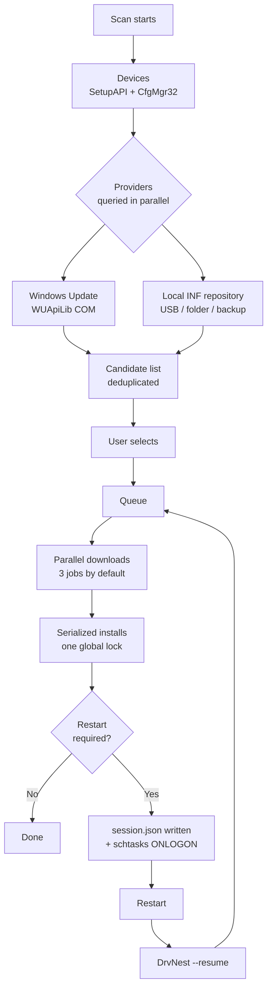

<div align="center">


# DrvNest

**DrvNest is a free, open-source driver updater, system monitor, network monitor and clean-up tool for Windows 10 and 11.**
It scans every device in the machine, finds and installs the missing and outdated drivers, resumes
after the restarts they need, backs your drivers up before a format and restores them afterwards
with no internet at all — and shows you live what the machine and every program on it are costing
in processor time, memory and bandwidth, which programs start with Windows, and what is
taking up disk space. One file, no installer, no adware.

<br>

[](https://github.com/ahmetcaglayan/DrvNest/releases/latest/download/DrvNest.exe)

<sub>[🌐 Project site](https://ahmetcaglayan.github.io/DrvNest/) · [All releases and the arm64 build →](../../releases)</sub>

<br>

### No installer. Download, double-click, done.

`Windows 10 1607+ / Windows 11` · `64-bit` · `Administrator rights required`

**No .NET installation. No Visual C++ Redistributable.**
Everything lives inside the executable: the .NET 8 runtime is published self-contained as
a single file, and WPF carries its own `vcruntime140_cor3.dll` / `msvcp140_cor3.dll`.

<br>

[](LICENSE)
[](../../releases)
[](https://dotnet.microsoft.com/)
[](../../releases/latest)
[](../../releases)
[](../../stargazers)
[](../../actions/workflows/build.yml)

<sub>🇬🇧 English · [🇹🇷 Türkçe](README.tr.md) · [🇷🇺 Русский](README.ru.md) · [🇨🇳 简体中文](README.zh.md) · [🇮🇳 हिन्दी](README.hi.md)</sub>

<br>


</div>

---

## 🎯 What is it for?

You just formatted Windows. Device Manager is full of yellow exclamation marks, the
resolution is wrong, there is no sound and — worst of all — no internet, because the
network adapter has no driver either.

DrvNest solves that from a single window:

- Lists **every PnP device** in the machine and tells you which ones have no driver.
- Finds missing and upgradable drivers in the **Windows Update catalog** or in a
  **local folder on a USB stick**.
- Queues them, downloads them, installs them and **carries on where it left off** after
  every restart it needs.
- Exports your current drivers **before** a format and restores them **afterwards**
  with no internet involved.

Since 1.1 it also answers the two questions people open Task Manager for:

- **What is this machine doing?** Processor load per logical core, a memory breakdown,
  every temperature sensor the firmware exposes, storage with real read/write throughput,
  battery — and a table of every running program with its processor share, working set,
  private bytes and disk throughput.
- **Who is using my connection?** Live download and upload for the whole machine, totals
  for this session and since Windows started, every adapter — and a per-application table
  showing which program is transferring what, right now.

Since 1.2 it also answers two more:

- **What starts with Windows, and do I want it to?** Every autostart entry with a switch,
  written the same way Task Manager writes it, so nothing is ever deleted.
- **What is eating my disk?** Every cache measured rather than estimated, with nothing
  ticked for you, and your own files kept separate and sent to the Recycle Bin.

One file, no installer, no background service, no telemetry.

---

## ✨ Features

| Feature | What it does |
| --- | --- |
| 🔍 **Full device scan** | Enumerates every present PnP device through SetupAPI + CfgMgr32. No WMI, so it also works on a freshly installed machine or one with a broken WMI repository. |
| ⚠️ **Missing-driver detection** | Reads Configuration Manager problem codes; 28 (`CM_PROB_FAILED_INSTALL`), 1 and 19 mean "no driver". 22 is disabled, 14 is waiting for a restart. |
| ☁️ **Windows Update driver catalog** | Talks to Microsoft Update through the Windows Update Agent COM API (WUApiLib). No extra service, no extra download, no extra dependency — `wuapi.dll` ships with Windows. |
| 💾 **Local / offline INF repository** | Parses `.inf` packages in folders and matches them by hardware id. A USB stick, a network share or a DrvNest backup all work as a source. |
| ⚡ **Parallel downloads + serialized installs** | Downloads overlap (3 by default, configurable 1–8). Installs run one at a time. That is not a shortcut: Windows Update returns `WU_E_OPERATIONINPROGRESS` for a second concurrent install and the PnP subsystem serializes anyway. Pretending otherwise would only produce spurious failures. |
| 🔄 **Resume after reboot** | The queue is written to `session.json` after every state change; a logon-triggered `schtasks` task (with an HKLM `RunOnce` fallback) relaunches DrvNest with `--resume` and it continues exactly where it stopped. |
| 🛡️ **System restore point** | Creates a driver-type restore point through `srclient.dll` before the first install of a session. |
| ↩️ **Pre-update backup** | The package about to be replaced is exported immediately before the install, and its path is stored in the history record so it can be restored if something goes wrong. |
| 📦 **Driver backup / restore** | Exports every third-party driver package with `pnputil /export-driver` into a folder or ZIP, and restores with `pnputil /add-driver ... /subdirs /install`. |
| 📊 **Update history** | A permanent record kept as one JSON object per line (`history.jsonl`), exportable to CSV in one click. |
| 📄 **Hardware report** | Writes every device and hardware id to a plain text file — carry it on a USB stick to a working computer and look the drivers up by hand. |
| 🆙 **Built-in updater** | Downloads the new release from GitHub, **verifies its SHA-256** (and refuses to install when the release publishes no `checksums.txt`), then swaps the executable in place. |
| 📈 **System monitor** | Processor load overall and per logical core (`NtQuerySystemInformation`), memory down to cached and committed bytes (`GlobalMemoryStatusEx` + `GetPerformanceInfo`), ACPI thermal zones, per-volume read/write throughput (`IOCTL_DISK_PERFORMANCE`) and battery state. Nothing is sampled until the page is opened, and it stops the moment you leave it. |
| 🧮 **Per-application resource usage** | Processor share, working set, private bytes, disk throughput and thread count for every process, measured exactly the way Task Manager measures them: the delta in the process' own kernel + user time between two samples, divided by the wall clock and the logical processor count. |
| 🌐 **Network monitor** | Machine-wide download and upload from the adapters' own counters, session and since-boot totals, open connection count, and every adapter with its address and negotiated link speed. |
| 🔎 **Per-application network usage** | Which program is transferring what, from `GetExtendedTcpTable` plus TCP ESTATS (`GetPerTcpConnectionEStats`). TCP only — Windows has no per-process UDP counter without a kernel driver, and the page says so instead of under-reporting quietly. |
| 🔁 **Automatic update check** | One request a day to the GitHub Releases API, and a count on the *About* entry when a new version exists. Automatic download and install is opt-in, SHA-256 verified, and only ever applied as DrvNest closes — never mid-queue. |
| 🚀 **Startup manager** | Every autostart entry from the `Run` / `RunOnce` keys (HKCU, HKLM and the 32-bit view) and both Startup folders, with a switch each. Disabling writes the same `StartupApproved` value Task Manager writes, so the two always agree and the original command line is never deleted. Entries pointing at a missing file are flagged. |
| 🧹 **Clean-up** | Temporary files, thumbnail and icon cache, seven browsers' caches, the Windows Update download cache, Delivery Optimization, crash dumps, error reports, shader caches, servicing logs and the Recycle Bin — every one **measured, not estimated**, and **nothing ticked by default**. |
| 🗂️ **Leftovers and old downloads** | Folders under AppData matching no installed program, no running program and nothing in Program Files, untouched for six months; plus archives and installers in Downloads older than a month. Listed item by item and sent to the **Recycle Bin**, never deleted outright. |
| 🧠 **Memory trim** | Pages out process working sets. The page says plainly that this frees physical memory *now* and does not make anything faster — which is the opposite of what every other tool with this button claims. |
| 🌍 **Five interface languages** | English, Turkish, Russian, Simplified Chinese and Hindi, all inside the single executable. Switches instantly while the app is open. |
| 🎨 **Dark / light theme** | Swaps the palette dictionary; applied without reopening the window. |

---

## 🚑 Post-format recovery

This is why DrvNest exists.

### The chicken-and-egg problem

After a format the **network adapter usually has no driver either**. You need the
internet to download the driver and the driver to reach the internet. Windows Update
cannot help, because you cannot reach it.

The fix: **take your drivers with you before the format.**

### BEFORE the format (5 minutes)

1. Run DrvNest.
2. Go to **Backup & Restore**.
3. Click **Create backup**. Every third-party driver package on the system is exported.
   (Microsoft's own in-box drivers are deliberately skipped — Windows reinstalls those
   itself, and including them would triple the backup size for nothing.)
4. Tick **Compress as ZIP** if you like.
5. Copy the resulting folder **and `DrvNest.exe`** onto the same USB stick.

> 💡 Optional: name the backup folder `Drivers` and keep it next to `DrvNest.exe`.
> DrvNest registers it **automatically** as a local driver repository — no configuration
> needed.

### AFTER the format

1. Plug the stick in and run `DrvNest.exe` (it asks for elevation).
   With no internet, start it as `DrvNest.exe --rescue`: Windows Update is never
   contacted and only local sources are used.
2. **Backup & Restore → Restore** (or **Restore from folder**) and pick your backup.
   Every package is added to the driver store and bound to its devices.
3. Once the network adapter works, press **Scan**.
4. **Dashboard → Post-format recovery** queues everything that is still missing from
   Windows Update.
5. Accept the restart when asked — DrvNest brings itself back at logon and finishes the
   rest of the queue.

> ℹ️ The folder does not have to be a DrvNest backup. Any vendor driver folder you
> downloaded and extracted works with **Restore from folder**; its `.inf` files are
> found recursively.

### Command line

```powershell
DrvNest.exe                 # normal launch
DrvNest.exe --rescue        # offline rescue mode (same as --offline)
DrvNest.exe --resume        # continue an interrupted queue straight away
```

---

## 📸 Screenshots

Real screenshots of the shipping build, taken on Windows 11. They are regenerated from
the build itself — see [Regenerating the screenshots](#regenerating-the-screenshots) — so
they cannot drift out of date.

<table>
<tr>
<td width="50%"><br><sub><b>System Monitor</b> — processor, memory, temperature and disk as live charts, one bar per logical core.</sub></td>
<td width="50%"><br><sub><b>Network Monitor</b> — machine-wide download and upload, session totals, every adapter.</sub></td>
</tr>
<tr>
<td width="50%"><br><sub><b>Usage per program</b> — processor, memory, disk and threads for every running process.</sub></td>
<td width="50%"><br><sub><b>Traffic per program</b> — which application is using the connection, and how much.</sub></td>
</tr>
<tr>
<td width="50%"><br><sub><b>Devices</b> — every PnP device grouped by class, with live problem codes.</sub></td>
<td width="50%"><br><sub><b>Updates</b> — installable packages from Windows Update and local INF folders.</sub></td>
</tr>
<tr>
<td width="50%"><br><sub><b>Activity</b> — the running queue, with speed and install phase per driver.</sub></td>
<td width="50%"><br><sub><b>Backup &amp; Restore</b> — export every third-party driver, restore it offline.</sub></td>
</tr>
<tr>
<td width="50%"><br><sub><b>Startup Programs</b> — a switch per entry, written the way Task Manager writes it.</sub></td>
<td width="50%"><br><sub><b>Clean Up</b> — measured, not estimated, and nothing ticked for you.</sub></td>
</tr>
<tr>
<td width="50%"><br><sub><b>Settings</b> — parallel downloads, safety, automatic updates, theme and language.</sub></td>
<td width="50%"><br><sub><b>About</b> — version information and the built-in updater.</sub></td>
</tr>
</table>

### Regenerating the screenshots

Every image above is produced by the application itself, so a UI change can be reflected
in the documentation with one command:

```powershell
# From an elevated prompt, after building
.\DrvNest.exe --capture .\assets\screenshots --lang en
```

It walks the whole menu, waits for the live pages to fill their charts, and writes one
PNG per page. `--lang` pins the interface language so the published images do not depend
on the display language of whoever regenerated them.

> Why a built-in capture at all? DrvNest runs elevated, and User Interface Privilege
> Isolation stops the (unelevated) Snipping Tool from seeing input aimed at a higher
> integrity window — pressing Print Screen over DrvNest, Task Manager or Registry Editor
> does nothing. Capturing from inside the process side-steps that entirely.

---

## 🧭 Menus

| Menu | What it does |
| --- | --- |
| **Dashboard** | Device count, missing drivers, available updates, problem devices. OS / machine / CPU / BIOS summary. Quick actions: *Scan now*, *Post-format recovery*, *Update everything*, *Back up drivers*, *Hardware report*. A warning banner appears when no network adapter has a working driver. |
| **Devices** | Every PnP device, grouped by class. Filters: *All / Problems / Missing / Generic driver*. Search by name, manufacturer, version and hardware id; copy a hardware id to the clipboard. |
| **Updates** | Installable packages: both missing drivers and version upgrades. Per-row selection, *Select all / Clear selection*, total selected size, *Install selected*. You can hide one update or ignore a device entirely. |
| **Activity** | The running queue. Download percentage, speed, transferred bytes and the install phase are shown separately for every job. *Cancel all*, *Retry failed*, *Restart now* / *Later*. An interrupted session shows a *Continue* button here. |
| **Backup & Restore** | *Create backup* (optionally zipped), the list of existing backups (package count, size, date), *Restore*, *Restore from folder*, *Open*, *Delete*. |
| **History** | A permanent record of every driver operation. Filter by outcome, search, *Export as CSV*, *Clear history*. If a record's pre-update backup still exists you can open its folder. |
| **System Monitor** | Processor load overall and per logical core, memory broken down into in-use / available / cached / committed, temperature sensors when the machine exposes any, storage capacity with live read and write throughput, and battery. Below that, every running process with its processor share, working set, private bytes, disk throughput and thread count — sortable by processor, memory, disk or name, searchable, and pausable so a row can actually be read. |
| **Network Monitor** | Live download and upload for the whole machine as charts, the total for this session and since Windows started, the number of open connections, and every adapter with its type, address and link speed. Below that, a per-application table: download and upload rate, session totals, open connections and the remote endpoint. |
| **Startup Programs** | Every autostart entry DrvNest can safely toggle, with the program name from the executable's version resource, its publisher, the command line, the size and where it starts from. A switch per row; disabling writes the same setting Task Manager writes and deletes nothing. Entries pointing at a file that no longer exists are flagged, security software is marked and asks before being switched off, and there are filters for on, off and broken plus a search. |
| **Clean Up** | Measured sizes for temporary files, thumbnail and icon caches, seven browsers, the Windows Update download cache, Delivery Optimization, crash dumps, error reports, shader caches, Windows logs, DrvNest's own cache and the Recycle Bin. Nothing is ticked by default. Old downloads and leftover AppData folders are listed item by item and go to the Recycle Bin. Plus a memory trim that is honest about what it does. |
| **Logs** | Live diagnostics. *Copy* puts the log on the clipboard with a version / OS / machine header — exactly what an issue report needs. Open the log file or folder, or clear it. |
| **Settings** | Parallel download count, retry count, scan on startup, restore point, pre-update backup, resume after restart, automatic restart and its delay, offline mode, optional drivers, local driver folders, history retention, **automatic update check, automatic install and pre-releases**, theme, language. |
| **About** | Version information, *Check for updates*, *Download and install*, release notes, project page and issue links. |

---

## ⚙️ How it works



In short:

1. **Scan.** `SetupDiGetClassDevs(DIGCF_PRESENT | DIGCF_ALLCLASSES)` enumerates every
   device physically present; `CM_Get_DevNode_Status` supplies the problem code, and
   `HKLM\SYSTEM\CurrentControlSet\Control\Class\<DriverKey>` supplies the installed
   driver's version, date and provider.
2. **Providers.** Windows Update and the local INF repository are queried at the same
   time. A provider that fails becomes a warning line, never an aborted scan.
3. **Deduplication.** When both sources offer the same package the **local copy wins** —
   it is already on disk and needs no network. If Windows Update offers a version older
   than the installed one, that candidate is dropped.
4. **Queue.** Downloads run behind `SemaphoreSlim(MaxParallelJobs)`; installs run behind
   one global lock. A failed job is retried twice by default.
5. **Resume.** Every state change is written atomically to `session.json`. When a restart
   is needed the queue is parked, and a logon-triggered task brings DrvNest back with
   `--resume`. A session survives at most 10 restarts before it is abandoned as a safety
   valve.

---

## 🔨 Building from source

Irrelevant if you just want the app: **download the exe, double-click, done.**
The source sits in its own folder and bothers nobody.

```
DrvNest/
├── src/                    source code (C#, .NET 8, WPF)
│   ├── DrvNest.Core/       UI-free core: scanning, providers, job engine
│   ├── DrvNest.App/        WPF desktop application (DrvNest.exe)
│   └── DrvNest.Cli/        (reserved) placeholder for a headless front end
├── docs/                   documentation
├── build/                  build scripts
├── assets/                 logo and screenshots
└── .github/workflows/      CI
```

The short version:

```powershell
dotnet publish src/DrvNest.App/DrvNest.App.csproj -c Release -r win-x64 -o publish
```

Details, the arm64 build and an explanation of the WUApiLib COM reference:
**[docs/BUILD.md](docs/BUILD.md)**

Architecture, the `IDriverProvider` abstraction and how to add a new driver source:
**[docs/ARCHITECTURE.md](docs/ARCHITECTURE.md)**

---

## 🔐 Security and privacy

- **No telemetry.** No usage data, no device identifiers, no statistics leave the machine.
- Exactly **two** things ever go out:
  1. **Windows Update queries** — straight to Microsoft, through Windows' own Windows
     Update Agent. (Never in offline mode or with `--rescue`.)
  2. **The GitHub Releases API** — only when you press *Check for updates*.
- **Why administrator?** Installing a driver is privileged: `pnputil`, the Windows Update
  installer and System Restore all need an elevated token. DrvNest asks for it up front in
  its application manifest (`requireAdministrator`) rather than failing half way through a
  queue.
- **Safety nets:** a system restore point before the first install of a session, and a
  backup of every driver package it replaces.
- **The updater** compares the download against the release's `checksums.txt` SHA-256;
  a missing or mismatching checksum means the file is deleted and the update refused.
- All state lives under `%ProgramData%\DrvNest`: `settings.json`, `session.json`,
  `history.jsonl`, `logs/`, `backups/`, `cache/`, `reports/`.

Vulnerability reports: **[SECURITY.md](SECURITY.md)**

---

## ❓ FAQ

### Is DrvNest free?

Yes. DrvNest is released under the MIT licence and the full source is in this repository. There is
no paid tier, no trial, no feature that unlocks after payment, no advertising and no bundled
third-party software. The scan and the installs are the same product.

### Do I need to install .NET?

No. The entire .NET 8 runtime is inside `DrvNest.exe` (self-contained, single-file publish) and WPF
carries its own `vcruntime140_cor3.dll` / `msvcp140_cor3.dll`. No Visual C++ Redistributable either.
The only requirement is 64-bit Windows 10 version 1607 (build 14393) or newer.

### Why does SmartScreen or my antivirus warn about it?

Because `DrvNest.exe` is **not code-signed** — certificates cost money. SmartScreen and Smart App
Control warn about any unsigned executable that has not built up reputation, and an app that runs as
administrator, installs drivers and registers a scheduled task looks like malware to a heuristic
scanner. The honest mitigation is to verify the file: compare the output of
`Get-FileHash .\DrvNest.exe -Algorithm SHA256` with the matching line in the release's
`checksums.txt`.

### Can I install drivers after a format with no internet?

Yes — that is what DrvNest was built for. Back your drivers up before the format, put the backup and
`DrvNest.exe` on the same USB stick, then start `DrvNest.exe --rescue` afterwards and press
**Restore**. A folder named `Drivers` next to `DrvNest.exe` is registered automatically as a local
driver repository, and any vendor folder you extracted yourself works too.

### Can I roll a driver back?

Yes, three ways: from the backup DrvNest exports immediately before each install (**Restore from
folder**), from the system restore point created before the first install of a session
(`rstrui.exe`), or with Windows' own *Roll Back Driver* button in Device Manager. Which is why
leaving the restore-point setting on is recommended.

### Does it really resume after a reboot?

Yes. Queue state is written atomically to `session.json` on every change, and a logon-triggered
`DrvNest\ResumeSession` scheduled task (with an HKLM `RunOnce` fallback) brings DrvNest back with
`--resume`. A session survives at most 10 restarts; the task and the registry value are removed once
the queue finishes.

### Does disabling a startup program delete anything?

No. Windows keeps the enabled flag in a separate key —
`...\CurrentVersion\Explorer\StartupApproved\Run` and its two siblings — and that is the
only thing DrvNest writes. The `Run` value, or the shortcut in the Startup folder, is left
exactly where it is, so switching the entry back on restores the original command line
byte for byte.

That also means Task Manager and DrvNest agree with each other: disable something in one
and the other shows it as disabled. And if you later delete DrvNest, the machine is not
left missing half its startup programs, because none of them ever went anywhere.

### Is the clean-up safe?

It is built to be, and the design says how rather than asking you to trust it:

- **Nothing is ticked by default.** The page opens with a total of zero.
- Every path comes from a well-known folder API, not from a string. Nothing outside a
  category's own roots is ever touched, and each individual deletion is re-checked against
  those roots immediately before it happens.
- Reparse points are never followed. `%LOCALAPPDATA%` is full of junctions, and walking
  into one is how a "clear the cache" feature ends up deleting somebody's documents.
- Files that are open are skipped, not forced. The count of skipped files is reported.
- Your own files — old downloads, leftover folders — are never bulk-selected. They are
  listed one by one with a size and an age, and they go to the **Recycle Bin**.

The leftover detection is the one place DrvNest is guessing, and it says so on the row.

### Does "free up memory" actually do anything?

It frees physical memory right now, and that is all it does.

It calls `EmptyWorkingSet` on each process, which asks Windows to page that process' working
set out to the page file. Memory in use genuinely drops. But those pages are not gone — they
are on disk, and the moment the program touches that memory again Windows reads them back,
which is slower than leaving them alone. Unused memory is not wasted memory; Windows was
already keeping it available.

So it is not a performance feature and DrvNest does not present it as one. It is genuinely
useful immediately before starting something that needs a large allocation, or to see how
much a leaking program is really holding. Every other tool with this button claims
otherwise.

### Why does the temperature card say there is no sensor?

Because on that machine there is not one Windows can read. The only temperature Windows
exposes without a driver is the ACPI thermal zone the firmware declares for its own fan
control (`root\WMI:MSAcpi_ThermalZoneTemperature`), and a great many desktop motherboards
declare none at all. Per-core and GPU temperatures come from a vendor sensor chip over an
SMBus, which needs a signed kernel driver — that is exactly what HWiNFO and Open Hardware
Monitor install. DrvNest will not install a kernel driver to fill in a number, so it tells
you the sensor is missing rather than inventing a plausible 45 °C.

### Why does per-program network usage not add up to the machine total?

Because the two are measured differently, and both are correct.

The machine-wide figure is the sum of the network adapters' own byte counters, so it
covers everything: TCP, UDP, QUIC, broadcast. The per-application figure comes from TCP
ESTATS (RFC 4898) via `GetPerTcpConnectionEStats`, which is the only per-process byte
counter Windows offers without a kernel driver — and it covers TCP only. Video calls,
much game traffic and DNS are therefore counted in the first number and not in the
second. The page says so rather than quietly under-reporting.

Enabling ESTATS needs an elevated token. DrvNest always has one; if it is ever refused,
the table falls back to per-process connection counts and says why.

### Does DrvNest update itself in the background?

It **checks** once a day and tells you, on the *About* menu entry. It does not download
or install anything unless you turn that on in **Settings → Updates**, and even then:

- the download is verified against the release's `checksums.txt` before it is trusted,
- the swap happens as DrvNest **closes**, never while a driver queue is running,
- both the check and the install are skipped entirely in offline and rescue mode.

You can turn the check off completely; the *Check for updates* button keeps working.

### Is the monitor a background service?

No. Neither monitor samples anything until you open its page, and both stop the moment
you navigate away. DrvNest still installs no service, no driver and no startup entry —
the only thing it ever registers is the logon task that resumes an interrupted driver
queue, and that removes itself when the queue finishes.

### Does DrvNest collect any data?

No. No telemetry, no usage statistics, no device identifiers. Exactly two things leave the machine:
Windows Update queries, which go straight to Microsoft through Windows' own agent and never happen
in offline mode, and one request to the GitHub Releases API when you press *Check for updates*.

---

"Why is the exe so big?", "Why no WMI?", "Does it work on Windows Server?" and the rest:

**[docs/FAQ.md](docs/FAQ.md)** · Usage guide (Turkish): **[docs/USAGE.md](docs/USAGE.md)** ·
Project site: **[ahmetcaglayan.github.io/DrvNest](https://ahmetcaglayan.github.io/DrvNest/)**

---

## 🤝 Contributing

Contributions are welcome.

- **Bug reports:** [Issues](../../issues) — please attach the log from the *Copy* button
  in the **Logs** menu; it already carries the version and OS header.
- **Code:** fork, branch, open a pull request. Keep the existing style: no NuGet
  dependencies (single-file size and offline operation are deliberate choices), and no UI
  code inside `DrvNest.Core`.
- **Translation:** adding a language means adding one dictionary to
  `src/DrvNest.App/Services/Loc.cs`; see [docs/ARCHITECTURE.md](docs/ARCHITECTURE.md).

---

## 📄 License

MIT — see [LICENSE](LICENSE).

---

## ⚠️ Disclaimer

Installing drivers carries inherent risk. A wrong or corrupt driver can cause problems up
to and including a machine that will not boot. DrvNest reduces that risk by creating a
system restore point and backing up the drivers it replaces, but it offers no guarantee.

**Leave the restore point setting on.** Keep backups of anything you care about. The
software is provided "as is"; the consequences of using it are the user's responsibility.

---

## Keywords

<sub>
windows driver updater open source · free driver updater no adware · install drivers after format ·
offline driver installer usb · driver backup restore windows · missing driver finder ·
windows 11 driver scanner · pnputil driver export · windows update driver catalog tool, free system monitor windows, cpu ram temperature monitor, per application network usage windows, bandwidth monitor per program, task manager alternative open source ·
device manager yellow exclamation mark fix
</sub>
