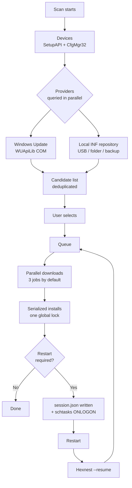

<div align="center">


# Hexnest

**O Hexnest é um utilitário de sistema gratuito e de código aberto para Windows e macOS: um atualizador de controladores,
um monitor de sistema, um monitor de rede, um gestor de arranque e uma limpeza de disco numa só janela.**

No Windows analisa todos os dispositivos da máquina, encontra e instala os controladores em falta e
desatualizados, retoma depois dos reinícios de que precisam, faz cópia dos seus controladores antes de uma formatação e repõe-nos
a seguir sem qualquer Internet. Nas duas plataformas mostra-lhe em direto o que a máquina e
cada programa nela estão a custar em tempo de processador, memória e largura de banda, o que arranca no início de sessão,
e o que está a ocupar espaço em disco. Sem instalador no Windows, sem adware em lado nenhum.

<br>

[](https://github.com/ahmetcaglayan/Hexnest/releases/latest/download/Hexnest.exe)
[](https://github.com/ahmetcaglayan/Hexnest/releases/latest/download/Hexnest-arm64.dmg)

<sub>[🌐 Site do projeto](https://ahmetcaglayan.github.io/Hexnest/) · [Mac Intel, Windows em ARM e todas as versões anteriores →](../../releases)</sub>

<br>

### Windows: sem instalador. macOS: arraste para Aplicações.

`Windows 10 1607+ / 11` · `macOS 12 Monterey+` · `64-bit` · `Apple silicon and Intel`

**Nada para instalar primeiro.** Ambas as versões trazem o runtime do .NET 8 dentro de si: sem transferir
.NET no Windows, sem Visual C++ Redistributable, sem Homebrew nem Xcode num Mac.

<br>

[](LICENSE)
[](../../releases)
[](../../releases)
[](https://dotnet.microsoft.com/)
[](../../releases/latest)
[](../../releases)
[](../../stargazers)
[](../../actions/workflows/build.yml)

<sub>[🇬🇧 English](README.md) · [🇹🇷 Türkçe](README.tr.md) · [🇷🇺 Русский](README.ru.md) · [🇨🇳 简体中文](README.zh.md) · [🇮🇳 हिन्दी](README.hi.md) · 🇵🇹 Português · [🇯🇵 日本語](README.ja.md) · [🇩🇪 Deutsch](README.de.md) · [🇫🇷 Français](README.fr.md) · [🇰🇷 한국어](README.ko.md)</sub>

<br>


</div>

---

## 🖥️ O que funciona onde

O Hexnest é um só produto com duas janelas. O motor partilhado — os monitores, a limpeza, o
gestor de arranque, as definições e os registos — é o mesmo código nas duas plataformas. A metade dos
controladores existe só no Windows, e não por ainda não ter sido escrita: **o macOS não tem um arquivo de
controladores de terceiros para analisar, atualizar ou copiar.** A Apple inclui os controladores no sistema operativo, por isso
não há ali nada que uma ferramenta destas possa encontrar. Essas páginas estão, portanto, ausentes da versão
Mac em vez de presentes e permanentemente vazias.

| |  |  |
| --- | :---: | :---: |
| **Painel** e resumo do hardware | ✅ | ✅ |
| **Monitor de sistema** — processador, por núcleo, memória, armazenamento, bateria | ✅ | ✅ |
| **Processador e memória por aplicação** | ✅ | ✅ |
| **Monitor de rede** — taxas em direto, totais, placas, ligações | ✅ | ✅ |
| **Utilização de rede por aplicação** | ✅ apenas TCP | ✅ via `nettop` |
| **Gestor de arranque** | ✅ chaves Run + pastas Arranque | ✅ agentes launchd |
| **Limpeza**, medida e não estimada | ✅ | ✅ |
| **Registos, definições, dez idiomas, escuro/claro** | ✅ | ✅ |
| **Temperatura do processador** | ✅ zonas térmicas ACPI | ❌ inacessível sem root |
| **Débito de disco por volume** | ✅ | ❌ sem contador por volume |
| **Libertar memória** | ✅ | ❌ o macOS comprime em vez disso |
| **Análise de dispositivos / controladores em falta** | ✅ | ❌ sem arquivo de controladores |
| **Catálogo de controladores do Windows Update** | ✅ | ❌ |
| **Repositório INF offline** | ✅ | ❌ |
| **Cópia e restauro de controladores** | ✅ | ❌ |
| **Fila de instalação e retoma após reinício** | ✅ | ❌ |
| **Ponto de restauro do sistema** | ✅ | ❌ tarefa do Time Machine |
| **Corre como administrador / root** | ⚠️ obrigatório | ✅ nunca — só o domínio do utilizador |

Um ❌ acima é algo que a plataforma não tem, não algo que o Hexnest tenha deixado de fazer. Cada um
deles é explicado no ponto em que aparece dentro da própria aplicação.

---

## 🎯 Para que serve?

Acabou de formatar o Windows. O Gestor de Dispositivos está cheio de pontos de exclamação amarelos, a
resolução está errada, não há som e — pior de tudo — não há Internet, porque a
placa de rede também não tem controlador.

O Hexnest resolve isso a partir de uma só janela:

- Lista **todos os dispositivos PnP** da máquina e diz-lhe quais não têm controlador.
- Encontra controladores em falta e atualizáveis no **catálogo do Windows Update** ou numa
  **pasta local numa pen USB**.
- Coloca-os em fila, transfere-os, instala-os e **continua onde ficou** depois de
  cada reinício necessário.
- Exporta os seus controladores atuais **antes** de uma formatação e repõe-nos **depois**
  sem qualquer Internet envolvida.

Desde a 1.1 também responde às duas perguntas que levam as pessoas a abrir o Gestor de Tarefas:

- **O que está esta máquina a fazer?** Carga do processador por núcleo lógico, uma repartição da memória,
  todos os sensores de temperatura que o firmware expõe, armazenamento com débito real de leitura/escrita,
  bateria — e uma tabela de todos os programas em execução com a sua fatia de processador, conjunto de trabalho,
  bytes privados e débito de disco.
- **Quem está a usar a minha ligação?** Transferência e envio em direto para toda a máquina, totais
  desta sessão e desde o arranque do Windows, todas as placas — e uma tabela por aplicação
  a mostrar que programa está a transferir o quê, neste preciso momento.

Desde a 1.2 responde a mais duas:

- **O que arranca com o Windows, e quero eu isso?** Todas as entradas de arranque com um interruptor,
  escritas da mesma forma que o Gestor de Tarefas as escreve, por isso nada é alguma vez apagado.
- **O que está a comer o meu disco?** Todas as caches medidas em vez de estimadas, com nada
  assinalado por si, e os seus ficheiros mantidos à parte e enviados para a Reciclagem.

Um ficheiro, sem instalador, sem serviço em segundo plano, sem telemetria.

---

## ✨ Funcionalidades

| Funcionalidade | Plataforma | O que faz |
| --- | --- | --- |
| 🔍 **Análise completa de dispositivos** |  | Enumera todos os dispositivos PnP presentes através da SetupAPI + CfgMgr32. Sem WMI, por isso também funciona numa máquina acabada de instalar ou com o repositório WMI avariado. |
| ⚠️ **Deteção de controladores em falta** |  | Lê os códigos de problema do Gestor de Configuração; 28 (`CM_PROB_FAILED_INSTALL`), 1 e 19 significam «sem controlador». 22 é desativado, 14 está à espera de um reinício. |
| ☁️ **Catálogo de controladores do Windows Update** |  | Fala com o Microsoft Update através da API COM do Agente do Windows Update (WUApiLib). Sem serviço extra, sem transferência extra, sem dependência extra — a `wuapi.dll` vem com o Windows. |
| 💾 **Repositório INF local / offline** |  | Analisa pacotes `.inf` em pastas e associa-os por ID de hardware. Uma pen USB, uma partilha de rede ou uma cópia do Hexnest servem todas como origem. |
| ⚡ **Transferências paralelas + instalações em série** |  | As transferências sobrepõem-se (3 por predefinição, configurável de 1 a 8). As instalações correm uma de cada vez. Isso não é um atalho: o Windows Update devolve `WU_E_OPERATIONINPROGRESS` a uma segunda instalação simultânea e o subsistema PnP serializa de qualquer maneira. Fingir o contrário só produziria falhas falsas. |
| 🔄 **Retoma após reinício** |  | A fila é escrita em `session.json` depois de cada mudança de estado; uma tarefa `schtasks` despoletada no início de sessão (com recurso a `RunOnce` em HKLM) relança o Hexnest com `--resume` e ele continua exatamente onde parou. |
| 🛡️ **Ponto de restauro do sistema** |  | Cria um ponto de restauro do tipo controlador através da `srclient.dll` antes da primeira instalação de uma sessão. |
| ↩️ **Cópia antes da atualização** |  | O pacote prestes a ser substituído é exportado imediatamente antes da instalação, e o seu caminho é guardado no registo do histórico para poder ser reposto se algo correr mal. |
| 📦 **Cópia / restauro de controladores** |  | Exporta todos os pacotes de controladores de terceiros com `pnputil /export-driver` para uma pasta ou ZIP, e repõe com `pnputil /add-driver ... /subdirs /install`. |
| 📊 **Histórico de atualizações** |  | Um registo permanente guardado como um objeto JSON por linha (`history.jsonl`), exportável para CSV num clique. |
| 📄 **Relatório de hardware** |  | Escreve todos os dispositivos e IDs de hardware num ficheiro de texto simples — leve-o numa pen USB até um computador que funcione e procure os controladores à mão. |
| 🆙 **Atualizador incorporado** |  | Transfere a nova versão do GitHub, **verifica o seu SHA-256** (e recusa instalar quando a versão não publica um `checksums.txt`), e depois substitui o executável no lugar. |
| 📈 **Monitor de sistema** |   | Carga do processador no total e por núcleo lógico (`NtQuerySystemInformation`), memória até aos bytes em cache e consolidados (`GlobalMemoryStatusEx` + `GetPerformanceInfo`), zonas térmicas ACPI, débito de leitura/escrita por volume (`IOCTL_DISK_PERFORMANCE`) e estado da bateria. Nada é amostrado até a página ser aberta, e para no momento em que a deixa. |
| 🧮 **Utilização de recursos por aplicação** |   | Fatia de processador, conjunto de trabalho, bytes privados, débito de disco e número de threads para cada processo, medidos exatamente como o Gestor de Tarefas os mede: a diferença do tempo de kernel + utilizador do próprio processo entre duas amostras, dividida pelo tempo decorrido e pelo número de processadores lógicos. |
| 🌐 **Monitor de rede** |   | Transferência e envio de toda a máquina a partir dos contadores das próprias placas, totais da sessão e desde o arranque, número de ligações abertas, e todas as placas com o seu endereço e velocidade negociada. |
| 🔎 **Utilização de rede por aplicação** |   | Que programa está a transferir o quê, a partir de `GetExtendedTcpTable` mais as ESTATS de TCP (`GetPerTcpConnectionEStats`). Apenas TCP — o Windows não tem contador de UDP por processo sem um controlador de kernel, e a página di-lo em vez de reportar a menos em silêncio. |
| 🔁 **Verificação automática de atualizações** |  | Um pedido por dia à API de versões do GitHub, e um contador na entrada *Acerca* quando existe uma versão nova. A transferência e instalação automáticas são opcionais, verificadas por SHA-256, e aplicadas apenas quando o Hexnest fecha — nunca a meio de uma fila. No macOS a verificação é manual — *Acerca* → *Procurar atualizações* — e abre a transferência em vez de a instalar. |
| 🚀 **Gestor de arranque** |   | Todas as entradas de arranque automático das chaves `Run` / `RunOnce` (HKCU, HKLM e a vista de 32 bits) e de ambas as pastas Arranque, cada uma com o seu interruptor. Desativar escreve o mesmo valor `StartupApproved` que o Gestor de Tarefas escreve, por isso os dois concordam sempre e a linha de comandos original nunca é apagada. As entradas que apontam para um ficheiro em falta são assinaladas. |
| 🧹 **Limpeza** |   | Ficheiros temporários, cache de miniaturas e ícones, caches de sete navegadores, cache de transferências do Windows Update, Otimização da Entrega, despejos de falhas, relatórios de erro, caches de shaders, registos de manutenção e a Reciclagem — todos **medidos, não estimados**, e **nada assinalado por predefinição**. |
| 🗂️ **Resíduos e transferências antigas** |   | Pastas em AppData que não correspondem a nenhum programa instalado, nenhum programa em execução e nada em Program Files, intocadas há seis meses; mais arquivos e instaladores na pasta Transferências com mais de um mês. Listados item a item e enviados para a **Reciclagem**, nunca eliminados de imediato. |
| 🧠 **Libertar memória** |  | Empurra os conjuntos de trabalho dos processos para o disco. A página diz claramente que isto liberta memória física *agora* e não torna nada mais rápido — o oposto do que afirma qualquer outra ferramenta com este botão. |
| 🌍 **Dez idiomas de interface** |   | Inglês, turco, russo, chinês simplificado, hindi, português, japonês, alemão, francês e coreano, todos dentro do executável único. Muda de imediato com a aplicação aberta. |
| 🎨 **Tema escuro / claro** |   | Troca a paleta; aplicado sem reabrir a janela. A versão para Mac acrescenta uma terceira opção, *Seguir o sistema*, que acompanha a mudança claro/escuro do macOS. |

---

## 🚑 Recuperação depois de formatar

É para isto que o Hexnest existe.

### O problema do ovo e da galinha

Depois de uma formatação, **a placa de rede também costuma ficar sem controlador**. Precisa da
Internet para transferir o controlador e do controlador para chegar à Internet. O Windows Update
não ajuda, porque não consegue chegar lá.

A solução: **leve os seus controladores consigo antes de formatar.**

### ANTES de formatar (5 minutos)

1. Execute o Hexnest.
2. Vá a **Cópias & restauro**.
3. Clique em **Criar cópia**. Todos os pacotes de controladores de terceiros do sistema são exportados.
   (Os controladores incluídos pela Microsoft são deliberadamente ignorados — o Windows reinstala-os
   sozinho, e incluí-los triplicaria o tamanho da cópia sem qualquer proveito.)
4. Assinale **Comprimir em ZIP** se quiser.
5. Copie a pasta resultante **e o `Hexnest.exe`** para a mesma pen USB.

> 💡 Opcional: dê à pasta da cópia o nome `Drivers` e mantenha-a ao lado do `Hexnest.exe`.
> O Hexnest regista-a **automaticamente** como repositório local de controladores — sem qualquer
> configuração.

### DEPOIS de formatar

1. Ligue a pen e execute o `Hexnest.exe` (pede elevação).
   Sem Internet, inicie-o como `Hexnest.exe --rescue`: o Windows Update nunca é
   contactado e só são usadas fontes locais.
2. **Cópias & restauro → Restaurar** (ou **Restaurar de uma pasta**) e escolha a sua cópia.
   Todos os pacotes são adicionados ao arquivo de controladores e associados aos seus dispositivos.
3. Assim que a placa de rede funcionar, prima **Analisar**.
4. **Painel → Recuperação pós-formatação** coloca em fila tudo o que ainda falta a partir
   do Windows Update.
5. Aceite o reinício quando for pedido — o Hexnest volta sozinho no início de sessão e termina o
   resto da fila.

> ℹ️ A pasta não tem de ser uma cópia do Hexnest. Qualquer pasta de controladores do fabricante que tenha
> transferido e extraído funciona com **Restaurar de uma pasta**; os seus ficheiros `.inf` são
> encontrados recursivamente.

### Linha de comandos

```powershell
Hexnest.exe                 # normal launch
Hexnest.exe --rescue        # offline rescue mode (same as --offline)
Hexnest.exe --resume        # continue an interrupted queue straight away
```

---

## 📸 Capturas de ecrã

Capturas reais da versão distribuída. São geradas de novo a partir da própria compilação — ver
[Gerar de novo as capturas de ecrã](#regenerating-the-screenshots) — pelo que não podem ficar
desatualizadas.

### 

<table>
<tr>
<td width="50%"><br><sub><b>Monitor de sistema</b> — processador, memória, temperatura e disco em gráficos ao vivo, uma barra por núcleo lógico.</sub></td>
<td width="50%"><br><sub><b>Monitor de rede</b> — transferência e envio de toda a máquina, totais da sessão, todas as placas.</sub></td>
</tr>
<tr>
<td width="50%"><br><sub><b>Utilização por programa</b> — processador, memória, disco e threads para cada processo em execução.</sub></td>
<td width="50%"><br><sub><b>Tráfego por programa</b> — que aplicação está a usar a ligação, e quanto.</sub></td>
</tr>
<tr>
<td width="50%"><br><sub><b>Dispositivos</b> — todos os dispositivos PnP agrupados por classe, com códigos de problema em direto.</sub></td>
<td width="50%"><br><sub><b>Atualizações</b> — pacotes instaláveis do Windows Update e de pastas INF locais.</sub></td>
</tr>
<tr>
<td width="50%"><br><sub><b>Atividade</b> — a fila em curso, com velocidade e fase de instalação por controlador.</sub></td>
<td width="50%"><br><sub><b>Cópias &amp; restauro</b> — exportar todos os controladores de terceiros, repô-los offline.</sub></td>
</tr>
<tr>
<td width="50%"><br><sub><b>Programas de arranque</b> — um interruptor por entrada, escrito como o Gestor de Tarefas o escreve.</sub></td>
<td width="50%"><br><sub><b>Limpeza</b> — medida, não estimada, e nada assinalado por si.</sub></td>
</tr>
<tr>
<td width="50%"><br><sub><b>Definições</b> — transferências paralelas, segurança, atualizações automáticas, tema e idioma.</sub></td>
<td width="50%"><br><sub><b>Acerca</b> — informação da versão e o atualizador incorporado.</sub></td>
</tr>
</table>

### 

<table>
<tr>
<td width="50%"><br><sub><b>Painel</b> — o que o Mac está a fazer agora, e o que ele é: chip, gráficos, memória, disco.</sub></td>
<td width="50%"><br><sub><b>Monitor de sistema</b> — uma barra por núcleo, incluindo os grupos P e E no Apple Silicon.</sub></td>
</tr>
<tr>
<td width="50%"><br><sub><b>Monitor de rede</b> — tráfego por aplicação a partir da mesma fonte que o Monitor de Atividade usa.</sub></td>
<td width="50%"><br><sub><b>Programas de arranque</b> — agentes launchd com um interruptor cada; as tarefas do sistema são mostradas, não tocadas.</sub></td>
</tr>
<tr>
<td width="50%"><br><sub><b>Limpeza</b> — caches, dados derivados do Xcode, cópias do iPhone. Medido, e nada assinalado.</sub></td>
<td width="50%"><br><sub><b>Definições</b> — as mesmas opções, mais um tema que segue o macOS ao nascer e ao pôr do sol.</sub></td>
</tr>
<tr>
<td width="50%"><br><sub><b>Registos</b> — diagnóstico em direto, um clique para a área de transferência para um relatório de erro.</sub></td>
<td width="50%"><br><sub><b>Acerca</b> — versão, máquina, e uma verificação de atualizações que abre a transferência.</sub></td>
</tr>
</table>

### Gerar de novo as capturas de ecrã

Todas as imagens acima são produzidas pela própria aplicação, por isso uma alteração à interface pode ficar refletida
na documentação com um só comando:

```powershell
# Windows, from an elevated prompt, after building
.\Hexnest.exe --capture .\assets\screenshots --lang en
```

```bash
# macOS, after ./build/make-mac-app.sh
./artifacts/mac/arm64/Hexnest.app/Contents/MacOS/Hexnest --capture ./shots --lang en
```

Ambos percorrem todo o menu, esperam que as páginas em direto preencham os gráficos, e escrevem um PNG
por página. O `--lang` fixa o idioma da interface para que as imagens publicadas não dependam do
idioma de quem as gerou de novo.

> Porquê uma captura incorporada? No Windows o Hexnest corre com elevação, e o Isolamento de Privilégios da
> Interface do Utilizador impede a Ferramenta de Recorte (sem elevação) de ver a entrada dirigida a uma janela
> de integridade mais alta — carregar em Print Screen sobre o Hexnest, o Gestor de Tarefas ou o Editor de
> Registo não faz nada. No macOS uma captura de ecrã precisaria da permissão de Gravação de Ecrã e
> fotografaria tudo o resto que estivesse na secretária. Ambas as versões desenham a sua própria árvore visual
> em vez disso, por isso nenhum dos problemas existe.

---

## 🧭 Menus

| Menu | Plataforma | O que faz |
| --- | --- | --- |
| **Painel** |   | Número de dispositivos, controladores em falta, atualizações disponíveis, dispositivos com problemas. Resumo do SO / máquina / CPU / BIOS. Ações rápidas: *Analisar agora*, *Recuperação pós-formatação*, *Atualizar tudo*, *Copiar controladores*, *Relatório de hardware*. Aparece um aviso quando nenhuma placa de rede tem um controlador a funcionar. |
| **Dispositivos** |  | Todos os dispositivos PnP, agrupados por classe. Filtros: *Todos / Problemas / Em falta / Controlador genérico*. Procura por nome, fabricante, versão e ID de hardware; copiar um ID de hardware para a área de transferência. |
| **Atualizações** |  | Pacotes instaláveis: tanto controladores em falta como atualizações de versão. Seleção por linha, *Selecionar tudo / Limpar seleção*, tamanho total selecionado, *Instalar selecionados*. Pode ocultar uma atualização ou ignorar por completo um dispositivo. |
| **Atividade** |  | A fila em curso. Percentagem de transferência, velocidade, bytes transferidos e a fase de instalação são mostrados em separado para cada tarefa. *Cancelar tudo*, *Repetir falhados*, *Reiniciar agora* / *Mais tarde*. Uma sessão interrompida mostra aqui um botão *Continuar*. |
| **Cópias & restauro** |  | *Criar cópia* (opcionalmente comprimida), a lista de cópias existentes (número de pacotes, tamanho, data), *Restaurar*, *Restaurar de uma pasta*, *Abrir*, *Eliminar*. |
| **Histórico** |  | Um registo permanente de todas as operações sobre controladores. Filtrar por resultado, procurar, *Exportar para CSV*, *Limpar histórico*. Se a cópia anterior à atualização ainda existir, pode abrir a respetiva pasta. |
| **Monitor de sistema** |   | Carga do processador no total e por núcleo lógico, memória dividida em em uso / disponível / em cache / consolidada, sensores de temperatura quando a máquina expõe algum, capacidade de armazenamento com débito de leitura e escrita em direto, e bateria. Por baixo, todos os processos em execução com a sua fatia de processador, conjunto de trabalho, bytes privados, débito de disco e número de threads — ordenáveis por processador, memória, disco ou nome, pesquisáveis, e com pausa para que uma linha possa mesmo ser lida. |
| **Monitor de rede** |   | Transferência e envio em direto para toda a máquina em gráficos, o total desta sessão e desde o arranque do Windows, o número de ligações abertas, e todas as placas com o tipo, endereço e velocidade de ligação. Por baixo, uma tabela por aplicação: taxa de transferência e envio, totais da sessão, ligações abertas e o ponto remoto. |
| **Programas de arranque** |   | Todas as entradas de arranque que o Hexnest pode alternar em segurança, com o nome do programa lido do recurso de versão do executável, o editor, a linha de comandos, o tamanho e a origem. Um interruptor por linha; desativar escreve a mesma definição que o Gestor de Tarefas escreve e não apaga nada. As entradas que apontam para um ficheiro que já não existe são assinaladas, o software de segurança é marcado e pergunta antes de ser desligado, e há filtros para ligado, desligado e avariado além de uma procura. |
| **Limpeza** |   | Tamanhos medidos para ficheiros temporários, caches de miniaturas e ícones, sete navegadores, a cache de transferências do Windows Update, a Otimização da Entrega, despejos de falhas, relatórios de erro, caches de shaders, registos do Windows, a cache do próprio Hexnest e a Reciclagem. Nada é assinalado por predefinição. As transferências antigas e as pastas residuais em AppData são listadas item a item e vão para a Reciclagem. Mais uma libertação de memória que é honesta sobre o que faz. |
| **Registos** |   | Diagnóstico em direto. *Copiar* põe o registo na área de transferência com um cabeçalho de versão / SO / máquina — exatamente o que um relatório de erro precisa. Abrir o ficheiro ou a pasta de registo, ou limpá-lo. |
| **Definições** |   | Número de transferências em paralelo, número de tentativas, analisar ao arrancar, ponto de restauro, cópia antes da atualização, retomar após reinício, reinício automático e o seu atraso, modo offline, controladores opcionais, pastas de controladores locais, retenção do histórico, **verificação automática de atualizações, instalação automática e pré-lançamentos**, tema, idioma. |
| **Acerca** |   | Informação da versão, *Procurar atualizações*, notas de lançamento, página do projeto e ligações para os problemas. A versão para Windows também transfere e instala a atualização; a versão para Mac abre a transferência, porque reescrever uma `.app` em execução quebra a sua assinatura. |

A barra lateral da versão para Mac são as oito linhas acima marcadas com macOS, por essa ordem. *Dispositivos*,
*Atualizações*, *Atividade*, *Cópias & restauro* e *Histórico* estão ali ausentes em vez de vazios.

---

## ⚙️ Como funciona



Em resumo:

1. **Análise.** `SetupDiGetClassDevs(DIGCF_PRESENT | DIGCF_ALLCLASSES)` enumera todos os
   dispositivos fisicamente presentes; `CM_Get_DevNode_Status` fornece o código de problema, e
   `HKLM\SYSTEM\CurrentControlSet\Control\Class\<DriverKey>` fornece a versão, a data e o
   fornecedor do controlador instalado.
2. **Fontes.** O Windows Update e o repositório INF local são consultados ao mesmo
   tempo. Uma fonte que falha transforma-se numa linha de aviso, nunca numa análise abortada.
3. **Eliminação de duplicados.** Quando as duas fontes oferecem o mesmo pacote, **ganha a cópia local** —
   já está no disco e não precisa de rede. Se o Windows Update oferecer uma versão mais antiga
   do que a instalada, esse candidato é descartado.
4. **Fila.** As transferências correm atrás de `SemaphoreSlim(MaxParallelJobs)`; as instalações atrás de
   um bloqueio global. Uma tarefa falhada é repetida duas vezes por predefinição.
5. **Retoma.** Todas as mudanças de estado são escritas atomicamente em `session.json`. Quando é preciso
   um reinício, a fila é estacionada, e uma tarefa despoletada no início de sessão traz o Hexnest de volta com
   `--resume`. Uma sessão sobrevive a 10 reinícios no máximo antes de ser abandonada, como válvula
   de segurança.

---

## 🔨 Compilar a partir do código-fonte

Irrelevante se só quer a aplicação: **transfira o exe, faça duplo clique, pronto.**
O código-fonte fica na sua própria pasta e não incomoda ninguém.

```
Hexnest/
├── src/                    source code (C#, .NET 8)
│   ├── Hexnest.Core/       UI-free core, multi-targeted:
│   │                         net8.0-windows  drivers, WUApiLib, SetupAPI, the registry
│   │                         net8.0          the portable half behind the Mac build
│   ├── Hexnest.App/        WPF application for Windows (Hexnest.exe)
│   ├── Hexnest.Mac/        Avalonia application for macOS (Hexnest.app)
│   └── Hexnest.Cli/        (reserved) placeholder for a headless front end
├── docs/                   documentation
├── build/                  build scripts, including the macOS bundler
├── assets/                 logo and screenshots
└── .github/workflows/      CI
```

A versão curta, no Windows:

```powershell
dotnet publish src/Hexnest.App/Hexnest.App.csproj -c Release -r win-x64 -o publish
```

e num Mac, o que produz `artifacts/mac/arm64/Hexnest.app`:

```bash
./build/make-mac-app.sh --arch arm64
```

Acrescente `--dmg` para a imagem de disco que a versão publica. O script não precisa de nada além do
SDK do .NET 8: escreve o `Info.plist`, constrói o `.icns` a partir de `assets/icon-mac-1024.png`
e assina o pacote em ad-hoc para que o Apple Silicon o execute.

Detalhes, as versões arm64 e uma explicação da referência COM WUApiLib:
**[docs/BUILD.md](docs/BUILD.md)**

Arquitetura, a abstração `IDriverProvider` e como acrescentar uma nova fonte de controladores:
**[docs/ARCHITECTURE.md](docs/ARCHITECTURE.md)**

---

## 🔐 Segurança e privacidade

- **Sem telemetria.** Nenhuns dados de utilização, identificadores de dispositivo ou estatísticas saem da máquina.
- Exatamente **duas** coisas alguma vez saem:
  1. **Consultas ao Windows Update** — diretamente para a Microsoft, através do próprio Agente do
     Windows Update. (Nunca em modo offline nem com `--rescue`.)
  2. **A API de versões do GitHub** — só quando carrega em *Procurar atualizações*.
- **Porquê administrador?** Instalar um controlador é uma operação privilegiada: o `pnputil`, o instalador
  do Windows Update e o Restauro do Sistema precisam todos de um token elevado. O Hexnest pede-o logo à partida no
  seu manifesto de aplicação (`requireAdministrator`) em vez de falhar a meio de uma
  fila.
- **Redes de segurança:** um ponto de restauro do sistema antes da primeira instalação de uma sessão, e uma
  cópia de todos os pacotes de controladores que substitui.
- **O atualizador** compara a transferência com o SHA-256 do `checksums.txt` da versão;
  uma soma de verificação em falta ou diferente significa que o ficheiro é apagado e a atualização recusada.
- **No macOS, o Hexnest nunca corre como root.** É uma decisão de desenho, não uma funcionalidade
  em falta: tudo o que a versão para Mac faz vive dentro da conta que a lançou, e uma
  aplicação gráfica a correr como root pode apagar qualquer coisa na máquina por acidente. As tarefas launchd
  de todo o sistema são listadas e claramente marcadas, e não são tocadas.
- Todo o estado vive em `%ProgramData%\Hexnest` no Windows, e em
  `~/Library/Application Support/Hexnest` com os registos em `~/Library/Logs/Hexnest` no macOS:
  `settings.json`, `session.json`, `history.jsonl`, `logs/`, `backups/`, `cache/`,
  `reports/`.

Comunicação de vulnerabilidades: **[SECURITY.md](SECURITY.md)**

---

## ❓ Perguntas frequentes

### O Hexnest é gratuito?

Sim. O Hexnest é publicado sob a licença MIT e todo o código-fonte está neste repositório. Não há
versão paga, nem período de avaliação, nem funcionalidade que se desbloqueie após pagamento, nem publicidade, nem software
de terceiros agregado. A análise e as instalações são o mesmo produto.

### Preciso de instalar o .NET?

Não. Todo o runtime do .NET 8 está dentro do `Hexnest.exe` (publicação autónoma, ficheiro único) e o WPF
traz as suas próprias `vcruntime140_cor3.dll` / `msvcp140_cor3.dll`. Também não é preciso o Visual C++ Redistributable.
O único requisito é Windows 10 versão 1607 (compilação 14393) de 64 bits ou mais recente.

### O Hexnest atualiza controladores num Mac?

Não, e mais nada o faz. O macOS não tem um arquivo de controladores de terceiros: a Apple inclui o
suporte de dispositivos no sistema operativo e atualiza-o com o SO. Não há nada que uma ferramenta
destas possa analisar, transferir ou copiar, por isso a versão para Mac não tem sequer páginas *Dispositivos*,
*Atualizações*, *Atividade*, *Cópias* ou *Histórico* — em vez de cinco páginas que nunca
teriam nada. Tudo o resto que o Hexnest faz funciona ali.

### De que Mac preciso?

macOS 12 Monterey ou mais recente, em Apple Silicon ou Intel. As duas versões são publicadas
em separado (`Hexnest-arm64.dmg` e `Hexnest-x64.dmg`) em vez de um binário universal:
cada uma traz a sua própria cópia do runtime do .NET, e juntá-las duplicaria a transferência
de toda a gente para poupar uma decisão na página de transferências.

### O macOS diz que o Hexnest «não pode ser aberto porque o programador não pode ser verificado»

As versões são assinadas em ad-hoc mas não notarizadas, porque a notarização exige uma conta paga de
Apple Developer. Clique com o botão direito (ou Control-clique) no Hexnest em Aplicações e escolha **Abrir**;
o macOS pergunta então uma vez e guarda a resposta. Todas as versões publicam um `checksums.txt` com que
pode verificar a transferência primeiro.

### Porque é que o Hexnest para Mac nunca pede a minha palavra-passe?

Porque nunca precisa dela. Os monitores leem estatísticas públicas, a limpeza trabalha dentro da sua
própria pasta pessoal, e o gestor de arranque altera os seus próprios agentes de início de sessão através do `launchctl`.
As tarefas launchd de todo o sistema são mostradas mas marcadas como só de leitura. Uma aplicação que pedisse uma
palavra-passe de administrador para lhe mostrar um gráfico estaria a pedir muito mais confiança do que precisa.

### Porque é que o SmartScreen ou o meu antivírus avisa sobre isto?

Porque o `Hexnest.exe` **não está assinado digitalmente** — os certificados custam dinheiro. O SmartScreen e o Smart App
Control avisam sobre qualquer executável não assinado que ainda não tenha reputação, e uma aplicação que corre como
administrador, instala controladores e regista uma tarefa agendada parece software malicioso a um analisador
heurístico. A mitigação honesta é verificar o ficheiro: compare o resultado de
`Get-FileHash .\Hexnest.exe -Algorithm SHA256` com a linha correspondente no
`checksums.txt`.

### Posso instalar controladores depois de formatar sem Internet?

Sim — foi para isso que o Hexnest foi criado. Faça cópia dos controladores antes de formatar, ponha a cópia e o
`Hexnest.exe` na mesma pen USB, depois inicie o `Hexnest.exe --rescue` a seguir e prima
**Restaurar**. Uma pasta chamada `Drivers` ao lado do `Hexnest.exe` é registada automaticamente como repositório
local de controladores, e qualquer pasta do fabricante que tenha extraído também funciona.

### Posso reverter um controlador?

Sim, de três maneiras: a partir da cópia que o Hexnest exporta imediatamente antes de cada instalação (**Restaurar de
uma pasta**), a partir do ponto de restauro do sistema criado antes da primeira instalação de uma sessão
(`rstrui.exe`), ou com o botão *Reverter controlador* do próprio Windows no Gestor de Dispositivos. É por isso que
se recomenda deixar ligada a definição do ponto de restauro.

### Retoma mesmo depois de um reinício?

Sim. O estado da fila é escrito atomicamente em `session.json` a cada alteração, e uma tarefa agendada
`Hexnest\ResumeSession` despoletada no início de sessão (com recurso a `RunOnce` em HKLM) traz o Hexnest de volta com
`--resume`. Uma sessão sobrevive a 10 reinícios no máximo; a tarefa e o valor de registo são removidos assim que
a fila termina.

### Desativar um programa de arranque apaga alguma coisa?

Não. O Windows guarda o indicador de ativação numa chave separada —
`...\CurrentVersion\Explorer\StartupApproved\Run` e as suas duas irmãs — e é a única
coisa que o Hexnest escreve. O valor `Run`, ou o atalho na pasta Arranque, fica
exatamente onde está, por isso voltar a ligar a entrada repõe a linha de comandos original
byte a byte.

Isso significa também que o Gestor de Tarefas e o Hexnest concordam um com o outro: desative algo num
e o outro mostra-o como desativado. E se apagar o Hexnest mais tarde, a máquina não fica
sem metade dos seus programas de arranque, porque nenhum deles foi para lado nenhum.

### A limpeza é segura?

Foi feita para o ser, e o desenho explica como, em vez de lhe pedir confiança:

- **Nada é assinalado por predefinição.** A página abre com um total de zero.
- Todos os caminhos vêm de uma API de pastas conhecidas, não de um texto qualquer. Nada fora das
  raízes da própria categoria é alguma vez tocado, e cada eliminação individual é reverificada contra
  essas raízes imediatamente antes de acontecer.
- Os pontos de nova análise nunca são seguidos. O `%LOCALAPPDATA%` está cheio de junções, e entrar
  por uma é a forma como uma funcionalidade de «limpar a cache» acaba por apagar os documentos de alguém.
- Os ficheiros abertos são ignorados, não forçados. O número de ficheiros ignorados é comunicado.
- Os seus ficheiros — transferências antigas, pastas residuais — nunca são selecionados em bloco. São
  listados um a um com tamanho e idade, e vão para a **Reciclagem**.

A deteção de resíduos é o único ponto em que o Hexnest está a adivinhar, e a linha di-lo.

### «Libertar memória» faz mesmo alguma coisa?

Liberta memória física naquele momento, e é só isso.

Chama `EmptyWorkingSet` em cada processo, o que pede ao Windows para empurrar o conjunto de trabalho desse
processo para o ficheiro de paginação. A memória em uso desce mesmo. Mas essas páginas não desapareceram — estão
no disco, e assim que o programa toca outra vez nessa memória o Windows volta a lê-las,
o que é mais lento do que tê-las deixado em paz. Memória não usada não é memória desperdiçada; o Windows já a
mantinha disponível.

Não é, portanto, uma funcionalidade de desempenho e o Hexnest não a apresenta como tal. É genuinamente
útil imediatamente antes de iniciar algo que precisa de uma grande alocação, ou para ver quanto
um programa com fugas está mesmo a reter. Todas as outras ferramentas com este botão afirmam
o contrário.

### Porque diz o cartão da temperatura que não há sensor?

Porque nessa máquina não há nenhum que o Windows saiba ler. A única temperatura que o Windows
expõe sem um controlador é a zona térmica ACPI que o firmware declara para o seu próprio controlo de
ventoinhas (`root\WMI:MSAcpi_ThermalZoneTemperature`), e muitíssimas placas-mãe de secretária
não declaram nenhuma. As temperaturas por núcleo e da GPU vêm de um chip sensor do fabricante através de um
barramento SMBus, o que exige um controlador de kernel assinado — é exatamente isso que o HWiNFO e o Open Hardware
Monitor instalam. O Hexnest não instala um controlador de kernel só para preencher um número, por isso diz-lhe
que o sensor não existe em vez de inventar uns plausíveis 45 °C.

### Porque é que a utilização de rede por programa não soma o total da máquina?

Porque as duas são medidas de forma diferente, e ambas estão corretas.

O valor de toda a máquina é a soma dos contadores de bytes das próprias placas de rede, por isso
cobre tudo: TCP, UDP, QUIC, difusão. O valor por aplicação vem das ESTATS de
TCP (RFC 4898) através de `GetPerTcpConnectionEStats`, que é o único contador de bytes por processo
que o Windows oferece sem um controlador de kernel — e cobre apenas TCP. As videochamadas,
grande parte do tráfego de jogos e o DNS são, portanto, contados no primeiro número e não no
segundo. A página di-lo em vez de reportar a menos em silêncio.

Ativar as ESTATS precisa de um token elevado. O Hexnest tem sempre um; se alguma vez for recusado,
a tabela recorre a contagens de ligações por processo e explica porquê.

### O Hexnest atualiza-se sozinho em segundo plano?

Ele **verifica** uma vez por dia e avisa-o, na entrada de menu *Acerca*. Não transfere
nem instala nada a menos que ligue isso em **Definições → Atualizações**, e mesmo assim:

- a transferência é verificada contra o `checksums.txt` da versão antes de ser considerada fiável,
- a troca acontece quando o Hexnest **fecha**, nunca com uma fila de controladores a correr,
- tanto a verificação como a instalação são completamente ignoradas nos modos offline e de salvamento.

Pode desligar a verificação por completo; o botão *Procurar atualizações* continua a funcionar.

### O monitor é um serviço em segundo plano?

Não. Nenhum dos monitores amostra seja o que for até abrir a respetiva página, e ambos param assim que
sai dela. O Hexnest continua a não instalar qualquer serviço, controlador ou entrada de arranque —
a única coisa que alguma vez regista é a tarefa de início de sessão que retoma uma fila de controladores
interrompida, e essa remove-se sozinha quando a fila termina.

### O Hexnest recolhe algum dado?

Não. Sem telemetria, sem estatísticas de utilização, sem identificadores de dispositivo. Exatamente duas coisas saem da máquina:
as consultas ao Windows Update, que vão diretamente para a Microsoft através do próprio agente do Windows e nunca acontecem
em modo offline, e um pedido à API de versões do GitHub quando carrega em *Procurar atualizações*.

---

«Porque é que o exe é tão grande?», «Porquê sem WMI?», «Funciona no Windows Server?» e o resto:

**[docs/FAQ.md](docs/FAQ.md)** · Guia de utilização (em turco): **[docs/USAGE.md](docs/USAGE.md)** ·
Site do projeto: **[ahmetcaglayan.github.io/Hexnest](https://ahmetcaglayan.github.io/Hexnest/)**

---

## 🤝 Contribuir

As contribuições são bem-vindas.

- **Relatórios de erro:** [Issues](../../issues) — anexe o registo obtido com o botão *Copiar*
  no menu **Registos**; já traz a versão e o cabeçalho do sistema operativo.
- **Código:** faça fork, crie um ramo, abra um pull request. Mantenha o estilo existente: sem dependências
  NuGet (o tamanho do ficheiro único e o funcionamento offline são escolhas deliberadas), e sem código
  de interface dentro do `Hexnest.Core`.
- **Tradução:** acrescentar um idioma é pôr um ficheiro JSON em
  `src/Hexnest.Core/Languages/`, que o `build/check-languages.py` depois compara com o
  inglês; ver [docs/ARCHITECTURE.md](docs/ARCHITECTURE.md).

---

## 📄 Licença

MIT — ver [LICENSE](LICENSE).

---

## ⚠️ Aviso legal

Instalar controladores acarreta risco por natureza. Um controlador errado ou corrompido pode causar problemas até
ao ponto de a máquina não arrancar. O Hexnest reduz esse risco criando um ponto de restauro
do sistema e fazendo cópia dos controladores que substitui, mas não oferece qualquer garantia.

**Deixe ligada a definição do ponto de restauro.** Mantenha cópias de tudo o que lhe interessa. O
software é fornecido «tal como está»; as consequências da sua utilização são da responsabilidade do utilizador.

---

## Palavras-chave

<sub>
atualizador de controladores windows código aberto · atualizador de controladores gratuito sem adware · instalar controladores depois de formatar ·
instalador de controladores offline usb · cópia e restauro de controladores windows · encontrar controladores em falta ·
analisador de controladores windows 11 · exportar controladores pnputil · ferramenta catálogo de controladores windows update ·
monitor de sistema gratuito windows · monitor cpu ram temperatura · utilização de rede por aplicação windows ·
monitor de largura de banda por programa · alternativa ao gestor de tarefas código aberto ·
corrigir ponto de exclamação amarelo no gestor de dispositivos ·
monitor de sistema mac código aberto · limpador mac gratuito sem subscrição · gestor de itens de arranque macos ·
editor de itens de início de sessão launchd · alternativa ao monitor de atividade mac · uso de rede por app mac ·
monitor de sistema apple silicon · monitor cpu memória mac m1 m2 m3 · limpar xcode derived data ·
libertar espaço em disco mac · utilitário de sistema gratuito barra de menus mac · utilitário mac código aberto
</sub>
