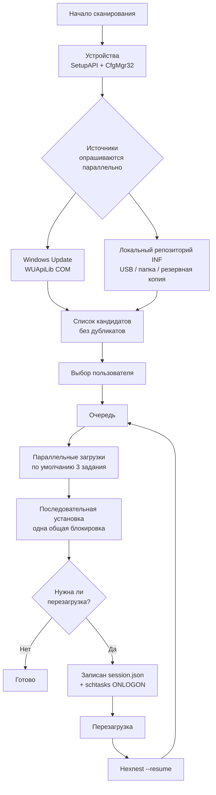

<div align="center">


# Hexnest

**Hexnest — бесплатная системная утилита с открытым исходным кодом для Windows и macOS:
обновление драйверов, системный монитор, сетевой монитор, менеджер автозапуска и очистка диска в одном окне.**

В Windows она сканирует каждое устройство, находит и устанавливает отсутствующие и устаревшие драйверы,
продолжает работу после нужных перезагрузок, создаёт резервную копию драйверов перед форматированием и
восстанавливает её потом вообще без интернета. На обеих платформах она показывает вживую, во что машине
и каждой программе на ней обходятся процессорное время, память и трафик, что запускается при входе и
куда уходит место на диске. В Windows без установщика, нигде без рекламного ПО.

<br>

[](https://github.com/ahmetcaglayan/Hexnest/releases/latest/download/Hexnest.exe)
[](https://github.com/ahmetcaglayan/Hexnest/releases/latest/download/Hexnest-arm64.dmg)

<sub>[🌐 Сайт проекта](https://ahmetcaglayan.github.io/Hexnest/) · [Intel Mac, Windows на ARM и все прошлые выпуски →](../../releases)</sub>

<br>

### Windows: без установщика. macOS: перетащите в «Программы».

`Windows 10 1607+ / 11` · `macOS 12 Monterey+` · `64-бит` · `Apple silicon и Intel`

**Ничего не нужно устанавливать заранее.** Обе сборки несут среду .NET 8 внутри себя:
ни загрузки .NET в Windows, ни Visual C++ Redistributable, ни Homebrew или Xcode на Mac.

<br>

[](LICENSE)
[](../../releases)
[](../../releases)
[](https://dotnet.microsoft.com/)
[](../../releases/latest)
[](../../releases)
[](../../stargazers)
[](../../actions/workflows/build.yml)

<sub>[🇬🇧 English](README.md) · [🇹🇷 Türkçe](README.tr.md) · 🇷🇺 Русский · [🇨🇳 简体中文](README.zh.md) · [🇮🇳 हिन्दी](README.hi.md) · [🇵🇹 Português](README.pt.md) · [🇯🇵 日本語](README.ja.md) · [🇩🇪 Deutsch](README.de.md) · [🇫🇷 Français](README.fr.md) · [🇰🇷 한국어](README.ko.md)</sub>

<br>


</div>

---

## 🖥️ Что где работает

Hexnest — один продукт с двумя окнами. Общий движок — мониторы, очистка, менеджер
автозапуска, настройки и журнал — это один и тот же код на обеих платформах. Драйверная половина работает
только в Windows, и не потому, что её ещё не написали: **в macOS нет стороннего хранилища драйверов,
которое можно было бы просканировать, обновить или сохранить.** Apple поставляет драйверы внутри
операционной системы, поэтому такому инструменту там просто нечего искать. Эти страницы поэтому
отсутствуют в сборке для Mac, а не присутствуют и вечно пусты.

| |  |  |
| --- | :---: | :---: |
| **Панель** и сводка оборудования | ✅ | ✅ |
| **Системный монитор** — процессор, по ядрам, память, накопители, батарея | ✅ | ✅ |
| **Процессор и память по приложениям** | ✅ | ✅ |
| **Сетевой монитор** — скорости, итоги, адаптеры, соединения | ✅ | ✅ |
| **Сетевой трафик по приложениям** | ✅ только TCP | ✅ через `nettop` |
| **Менеджер автозапуска** | ✅ ключи Run + папки | ✅ агенты launchd |
| **Очистка**, измеренная, а не оценённая | ✅ | ✅ |
| **Журнал, настройки, десять языков, тёмная/светлая тема** | ✅ | ✅ |
| **Температура процессора** | ✅ тепловые зоны ACPI | ❌ недоступна без root |
| **Скорость диска по томам** | ✅ | ❌ нет счётчика по томам |
| **Освобождение памяти** | ✅ | ❌ macOS вместо этого сжимает |
| **Сканирование устройств / отсутствующие драйверы** | ✅ | ❌ нет хранилища драйверов |
| **Каталог драйверов Windows Update** | ✅ | ❌ |
| **Офлайн-репозиторий INF** | ✅ | ❌ |
| **Резервная копия и восстановление драйверов** | ✅ | ❌ |
| **Очередь установки и продолжение после перезагрузки** | ✅ | ❌ |
| **Точка восстановления системы** | ✅ | ❌ это дело Time Machine |
| **Запуск от администратора / root** | ⚠️ обязателен | ✅ никогда — только домен пользователя |

❌ выше — это то, чего нет у платформы, а не то, что Hexnest пропустила. Каждый такой
случай объяснён в самом приложении, там, где он встречается.

---

## 🎯 Зачем это нужно

Вы только что переустановили Windows после форматирования. Диспетчер устройств полон жёлтых
восклицательных знаков, разрешение экрана неправильное, звука нет и — хуже всего — нет
интернета, потому что у сетевого адаптера тоже нет драйвера.

Hexnest решает это в одном окне:

- Показывает **все PnP-устройства** компьютера и сообщает, у каких из них нет драйвера.
- Находит отсутствующие и обновляемые драйверы в **каталоге Windows Update** или в
  **локальной папке на USB-накопителе**.
- Ставит их в очередь, загружает, устанавливает и **продолжает с того места, где
  остановился**, после каждой нужной перезагрузки.
- Экспортирует текущие драйверы **до** форматирования и восстанавливает их **после**,
  без всякого интернета.

Начиная с версии 1.1 программа отвечает ещё на два вопроса, ради которых обычно открывают
диспетчер задач:

- **Чем занят этот компьютер?** Загрузка процессора по каждому логическому ядру, разбивка
  использования памяти, все датчики температуры, которые предоставляет микропрограмма,
  накопители с реальной скоростью чтения и записи, батарея — и таблица всех запущенных
  программ с их долей процессора, рабочим набором, частной памятью и дисковым обменом.
- **Кто расходует моё подключение?** Входящий и исходящий трафик всего компьютера в реальном
  времени, итоги за текущий сеанс и с момента запуска Windows, все адаптеры — и таблица по
  приложениям, показывающая, какая программа что передаёт прямо сейчас.

Начиная с версии 1.2 программа отвечает ещё на два вопроса:

- **Что запускается вместе с Windows и нужно ли мне это?** Каждая запись автозагрузки с
  переключателем, а отключение сохраняет тот же параметр, что и диспетчер задач, поэтому
  ничего никогда не удаляется.
- **Что занимает место на диске?** Каждый кэш измерен, а не оценён приблизительно, ничего не
  отмечено за вас, а ваши собственные файлы вынесены отдельно и отправляются в Корзину.

Один файл, без установщика, без фоновой службы, без телеметрии.

---

## ✨ Возможности

| Возможность | Platform | Что делает |
| --- | --- | --- |
| 🔍 **Полное сканирование устройств** |  | Перечисляет все присутствующие PnP-устройства через SetupAPI + CfgMgr32. Без WMI, поэтому работает и на только что установленной системе, и на системе с повреждённым хранилищем WMI. |
| ⚠️ **Обнаружение отсутствующих драйверов** |  | Читает коды проблем диспетчера конфигурации: 28 (`CM_PROB_FAILED_INSTALL`), 1 и 19 означают «драйвера нет». 22 — устройство отключено, 14 — ожидает перезагрузки. |
| ☁️ **Каталог драйверов Windows Update** |  | Обращается к Microsoft Update через COM-интерфейс агента Windows Update (WUApiLib). Ни отдельной службы, ни отдельной загрузки, ни отдельной зависимости — `wuapi.dll` входит в состав Windows. |
| 💾 **Локальный / автономный репозиторий INF** |  | Разбирает пакеты `.inf` в папках и сопоставляет их по идентификатору оборудования. Источником может быть USB-накопитель, сетевая папка или резервная копия Hexnest. |
| ⚡ **Параллельные загрузки и последовательная установка** |  | Загрузки идут одновременно (по умолчанию 3, настраивается от 1 до 8). Установка выполняется по одной. Это не упрощение: при второй одновременной установке Windows Update возвращает `WU_E_OPERATIONINPROGRESS`, а подсистема PnP всё равно выстраивает установки в очередь. Делать вид, что это не так, значило бы получать мнимые ошибки. |
| 🔄 **Продолжение после перезагрузки** |  | Очередь записывается в `session.json` после каждого изменения состояния; задание `schtasks`, запускаемое при входе в систему (с запасным вариантом через `RunOnce` в HKLM), снова запускает Hexnest с ключом `--resume`, и работа продолжается ровно с того места, где прервалась. |
| 🛡️ **Точка восстановления системы** |  | Создаёт точку восстановления типа «драйвер» через `srclient.dll` перед первой установкой в сеансе. |
| ↩️ **Резервная копия перед обновлением** |  | Заменяемый пакет экспортируется непосредственно перед установкой, а путь к нему сохраняется в записи истории, чтобы его можно было восстановить, если что-то пойдёт не так. |
| 📦 **Копирование и восстановление драйверов** |  | Экспортирует все сторонние пакеты драйверов командой `pnputil /export-driver` в папку или ZIP и восстанавливает их командой `pnputil /add-driver ... /subdirs /install`. |
| 📊 **История обновлений** |  | Постоянная запись в виде одного объекта JSON на строку (`history.jsonl`), экспортируется в CSV одним нажатием. |
| 📄 **Отчёт об оборудовании** |  | Записывает все устройства и идентификаторы оборудования в обычный текстовый файл — его можно отнести на USB-накопителе к работающему компьютеру и найти драйверы вручную. |
| 🆙 **Встроенное обновление программы** |  | Загружает новый выпуск с GitHub, **проверяет его SHA-256** (и отказывается устанавливать, если в выпуске нет `checksums.txt`), затем заменяет исполняемый файл на месте. |
| 📈 **Монитор системы** |   | Общая загрузка процессора и загрузка по каждому логическому ядру (`NtQuerySystemInformation`), память вплоть до кэшированных и выделенных байтов (`GlobalMemoryStatusEx` + `GetPerformanceInfo`), тепловые зоны ACPI, скорость чтения и записи по каждому тому (`IOCTL_DISK_PERFORMANCE`) и состояние батареи. Пока страница не открыта, не снимается ни одно показание, и сбор прекращается, как только вы с неё уходите. |
| 🧮 **Потребление ресурсов по приложениям** |   | Доля процессора, рабочий набор, частная память, дисковый обмен и число потоков для каждого процесса, измеренные ровно так же, как их измеряет диспетчер задач: прирост собственного времени процесса в режиме ядра и пользователя между двумя замерами, делённый на прошедшее время и число логических процессоров. |
| 🌐 **Монитор сети** |   | Входящий и исходящий трафик всего компьютера по собственным счётчикам адаптеров, итоги за сеанс и с момента загрузки, число открытых подключений и все адаптеры с их адресом и согласованной скоростью подключения. |
| 🔎 **Сетевая активность по приложениям** |   | Какая программа что передаёт — по данным `GetExtendedTcpTable` и TCP ESTATS (`GetPerTcpConnectionEStats`). Только TCP: без драйвера режима ядра в Windows нет счётчика UDP по процессам, и страница прямо об этом сообщает, вместо того чтобы молча занижать цифры. |
| 🔁 **Автоматическая проверка обновлений** |  | Один запрос в сутки к API выпусков GitHub и счётчик у пункта *О программе*, когда вышла новая версия. Автоматическая загрузка и установка включаются по вашему выбору, проверяются по SHA-256 и применяются только при закрытии Hexnest — никогда посреди очереди. На macOS проверка выполняется вручную — *О программе* → *Проверить обновления* — и открывает загрузку, а не устанавливает её. |
| 🚀 **Управление автозагрузкой** |   | Все записи автозагрузки из разделов `Run` / `RunOnce` (HKCU, HKLM и 32-разрядное представление реестра) и обеих папок «Автозагрузка», у каждой — переключатель. При отключении сохраняется тот же параметр `StartupApproved`, что сохраняет и диспетчер задач, поэтому их состояния всегда совпадают, а исходная командная строка никогда не удаляется. Записи, указывающие на отсутствующий файл, помечаются. |
| 🧹 **Очистка** |   | Временные файлы, кэш эскизов и значков, кэш семи браузеров, кэш загрузок Windows Update, кэш «Оптимизации доставки», аварийные дампы, отчёты об ошибках, кэш шейдеров, журналы обслуживания и Корзина — каждый пункт **измерен, а не оценён приблизительно**, и **ничего не отмечено заранее**. |
| 🗂️ **Оставшиеся папки и старые загрузки** |   | Папки внутри AppData, которые не соответствуют ни одной установленной программе, ни одной запущенной программе и ничему в Program Files и к которым полгода никто не обращался; плюс архивы и установщики в папке «Загрузки» старше месяца. Перечисляются по отдельности и отправляются в **Корзину**, а не удаляются сразу и безвозвратно. |
| 🧠 **Сокращение рабочих наборов** |  | Выгружает рабочие наборы процессов на диск. Страница прямо сообщает, что это освобождает физическую память *сейчас* и ничего при этом не ускоряет, — то есть ровно обратное тому, что заявляет любая другая программа с такой кнопкой. |
| 🌍 **Десять языков интерфейса** |   | Английский, турецкий, русский, упрощённый китайский, хинди, португальский, японский, немецкий, французский и корейский — все внутри одного исполняемого файла. Переключаются мгновенно, не закрывая программу. |
| 🎨 **Тёмная и светлая темы** |   | Подменяется словарь палитры; применяется без повторного открытия окна. |

---

## 🚑 Восстановление после форматирования

Ради этого Hexnest и создавался.

### Замкнутый круг

После форматирования **у сетевого адаптера обычно тоже нет драйвера**. Чтобы загрузить
драйвер, нужен интернет, а чтобы выйти в интернет, нужен драйвер. Windows Update не поможет,
потому что до него не добраться.

Выход: **возьмите драйверы с собой ещё до форматирования.**

### ДО форматирования (5 минут)

1. Запустите Hexnest.
2. Откройте раздел **Копии и восстановление**.
3. Нажмите **Создать копию**. Экспортируются все сторонние пакеты драйверов системы.
   (Собственные встроенные драйверы Microsoft намеренно пропускаются — Windows устанавливает
   их сама, а с ними размер копии вырос бы втрое без всякой пользы.)
4. При желании отметьте **Сжать в ZIP**.
5. Скопируйте получившуюся папку **и `Hexnest.exe`** на один и тот же USB-накопитель.

> 💡 Необязательно: назовите папку с копией `Drivers` и держите её рядом с `Hexnest.exe`.
> Hexnest **автоматически** зарегистрирует её как локальный репозиторий драйверов —
> настраивать ничего не нужно.

### ПОСЛЕ форматирования

1. Подключите накопитель и запустите `Hexnest.exe` (программа запросит повышение прав).
   Если интернета нет, запустите её как `Hexnest.exe --rescue`: к Windows Update обращений
   не будет, используются только локальные источники.
2. **Копии и восстановление → Восстановить** (или **Восстановить из папки**) и выберите свою
   копию. Все пакеты добавляются в хранилище драйверов и привязываются к своим устройствам.
3. Как только сетевой адаптер заработает, нажмите **Сканировать**.
4. **Обзор → Восстановление после форматирования** ставит в очередь всё, чего ещё не хватает,
   из Windows Update.
5. Согласитесь на перезагрузку, когда её попросят, — Hexnest вернётся при входе в систему и
   доделает остаток очереди.

> ℹ️ Папка не обязана быть резервной копией Hexnest. С командой **Восстановить из папки**
> подойдёт любая папка с драйверами производителя, которую вы скачали и распаковали; файлы
> `.inf` в ней находятся рекурсивно.

### Командная строка

```powershell
Hexnest.exe                 # normal launch
Hexnest.exe --rescue        # offline rescue mode (same as --offline)
Hexnest.exe --resume        # continue an interrupted queue straight away
```

---

## 📸 Снимки экрана

Настоящие снимки выпускаемой сборки. Они создаются самой программой — см.
[Как пересоздать снимки](#как-пересоздать-снимки) — поэтому не могут устареть.

### 

<table>
<tr>
<td width="50%"><br><sub><b>Монитор системы</b> — процессор, память, температура и диски в виде графиков в реальном времени, по столбцу на логический процессор.</sub></td>
<td width="50%"><br><sub><b>Монитор сети</b> — входящий и исходящий трафик всего компьютера, итоги за сеанс, все адаптеры.</sub></td>
</tr>
<tr>
<td width="50%"><br><sub><b>Потребление по программам</b> — процессор, память, диск и потоки для каждого запущенного процесса.</sub></td>
<td width="50%"><br><sub><b>Трафик по программам</b> — какая программа расходует подключение и насколько.</sub></td>
</tr>
<tr>
<td width="50%"><br><sub><b>Устройства</b> — все PnP-устройства по классам, с актуальными кодами проблем.</sub></td>
<td width="50%"><br><sub><b>Обновления</b> — устанавливаемые пакеты из Windows Update и локальных папок INF.</sub></td>
</tr>
<tr>
<td width="50%"><br><sub><b>Активность</b> — текущая очередь со скоростью и этапом установки по каждому драйверу.</sub></td>
<td width="50%"><br><sub><b>Копии и восстановление</b> — экспорт всех сторонних драйверов и восстановление без сети.</sub></td>
</tr>
<tr>
<td width="50%"><br><sub><b>Автозагрузка</b> — переключатель у каждой записи; отключение сохраняет тот же параметр, что и диспетчер задач.</sub></td>
<td width="50%"><br><sub><b>Очистка</b> — измерено, а не оценено приблизительно, и ничего не отмечено за вас.</sub></td>
</tr>
<tr>
<td width="50%"><br><sub><b>Параметры</b> — одновременные загрузки, защита, автоматические обновления, тема и язык.</sub></td>
<td width="50%"><br><sub><b>О программе</b> — сведения о версии и встроенное обновление.</sub></td>
</tr>
</table>

### 

<table>
<tr>
<td width="50%"><br><sub><b>Панель</b> — что Mac делает сейчас и что он такое: чип, графика, память, диск.</sub></td>
<td width="50%"><br><sub><b>Системный монитор</b> — столбик на ядро, включая кластеры P и E на Apple silicon.</sub></td>
</tr>
<tr>
<td width="50%"><br><sub><b>Сетевой монитор</b> — трафик по приложениям из того же источника, что и «Мониторинг системы».</sub></td>
<td width="50%"><br><sub><b>Автозапуск</b> — переключатель для агентов launchd; системные задания показаны, но не изменяются.</sub></td>
</tr>
<tr>
<td width="50%"><br><sub><b>Очистка</b> — кеши, Xcode derived data, копии iPhone. Измерено, и ничего не отмечено.</sub></td>
<td width="50%"><br><sub><b>Настройки</b> — те же параметры плюс тема, следующая за macOS на рассвете и закате.</sub></td>
</tr>
<tr>
<td width="50%"><br><sub><b>Журнал</b> — живая диагностика, один клик в буфер обмена для сообщения об ошибке.</sub></td>
<td width="50%"><br><sub><b>О программе</b> — версия, машина и проверка обновлений, открывающая загрузку.</sub></td>
</tr>
</table>

### Как пересоздать снимки

Каждое изображение выше создаёт сама программа, поэтому изменение интерфейса можно
отразить в документации одной командой:

```powershell
# Windows, из командной строки с правами администратора, после сборки
.\Hexnest.exe --capture .\assets\screenshots --lang en
```

```bash
# macOS, после ./build/make-mac-app.sh
./artifacts/mac/arm64/Hexnest.app/Contents/MacOS/Hexnest --capture ./shots --lang en
```

Обе обходят всё меню, ждут, пока живые страницы наполнят графики, и записывают по одному
PNG на страницу. `--lang` фиксирует язык интерфейса, поэтому опубликованные изображения не зависят от
языка того, кто их пересоздал.

> Зачем встроенный снимок? В Windows Hexnest работает с повышенными правами, а изоляция
> привилегий пользовательского интерфейса не даёт (непривилегированному) «Ножницам» видеть ввод,
> адресованный окну с более высокой целостностью — Print Screen над Hexnest, «Диспетчером задач» или
> «Редактором реестра» не делает ничего. В macOS снимок экрана потребовал бы разрешения на запись экрана
> и заснял бы всё остальное на рабочем столе. Обе сборки вместо этого рисуют собственное дерево.

---

## 🧭 Разделы

| Раздел | Platform | Что делает |
| --- | --- | --- |
| **Обзор** |   | Число устройств, отсутствующие драйверы, доступные обновления, проблемные устройства. Сводка по ОС, компьютеру, процессору и BIOS. Быстрые действия: *Сканировать*, *Восстановление после форматирования*, *Обновить все*, *Резервная копия драйверов*, *Отчёт об оборудовании*. Когда ни у одного сетевого адаптера нет рабочего драйвера, появляется предупреждение. |
| **Устройства** |  | Все PnP-устройства, сгруппированные по классам. Фильтры: *Все / Проблемы / Без драйвера / Стандартный драйвер*. Поиск по имени, производителю, версии и ИД оборудования; копирование ИД оборудования в буфер обмена. |
| **Обновления** |  | Пакеты, доступные для установки: и отсутствующие драйверы, и обновления версий. Выбор по строкам, *Выбрать все / Снять выбор*, общий объём выбранного, *Установить выбранные*. Отдельное обновление можно скрыть, а устройство — вовсе пропускать. |
| **Активность** |  | Текущая очередь. Процент загрузки, скорость, переданные байты и этап установки показаны отдельно для каждого задания. *Отменить все*, *Повторить неудачные*, *Перезагрузить* / *Позже*. Если сеанс был прерван, здесь появляется кнопка *Продолжить*. |
| **Копии и восстановление** |  | *Создать копию* (при желании в ZIP), список имеющихся копий (число пакетов, размер, дата), *Восстановить*, *Восстановить из папки*, *Открыть*, *Удалить*. |
| **История** |  | Постоянная запись обо всех операциях с драйверами. Фильтр по результату, поиск, *Экспорт в CSV*, *Очистить историю*. Если копия, созданная перед обновлением, ещё существует, её папку можно открыть. |
| **Монитор системы** |   | Общая загрузка процессора и загрузка по каждому логическому ядру, память с разбивкой на используется / доступно / кэшировано / выделено, датчики температуры, если компьютер их предоставляет, ёмкость накопителей с текущей скоростью чтения и записи, батарея. Ниже — все запущенные процессы с долей процессора, рабочим набором, частной памятью, дисковым обменом и числом потоков: с сортировкой по процессору, памяти, диску или имени, с поиском и с паузой, чтобы строку и правда можно было прочитать. |
| **Монитор сети** |   | Входящий и исходящий трафик всего компьютера в реальном времени в виде графиков, итог за текущий сеанс и с момента запуска Windows, число открытых подключений и все адаптеры с их типом, адресом и скоростью подключения. Ниже — таблица по приложениям: скорость приёма и передачи, итоги за сеанс, открытые подключения и удалённый узел. |
| **Автозагрузка** |   | Все записи автозагрузки, которые Hexnest может безопасно переключать: имя программы из ресурса версии исполняемого файла, издатель, командная строка, размер и место запуска. У каждой строки переключатель; при отключении сохраняется тот же параметр, что и у диспетчера задач, и ничего не удаляется. Записи, указывающие на файл, которого больше нет, помечаются; программы защиты выделены, и перед их отключением Hexnest спрашивает подтверждение; есть фильтры включённых, отключённых и нерабочих записей, а также поиск. |
| **Очистка** |   | Измеренные размеры временных файлов, кэша эскизов и значков, семи браузеров, кэша загрузок Windows Update, кэша «Оптимизации доставки», аварийных дампов, отчётов об ошибках, кэша шейдеров, журналов Windows, собственного кэша Hexnest и Корзины. Ничего не отмечено заранее. Старые загрузки и оставшиеся папки AppData перечисляются по отдельности и отправляются в Корзину. Плюс освобождение памяти, о котором честно сказано, что именно оно делает. |
| **Журнал** |   | Диагностика в реальном времени. *Копировать всё* помещает журнал в буфер обмена вместе с заголовком, где указаны версия, ОС и компьютер, — ровно то, что нужно для сообщения о проблеме. Файл журнала или его папку можно открыть, а сам журнал очистить. |
| **Параметры** |   | Число одновременных загрузок, число повторных попыток, сканирование при запуске, точка восстановления, копия перед обновлением, продолжение после перезагрузки, автоматическая перезагрузка и её задержка, автономный режим, необязательные драйверы, локальные папки с драйверами, срок хранения истории, **автоматическая проверка обновлений, автоматическая установка и предварительные выпуски**, тема, язык. |
| **О программе** |   | Сведения о версии, *Проверить обновления*, *Загрузить и установить*, список изменений, ссылки на страницу проекта и на раздел с проблемами. |

Боковая панель сборки для Mac — это восемь строк выше, отмеченных macOS, именно в этом
порядке. *Устройства*, *Обновления*, *Активность*, *Резервные копии* и *История* там не пусты, а
отсутствуют.

---

## ⚙️ Как это работает



Коротко:

1. **Сканирование.** `SetupDiGetClassDevs(DIGCF_PRESENT | DIGCF_ALLCLASSES)` перечисляет все
   физически присутствующие устройства; `CM_Get_DevNode_Status` даёт код проблемы, а
   `HKLM\SYSTEM\CurrentControlSet\Control\Class\<DriverKey>` — версию, дату и поставщика
   установленного драйвера.
2. **Источники.** Windows Update и локальный репозиторий INF опрашиваются одновременно.
   Источник, который не ответил, превращается в строку предупреждения, но никогда — в
   прерванное сканирование.
3. **Устранение дубликатов.** Когда один и тот же пакет предлагают оба источника,
   **побеждает локальная копия** — она уже на диске и не требует сети. Если Windows Update
   предлагает версию старее установленной, такой кандидат отбрасывается.
4. **Очередь.** Загрузки идут под `SemaphoreSlim(MaxParallelJobs)`, установки — под одной
   общей блокировкой. Неудавшееся задание по умолчанию повторяется дважды.
5. **Продолжение.** Каждое изменение состояния атомарно записывается в `session.json`. Когда
   нужна перезагрузка, очередь откладывается, а задание, срабатывающее при входе в систему,
   возвращает Hexnest с ключом `--resume`. Сеанс переживает не более 10 перезагрузок, после
   чего прекращается — это предохранительный клапан.

---

## 🔨 Сборка из исходного кода

Не нужно, если вам нужна сама программа: **скачайте exe, дважды щёлкните, готово.**
Исходный код лежит в отдельной папке и никому не мешает.

```
Hexnest/
├── src/                    source code (C#, .NET 8, WPF)
│   ├── Hexnest.Core/       UI-free core: scanning, providers, job engine
│   ├── Hexnest.App/        WPF desktop application (Hexnest.exe)
│   ├── Hexnest.Mac/        приложение Avalonia для macOS (Hexnest.app)
│   └── Hexnest.Cli/        (reserved) placeholder for a headless front end
├── docs/                   documentation
├── build/                  build scripts
├── assets/                 logo and screenshots
└── .github/workflows/      CI
```

Если совсем коротко:

```powershell
dotnet publish src/Hexnest.App/Hexnest.App.csproj -c Release -r win-x64 -o publish
```

А на Mac — она собирает `artifacts/mac/arm64/Hexnest.app`:

```bash
./build/make-mac-app.sh --arch arm64
```

Добавьте `--dmg`, чтобы получить образ диска, который публикуется в выпуске. Скрипту не нужно ничего, кроме .NET 8 SDK: он пишет `Info.plist`, собирает `.icns` из `assets/icon-mac-1024.png` и подписывает бандл ad-hoc, чтобы Apple silicon его запустил.


Подробности, сборка arm64 и объяснение COM-ссылки на WUApiLib:
**[docs/BUILD.md](docs/BUILD.md)**

Архитектура, абстракция `IDriverProvider` и как добавить новый источник драйверов:
**[docs/ARCHITECTURE.md](docs/ARCHITECTURE.md)**

---

## 🔐 Безопасность и конфиденциальность

- **Телеметрии нет.** С компьютера не уходят ни данные об использовании, ни идентификаторы
  устройств, ни статистика.
- Наружу отправляются ровно **две** вещи:
  1. **Запросы к Windows Update** — напрямую в Microsoft, через собственный агент Windows
     Update. (Никогда в автономном режиме и при запуске с `--rescue`.)
  2. **Запрос к API выпусков GitHub** — только когда вы нажимаете *Проверить обновления*.
- **Почему нужны права администратора?** Установка драйвера — привилегированная операция:
  `pnputil`, установщику Windows Update и защите системы нужен маркер с повышенными правами.
  Hexnest запрашивает его сразу, в манифесте приложения (`requireAdministrator`), вместо того
  чтобы останавливаться на середине очереди.
- **Страховка:** точка восстановления системы перед первой установкой в сеансе и резервная
  копия каждого пакета драйверов, который программа заменяет.
- **Встроенное обновление** сверяет загруженный файл с SHA-256 из `checksums.txt` выпуска;
  если контрольной суммы нет или она не совпала, файл удаляется, а обновление отклоняется.
- Все данные хранятся в `%ProgramData%\Hexnest`: `settings.json`, `session.json`,
  `history.jsonl`, `logs/`, `backups/`, `cache/`, `reports/`.

Сообщения об уязвимостях: **[SECURITY.md](SECURITY.md)**

---

## ❓ Частые вопросы

### Hexnest бесплатный?

Да. Hexnest выпущен по лицензии MIT, и весь исходный код лежит в этом репозитории. Нет ни платной
версии, ни пробного периода, ни возможностей, которые открываются после оплаты, ни рекламы, ни
постороннего ПО в комплекте. Сканирование и установка — одна и та же программа.

### Нужно ли устанавливать .NET?

Нет. Вся среда выполнения .NET 8 находится внутри `Hexnest.exe` (автономная сборка в один файл), а
WPF несёт с собой собственные `vcruntime140_cor3.dll` / `msvcp140_cor3.dll`. Visual C++
Redistributable тоже не нужен. Единственное требование — 64-разрядная Windows 10 версии 1607
(сборка 14393) или новее.

### Обновляет ли Hexnest драйверы на Mac?

Нет, и ничто другое тоже. В macOS нет стороннего хранилища драйверов: Apple поставляет поддержку
устройств внутри операционной системы и обновляет её вместе с ОС. Такому инструменту там нечего
сканировать, скачивать или сохранять, поэтому в сборке для Mac вообще нет страниц *Устройства*,
*Обновления*, *Активность*, *Резервные копии* и *История* — вместо пяти страниц, которые никогда
ничем бы не наполнились. Всё остальное, что делает Hexnest, там работает.

### Какой нужен Mac?

macOS 12 Monterey или новее, на Apple silicon или Intel. Две сборки публикуются отдельно
(`Hexnest-arm64.dmg` и `Hexnest-x64.dmg`), а не одним универсальным двоичным файлом: каждая несёт
собственную копию среды .NET, и их объединение удвоило бы загрузку для всех ради одного решения на
странице загрузки.

### macOS пишет, что «не удаётся открыть, так как разработчик не может быть проверен»

Выпуски подписаны ad-hoc, но не нотаризованы: нотаризация требует платной учётной записи Apple
Developer. Щёлкните по Hexnest в «Программах» правой кнопкой (или с Control) и выберите **Открыть** —
macOS спросит один раз и запомнит ответ. К каждому выпуску прилагается `checksums.txt`, по которому
загрузку можно проверить заранее.

### Почему Hexnest для Mac никогда не спрашивает пароль?

Потому что он ему не нужен. Мониторы читают открытую статистику, очистка работает внутри вашей
домашней папки, а менеджер автозапуска меняет ваши собственные агенты входа через `launchctl`.
Системные задания launchd показаны, но помечены как доступные только для чтения. Программа, которая
просит пароль администратора, чтобы показать вам график, просит куда больше доверия, чем ей нужно.

### Почему SmartScreen или антивирус предупреждают о программе?

Потому что `Hexnest.exe` **не подписан цифровой подписью** — сертификаты стоят денег. SmartScreen и
Smart App Control предупреждают о любом неподписанном исполняемом файле, который ещё не заработал
репутацию, а программа, которая запускается от имени администратора, устанавливает драйверы и
регистрирует задание в планировщике, для эвристического анализатора выглядит как вредоносная.
Честный выход — проверить файл самостоятельно: сравните вывод команды
`Get-FileHash .\Hexnest.exe -Algorithm SHA256` с соответствующей строкой в `checksums.txt`
выпуска.

### Можно ли установить драйверы после форматирования без интернета?

Да — ради этого Hexnest и сделан. Создайте резервную копию драйверов до форматирования, положите
копию и `Hexnest.exe` на один USB-накопитель, а потом запустите `Hexnest.exe --rescue` и нажмите
**Восстановить**. Папка с именем `Drivers` рядом с `Hexnest.exe` автоматически регистрируется как
локальный репозиторий драйверов; подойдёт и любая папка производителя, которую вы распаковали сами.

### Можно ли откатить драйвер?

Да, тремя способами: из копии, которую Hexnest создаёт непосредственно перед каждой установкой
(**Восстановить из папки**), из точки восстановления системы, созданной перед первой установкой в
сеансе (`rstrui.exe`), или кнопкой Windows *Откатить* в диспетчере устройств. Именно поэтому
параметр создания точки восстановления лучше не выключать.

### Программа действительно продолжает работу после перезагрузки?

Да. Состояние очереди атомарно записывается в `session.json` при каждом изменении, а задание
планировщика `Hexnest\ResumeSession`, срабатывающее при входе в систему (с запасным вариантом через
`RunOnce` в HKLM), возвращает Hexnest с ключом `--resume`. Сеанс переживает не более 10
перезагрузок; когда очередь завершается, задание и параметр реестра удаляются.

### Удаляется ли что-нибудь при отключении программы из автозагрузки?

Нет. Windows хранит признак «включено» в отдельном разделе —
`...\CurrentVersion\Explorer\StartupApproved\Run` и двух соседних с ним, — и это
единственное, что записывает Hexnest. Параметр в `Run` или ярлык в папке «Автозагрузка»
остаётся ровно там, где был, поэтому обратное включение записи восстанавливает исходную
командную строку байт в байт.

Из этого же следует, что диспетчер задач и Hexnest согласуются друг с другом: отключите
что-нибудь в одном — другой покажет это как отключённое. И если вы потом удалите Hexnest,
компьютер не останется без половины своих программ автозагрузки, потому что ни одна из них
никуда не исчезала.

### Безопасна ли очистка?

Она так и сделана, и вместо того чтобы просить поверить на слово, прямо объясняет как:

- **Ничего не отмечено заранее.** Страница открывается с нулевым итогом.
- Каждый путь берётся из API известных папок, а не из строки. Ничего за пределами собственных
  корневых папок категории не затрагивается, а каждое отдельное удаление ещё раз сверяется с
  этими папками непосредственно перед выполнением.
- По точкам повторного анализа программа никогда не переходит. В `%LOCALAPPDATA%` полно точек
  соединения, и переход внутрь одной из них — это ровно тот путь, которым функция «очистки
  кэша» доходит до удаления чьих-то документов.
- Открытые файлы пропускаются, а не удаляются принудительно. Число пропущенных файлов
  сообщается.
- Ваши собственные файлы — старые загрузки, оставшиеся папки — никогда не отмечаются скопом.
  Они перечисляются по одному, с указанием размера и давности, и отправляются в **Корзину**.

Определение оставшихся папок — единственное место, где Hexnest предполагает, а не знает, и в
строке так и написано: «Это предположение, а не факт».

### Действительно ли «освободить память» что-то даёт?

Эта кнопка освобождает физическую память прямо сейчас, и это всё, что она делает.

Для каждого процесса вызывается `EmptyWorkingSet` — этот вызов просит Windows выгрузить
рабочий набор процесса в файл подкачки. Объём используемой памяти действительно уменьшается.
Но эти страницы никуда не исчезли — они на диске, и как только программа снова обращается к
этой памяти, Windows считывает их обратно, а это медленнее, чем если бы их не трогали.
Неиспользуемая память — не потерянная память; Windows и так держала её доступной.

Значит, это не средство ускорения, и Hexnest не выдаёт её за таковое. По-настоящему полезна
она непосредственно перед запуском того, чему сразу нужен большой объём памяти, или чтобы
увидеть, сколько на самом деле удерживает программа с утечкой. Любая другая программа с такой
кнопкой утверждает обратное.

### Почему на плитке температуры написано, что датчика нет?

Потому что на этом компьютере нет датчика, который Windows может прочитать. Единственная
температура, которую Windows отдаёт без драйвера, — это тепловая зона ACPI, объявленная
микропрограммой для собственного управления вентилятором
(`root\WMI:MSAcpi_ThermalZoneTemperature`), а очень многие материнские платы настольных
компьютеров не объявляют её вовсе. Температура отдельных ядер и видеокарты снимается с
микросхемы датчиков производителя по шине SMBus, а для этого нужен подписанный драйвер режима
ядра — именно его и устанавливают HWiNFO и Open Hardware Monitor. Hexnest не станет
устанавливать драйвер режима ядра ради одного числа, поэтому он сообщает, что датчика нет,
вместо того чтобы выдумать правдоподобные 45 °C.

### Почему трафик по программам не сходится с общим трафиком компьютера?

Потому что это два разных измерения, и оба верны.

Общий показатель — это сумма собственных счётчиков байтов сетевых адаптеров, поэтому он
охватывает всё: TCP, UDP, QUIC, широковещательный трафик. Показатель по приложениям берётся
из TCP ESTATS (RFC 4898) через `GetPerTcpConnectionEStats` — это единственный счётчик байтов
по процессам, который Windows предоставляет без драйвера режима ядра, и он охватывает только
TCP. Поэтому видеозвонки, значительная часть игрового трафика и DNS попадают в первое число,
но не во второе. Страница прямо об этом сообщает, вместо того чтобы молча занижать цифры.

Чтобы включить ESTATS, нужен маркер с повышенными правами. У Hexnest он есть всегда; если в
нём когда-нибудь откажут, таблица переходит на подсчёт подключений по процессам и объясняет
почему.

### Обновляется ли Hexnest сам в фоновом режиме?

Он раз в сутки **проверяет** наличие обновления и сообщает об этом у пункта меню
*О программе*. Ничего не загружается и не устанавливается, пока вы не включите это в разделе
**Параметры → Обновления**, да и тогда:

- загруженный файл сверяется с `checksums.txt` выпуска, прежде чем ему начинают доверять;
- замена происходит при **закрытии** Hexnest, никогда во время работы очереди драйверов;
- в автономном режиме и в режиме восстановления и проверка, и установка пропускаются
  полностью.

Проверку можно отключить совсем; кнопка *Проверить обновления* при этом продолжает работать.

### Мониторинг — это фоновая служба?

Нет. Ни один из мониторов ничего не измеряет, пока вы не откроете его страницу, и оба
останавливаются, как только вы с неё уходите. Hexnest по-прежнему не устанавливает ни службу,
ни драйвер, ни элемент автозагрузки — единственное, что он вообще регистрирует, это задание
при входе в систему, которое продолжает прерванную очередь драйверов, и оно удаляется само,
когда очередь завершается.

### Собирает ли Hexnest какие-нибудь данные?

Нет. Ни телеметрии, ни статистики использования, ни идентификаторов устройств. С компьютера
уходят ровно две вещи: запросы к Windows Update, которые идут напрямую в Microsoft через
собственный агент Windows и никогда не выполняются в автономном режиме, и один запрос к API
выпусков GitHub, когда вы нажимаете *Проверить обновления*.

---

«Почему exe такой большой?», «Почему не используется WMI?», «Работает ли программа на
Windows Server?» и остальные вопросы:

**[docs/FAQ.md](docs/FAQ.md)** · Руководство пользователя (на турецком):
**[docs/USAGE.md](docs/USAGE.md)** ·
Сайт проекта: **[ahmetcaglayan.github.io/Hexnest](https://ahmetcaglayan.github.io/Hexnest/)**

---

## 🤝 Участие в проекте

Участие приветствуется.

- **Сообщения об ошибках:** [Issues](../../issues) — приложите, пожалуйста, журнал,
  скопированный кнопкой *Копировать всё* в разделе **Журнал**: в нём уже есть заголовок с
  версией и сведениями об ОС.
- **Код:** сделайте форк, создайте ветку, откройте pull request. Придерживайтесь сложившегося
  стиля: без зависимостей NuGet (размер одного файла и работа без сети — сознательный выбор) и
  без кода интерфейса внутри `Hexnest.Core`.
- **Перевод:** чтобы добавить язык, нужно положить один файл JSON в
  `src/Hexnest.Core/Languages/`, который `build/check-languages.py` сверяет с
  английским; см. [docs/ARCHITECTURE.md](docs/ARCHITECTURE.md).

---

## 📄 Лицензия

MIT — см. [LICENSE](LICENSE).

---

## ⚠️ Отказ от ответственности

Установка драйверов всегда связана с риском. Неподходящий или повреждённый драйвер может
привести к неполадкам вплоть до того, что компьютер перестанет загружаться. Hexnest снижает
этот риск, создавая точку восстановления системы и копии заменяемых драйверов, но никаких
гарантий не даёт.

**Не отключайте создание точки восстановления.** Храните резервные копии всего, что вам
дорого. Программа предоставляется «как есть»; ответственность за последствия её использования
несёт пользователь.

---

## Ключевые слова

<sub>
обновление драйверов windows с открытым исходным кодом · бесплатное обновление драйверов без рекламы · установка драйверов после форматирования ·
автономная установка драйверов с usb · резервное копирование и восстановление драйверов windows · поиск отсутствующих драйверов ·
сканер драйверов windows 11 · экспорт драйверов pnputil · программа для каталога драйверов windows update, бесплатный монитор системы windows, монитор температуры процессора и памяти, расход трафика по приложениям windows, монитор трафика по программам, замена диспетчера задач с открытым исходным кодом ·
жёлтый восклицательный знак в диспетчере устройств
</sub>
