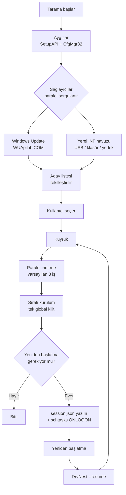

<div align="center">


# DrvNest

**DrvNest, Windows 10 ve 11 için ücretsiz ve açık kaynak bir sürücü güncelleme, sistem izleme ve ağ izleme programıdır.**
Sistemdeki tüm aygıtları tarar, eksik ve eski sürücüleri bulup kurar, gereken yeniden
başlatmalardan sonra kaldığı yerden devam eder, format öncesinde sürücülerinizi yedekler ve
format sonrasında hiç internet olmadan geri yükler — ayrıca bu bilgisayarın ve üzerindeki her
programın işlemci, bellek ve bant genişliği kullanımını canlı olarak gösterir. Tek dosya,
kurulum yok, reklam yok.

<br>

[](https://github.com/ahmetcaglayan/DrvNest/releases/latest/download/DrvNest.exe)

<sub>[🌐 Proje sayfası](https://ahmetcaglayan.github.io/DrvNest/tr/) · [Tüm sürümler ve arm64 yapısı →](../../releases)</sub>

<br>

### Kurulum gerekmez. İndir, çift tıkla, çalışır.

`Windows 10 1607+ / Windows 11` · `64-bit` · `Yönetici yetkisi gerekir`

**.NET kurulumu gerekmez. Visual C++ Redistributable gerekmez.**
Her şey exe'nin içinde: .NET 8 çalışma zamanı self-contained ve tek dosya olarak paketlenir,
WPF de kendi `vcruntime140_cor3.dll` / `msvcp140_cor3.dll` kopyalarını beraberinde taşır.

<br>

[](LICENSE)
[](../../releases)
[](https://dotnet.microsoft.com/)
[](../../releases/latest)
[](../../releases)
[](../../stargazers)
[](../../actions/workflows/build.yml)

<sub>[🇬🇧 English](README.md) · 🇹🇷 Türkçe · [🇷🇺 Русский](README.ru.md) · [🇨🇳 简体中文](README.zh.md) · [🇮🇳 हिन्दी](README.hi.md)</sub>

<br>


</div>

---

## 🎯 Bu ne işe yarar?

Windows'u formatladınız. Aygıt Yöneticisi sarı ünlem işaretleriyle dolu, ekran çözünürlüğü
yanlış, ses yok ve — en kötüsü — ağ bağdaştırıcısının da sürücüsü olmadığı için internet yok.

DrvNest bu tabloyu tek bir pencereden çözer:

- Sistemdeki **tüm PnP aygıtlarını** listeler ve hangisinin sürücüsü olmadığını söyler.
- Eksik ve güncellenebilir sürücüleri **Windows Update kataloğundan** ya da
  **USB bellekteki yerel bir klasörden** bulur.
- Hepsini bir kuyruğa alır, indirir, kurar; gereken her yeniden başlatmadan sonra
  **kaldığı yerden devam eder**.
- Format **öncesinde** mevcut sürücülerinizi dışa aktarır; format **sonrasında**
  internet olmadan geri yükler.

1.1 sürümünden beri, insanların Görev Yöneticisi'ni açma sebebi olan iki soruyu da yanıtlıyor:

- **Bu bilgisayar ne yapıyor?** Mantıksal çekirdek başına işlemci yükü, bellek dağılımı,
  ürün yazılımının yayınladığı tüm sıcaklık sensörleri, gerçek okuma/yazma hızıyla depolama,
  pil — ve çalışan her programı işlemci payı, bellek kullanımı, özel baytları ve disk hızıyla
  birlikte listeleyen bir tablo.
- **Bağlantımı kim kullanıyor?** Tüm bilgisayar için canlı indirme ve yükleme, bu oturumun ve
  Windows açıldığından beri olan toplamlar, tüm ağ bağdaştırıcıları — ve hangi programın şu
  anda ne aktardığını gösteren, uygulama bazında bir tablo.

Tek dosya, kurulum yok, arka planda çalışan servis yok, telemetri yok.

---

## ✨ Öne çıkan özellikler

| Özellik | Ne yapar |
| --- | --- |
| 🔍 **Tam aygıt taraması** | Sistemdeki tüm PnP aygıtlarını SetupAPI + CfgMgr32 ile sayar. WMI kullanmaz, bu yüzden WMI deposu bozuk ya da yeni kurulmuş bir makinede de çalışır. |
| ⚠️ **Eksik sürücü tespiti** | Configuration Manager sorun kodlarını okur; 28 (`CM_PROB_FAILED_INSTALL`), 1 ve 19 "sürücü yok" olarak işaretlenir. 22 devre dışı, 14 yeniden başlatma bekliyor demektir. |
| ☁️ **Windows Update sürücü kataloğu** | Windows Update Agent COM API'si (WUApiLib) üzerinden Microsoft Update'e bağlanır. Ek servis, ek indirme, ek bağımlılık yok — `wuapi.dll` zaten her Windows'ta var. |
| 💾 **Yerel / çevrimdışı INF havuzu** | Klasörlerdeki `.inf` paketlerini ayrıştırır ve donanım kimliğine göre eşleştirir. USB bellek, ağ paylaşımı ya da bir DrvNest yedeği kaynak olabilir. |
| ⚡ **Paralel indirme + sıralı kurulum** | İndirmeler aynı anda (varsayılan 3, ayarlanabilir 1–8). Kurulumlar tek tek. Bu bir eksiklik değil: Windows Update ikinci bir kuruluma `WU_E_OPERATIONINPROGRESS` döner ve PnP alt sistemi zaten sıraya sokar. Aynı anda kurmaya çalışmak sadece sahte hatalar üretir. |
| 🔄 **Yeniden başlatma sonrası devam** | Kuyruk her adımda `session.json` dosyasına yazılır; `schtasks` ile oturum açılışına bağlı bir görev (yedeği HKLM `RunOnce`) DrvNest'i `--resume` ile geri getirir ve kaldığı yerden devam eder. |
| 🛡️ **Sistem geri yükleme noktası** | Oturumdaki ilk kurulumdan önce `srclient.dll` ile sürücü tipinde bir geri yükleme noktası oluşturur. |
| ↩️ **Güncelleme öncesi yedek** | Değiştirilecek sürücü paketi kurulumdan hemen önce dışa aktarılır; yolu geçmiş kaydına yazılır, böylece bir şey ters giderse o klasörden geri yüklenebilir. |
| 📦 **Sürücü yedekleme / geri yükleme** | `pnputil /export-driver` ile tüm üçüncü parti sürücüleri klasöre veya ZIP'e aktarır; `pnputil /add-driver ... /subdirs /install` ile geri yükler. |
| 📊 **Güncelleme geçmişi** | Kalıcı kayıt, satır başına bir JSON nesnesi (`history.jsonl`) olarak tutulur; tek tıkla CSV'ye aktarılır. |
| 📄 **Donanım raporu** | Tüm aygıtları ve donanım kimliklerini düz metin dosyasına yazar. USB bellekle çalışan bir bilgisayara taşıyıp sürücüleri elle arayabilirsiniz. |
| 🆙 **Kendi kendini güncelleme** | GitHub'dan yeni sürümü indirir, **SHA-256 doğrulaması** yapar (sürüm `checksums.txt` yayımlamamışsa kurulumu reddeder) ve exe'yi yerinde değiştirir. |
| 📈 **Sistem izleme** | Genel ve mantıksal çekirdek başına işlemci yükü (`NtQuerySystemInformation`), önbellek ve ayrılmış bayta kadar inen bellek dağılımı (`GlobalMemoryStatusEx` + `GetPerformanceInfo`), ACPI termal bölgeleri, birim başına okuma/yazma hızı (`IOCTL_DISK_PERFORMANCE`) ve pil durumu. Sayfa açılana kadar hiçbir örnekleme yapılmaz; sayfadan çıktığınız anda da durur. |
| 🧮 **Uygulama bazında kaynak kullanımı** | Her işlem için işlemci payı, bellek kullanımı, özel baytlar, disk hızı ve iş parçacığı sayısı; tam olarak Görev Yöneticisi'nin ölçtüğü yöntemle: işlemin iki örnekleme arasındaki kendi çekirdek + kullanıcı süresi farkı, geçen süreye ve mantıksal işlemci sayısına bölünür. |
| 🌐 **Ağ izleme** | Bağdaştırıcıların kendi sayaçlarından tüm bilgisayarın indirme ve yüklemesi, oturum ve açılıştan beri toplamları, açık bağlantı sayısı ve adresiyle, anlaşılan bağlantı hızıyla birlikte tüm bağdaştırıcılar. |
| 🔎 **Uygulama bazında ağ kullanımı** | Hangi programın ne aktardığı; `GetExtendedTcpTable` ve TCP ESTATS (`GetPerTcpConnectionEStats`) üzerinden. Yalnızca TCP — Windows, çekirdek sürücüsü olmadan işlem başına UDP sayacı sunmaz ve sayfa bunu sessizce eksik göstermek yerine açıkça yazar. |
| 🔁 **Otomatik güncelleme denetimi** | Günde bir kez GitHub Releases API'sine tek bir istek; yeni sürüm varsa *Hakkında* girdisinde bir sayı belirir. Otomatik indirme ve kurulum isteğe bağlıdır, SHA-256 ile doğrulanır ve yalnızca DrvNest kapanırken uygulanır — asla kuyruğun ortasında değil. |
| 🌍 **Beş arayüz dili** | İngilizce, Türkçe, Rusça, Basitleştirilmiş Çince ve Hintçe; hepsi tek exe'nin içinde. Uygulama açıkken anında değişir. |
| 🎨 **Koyu / açık tema** | Palet sözlüğü değiştirilir, pencere yeniden açılmadan uygulanır. |

---

## 🚑 Format sonrası kurtarma senaryosu

Bu, DrvNest'in var oluş sebebi.

### Tavuk-yumurta problemi

Formattan sonra genellikle **ağ bağdaştırıcısının sürücüsü de yoktur**. Sürücüyü indirmek
için internet, internete çıkmak için sürücü gerekir. Windows Update bu durumda size yardım
edemez, çünkü ona ulaşamazsınız.

Çözüm: **sürücüleri formattan önce yanınıza almak.**

### Format ÖNCESİ (5 dakika)

1. DrvNest'i çalıştırın.
2. **Yedekle & Geri Yükle** menüsüne gidin.
3. **Yedek Oluştur**'a basın. Sistemdeki tüm üçüncü parti sürücü paketleri dışa aktarılır.
   (Microsoft'un kendi kutu içi sürücüleri bilinçli olarak yedeklenmez — Windows onları
   zaten kendisi kurar, yedeğe eklemek boyutu boşuna üçe katlardı.)
4. İsterseniz **ZIP olarak sıkıştır** kutusunu işaretleyin.
5. Oluşan klasörü **ve `DrvNest.exe`'yi aynı USB belleğe** kopyalayın.

> 💡 İsteğe bağlı: Yedek klasörünü `DrvNest.exe` ile aynı dizinde `Drivers` adıyla
> tutarsanız, DrvNest onu **otomatik olarak** yerel sürücü havuzu olarak kaydeder.
> Hiçbir ayar yapmanız gerekmez.

### Format SONRASI

1. USB belleği takın, `DrvNest.exe`'yi çalıştırın (yönetici onayı ister).
   İnternet yoksa `DrvNest.exe --rescue` ile açın: Windows Update hiç aranmaz,
   yalnızca yerel kaynaklar kullanılır.
2. **Yedekle & Geri Yükle → Geri Yükle** (veya **Klasörden Geri Yükle**) ile yedeğinizi
   seçin. Tüm paketler sürücü deposuna eklenir ve aygıtlara bağlanır.
3. Ağ bağdaştırıcısı çalışmaya başladıktan sonra **Tara**'ya basın.
4. **Genel Bakış → Format Sonrası Kurtarma** butonu, hâlâ eksik olan her şeyi
   Windows Update'ten bulup sıraya alır.
5. Yeniden başlatma istenirse kabul edin — DrvNest oturum açılışında kendini geri çağırır
   ve kuyruğun kalanını tamamlar.

> ℹ️ Yedek klasörü illa DrvNest tarafından üretilmiş olmak zorunda değil. Üreticinin
> sitesinden indirip açtığınız herhangi bir sürücü klasörünü de **Klasörden Geri Yükle**
> ile kurabilirsiniz; içindeki `.inf` dosyaları alt klasörler dahil taranır.

### Komut satırı

```powershell
DrvNest.exe                 # normal başlatma
DrvNest.exe --rescue        # çevrimdışı kurtarma modu (--offline ile aynı)
DrvNest.exe --resume        # kesintiye uğramış kuyruğu doğrudan sürdür
```

---

## 📸 Ekran görüntüleri

Yayımlanan yapının Windows 11'de alınmış gerçek ekran görüntüleri. Uygulamanın kendisinden
yeniden üretilirler — bkz. [Ekran görüntülerini yeniden üretmek](#ekran-görüntülerini-yeniden-üretmek) —
bu yüzden zamanla gerçeklikten kopamazlar.

<table>
<tr>
<td width="50%"><br><sub><b>Sistem İzleme</b> — işlemci, bellek, sıcaklık ve disk canlı grafiklerle; mantıksal çekirdek başına bir çubuk.</sub></td>
<td width="50%"><br><sub><b>Ağ İzleme</b> — tüm bilgisayarın indirme ve yüklemesi, oturum toplamları, tüm bağdaştırıcılar.</sub></td>
</tr>
<tr>
<td width="50%"><br><sub><b>Program başına kullanım</b> — çalışan her işlem için işlemci, bellek, disk ve iş parçacığı.</sub></td>
<td width="50%"><br><sub><b>Program başına trafik</b> — bağlantıyı hangi uygulama, ne kadar kullanıyor.</sub></td>
</tr>
<tr>
<td width="50%"><br><sub><b>Aygıtlar</b> — sınıfa göre gruplanmış tüm PnP aygıtları, canlı sorun kodlarıyla.</sub></td>
<td width="50%"><br><sub><b>Güncellemeler</b> — Windows Update ve yerel INF klasörlerinden kurulabilir paketler.</sub></td>
</tr>
<tr>
<td width="50%"><br><sub><b>İşlemler</b> — çalışan kuyruk; her sürücü için hız ve kurulum aşaması.</sub></td>
<td width="50%"><br><sub><b>Yedekle &amp; Geri Yükle</b> — tüm üçüncü parti sürücüleri dışa aktar, çevrimdışı geri yükle.</sub></td>
</tr>
<tr>
<td width="50%"><br><sub><b>Ayarlar</b> — paralel indirme, güvenlik, otomatik güncelleme, tema ve dil.</sub></td>
<td width="50%"><br><sub><b>Hakkında</b> — sürüm bilgisi ve kendi kendini güncelleme.</sub></td>
</tr>
</table>

### Ekran görüntülerini yeniden üretmek

Yukarıdaki her görüntüyü uygulamanın kendisi üretir; böylece arayüzdeki bir değişiklik tek
komutla dokümana yansıtılabilir:

```powershell
# Yönetici yetkili bir komut isteminden, derlemeden sonra
.\DrvNest.exe --capture .\assets\screenshots --lang en
```

Tüm menüyü gezer, canlı sayfaların grafikleri dolana kadar bekler ve her sayfa için bir PNG
yazar. `--lang` arayüz dilini sabitler; böylece yayımlanan görüntüler onları yeniden üreten
kişinin görüntü diline bağlı kalmaz.

> Peki neden uygulamanın içine gömülü bir görüntü alma özelliği? DrvNest yönetici yetkisiyle
> çalışır ve Kullanıcı Arabirimi Ayrıcalık Yalıtımı, (yükseltilmemiş) Ekran Alıntısı Aracı'nın
> daha yüksek bütünlük düzeyindeki bir pencereye giden girdiyi görmesini engeller — DrvNest,
> Görev Yöneticisi veya Kayıt Defteri Düzenleyicisi üstündeyken Print Screen tuşuna basmak
> hiçbir işe yaramaz. Görüntüyü işlemin kendi içinden almak bu sorunu tamamen aşar.

---

## 🧭 Menüler

| Menü | Ne yapar |
| --- | --- |
| **Genel Bakış** | Aygıt sayısı, eksik sürücü sayısı, güncelleme sayısı, sorunlu aygıt sayısı. İşletim sistemi / makine / işlemci / BIOS özeti. Hızlı işlemler: *Şimdi Tara*, *Format Sonrası Kurtarma*, *Tümünü Güncelle*, *Sürücüleri Yedekle*, *Donanım Raporu*. Çalışan sürücüsü olan bir ağ bağdaştırıcısı yoksa uyarı şeridi çıkar. |
| **Aygıtlar** | Sistemdeki tüm PnP aygıtları, sınıfa göre gruplanmış. Filtreler: *Tümü / Sorunlu / Sürücüsüz / Jenerik Sürücü*. Ada, üreticiye, sürüme ve donanım kimliğine göre arama; donanım kimliğini panoya kopyalama. |
| **Güncellemeler** | Kurulabilecek paketler: hem eksik sürücüler hem de sürüm yükseltmeleri. Tekli seçim, *Tümünü Seç / Seçimi Temizle*, seçili boyut toplamı, *Seçilenleri Kur*. Bir güncellemeyi gizleyebilir veya bir aygıtı tamamen yoksayabilirsiniz. |
| **İşlemler** | Çalışan kuyruk. Her iş için indirme yüzdesi, hız, aktarılan bayt ve kurulum aşaması ayrı ayrı görünür. *Tümünü İptal Et*, *Başarısızları Tekrar Dene*, *Şimdi Yeniden Başlat* / *Daha Sonra*. Kesintiye uğramış bir oturum varsa *Devam Et* butonu burada çıkar. |
| **Yedekle & Geri Yükle** | *Yedek Oluştur* (isteğe bağlı ZIP), mevcut yedeklerin listesi (paket sayısı, boyut, tarih), *Geri Yükle*, *Klasörden Geri Yükle*, *Aç*, *Sil*. |
| **Geçmiş** | Yapılan tüm sürücü işlemlerinin kalıcı kaydı. Sonuca göre filtre, arama, *CSV Olarak Dışa Aktar*, *Geçmişi Temizle*. Bir kaydın güncelleme öncesi yedeği duruyorsa klasörü açabilirsiniz. |
| **Sistem İzleme** | Genel ve mantıksal çekirdek başına işlemci yükü; kullanımda / kullanılabilir / önbellek / ayrılmış olarak ayrıştırılmış bellek; makine yayınlıyorsa sıcaklık sensörleri; canlı okuma ve yazma hızıyla depolama kapasitesi; pil. Altında çalışan her işlem, işlemci payı, bellek kullanımı, özel baytları, disk hızı ve iş parçacığı sayısıyla — işlemciye, belleğe, diske veya ada göre sıralanabilir, aranabilir ve bir satır gerçekten okunabilsin diye duraklatılabilir. |
| **Ağ İzleme** | Tüm bilgisayarın canlı indirme ve yüklemesi grafik olarak, bu oturumun ve Windows açıldığından beri olan toplamı, açık bağlantı sayısı ve türü, adresi ve bağlantı hızıyla birlikte tüm bağdaştırıcılar. Altında uygulama bazında bir tablo: indirme ve yükleme hızı, oturum toplamları, açık bağlantılar ve karşı uç adresi. |
| **Günlük** | Canlı tanılama akışı. *Kopyala* butonu sürüm, işletim sistemi ve makine başlığıyla birlikte günlüğü panoya alır — hata bildirirken tam olarak bu gerekir. Günlük dosyasını / klasörünü açma ve temizleme. |
| **Ayarlar** | Aynı anda indirme sayısı, tekrar deneme sayısı, açılışta tarama, geri yükleme noktası, güncelleme öncesi yedek, yeniden başlatma sonrası devam, otomatik yeniden başlatma ve gecikmesi, çevrimdışı mod, isteğe bağlı sürücüler, yerel sürücü klasörleri, geçmiş saklama süresi, **otomatik güncelleme denetimi, otomatik kurulum ve ön sürümler**, tema, dil. |
| **Hakkında** | Sürüm bilgisi, *Güncellemeleri Kontrol Et*, *İndir ve Kur*, sürüm notları, proje sayfası ve hata bildirme bağlantıları. |

---

## ⚙️ Nasıl çalışır?



Kısa teknik özet:

1. **Tarama.** `SetupDiGetClassDevs(DIGCF_PRESENT | DIGCF_ALLCLASSES)` ile sistemde
   fiziksel olarak bulunan her aygıt sayılır; `CM_Get_DevNode_Status` sorun kodunu,
   `HKLM\SYSTEM\CurrentControlSet\Control\Class\<DriverKey>` ise kurulu sürücünün
   sürümünü, tarihini ve sağlayıcısını verir.
2. **Sağlayıcılar.** Windows Update ve yerel INF havuzu aynı anda sorgulanır. Biri
   başarısız olursa bu bir uyarı satırına dönüşür, tarama iptal olmaz.
3. **Tekilleştirme.** İki kaynak aynı paketi önerirse **yerel kopya tercih edilir** —
   zaten diskte olduğu için ağ gerektirmez. Windows Update kurulu olandan daha eski bir
   sürüm önerirse o aday listeden düşer.
4. **Kuyruk.** İndirmeler `SemaphoreSlim(MaxParallelJobs)` ile paralel, kurulumlar tek
   bir global kilidin arkasında sıralıdır. Başarısız bir iş varsayılan olarak 2 kez
   tekrar denenir.
5. **Devam.** Her durum değişikliği `session.json`'a atomik olarak yazılır. Yeniden
   başlatma gerekiyorsa kuyruk park edilir, oturum açılışına bağlı görev DrvNest'i
   `--resume` ile geri getirir. Bir oturum en fazla 10 yeniden başlatma sürer; sonrasında
   güvenlik gereği bırakılır.

---

## 🔨 Kaynak koddan derleme

Sadece programı kullanmak isteyen için burası ilgisiz: **exe'yi indirin, çift tıklayın, bitti.**
Kaynak kod deponun içinde ayrı bir klasörde durur ve kimseyi rahatsız etmez.

```
DrvNest/
├── src/                    kaynak kod (C#, .NET 8, WPF)
│   ├── DrvNest.Core/       arayüzden bağımsız çekirdek: tarama, sağlayıcılar, kuyruk
│   ├── DrvNest.App/        WPF masaüstü uygulaması (DrvNest.exe)
│   └── DrvNest.Cli/        (ayrılmış) başsız/konsol ön yüz için yer tutucu
├── docs/                   dokümanlar
├── build/                  derleme scriptleri
├── assets/                 logo ve ekran görüntüleri
└── .github/workflows/      CI
```

Kısaca:

```powershell
dotnet publish src/DrvNest.App/DrvNest.App.csproj -c Release -r win-x64 -o publish
```

Ayrıntılar, arm64 yapısı ve WUApiLib COM referansının açıklaması için:
**[docs/BUILD.md](docs/BUILD.md)**

Mimari, `IDriverProvider` soyutlaması ve yeni bir sürücü kaynağının nasıl ekleneceği:
**[docs/ARCHITECTURE.md](docs/ARCHITECTURE.md)**

---

## 🔐 Güvenlik ve gizlilik

- **Telemetri yok.** Kullanım verisi, aygıt kimliği, istatistik hiçbir yere gönderilmez.
- Makineden dışarı çıkan **yalnızca iki** trafik vardır:
  1. **Windows Update sorguları** — doğrudan Microsoft'a, Windows'un kendi
     Windows Update Agent bileşeni üzerinden. (Çevrimdışı modda veya `--rescue` ile
     hiç yapılmaz.)
  2. **GitHub Releases API** — sadece siz *Güncellemeleri Kontrol Et*'e bastığınızda.
- **Neden yönetici yetkisi?** Sürücü kurmak ayrıcalıklı bir işlemdir: `pnputil`,
  Windows Update kurucusu ve Sistem Geri Yükleme yükseltilmiş bir belirteç ister.
  DrvNest bunu uygulama bildiriminde (`requireAdministrator`) baştan ister — kuyruğun
  ortasında yarıda kalmaktansa dürüst olmayı tercih eder.
- **Güvenlik ağları:** oturumdaki ilk kurulumdan önce sistem geri yükleme noktası,
  her değiştirdiği sürücü paketinin yedeği.
- **Kendi kendini güncelleme** indirilen dosyayı sürümün `checksums.txt` dosyasındaki
  SHA-256 ile karşılaştırır; sağlama toplamı yoksa veya tutmuyorsa dosya silinir ve
  kurulum reddedilir.
- Tüm durum dosyaları `%ProgramData%\DrvNest` altındadır: `settings.json`,
  `session.json`, `history.jsonl`, `logs/`, `backups/`, `cache/`, `reports/`.

Güvenlik açığı bildirimi: **[SECURITY.md](SECURITY.md)**

---

## ❓ Sık Sorulan Sorular

### DrvNest ücretsiz mi?

Evet. DrvNest MIT lisansıyla yayımlanır ve kaynak kodunun tamamı bu depodadır. Ücretli sürüm,
deneme süresi, para ödeyince açılan özellik, reklam ya da yanında gelen üçüncü parti yazılım
yoktur. Tarama ile kurulum aynı programın parçasıdır.

### .NET kurmam gerekiyor mu?

Hayır. .NET 8 çalışma zamanının tamamı `DrvNest.exe`'nin içindedir (self-contained, tek dosya
yayını) ve WPF kendi `vcruntime140_cor3.dll` / `msvcp140_cor3.dll` kopyalarını taşır. Visual C++
Redistributable de gerekmez. Tek gereksinim 64-bit Windows 10 sürüm 1607 (yapı 14393) veya üstüdür.

### SmartScreen / antivirüs neden uyarı veriyor?

Çünkü `DrvNest.exe` **kod imzalama sertifikasıyla imzalanmamıştır** — sertifika ücretlidir.
SmartScreen ve Smart App Control, itibar kazanmamış imzasız her exe için uyarı gösterir; üstelik
yönetici olarak çalışıp sürücü kuran ve zamanlanmış görev oluşturan bir uygulama sezgisel
tarayıcılara kötü amaçlı yazılım gibi görünür. Dürüst çözüm dosyayı doğrulamaktır:
`Get-FileHash .\DrvNest.exe -Algorithm SHA256` çıktısını sürümün `checksums.txt` dosyasındaki
satırla karşılaştırın.

### Formattan sonra internet yokken sürücü kurabilir miyim?

Evet, DrvNest asıl bunun için yazıldı. Format öncesinde sürücülerinizi yedekleyip yedeği ve
`DrvNest.exe`'yi aynı USB belleğe koyun, format sonrasında `DrvNest.exe --rescue` ile açıp
**Geri Yükle**'ye basın. `DrvNest.exe` ile aynı klasördeki `Drivers` adlı klasör otomatik olarak
yerel sürücü havuzu sayılır; üreticiden indirip açtığınız klasörler de kullanılabilir.

### Bozulan bir sürücüyü geri alabilir miyim?

Evet, üç yolu var: DrvNest'in her kurulumdan hemen önce aldığı yedekten **Klasörden Geri Yükle**
ile, oturumun ilk kurulumundan önce oluşturulan sistem geri yükleme noktasından (`rstrui.exe`) ya
da Aygıt Yöneticisi'ndeki *Sürücüyü Geri Al* düğmesiyle. Bu yüzden geri yükleme noktası ayarını
kapatmayın.

### Yeniden başlatmadan sonra gerçekten devam ediyor mu?

Evet. Kuyruk durumu her değişiklikte `session.json`'a atomik olarak yazılır ve oturum açılışına
bağlı `DrvNest\ResumeSession` zamanlanmış görevi (yedeği HKLM `RunOnce`) DrvNest'i `--resume` ile
geri getirir. Bir oturum en fazla 10 yeniden başlatma taşır; kuyruk bitince görev ve kayıt silinir.

### Sıcaklık kartı neden sensör olmadığını yazıyor?

Çünkü o bilgisayarda Windows'un okuyabileceği bir sensör yok. Windows'un sürücü olmadan
sunduğu tek sıcaklık değeri, ürün yazılımının kendi fan denetimi için tanımladığı ACPI termal
bölgesidir (`root\WMI:MSAcpi_ThermalZoneTemperature`) ve pek çok masaüstü anakart hiç
tanımlamaz. Çekirdek başına ve ekran kartı sıcaklıkları, SMBus üzerinden üreticinin sensör
yongasından gelir; bunun için imzalı bir çekirdek sürücüsü gerekir — HWiNFO ve Open Hardware
Monitor tam olarak bunu kurar. DrvNest bir sayıyı doldurmak için çekirdek sürücüsü kurmaz;
bu yüzden makul görünen bir 45 °C uydurmak yerine sensörün olmadığını söyler.

### Program başına ağ kullanımı neden bilgisayar toplamıyla uyuşmuyor?

Çünkü ikisi farklı ölçülür ve ikisi de doğrudur.

Bilgisayar geneli değer, ağ bağdaştırıcılarının kendi bayt sayaçlarının toplamıdır; yani her
şeyi kapsar: TCP, UDP, QUIC, yayın trafiği. Uygulama bazındaki değer ise
`GetPerTcpConnectionEStats` üzerinden TCP ESTATS'tan (RFC 4898) gelir; Windows'un çekirdek
sürücüsü olmadan sunduğu tek işlem başına bayt sayacı budur — ve yalnızca TCP'yi kapsar.
Görüntülü aramalar, oyun trafiğinin büyük kısmı ve DNS bu yüzden birinci sayıya dahildir,
ikincisine değil. Sayfa bunu sessizce eksik göstermek yerine açıkça yazar.

ESTATS'ı etkinleştirmek yükseltilmiş bir belirteç gerektirir. DrvNest'te bu her zaman vardır;
yine de reddedilirse tablo işlem başına bağlantı sayısına düşer ve nedenini yazar.

### DrvNest kendini arka planda güncelliyor mu?

Günde bir kez **denetler** ve sonucu *Hakkında* menü girdisinde gösterir. **Ayarlar →
Güncellemeler** altından açmadığınız sürece hiçbir şey indirmez ve kurmaz; açtığınızda bile:

- indirilen dosya güvenilir sayılmadan önce sürümün `checksums.txt` dosyasıyla doğrulanır,
- değiştirme işlemi DrvNest **kapanırken** yapılır, asla bir sürücü kuyruğu çalışırken değil,
- çevrimdışı ve kurtarma modunda hem denetim hem kurulum tamamen atlanır.

Denetimi tamamen kapatabilirsiniz; *Güncellemeleri Kontrol Et* düğmesi yine çalışır.

### İzleme sayfaları arka planda çalışan bir servis mi?

Hayır. İki izleme sayfası da siz açmadan hiçbir şey örneklemez ve başka bir sayfaya geçtiğiniz
anda ikisi de durur. DrvNest yine hiçbir servis, sürücü ve başlangıç girdisi kurmaz — kaydettiği
tek şey, yarıda kalan bir sürücü kuyruğunu sürdüren oturum açılışı görevidir; o da kuyruk bitince
kendini siler.

### DrvNest veri topluyor mu?

Hayır. Telemetri, kullanım istatistiği, aygıt kimliği yok. Makineden dışarı yalnızca iki trafik
çıkar: Windows'un kendi bileşeni üzerinden Microsoft'a giden Windows Update sorguları (çevrimdışı
modda hiç yapılmaz) ve *Güncellemeleri Kontrol Et*'e bastığınızda GitHub Releases API'sine giden
tek bir istek.

---

"Exe neden bu kadar büyük?", "Neden WMI kullanılmıyor?", "Windows Server'da çalışır mı?" gibi
soruların cevapları ve tam liste:

**[docs/FAQ.md](docs/FAQ.md)** · Kullanım rehberi: **[docs/USAGE.md](docs/USAGE.md)** ·
Proje sayfası: **[ahmetcaglayan.github.io/DrvNest](https://ahmetcaglayan.github.io/DrvNest/tr/)**

---

## 🤝 Katkıda bulunma

Katkılar memnuniyetle karşılanır.

- **Hata bildirimi:** [Issues](../../issues) — lütfen **Günlük** menüsündeki *Kopyala*
  butonuyla aldığınız günlüğü ekleyin, sürüm ve işletim sistemi bilgisi otomatik olarak
  başına yazılır.
- **Kod:** depoyu çatallayın, bir dal açın, değişikliğinizi gönderin. Mevcut kod stilini
  koruyun: NuGet bağımlılığı eklemeyin (tek dosya boyutu ve çevrimdışı çalışabilirlik
  bilinçli bir tercihtir), `DrvNest.Core` içine arayüz kodu koymayın.
- **Çeviri:** yeni bir dil eklemek `src/DrvNest.App/Services/Loc.cs` içine bir sözlük
  eklemekten ibarettir; ayrıntılar [docs/ARCHITECTURE.md](docs/ARCHITECTURE.md) içinde.

---

## 📄 Lisans

MIT — bkz. [LICENSE](LICENSE).

---

## ⚠️ Sorumluluk reddi

Sürücü kurmak doğası gereği risklidir. Yanlış ya da bozuk bir sürücü, sistemin
açılmamasına kadar varan sorunlara yol açabilir. DrvNest bu riski azaltmak için
sistem geri yükleme noktası oluşturur ve değiştirdiği sürücüleri yedekler, ancak
hiçbir garanti vermez.

**Geri yükleme noktası ayarını kapatmayın.** Önemli verilerinizin yedeği olsun.
Yazılım "olduğu gibi" sunulur; kullanımından doğacak sonuçların sorumluluğu
kullanıcıya aittir.

---

## Anahtar kelimeler

<sub>
sürücü güncelleme programı · format sonrası driver yükleme · eksik sürücü bulma programı ·
driver yedekleme programı · ücretsiz driver güncelleyici · windows sürücü tarama ·
çevrimdışı sürücü kurulumu · usb ile driver yükleme · açık kaynak sürücü güncelleyici ·
windows 10 / windows 11 sürücü kurma, ücretsiz sistem izleme programı, işlemci ram sıcaklık takibi, program bazında ağ kullanımı windows, program bazında bant genişliği takibi, açık kaynak görev yöneticisi alternatifi ·
aygıt yöneticisi sarı ünlem çözümü
</sub>
