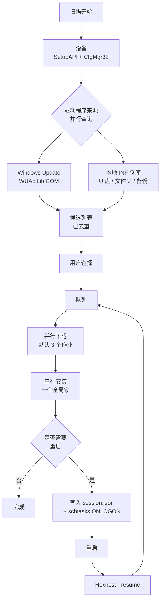

<div align="center">


# Hexnest

**Hexnest 是一款面向 Windows 和 macOS 的免费开源系统工具：驱动更新、系统监视、网络监视、
启动项管理与磁盘清理，全在一个窗口里。**

在 Windows 上，它扫描机器中的每个设备，找到并安装缺失和过时的驱动，在需要重启后接着往下做，
在重装前备份驱动并在之后完全离线地还原。在两个平台上，它都实时显示这台机器以及上面每个程序
花掉了多少处理器时间、内存和带宽，登录时有什么在启动，以及磁盘空间去了哪里。
Windows 上无需安装程序，任何平台上都没有广告软件。

<br>

[](https://github.com/ahmetcaglayan/Hexnest/releases/latest/download/Hexnest.exe)
[](https://github.com/ahmetcaglayan/Hexnest/releases/latest/download/Hexnest-arm64.dmg)

<sub>[🌐 项目网站](https://ahmetcaglayan.github.io/Hexnest/) · [Intel Mac、ARM 版 Windows 与全部历史版本 →](../../releases)</sub>

<br>

### Windows：无需安装。macOS：拖到「应用程序」。

`Windows 10 1607+ / 11` · `macOS 12 Monterey+` · `64 位` · `Apple 芯片与 Intel`

**不需要先装任何东西。** 两个版本都把 .NET 8 运行时带在自己里面：Windows 上不用下载 .NET，
不用 Visual C++ Redistributable，Mac 上不用 Homebrew 或 Xcode。

<br>

[](LICENSE)
[](../../releases)
[](../../releases)
[](https://dotnet.microsoft.com/)
[](../../releases/latest)
[](../../releases)
[](../../stargazers)
[](../../actions/workflows/build.yml)

<sub>[🇬🇧 English](README.md) · [🇹🇷 Türkçe](README.tr.md) · [🇷🇺 Русский](README.ru.md) · 🇨🇳 简体中文 · [🇮🇳 हिन्दी](README.hi.md)</sub>

<br>


</div>

---

## 🖥️ 哪些功能在哪里可用

Hexnest 是一个产品、两个窗口。共用的引擎——监视器、清理、启动项管理、设置和日志——
在两个平台上是同一份代码。驱动这一半只在 Windows 上，而且不是因为还没写：**macOS 没有可供扫描、
更新或备份的第三方驱动库。** Apple 把驱动放在操作系统里随系统更新，这类工具在那里根本无从下手。
所以这些页面在 Mac 版中是不存在的，而不是存在却永远空着。

| |  |  |
| --- | :---: | :---: |
| **仪表板**与硬件摘要 | ✅ | ✅ |
| **系统监视**——处理器、每核、内存、存储、电池 | ✅ | ✅ |
| **每个程序的处理器与内存** | ✅ | ✅ |
| **网络监视**——实时速率、总量、网卡、连接 | ✅ | ✅ |
| **每个程序的网络用量** | ✅ 仅 TCP | ✅ 通过 `nettop` |
| **启动项管理** | ✅ Run 键 + 启动文件夹 | ✅ launchd 代理 |
| **清理**，实测而非估算 | ✅ | ✅ |
| **日志、设置、五种语言、深浅色主题** | ✅ | ✅ |
| **处理器温度** | ✅ ACPI 热区 | ❌ 非 root 无法读取 |
| **按卷的磁盘吞吐** | ✅ | ❌ 没有按卷的计数器 |
| **释放内存** | ✅ | ❌ macOS 改用内存压缩 |
| **设备扫描 / 缺失驱动** | ✅ | ❌ 没有驱动库 |
| **Windows Update 驱动目录** | ✅ | ❌ |
| **离线 INF 仓库** | ✅ | ❌ |
| **驱动备份与还原** | ✅ | ❌ |
| **安装队列与重启后续传** | ✅ | ❌ |
| **系统还原点** | ✅ | ❌ 那是时间机器的事 |
| **以管理员 / root 运行** | ⚠️ 必需 | ✅ 从不——只在用户自己的范围内 |

上面的 ❌ 是平台没有的东西，不是 Hexnest 略过的东西。每一条都在应用里出现的地方
本身作了说明。

---

## 🎯 它有什么用？

你刚重装完 Windows。设备管理器里满是黄色感叹号，分辨率不对，没有声音——最糟的是
也没有网络，因为网络适配器同样没有驱动程序。

Hexnest 在一个窗口里解决这些问题：

- 列出本机的**所有即插即用设备**，并告诉你哪些没有驱动程序。
- 在 **Windows Update 目录**里或 **U 盘上的本地文件夹**里查找缺失的和可升级的驱动程序。
- 把它们加入队列，下载、安装，并在每一次需要的重启之后**从中断处继续**。
- 在重装系统**之前**导出当前的驱动程序，重装**之后**完全不联网也能还原。

从 1.1 起，它还回答人们打开任务管理器时想弄清的两个问题：

- **这台机器在忙什么？** 每个逻辑处理器的负载、内存明细、固件公开的所有温度传感器、
  带真实读写吞吐量的存储、电池——以及一张列出每个正在运行的程序及其处理器份额、
  工作集、专用字节和磁盘吞吐量的表格。
- **谁在占用我的网络？** 整机的实时下载和上传、本次会话以及自 Windows 启动以来的合计、
  每一个网络适配器——以及一张按程序分列的表格，显示此刻是哪个程序在传输、传了多少。

从 1.2 起，它还回答另外两个问题：

- **什么会随 Windows 一起启动，我愿意让它启动吗？** 每一个自启动项都配一个开关，
  写入方式与任务管理器完全一致，因此从不删除任何东西。
- **磁盘空间被什么吃掉了？** 每一处缓存都是实测而不是估算，没有一项是替你勾好的，
  你自己的文件单独列出，并且送进回收站。

单个文件，无需安装，没有后台服务，没有遥测。

---

## ✨ 功能

| 功能 | Platform | 说明 |
| --- | --- | --- |
| 🔍 **完整设备扫描** |  | 通过 SetupAPI + CfgMgr32 枚举当前存在的每一个即插即用设备。不使用 WMI，因此在刚装好的系统上、或者 WMI 存储库已损坏的机器上同样可用。 |
| ⚠️ **缺失驱动程序检测** |  | 读取配置管理器的问题代码；28（`CM_PROB_FAILED_INSTALL`）、1 和 19 表示“没有驱动程序”。22 是已禁用，14 是正在等待重启。 |
| ☁️ **Windows Update 驱动程序目录** |  | 通过 Windows Update Agent 的 COM API（WUApiLib）与 Microsoft Update 通信。不需要额外的服务、额外的下载或额外的依赖——`wuapi.dll` 是 Windows 自带的。 |
| 💾 **本地 / 离线 INF 仓库** |  | 解析文件夹里的 `.inf` 包，并按硬件 ID 匹配。U 盘、网络共享或一份 Hexnest 备份都可以作为来源。 |
| ⚡ **并行下载 + 串行安装** |  | 下载可以重叠进行（默认 3 个，可在 1–8 之间调整）。安装一次只进行一个。这不是偷懒：第二个并发安装会让 Windows Update 返回 `WU_E_OPERATIONINPROGRESS`，而且即插即用子系统本来就会把安装串行化。假装可以并行只会制造无谓的失败。 |
| 🔄 **重启后继续** |  | 队列的每次状态变化都会写入 `session.json`；一个由登录触发的 `schtasks` 任务（备用方案是 HKLM 的 `RunOnce`）会用 `--resume` 重新启动 Hexnest，它从停下的地方精确地继续。 |
| 🛡️ **系统还原点** |  | 在一次会话的第一次安装之前，通过 `srclient.dll` 创建一个驱动程序类型的还原点。 |
| ↩️ **更新前备份** |  | 即将被替换的驱动程序包会在安装前立刻导出，其路径记入历史记录，出问题时可以还原回去。 |
| 📦 **驱动程序备份 / 还原** |  | 用 `pnputil /export-driver` 把每个第三方驱动程序包导出到文件夹或 ZIP，再用 `pnputil /add-driver ... /subdirs /install` 还原。 |
| 📊 **更新历史记录** |  | 一份长期保留的记录，每行一个 JSON 对象（`history.jsonl`），一键即可导出为 CSV。 |
| 📄 **硬件报告** |  | 把所有设备和硬件 ID 写进一个纯文本文件——用 U 盘把它带到一台能上网的电脑上，手动查找驱动程序。 |
| 🆙 **内置更新程序** |  | 从 GitHub 下载新版本，**校验它的 SHA-256**（发行版没有发布 `checksums.txt` 时拒绝安装），然后就地替换可执行文件。 |
| 📈 **系统监视器** |   | 处理器的总体负载和每个逻辑处理器的负载（`NtQuerySystemInformation`）、细到已缓存和已提交字节的内存（`GlobalMemoryStatusEx` + `GetPerformanceInfo`）、ACPI 热区、按卷统计的读写吞吐量（`IOCTL_DISK_PERFORMANCE`）和电池状态。页面打开之前不采集任何数据，你一离开就停止。 |
| 🧮 **按程序统计的资源占用** |   | 每个进程的处理器份额、工作集、专用字节、磁盘吞吐量和线程数，测量方式与任务管理器完全一致：取两次采样之间进程自身内核时间加用户时间的增量，再除以实际经过的时间和逻辑处理器数。 |
| 🌐 **网络监视器** |   | 来自网络适配器自身计数器的整机下载和上传、本次会话以及开机以来的合计、打开的连接数，以及每个网络适配器的地址和协商出的链接速度。 |
| 🔎 **按程序统计的网络占用** |   | 哪个程序在传输什么，数据来自 `GetExtendedTcpTable` 加上 TCP ESTATS（`GetPerTcpConnectionEStats`）。只涵盖 TCP——不安装内核驱动程序，Windows 就没有按进程统计的 UDP 计数器，页面会直接说明这一点，而不是悄悄少报。 |
| 🔁 **自动检查更新** |  | 每天向 GitHub Releases API 请求一次，有新版本时在*关于*菜单项上显示一个计数。自动下载和安装需要你主动开启，会校验 SHA-256，而且只在 Hexnest 关闭时应用——绝不会在队列进行中。 在 macOS 上是手动检查——*关于* → *检查更新*——而且只打开下载页，不会自行安装。 |
| 🚀 **启动项管理** |   | 来自 `Run` / `RunOnce` 注册表项（HKCU、HKLM 以及 32 位视图）和两个启动文件夹的每一个自启动项，各配一个开关。禁用时写入的是任务管理器同样会写的 `StartupApproved` 值，因此两者永远一致，原来的命令行也绝不会被删除。指向已不存在的文件的项会被标出来。 |
| 🧹 **清理** |   | 临时文件、缩略图和图标缓存、七种浏览器的缓存、Windows Update 下载缓存、传递优化、崩溃转储、错误报告、着色器缓存、系统维护日志和回收站——每一项都是**实测，不是估算**，而且**默认一项都不勾选**。 |
| 🗂️ **残留文件夹和旧下载** |   | AppData 下与任何已安装的程序、任何正在运行的程序以及 Program Files 里的任何东西都对不上、并且六个月没有动过的文件夹；再加上“下载”文件夹里超过一个月的压缩包和安装程序。逐项列出，送进**回收站**，绝不直接删除。 |
| 🧠 **内存收缩** |  | 把进程的工作集换出去。页面上明说：这只是*当下*释放物理内存，并不会让任何东西变快——这和其他每一个带这个按钮的工具所宣称的正好相反。 |
| 🌍 **五种界面语言** |   | 英语、土耳其语、俄语、简体中文和印地语，全部装在同一个可执行文件里。程序开着的时候切换，立即生效。 |
| 🎨 **深色 / 浅色主题** |   | 更换调色板字典；无需重新打开窗口即可应用。 |

---

## 🚑 重装后恢复

这正是 Hexnest 存在的理由。

### 先有鸡还是先有蛋

重装系统之后，**网络适配器通常也没有驱动程序**。下载驱动程序需要联网，而联网又需要
这个驱动程序。Windows Update 帮不上忙，因为你根本连不上它。

办法是：**在重装之前把驱动程序随身带走。**

### 重装之前（5 分钟）

1. 运行 Hexnest。
2. 打开**备份和还原**。
3. 点击**创建备份**。系统上所有第三方驱动程序包都会被导出。
   （Microsoft 自带的驱动程序是有意跳过的——Windows 自己会重新装上它们，
   把它们也放进去只会让备份体积翻三倍而毫无用处。）
4. 需要的话勾选**压缩为 ZIP**。
5. 把得到的文件夹**和 `Hexnest.exe`** 一起复制到同一个 U 盘里。

> 💡 可选：把备份文件夹命名为 `Drivers`，放在 `Hexnest.exe` 旁边。
> Hexnest 会**自动**把它注册为本地驱动程序仓库——不需要任何配置。

### 重装之后

1. 插上 U 盘，运行 `Hexnest.exe`（它会请求提升权限）。
   没有网络时用 `Hexnest.exe --rescue` 启动：完全不会连接 Windows Update，只使用本地来源。
2. **备份和还原 → 还原**（或**从文件夹还原**），选择你的备份。
   每个包都会被加入驱动程序存储，并绑定到对应的设备上。
3. 网络适配器能用之后，点击**扫描**。
4. **仪表板 → 重装后恢复**会把仍然缺失的驱动程序从 Windows Update 全部加入队列。
5. 程序要求重启时同意即可——Hexnest 会在登录时自行回来，把队列剩下的部分做完。

> ℹ️ 这个文件夹不一定要是 Hexnest 的备份。任何你自己下载并解压的厂商驱动程序文件夹
> 都可以用**从文件夹还原**；其中的 `.inf` 文件会被递归找出来。

### 命令行

```powershell
Hexnest.exe                 # normal launch
Hexnest.exe --rescue        # offline rescue mode (same as --offline)
Hexnest.exe --resume        # continue an interrupted queue straight away
```

---

## 📸 屏幕截图

发行版本的真实截图。它们由程序自己重新生成——见
[重新生成截图](#重新生成截图)——所以不会过时。

### 

<table>
<tr>
<td width="50%"><br><sub><b>系统监视器</b>——处理器、内存、温度和磁盘的实时图表，每个逻辑处理器一根柱子。</sub></td>
<td width="50%"><br><sub><b>网络监视器</b>——整机的下载和上传、本次会话的合计、每一个网络适配器。</sub></td>
</tr>
<tr>
<td width="50%"><br><sub><b>按程序统计的占用</b>——每个正在运行的进程的处理器、内存、磁盘和线程。</sub></td>
<td width="50%"><br><sub><b>按程序统计的流量</b>——哪个程序在占用网络，占用了多少。</sub></td>
</tr>
<tr>
<td width="50%"><br><sub><b>设备</b>——按类别分组的所有即插即用设备，带实时问题代码。</sub></td>
<td width="50%"><br><sub><b>更新</b>——来自 Windows Update 和本地 INF 文件夹的可安装包。</sub></td>
</tr>
<tr>
<td width="50%"><br><sub><b>活动</b>——正在运行的队列，逐个驱动程序显示速度和安装阶段。</sub></td>
<td width="50%"><br><sub><b>备份和还原</b>——导出每一个第三方驱动程序，离线还原回去。</sub></td>
</tr>
<tr>
<td width="50%"><br><sub><b>启动项</b>——每一项一个开关，写入方式与任务管理器一致。</sub></td>
<td width="50%"><br><sub><b>清理</b>——是实测而不是估算，而且不替你勾选任何东西。</sub></td>
</tr>
<tr>
<td width="50%"><br><sub><b>设置</b>——并行下载、安全、自动更新、主题和语言。</sub></td>
<td width="50%"><br><sub><b>关于</b>——版本信息和内置更新程序。</sub></td>
</tr>
</table>

### 

<table>
<tr>
<td width="50%"><br><sub><b>仪表板</b>——这台 Mac 此刻在做什么，以及它是什么：芯片、显卡、内存、磁盘。</sub></td>
<td width="50%"><br><sub><b>系统监视</b>——每核一根柱，Apple 芯片上包括性能核与能效核。</sub></td>
</tr>
<tr>
<td width="50%"><br><sub><b>网络监视</b>——按程序的流量，数据来源与「活动监视器」相同。</sub></td>
<td width="50%"><br><sub><b>启动项</b>——launchd 代理各有一个开关；系统任务只展示，不改动。</sub></td>
</tr>
<tr>
<td width="50%"><br><sub><b>清理</b>——缓存、Xcode derived data、iPhone 备份。实测，且默认一项都不勾。</sub></td>
<td width="50%"><br><sub><b>设置</b>——同样的选项，外加一个日出日落跟随 macOS 的主题。</sub></td>
</tr>
<tr>
<td width="50%"><br><sub><b>日志</b>——实时诊断，一键复制到剪贴板用于问题反馈。</sub></td>
<td width="50%"><br><sub><b>关于</b>——版本、机器，以及一个会打开下载页的更新检查。</sub></td>
</tr>
</table>

### 重新生成截图

上面每张图都由程序自己生成，所以界面一改，文档可以用一条命令跟上：

```powershell
# Windows，构建后在管理员命令提示符中
.\Hexnest.exe --capture .\assets\screenshots --lang en
```

```bash
# macOS，运行 ./build/make-mac-app.sh 之后
./artifacts/mac/arm64/Hexnest.app/Contents/MacOS/Hexnest --capture ./shots --lang en
```

两者都会走遍整个菜单，等实时页面把图表填满，然后每页写出一个 PNG。`--lang` 固定界面语言，
这样发布的图片就不取决于重新生成它们的人用什么显示语言。

> 为什么要内置截图？在 Windows 上 Hexnest 以管理员身份运行，而用户界面特权隔离会阻止
> （非提权的）截图工具看到发往更高完整性窗口的输入——在 Hexnest、任务管理器或注册表编辑器上按
> Print Screen 毫无反应。在 macOS 上，屏幕捕获需要「屏幕录制」权限，而且会把桌面上其他东西一起拍进去。
> 两个版本都改为绘制自己的可视化树。

---

## 🧭 菜单

| 菜单 | Platform | 说明 |
| --- | --- | --- |
| **仪表板** |   | 设备数量、缺失的驱动程序、可用的更新、有问题的设备。操作系统 / 机器 / CPU / BIOS 概要。快速操作：*立即扫描*、*重装后恢复*、*全部更新*、*备份驱动程序*、*硬件报告*。当没有任何网络适配器有可用驱动程序时，会出现一条警告横幅。 |
| **设备** |  | 所有即插即用设备，按类别分组。筛选器：*全部 / 有问题 / 无驱动程序 / 通用驱动程序*。可按名称、制造商、版本和硬件 ID 搜索；可把硬件 ID 复制到剪贴板。 |
| **更新** |  | 可安装的驱动程序包：既包括缺失的驱动程序，也包括版本升级。逐行选择、*全选 / 清除选择*、所选项的总大小、*安装所选项*。你可以隐藏某个更新，或者完全忽略某个设备。 |
| **活动** |  | 正在运行的队列。每个作业分别显示下载百分比、速度、已传输字节和安装阶段。*全部取消*、*重试失败项*、*立即重启* / *稍后*。中断过的会话会在这里显示一个*继续*按钮。 |
| **备份和还原** |  | *创建备份*（可选压缩）、现有备份的列表（包数量、大小、日期）、*还原*、*从文件夹还原*、*打开*、*删除*。 |
| **历史记录** |  | 每一次驱动程序操作的长期记录。可按结果筛选、可搜索，*导出为 CSV*、*清除历史记录*。如果某条记录的更新前备份还在，可以打开它所在的文件夹。 |
| **系统监视器** |   | 处理器的总体负载和每个逻辑处理器的负载，内存细分为使用中 / 可用 / 已缓存 / 已提交，机器公开温度传感器时显示传感器，存储容量以及实时的读写吞吐量，还有电池。下方是每个正在运行的进程及其处理器份额、工作集、专用字节、磁盘吞吐量和线程数——可按处理器、内存、磁盘或名称排序，可搜索，也可以暂停，好让某一行真的能被看清。 |
| **网络监视器** |   | 整机的实时下载和上传图表、本次会话以及自 Windows 启动以来的合计、打开的连接数，以及每个网络适配器的类型、地址和链接速度。下方是一张按程序分列的表格：下载和上传速率、本次会话合计、打开的连接数和远程端点。 |
| **启动项** |   | Hexnest 能安全开关的每一个自启动项，显示取自可执行文件版本资源的程序名、它的发布者、命令行、大小和启动来源。每行一个开关；禁用时写入的是任务管理器同样会写的设置，什么都不删除。指向已不存在的文件的项会被标出来，安全软件会被标记，关掉之前会先询问；另有已开启、已关闭和已失效的筛选器以及搜索。 |
| **清理** |   | 临时文件、缩略图和图标缓存、七种浏览器、Windows Update 下载缓存、传递优化、崩溃转储、错误报告、着色器缓存、Windows 日志、Hexnest 自己的缓存和回收站，全都给出实测的大小。默认一项都不勾选。旧下载和残留的 AppData 文件夹逐项列出，并送进回收站。此外还有一个内存收缩功能，它对自己做的事直言不讳。 |
| **日志** |   | 实时诊断信息。*复制*会把日志连同版本 / 操作系统 / 机器信息的头部一起放进剪贴板——正好是一份问题报告需要的内容。也可以打开日志文件或它所在的文件夹，或者清空它。 |
| **设置** |   | 并行下载数、重试次数、启动时扫描、还原点、更新前备份、重启后继续、自动重启及其延迟、离线模式、可选的驱动程序、本地驱动程序文件夹、历史记录保留时间，**自动检查更新、自动安装和预发布版本**，主题，语言。 |
| **关于** |   | 版本信息、*检查更新*、*下载并安装*、版本说明、项目页面和问题反馈链接。 |

Mac 版的侧边栏就是上面标了 macOS 的那八行，顺序相同。*设备*、*更新*、*活动*、*备份与还原*
和*历史*在那里不是空的，而是根本没有。

---

## ⚙️ 工作原理



简单来说：

1. **扫描。** `SetupDiGetClassDevs(DIGCF_PRESENT | DIGCF_ALLCLASSES)` 枚举物理上存在的
   每一个设备；`CM_Get_DevNode_Status` 提供问题代码，
   `HKLM\SYSTEM\CurrentControlSet\Control\Class\<DriverKey>` 提供已安装驱动程序的
   版本、日期和提供者。
2. **来源。** Windows Update 和本地 INF 仓库同时查询。某个来源失败只会变成一行警告，
   绝不会中止整次扫描。
3. **去重。** 当两个来源提供同一个包时，**本地副本优先**——它已经在硬盘上，不需要联网。
   如果 Windows Update 提供的版本比已安装的还旧，这个候选项会被丢弃。
4. **队列。** 下载在 `SemaphoreSlim(MaxParallelJobs)` 之后排队；安装在一个全局锁之后排队。
   失败的作业默认重试两次。
5. **继续。** 每一次状态变化都会原子地写入 `session.json`。需要重启时队列会被暂存，
   由登录触发的任务用 `--resume` 把 Hexnest 带回来。作为安全阀，一次会话最多经历
   10 次重启，之后就会被放弃。

---

## 🔨 从源代码构建

如果你只想用这个程序，这一节与你无关：**下载 exe，双击，就能用。**
源代码待在自己的文件夹里，不碍任何人的事。

```
Hexnest/
├── src/                    source code (C#, .NET 8, WPF)
│   ├── Hexnest.Core/       UI-free core: scanning, providers, job engine
│   ├── Hexnest.App/        WPF desktop application (Hexnest.exe)
│   ├── Hexnest.Mac/        macOS 的 Avalonia 应用（Hexnest.app）
│   └── Hexnest.Cli/        (reserved) placeholder for a headless front end
├── docs/                   documentation
├── build/                  build scripts
├── assets/                 logo and screenshots
└── .github/workflows/      CI
```

最简单的做法：

```powershell
dotnet publish src/Hexnest.App/Hexnest.App.csproj -c Release -r win-x64 -o publish
```

在 Mac 上则会生成 `artifacts/mac/arm64/Hexnest.app`：

```bash
./build/make-mac-app.sh --arch arm64
```

加上 `--dmg` 可以生成发布用的磁盘映像。脚本除了 .NET 8 SDK 之外什么都不需要：它会写 `Info.plist`，从 `assets/icon-mac-1024.png` 生成 `.icns`，并对 bundle 做 ad-hoc 签名，好让 Apple 芯片能运行它。


详细说明、arm64 构建，以及对 WUApiLib COM 引用的解释：
**[docs/BUILD.md](docs/BUILD.md)**

架构、`IDriverProvider` 抽象，以及如何添加新的驱动程序来源：
**[docs/ARCHITECTURE.md](docs/ARCHITECTURE.md)**

---

## 🔐 安全与隐私

- **没有遥测。**没有使用数据、没有设备标识符、没有统计信息离开这台机器。
- 只有**两样**东西会发出去：
  1. **Windows Update 查询**——通过 Windows 自带的 Windows Update Agent 直接发给
     Microsoft。（离线模式下或使用 `--rescue` 时从不发生。）
  2. **GitHub Releases API**——只有在你点击*检查更新*时。
- **为什么需要管理员权限？**安装驱动程序是特权操作：`pnputil`、Windows Update 的
  安装程序和系统还原都需要提升的令牌。Hexnest 在应用程序清单里
  （`requireAdministrator`）一开始就申请它，而不是在队列走到一半时才失败。
- **安全网：**一次会话的第一次安装之前会创建一个系统还原点，它替换掉的每个
  驱动程序包也都会先备份。
- **更新程序**会用发行版 `checksums.txt` 里的 SHA-256 校验下载的文件；校验值缺失或
  对不上时，文件会被删除，更新被拒绝。
- 所有状态都保存在 `%ProgramData%\Hexnest` 下：`settings.json`、`session.json`、
  `history.jsonl`、`logs/`、`backups/`、`cache/`、`reports/`。

漏洞报告：**[SECURITY.md](SECURITY.md)**

---

## ❓ 常见问题

### Hexnest 是免费的吗？

是的。Hexnest 以 MIT 许可证发布，完整源代码就在这个仓库里。没有付费版本，没有试用期，没有
付费之后才解锁的功能，没有广告，也不捆绑任何第三方软件。扫描和安装是同一个产品。

### 我需要安装 .NET 吗？

不需要。整个 .NET 8 运行时都在 `Hexnest.exe` 里面（self-contained 单文件发布），WPF 自带
`vcruntime140_cor3.dll` / `msvcp140_cor3.dll`。也不需要 Visual C++ Redistributable。
唯一的要求是 64 位的 Windows 10 版本 1607（内部版本 14393）或更新的系统。

### Hexnest 会在 Mac 上更新驱动吗？

不会，别的软件也不会。macOS 没有第三方驱动库：Apple 把设备支持放在操作系统里，随系统一起更新。
这类工具在那里没有东西可扫描、可下载或可备份，所以 Mac 版根本就没有*设备*、*更新*、*活动*、
*备份*和*历史*页面——总好过五个永远填不满的页面。Hexnest 做的其他一切在那里都能用。

### 需要什么样的 Mac？

macOS 12 Monterey 或更新版本，Apple 芯片或 Intel 均可。两个版本分开发布
（`Hexnest-arm64.dmg` 和 `Hexnest-x64.dmg`），而不是合成一个通用二进制：每个都自带一份 .NET
运行时，合并会让所有人的下载量翻倍，只为了在下载页上少做一个选择。

### macOS 提示「无法打开，因为无法验证开发者」

发布版本做了 ad-hoc 签名，但没有做公证——公证需要付费的 Apple Developer 账号。在「应用程序」里
右键（或按住 Control 点击）Hexnest，选择**打开**；macOS 会问一次并记住答案。每个发布版本都附带
`checksums.txt`，可以先校验下载的文件。

### 为什么 Hexnest for Mac 从不要我的密码？

因为它根本不需要。监视器读取的是公开统计数据，清理只在你自己的主文件夹里工作，启动项管理通过
`launchctl` 修改的是你自己的登录代理。系统级的 launchd 任务只展示，并标为只读。一个为了给你看
一张图表就要管理员密码的程序，索取的信任远超它实际需要的。

### 为什么 SmartScreen 或杀毒软件会对它报警？

因为 `Hexnest.exe` **没有代码签名**——证书是要花钱的。SmartScreen 和智能应用控制会对任何
尚未积累信誉的未签名可执行文件发出警告；而一个以管理员身份运行、安装驱动程序、还注册计划
任务的程序，在启发式扫描器眼里就很像恶意软件。诚实的应对办法是自己校验这个文件：把
`Get-FileHash .\Hexnest.exe -Algorithm SHA256` 的输出和发行版 `checksums.txt` 里对应的
那一行做比较。

### 重装系统之后没有网络，还能安装驱动程序吗？

能——Hexnest 就是为这件事做的。重装之前先备份驱动程序，把备份和 `Hexnest.exe` 放进同一个
U 盘，重装之后用 `Hexnest.exe --rescue` 启动，然后点击**还原**。放在 `Hexnest.exe` 旁边、
名为 `Drivers` 的文件夹会被自动注册为本地驱动程序仓库，你自己解压的任何厂商文件夹也一样可用。

### 可以回滚某个驱动程序吗？

可以，有三种办法：用 Hexnest 在每次安装前立刻导出的那份备份（**从文件夹还原**），用一次会话
第一次安装前创建的系统还原点（`rstrui.exe`），或者用设备管理器里 Windows 自带的*回退驱动程序*
按钮。所以建议把还原点这个设置一直开着。

### 重启之后真的能继续吗？

能。队列状态每次变化都会原子地写入 `session.json`，一个由登录触发的 `Hexnest\ResumeSession`
计划任务（备用方案是 HKLM 的 `RunOnce`）会用 `--resume` 把 Hexnest 带回来。一次会话最多经历
10 次重启；队列结束后，这个任务和那个注册表值都会被删掉。

### 禁用一个启动项会删掉什么东西吗？

不会。Windows 把“已启用”这个标志放在另一个注册表项里——
`...\CurrentVersion\Explorer\StartupApproved\Run` 以及它的两个同级项——Hexnest 写的只有
这一处。`Run` 里的值，或者启动文件夹里的快捷方式，都原封不动留在原地，所以把这一项重新
打开时，原来的命令行会一个字节不差地恢复。

这也意味着任务管理器和 Hexnest 彼此一致：在其中一边禁用某个东西，另一边也显示为已禁用。
而且你以后就算把 Hexnest 删掉，机器也不会少掉一半启动项，因为它们从来就没被挪走过。

### 清理安全吗？

它是按安全来设计的，而且设计本身说明了是怎么做到的，而不是要你凭信任接受：

- **默认一项都不勾选。**页面打开时合计是零。
- 每一个路径都来自已知文件夹 API，而不是拼出来的字符串。某个类别自己的根目录之外的东西
  一律不碰，而且每一次具体的删除在执行之前，都会再对照这些根目录检查一遍。
- 从不跟随重分析点。`%LOCALAPPDATA%` 里到处是目录联接，走进去正是“清理缓存”这类功能
  到头来把用户的文档删掉的原因。
- 打开着的文件会被跳过，而不是强行删除。被跳过的文件数量会报告出来。
- 你自己的文件——旧下载、残留文件夹——从不被批量选中。它们逐个列出，标明大小和放了多久，
  而且送进**回收站**。

残留检测是 Hexnest 唯一靠猜的地方，它也在那一行里直说了：这是猜测，不是事实。

### “释放内存”真的有用吗？

它确实会当下释放物理内存，而它做的也就只有这件事。

它对每个进程调用 `EmptyWorkingSet`，也就是请 Windows 把那个进程的工作集换出到页面文件。
使用中的内存确实会降下来。但那些页面并没有消失——它们跑到了硬盘上，程序下一次碰到这块
内存，Windows 就得把它们读回来，这比原样放着更慢。没被用上的内存不等于被浪费的内存；
Windows 本来就把它准备在那里随时可用。

所以这不是一项性能功能，Hexnest 也不把它当成性能功能来讲。它真正有用的场合，就在要启动
一个需要大块内存的程序之前，或者想看看一个正在泄漏内存的程序实际占着多少。其他每一个
带这个按钮的工具，宣称的都与此相反。

### 为什么温度卡片说没有传感器？

因为那台机器上没有一个是 Windows 读得到的。不装驱动程序的话，Windows 唯一能读出的温度，是
固件为自己的风扇控制而声明的 ACPI 热区（`root\WMI:MSAcpi_ThermalZoneTemperature`），而相当多
台式机主板根本没有声明。每个核心的温度和 GPU 温度来自厂商的传感器芯片，要经由 SMBus 读取，
这需要一个带签名的内核驱动程序——HWiNFO 和 Open Hardware Monitor 装的正是这种东西。Hexnest
不会为了填上一个数字而安装内核驱动程序，所以它告诉你传感器不存在，而不是编一个看起来
很合理的 45 °C。

### 为什么按程序统计的网络用量加不出整机的合计？

因为两者的测量方式不同，而且两者都是对的。

整机的数字是网络适配器自身字节计数器的总和，所以它涵盖一切：TCP、UDP、QUIC、广播。按程序
统计的数字来自 TCP ESTATS（RFC 4898），通过 `GetPerTcpConnectionEStats` 读取，这是 Windows
在不装内核驱动程序的前提下提供的唯一一个按进程统计的字节计数器——而它只涵盖 TCP。因此视频
通话、大部分游戏流量和 DNS 都算进了前一个数字，却不在后一个里面。页面会直接说明这一点，
而不是悄悄少报。

启用 ESTATS 需要提升的令牌。Hexnest 一直都有；万一被拒绝，表格会退回到按进程统计连接数，
并说明原因。

### Hexnest 会在后台自我更新吗？

它每天**检查**一次，并在*关于*菜单项上告诉你。除非你在**设置 → 更新**里打开，否则它不会
下载或安装任何东西；即使打开了：

- 下载的文件在被信任之前，会先对照发行版的 `checksums.txt` 校验，
- 替换发生在 Hexnest **关闭**的时候，绝不会在驱动程序队列运行期间进行，
- 离线模式和救援模式下，检查和安装都会被完全跳过。

你也可以把检查彻底关掉；*检查更新*按钮照样能用。

### 监视器是后台服务吗？

不是。两个监视器在你打开它们的页面之前都不采集任何数据，你一离开就立刻停止。Hexnest 依然
不安装服务、不安装驱动程序、不添加启动项——它唯一注册过的东西，是那个用来继续被中断的
驱动程序队列的登录任务，而它在队列结束后会自行删除。

### Hexnest 会收集任何数据吗？

不会。没有遥测，没有使用统计，没有设备标识符。只有两样东西会离开这台机器：Windows Update
查询，它通过 Windows 自带的代理直接发给 Microsoft，离线模式下从不发生；以及你点击*检查更新*
时向 GitHub Releases API 发出的一次请求。

---

“exe 为什么这么大？”“为什么不用 WMI？”“它能在 Windows Server 上跑吗？”以及其余问题：

**[docs/FAQ.md](docs/FAQ.md)** · 使用指南（土耳其语）：**[docs/USAGE.md](docs/USAGE.md)** ·
项目主页：**[ahmetcaglayan.github.io/Hexnest](https://ahmetcaglayan.github.io/Hexnest/)**

---

## 🤝 参与贡献

欢迎参与。

- **问题报告：**[Issues](../../issues)——请附上**日志**菜单里*复制*按钮给出的日志；
  它已经带有版本和操作系统的头部信息。
- **代码：**fork、开分支、提交 pull request。请保持现有风格：不引入 NuGet 依赖
  （单文件的体积和离线运行是有意的选择），`Hexnest.Core` 里不放任何界面代码。
- **翻译：**新增一种语言就是往 `src/Hexnest.App/Services/Loc.cs` 里加一个字典；
  参见 [docs/ARCHITECTURE.md](docs/ARCHITECTURE.md)。

---

## 📄 许可证

MIT——见 [LICENSE](LICENSE)。

---

## ⚠️ 免责声明

安装驱动程序本身就有风险。错误或损坏的驱动程序可能带来各种问题，严重时会让机器无法启动。
Hexnest 通过创建系统还原点、备份它所替换的驱动程序来降低这个风险，但它不提供任何担保。

**请把还原点这个设置一直开着。**在意的数据请自己留一份备份。本软件按“原样”提供；
使用它的后果由用户自行承担。

---

## 关键词

<sub>
windows 驱动程序更新工具 开源 · 免费驱动更新工具 无广告 · 重装系统后安装驱动程序 ·
u盘离线驱动安装 · windows 驱动程序备份还原 · 查找缺失的驱动程序 ·
windows 11 驱动扫描 · pnputil 驱动导出 · windows update 驱动程序目录工具, 免费系统监视器 windows, cpu 内存 温度 监控, 按程序统计网络用量 windows, 按程序统计带宽, 任务管理器替代品 开源 ·
设备管理器 黄色感叹号 修复
</sub>
